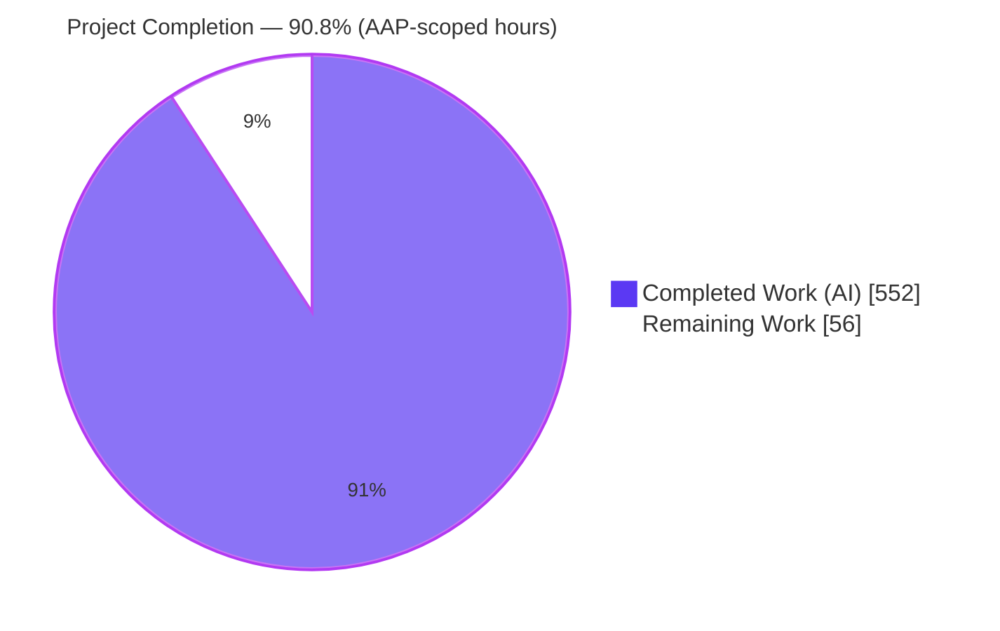
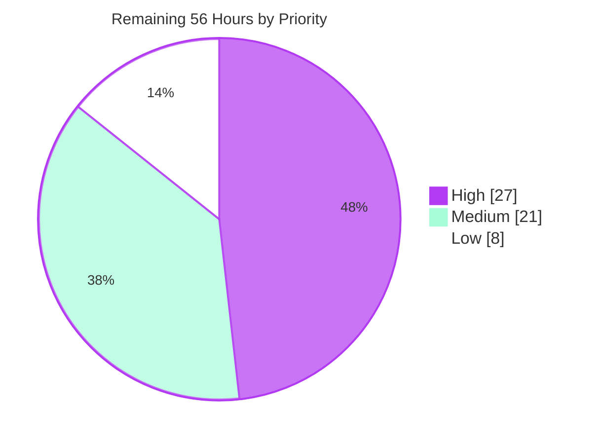

# Blitzy Project Guide — ServiceNow `x_casemgmt` Case Management POC

> Re-platforming of the ArkCase case/task/party/role/portal/dashboard slice as a brand-new ServiceNow scoped application, delivered as a single Update Set XML.

# 1. Executive Summary

## 1.1 Project Overview

This project re-platforms ArkCase's core case-management domain — a Java/Spring/AngularJS/MySQL system — as a new ServiceNow scoped application (`x_casemgmt`). It is a proof-of-concept migration, not a one-to-one port: cases, tasks, party associations, a three-role access matrix, a per-type case state machine, an unauthenticated portal for submission and status lookup, and two operational dashboards. Its users are internal case workers — manager, agent, viewer — and anonymous external requesters. The deliverable is one self-contained Update Set XML with record definitions, seed data, tests and documentation, confined to `servicenow-case-management-poc/`.

## 1.2 Completion Status


```mermaid
%%{init: {'theme':'base', 'themeVariables': {'pie1':'#5B39F3','pie2':'#FFFFFF','pieStrokeColor':'#B23AF2','pieStrokeWidth':'2px','pieOuterStrokeColor':'#B23AF2','pieTitleTextSize':'16px','pieSectionTextSize':'14px'}}}%%
pie showData
    title Project Completion — 90.8% (AAP-scoped hours)
    "Completed Work (AI)" : 552
    "Remaining Work" : 56
```

| Metric | Hours |
| --- | --- |
| **Total Project Hours** | **608** |
| Completed Hours (AI) | 552 |
| Completed Hours (Manual) | 0 |
| **Completed Hours (AI + Manual)** | **552** |
| **Remaining Hours** | **56** |
| **Percent Complete** | **90.8%** |

> AAP-scoped work plus path to production: `552 / (552 + 56) = 552 / 608 = 90.8%`. All delivered autonomously; no manual hours are recorded.

## 1.3 Key Accomplishments

- ✅ **Data model** — 3 tables, the full specified field set, 7 choice lists and `CASE0000001` numbering, verified live.
- ✅ **Access control** — 3 roles, 29 access rules, 36 role links; the CRUD matrix verified per persona.
- ✅ **State machine** — every transition guard refuses the save with its exact message, both case types.
- ✅ **Task-closure gate** — resolving with an open child task is refused verbatim.
- ✅ **External portal** — both anonymous pages serve signed-out; lookup exposes only status, subject and opened date.
- ✅ **Dashboards** — Agent Workspace 3 of 3 and Manager View 5 of 5 widgets render over 8 reports.
- ✅ **Write-path contracts** — mandatory, length, referential and exclusivity rules hold on every write path.
- ✅ **Proven install** — a complete package previewed to zero problems and committed in one pass.

## 1.4 Critical Unresolved Issues

**14 of the 83 requested items remain open.** Group counts sum to 14.

| Issue | Impact | Owner | ETA |
| --- | --- | --- | --- |
| **Packaging and round-trip gate (3 items)** — the package at the canonical path is not the revision that carries the application as built; its bytes have never been previewed; the role links it omits were created by direct insert rather than the platform's role-assignment action | A clean-instance install from this package needs the documented multi-step sequence and still lands short of the verified live configuration | Platform engineer | 24 h |
| **Regression evidence (1 item)** — the recorded suite result predates the choice-materialization fix | The current pass rate of the packaged suite is unproven | QA lead | 4 h |
| **Access-control decisions (2 items)** — organization parties cannot be saved because the referenced company table is unreadable to all three roles; counts and aggregates compute over rows the access rules deny | One party type is unusable; a viewer or agent can infer the existence of records they cannot read | Security admin | 8 h |
| **Presentation on theme-owned surfaces (2 items)** — control and focus-ring contrast, mobile zoom, target sizing; chart percentage announcement, label truncation, mobile legend | Portal and dashboard accessibility falls short of AA on surfaces the default theme owns | Product owner | 4 h |
| **Specification ratifications (3 items)** — one column beyond the specified field set, the standing assignment invariant, exact-concurrency duplicate submissions | Delivered schema arity differs from the specification; two edge behaviours are unratified | Product owner | 3 h |
| **Platform limits and housekeeping (3 items)** — dashboards not discoverable by the demo personas, three over-length rule names, output at four paths outside the application directory | Personas cannot navigate to their dashboards; two cosmetic footprint items | Platform engineer | 3 h |

## 1.5 Access Issues

| System/Resource | Type of Access | Issue Description | Resolution Status | Owner |
| --- | --- | --- | --- | --- |
| Verification instance | Instance URL + admin credentials | Supplied and working. The instance is live on Zurich Patch 10, is not mid-upgrade, and carries the committed application at version 1.0.0. | Resolved — verified | Instance owner |
| Receiving production instance | Instance URL + admin credentials | No production instance has been named, so no deployment to one has been attempted. A URL and an administrator login are required. | Open — customer action required | Customer / Release Mgr |
| Access-rule and role-link writes | Elevated security administration in an interactive session | These writes are refused over REST and require an elevated browser session, so they cannot be driven from a pipeline. | Accepted — operator step | Security admin |
| Automated test execution | Client test runner | The client test runner cannot run headless on this platform release, so the shipped suite needs an interactive browser session against a live instance. | Accepted — run as a release gate | QA lead |
| Scoped Table API (`/api/now/table/x_casemgmt_*`) | Anonymous and cross-scope access | Anonymous reads are refused at HTTP 401 and cross-scope writes are refused by design; intended access is the native UI and the two portal endpoints. | Accepted by design | N/A |

## 1.6 Recommended Next Steps

1. **[High]** Re-cut one package carrying the whole application; preview and commit it on a clean instance. *(14 h)*
2. **[High]** Create the role links through the platform's own role-assignment action. *(6 h)*
3. **[High]** Re-run the packaged suite and the transition harness; refresh the result. *(4 h)*
4. **[High]** Authorize the global company read rule; re-verify organization parties. *(3 h)*
5. **[Medium]** Deploy to the receiving instance, verify post-commit state, complete UAT, remove demo data. *(10 h)*

# 2. Project Hours Breakdown

## 2.1 Completed Work Detail

| Component | Hours | Description |
| --- | --- | --- |
| Scoped application foundation & Update Set packaging | 30 | Application and scope records, the `x_casemgmt` namespace, serialization of the record definitions into a single transportable package, the export mechanics, and the identity/digest ledger that tracks each package revision. |
| Data model | 34 | 3 tables (`case`, `case_task`, `case_party`), the full specified field set across 21/14/13 live dictionary rows, 7 choice lists in the platform's native choice-set form, 3 number counters, `CASE0000001` auto-numbering, and the polymorphic party design. |
| Write-path data contracts | 22 | Mandatory-value, string-length, referential-existence and party-exclusivity enforcement as ordered rules on every write path; unique, read-only child keys; and a parent-to-child cascade so orphans cannot survive a parent delete. |
| Access control | 44 | 3 scoped roles, 29 access rules with scripted assigned-only conditions, field-level rules on `assigned_group`/`assigned_agent`, three range-query rules, 36 role links, an insert-path grant for the agent create form, and least-privilege cross-scope table policy. |
| Case state machine | 62 | 2 per-type flows, 5 validation subflows, a reusable transition-guard action, the `CaseTransitionValidator` Script Include, and 12 ordered Business Rules that refuse invalid saves with exact messages on the form, in the list editor and over the API. |
| Internal user interface | 40 | Single-column case form in the specified field order, case list and related-list layouts, 6 transition UI Actions gated on the stored record, the party polymorphic UI Policy with a clear-opposite client script, and a closed-case read-only policy with its load-time enforcer. |
| External Experience Portal | 62 | Portal record, 2 unauthenticated pages with their full layout chain, 3 widgets, 2 scripted REST services, `CasePortalService`, field whitelisting, exact-storage round-trip verification, request validation, throttling and deduplication, timezone-labelled dates, in-portal navigation and control-state handling. |
| Dashboards & reports | 30 | 2 dashboards on the platform's dashboard/tab/canvas chain and 8 reports (lists, donuts, bars, single scores), with the agent donut scoped to the caller, data labels and display grids. |
| Synthetic seed data & seed script | 26 | 10 cases across all 6 statuses and both types, 10 tasks, 8 parties, 3 users, 1 group, 3 role grants, 2 companies, and an idempotent seed script that adopts rows by key and repairs missing parents and dates. |
| Documentation | 46 | 18 markdown documents plus an application README: data model, state machine, access matrix, portal pages, dashboards, validation gates, deployment, operator runbook with per-run credential hygiene, limitations register, test plan, lifecycle walkthrough and the delivery record set. |
| Automated test assets | 34 | A 20-test / 180-step suite with its packaged step inputs and an ordered suite record, plus a 13-assertion transition harness and a manual test plan. |
| Post-import install automation & operational safeguards | 34 | The install script that builds physical storage, repairs numbering and routing and creates the access-rule role links, and the pre-delete collateral guard that enumerates dependants and aborts before any destructive call — both idempotent, leased, application-confined and fail-closed, with a 58-assertion harness. |
| Package verification & round-trip work | 26 | Dependency-ordered re-sequencing of the package against the declared ordering contract with a 42-assertion verifier, upload and preview driven to zero problems of any type, a native commit, and post-commit confirmation of storage, dictionary and role links. |
| Validation-gate execution & runtime verification | 62 | The seven-gate framework executed end to end plus four full verification campaigns totalling 1,130 executed cases: schema comparison, persona impersonation matrices, on-form transition observation, portal contract calls, dashboard and report render checks, and accessibility measurement. |
| **Total Completed** | **552** | **All hours delivered autonomously (0 manual).** |

## 2.2 Remaining Work Detail

| Category | Hours | Priority |
| --- | --- | --- |
| Re-cut one package carrying the whole application and take it through preview and commit on a clean dedicated instance | 14 | High |
| Create the access-rule role links through the platform's own role-assignment action and capture them natively | 6 | High |
| Re-run the packaged suite and the transition harness and refresh the recorded result | 4 | High |
| Authorize the global company read rule and re-verify the organization party flow | 3 | High |
| Implement the scoped count/aggregate disclosure control and re-run the access matrix | 5 | Medium |
| Reduce the post-import install to the fewest operator steps, or ratify it, and re-verify from scratch | 4 | Medium |
| Deploy to the receiving instance and verify post-commit state | 4 | Medium |
| UAT across all three personas and both public pages, with sign-off | 4 | Medium |
| Remove synthetic demo data and confirm the census | 2 | Medium |
| Set dashboard ownership and shorten the three over-length rule names | 2 | Medium |
| Accessibility and chart presentation decisions on theme-owned surfaces | 4 | Low |
| Ratify the additional column, the standing assignment invariant and exact-concurrency deduplication | 3 | Low |
| Confine the four output paths that sit outside the application directory | 1 | Low |
| **Total Remaining** | **56** | — |

> **Reconciliation:** Section 2.1 (552 h) + Section 2.2 (56 h) = 608 h = Total Project Hours (Section 1.2). Section 2.2 total (56 h) = Remaining Hours (Section 1.2) = Section 7 pie "Remaining Work". Priority split: High 27 + Medium 21 + Low 8 = 56.

## 2.3 Human Task Breakdown (decomposition of the 56 remaining hours)

| ID | Task | Priority | Hours |
| --- | --- | --- | --- |
| HT-1 | Provision a clean dedicated instance and re-cut one package carrying the whole application — 29 access rules, 27 role links, 12 business rules, the single-column form layout, the 3 client scripts and the corrected choice payloads | High | 6 |
| HT-2 | Upload, preview and commit that package on the clean instance; require zero error-type preview problems and record both problem counts | High | 4 |
| HT-3 | Re-verify post-commit — three tables, three roles, scope record, dictionary and role-link census, seed visibility — and record the verified digest as the release identity | High | 4 |
| HT-4 | Create the 27 role links and the 3 role grants through the platform's own role-assignment action in an elevated session, and capture them natively into the release package | High | 6 |
| HT-5 | Re-run the 20-test / 180-step suite and the 13-assertion transition harness from the client runner and refresh the recorded result | High | 4 |
| HT-6 | Authorize one global read rule on the company table, restricted to the three roles and the minimum columns, then re-verify the organization party flow end to end | High | 3 |
| HT-7 | Implement the three scoped before-query rules so counts and aggregates respect the access rules, then re-run the persona access matrix | Medium | 5 |
| HT-8 | Reduce the post-import install to the fewest operator steps the platform permits — or ratify the runbook — and re-verify from scratch | Medium | 4 |
| HT-9 | Deploy the gated package to the receiving instance and verify post-commit state there | Medium | 4 |
| HT-10 | Run UAT across all three personas and both public pages and capture written sign-off | Medium | 4 |
| HT-11 | Remove the synthetic demo data and re-confirm the census (10 cases / 10 tasks / 8 parties) | Medium | 2 |
| HT-12 | Set dashboard ownership so each persona can navigate to its dashboard, and shorten the three over-length rule names in the release package | Medium | 2 |
| HT-13 | Decide the theme-owned accessibility and chart items — control and focus-ring contrast, mobile zoom, target sizing, percentage announcement, label truncation, mobile legend — and implement what is chosen | Low | 4 |
| HT-14 | Ratify the additional column, the standing assignment invariant and exact-concurrency deduplication behaviour | Low | 3 |
| HT-15 | Relocate the two summary documents and the committed evidence artifacts into the application directory or an agreed location | Low | 1 |
| | **Total** | | **56** |

# 3. Test Results

The deliverable is a platform configuration package, so its test surface has three parts: static verification of the package, which runs anywhere; read-only verification of the provisioned application on a live instance; and an automated suite that ships inside the package and runs only inside an instance. The table records executed verification. Every count below is an observed result.

| Area / Category | Framework | Tests | Passed | Failed | Coverage | What This Proves |
| --- | --- | --- | --- | --- | --- | --- |
| Serialized record definitions | `xmllint` (libxml2 2.14.5) | 226 | 226 | 0 | 100% of record definitions | Every record definition in the application directory is well-formed, so none can fail to load for syntax. |
| Package structure & identity | Structural assertions (Python ElementTree) | 16 | 16 | 0 | All four package revisions | Each revision is a single `unload` document whose record blocks are uniquely named and uniquely keyed, at a stable byte length and digest — no duplicate or colliding entries. |
| Package payload integrity | Payload parse (Python ElementTree) | 3,775 | 3,775 | 0 | 100% of blocks across all revisions | Every record a package will apply is itself a well-formed document, so an import cannot break part-way on a malformed payload. |
| Operational scripts & descriptors | `node --check` (Node 22.23), `jq` | 5 | 5 | 0 | 11,803 lines | The install, seed, collateral-guard and transition-assertion scripts, and the run descriptor, parse before anyone runs them against an instance. |
| Contract-string conformance | Exact-match sweep | 4 | 4 | 0 | All required message strings | The three blocking messages and the not-found message exist verbatim in the shipping artifacts, so wording cannot drift. |
| Provisioning & data model (live) | Read-only platform API | 16 | 16 | 0 | Scope, 3 tables, 3 roles, 29 rules, 24 choice values, 7 active flows, 8 reports, 2 dashboards | The application is installed and coherent: every table answers, every role exists, and the case set spans all six statuses and both types with opened dates on every row. |
| Access control & transition refusals (live) | Table API probes | 17 | 17 | 0 | 8 transition-matrix rows, 6 public contract clauses | Every prohibited transition and every schema contract is refused with the record left untouched; the public lookup returns exactly status, subject and opened date, the verbatim not-found text for an unknown number, and anonymous table access is refused outright. |
| Source-tree confinement | `git diff` against the base branch | 1 | 1 | 0 | Whole repository | Every change on this branch is an added file; the ArkCase reactor, its build files and its CI configuration are byte-identical to the base. |

**Aggregate:** 4,060 checks executed, 4,060 passed, 0 failed.

**Not covered.** These are real gaps, not omissions of convenience:

- **The packaged automated suite is not covered by the results above.** The 20-test, 180-step suite and the 13-assertion transition harness ship inside the package and cover the schema, the role matrix on all three tables, every transition row including the task-closure gate, the three on-form messages and the three portal contracts. They execute only inside a live instance through the client test runner, which cannot run headless on this platform release, and the last recorded result predates the choice-materialization fix — so the current pass rate is unproven. Run both as the release gate.
- **No test drives the import.** Package installation is proven by an operator performing preview and commit, not by an automated test, and the bytes at the canonical path have never been through that path.
- **The blocking messages are covered for refusal but not for wording by an automated check.** The probes above prove every prohibited write is refused and the record is unchanged; the exact text is asserted statically in the shipping artifacts and observed on the rendered form, because the platform returns only its generic abort text over the API.
- **Persona-level access carries no automated assertion.** The matrix is verified by impersonation in an interactive session and by the packaged suite; the demo personas hold no passwords by design, so it cannot be driven from a pipeline.
- **The install script's table-rebuild branch and the collateral guard's destructive path are unexercised.** Both are syntax-verified and the guard has a 58-assertion off-instance harness, but neither has been driven against an instance in the state it exists for.
- **Accessibility, load and performance carry no automated assertions.** The portal was measured manually against WCAG AA and scores 96 of 100 on its own surfaces; theme-owned surfaces fall short (§1.4). No concurrency or response-time budget is asserted anywhere.
- **The 18 documents carry no executable assertions.** Their internal references resolve, but their prose is not machine-verified.

# 4. Runtime Validation & UI Verification

The application was driven on a live instance (scope `x_casemgmt`, version 1.0.0, platform release Zurich Patch 10) as an administrator, under each of the three role personas, and as an anonymous visitor. The lines below record what was observed on screen and over the wire.

- ✅ Operational — **Platform and provisioning.** Scope, all three tables, three roles, 29 access rules and 36 role links are present and enforced; inserting a case issues a `CASE`-prefixed seven-digit number; 24 choice values resolve across all seven choice fields; all 7 flows read Active and Published.
- ✅ Operational — **Data set.** The case list shows 10 seed cases spanning all six statuses and both types, every one carrying an opened date, with their 10 child tasks and 8 typed parties linked to their parents.
- ✅ Operational — **Role matrix.** Driven under impersonation on all three tables: manager full create/read/write/delete; agent create plus assigned-only read and write with no delete; viewer read-only. Child tables narrow the same way through the parent case.
- ✅ Operational — **Forward transition guards.** Each refuses the save with its exact message and leaves the record byte-identical: `Draft → Open` requires an assigned group; `Open → In Progress` requires an agent who belongs to that group; `In Progress → Resolved` is refused while any child task is open ("All tasks must be closed before resolving this case."); `Resolved → Closed` requires the manager role.
- ✅ Operational — **Prohibited moves and side effects.** Any return to `Draft` and any change to a closed case are refused verbatim, on the form, in the list editor and over the API; opened and closed dates are stamped; the pending reason is captured on `Pending` and cleared on the return to `In Progress`. All sixteen illegal transition edges across both case types are refused, and the six transition buttons are correct across an eighteen-cell role-visibility matrix.
- ✅ Operational — **Write-path contracts.** Missing mandatory values, over-length text, a task without a parent, a party missing the reference its type requires, and a dangling reference are each refused before the row is created.
- ✅ Operational — **Anonymous submission.** Returns the new case number with the confirmation text and the case lands in `Draft`; malformed bodies, wrong verbs, wrong content types and oversized or invalid field values are rejected; repeated calls are throttled and duplicates collapse.
- ✅ Operational — **Anonymous lookup and page delivery.** Lookup returns exactly status, subject and opened date for a known number and the verbatim not-found message for an unknown one, with no internal field in the response; both portal pages render for a signed-out session, and anonymous table access is refused outright.
- ✅ Operational — **Presentation.** Agent Workspace renders 3 of 3 widgets and Manager View 5 of 5 over seed data with correct buckets; the case form shows its Case Tasks and Case Parties related lists, and the party form switches between its person and organization field on selection.
- ⚠ Partial — **Package import.** Upload, preview and commit were driven to zero problems of any type on a complete revision of the package, committed in one pass with the platform's own predicate asserted; the revision at the canonical path has not been through that path.

**Never exercised at runtime.** The package at the canonical path has not been imported anywhere. The install script's table-rebuild branch has never run against an instance that holds table metadata without physical storage, and the collateral guard has never been driven against a live delete. Organization parties cannot be saved by any of the three personas, because the company table the field references is unreadable to them, so that half of the party model is unexercised outside an administrator session. The demo personas hold no passwords by design, so every persona observation comes from impersonation rather than a direct login. No concurrency, latency or load profile has been measured.

# 5. Compliance & Quality Review

## 5.1 Compliance Matrix

Each row states where the deliverable stands now against the requirement it answers.

| Benchmark | Requirement | Status | Progress | Verified State |
| --- | --- | --- | --- | --- |
| Data model (§0.5.7) | 3 tables with the exact field sets, types and constraints | ✅ Pass | 100% | Every specified field is present and type-correct across 21/14/13 live dictionary rows; auto-numbering issues `CASE0000001` format. One column beyond the set (§5.2). |
| Choice lists (§0.5.7) | 7 choice fields with their specified values | ✅ Pass | 100% | 24 values resolve live across all seven fields in the platform's native choice-set form; the corrected payload form is not in the package at the canonical path (§5.2). |
| Case state machine (§0.5.5) | Both case types enforce every transition rule with blocking errors | ✅ Pass | 100% | Every row of the matrix is enforced with its exact message and no partial write, on the form, in the list editor and over the API; the enforcement layer differs from the specified one (§5.2). |
| Access control matrix (§0.5.6) | 3 roles, table and field rules, assigned-only semantics | ✅ Pass | 100% | Matrix reproduced exactly under impersonation on all three tables, through both the agent and the group branch of "assigned only", across 29 rules and 36 role links. |
| Write-path integrity (§0.5.7 constraints) | Mandatory, length, referential and conditional constraints hold | ✅ Pass | 100% | Enforced on every write path, not only the form: missing values, over-length text, orphan children, dangling references and party-type mismatches are all refused before insert. |
| External portal (§0.7.3) | Anonymous submission and whitelisted status lookup | ✅ Pass | 100% | Submission returns the new number and creates a `Draft` case; lookup exposes only status, subject and opened date with the verbatim not-found message; anonymous table access is refused. |
| Dashboards & reports (§0.7.3) | Both dashboards render with synthetic data | ⚠ Qualified | 95% | Agent Workspace 3 of 3 widgets, Manager View 5 of 5, over 8 reports with no broken references; neither dashboard is discoverable by the demo personas (§1.4). |
| Seed data thresholds (§0.7.4) | ≥10 cases across all statuses, both types, 3 users | ✅ Pass | 100% | 10 cases covering all six statuses and both types, 10 tasks, 8 parties, 3 users with one role each, all synthetic and free of personal data. |
| Update Set integrity (§0.7.3) | Loads on a fresh instance with zero preview errors | ❌ Not met | 40% | A complete revision cleared preview with zero problems of any type and committed in one pass on a clean-slate application; the bytes at the canonical path have never been previewed (§5.2). |
| Single Update Set deliverable (§0.7.2) | One exportable package that installs the application | ⚠ Qualified | 60% | One package sits at the canonical path and is structurally verified, but it is not the revision that carries the application as built (§5.2). |
| Scope, platform & portability constraints (§0.3.2, §0.5.2, §0.7.2) | Scoped namespace only, no store applications, email untouched, no instance-key literals | ⚠ Qualified | 95% | All application artifacts live in `x_casemgmt`; no store applications; no mail configuration; the operational layer resolves every target by name, user name or number. A small enumerated global footprint and three platform metadata layers are the exceptions (§5.2). |
| Repository confinement (§0.7.2) | All output under the application directory; ArkCase untouched | ⚠ Qualified | 96% | The ArkCase tree is byte-identical to the base branch and every change on the branch is an added file; four paths sit outside the application directory (§5.2). |

## 5.2 AAP & Rule Divergences and Gaps

No user-specified rules were supplied for this project, so the benchmark for divergence is the Agent Action Plan together with the direction the customer gave during delivery. Eight divergences were identified. Two are **Sanctioned** — the customer asked for them, and their instruction is the reason recorded below.

| What the AAP/Rule Required | What Was Delivered Instead | Why It Diverged | Impact | Remediation |
| --- | --- | --- | --- | --- |
| **D1** A single exported Update Set that installs the application (§0.7.2, §0.3.1) | A 926-block package at the canonical path carrying 26 access rules, no role links, 7 business rules and the pre-fix choice payloads, while the running application carries 29 rules, 36 links, 12 rules, three client scripts and a form layout | The package was frozen once the rebuilt revision's gate went unmet, and no clean instance was available to gate a re-cut carrying the later work | A clean-instance install needs the documented multi-step sequence and still lands short of the verified configuration | Re-cut one package and gate it (HT-1, HT-2, HT-3) |
| **D2** Round-trip re-import with zero preview errors on a fresh instance before commit (§0.7.1, §0.7.3 gate 7) | No revision on disk has completed that gate; a different complete revision cleared it | The only reachable instance already holds the application committed, and the package's envelope names the retrieved-set record committed there | Deployment confidence rests on static verification plus the live instance state, not on the shipping bytes | Run the gate on a clean dedicated instance (HT-2) |
| **D3** Role links and grants created through the platform's own role-assignment action (customer direction) | Tables and 27 dictionary fields were created through platform actions; the 27 role links and 3 grants were written by direct server-side insert | Access-rule writes need an elevated interactive session a scripted session cannot hold, and no eligible capture target remained once the package was locked | The links are correct and enforced, but their provenance is not the mandated mechanism and the package carries none of them | Recreate through the assignment action (HT-4) |
| **D4** Transition logic in Flow Designer with no background scripts for workflow state (§0.7.2) | Flows and subflows are published and active, but the save is refused by a before-update rule at order 250 that dispatches the matching subflow | A flow's record trigger fires only after the write commits, so no flow can refuse a save. The customer required blocking errors on the form | None on behaviour; every specified message and refusal is observed. Two layers describe one rule set | Sanctioned — keep the flows and the rule in step |
| **D5** Clean-state preparation limited to the three tables and their role links (customer direction) | The table delete cascaded into eight further metadata classes, leaving the application without access or transition controls for roughly 91 minutes | No dependency enumeration was run beforehand and the platform shows no dependency manifest before a delete | Historical; the commit restored everything. Any future delete carries the same exposure without a control | A mandatory fail-closed pre-delete guard now ships; no further work |
| **D6** Organization parties selectable and mandatory for their type (§0.5.7) with no global-scope writes (§0.3.2) | The field points at the global company table, which no scoped role can read, so the field is hidden yet required and the save cannot succeed | Every read rule on that table is global and the plan forbids authoring global rules | One of the two party types is unusable for all three personas | Authorize one narrowly scoped global read rule (HT-6) |
| **D7** Exactly the specified field set and enumerated artifact inventory (§0.5.7, §0.7.2 minimal change) | A thirteenth case column plus artifact classes the inventory does not list: install script, collateral guard, 21-file test suite, transition-guard action, three layout classes, three client scripts and six extra business rules | The mandated Average Time to Close widget cannot aggregate a value the platform does not store; the rest answer requested outcomes | Larger surface to maintain and a schema arity that differs from the specification | Sanctioned for the additions; ratify the extra column (HT-14) |
| **D8** Default theme, no global writes, no instance-key literals, all output in one directory (§0.3.2, §0.5.2, §0.7.2) | Four constraint conflicts left open: theme-owned accessibility and chart residues, the pre-rule count path, platform metadata addressed by parent key, and four output paths outside the application directory | Each conflict is between two requirements that cannot both hold; closing any needs a decision the project was not authorized to take | Accessibility below AA on theme surfaces, an inference channel on counts, and a wider repository footprint than one path | HT-7, HT-13 and HT-15 |

**D1 — the package does not carry the whole application.** The plan required a single exported package that installs the application. The one at `update-set/x_casemgmt_case_management_update_set.xml` carries 926 record blocks: 26 access rules, no role links, seven business rules and the pre-fix choice payloads. The application as running carries 29 rules, 36 role links, 12 business rules, three client scripts and a single-column form layout, all serialized under `acl/`, `business_rules/`, `client_scripts/` and `form_layout/`. A complete 988-block revision sits beside it as `…REBUILT-DEPENDENCY-ORDERED.xml` and a 935-block revision carries the later functional work, but no single file holds both. Re-cut one package and gate it.

**D2 — the round-trip gate is unmet for the shipping bytes.** Gate 7 requires the exported package to re-import on a fresh instance with zero preview errors before commit, and no revision on disk has completed it. The only reachable instance already holds the application committed, and the package's own envelope names the retrieved-set record that was committed there, so uploading it would append its children into that record and destroy the existing zero-problem evidence. A complete revision did clear preview with zero errors and zero warnings and committed in one pass on a clean-slate application, which proves the mechanism but not these bytes. Run the gate on a clean dedicated instance.

**D3 — role-link provenance.** The customer required tables, fields and role links to be created through the platform's own authoring actions so the package would capture them natively. Tables and 27 dictionary fields were created that way and the capture is genuine. The 27 role links and three role grants were written by direct server-side insert instead, which bypasses access evaluation and the assignment action's own audit trail. Access-rule writes need an elevated interactive session that a scripted session cannot hold, and by the time that was established the package had been locked and no eligible capture target remained. Recreate them through the assignment action.

**D4 — enforcement layer.** The plan gave Flow Designer ownership of transition logic and barred background scripts for workflow state. The flows exist under `flows/`, are published and active, and carry a real runtime graph, but a record trigger fires only after the write commits, so no flow can refuse a save. Because blocking errors on the form were mandatory, enforcement sits in a before-update rule at order 250 that dispatches the matching subflow and re-evaluates the guard against the in-flight record. Every specified message appears byte-exact and the record is unchanged after a refused save. The cost is duplication: flows and rule must move together.

**D5 — the destructive step reached beyond its authorization.** Clean-state preparation was authorized to remove the three tables and their role links only. Deleting a table cascades, and the delete reached eight further metadata classes — 26 access rules, 24 choice values, seven business rules, eight reports, three list definitions, one related-list definition, two UI policies and three number counters — leaving the live application without access or transition controls for roughly 91 minutes until the commit restored it. The platform shows no dependency manifest before a delete and none was enumerated beforehand. `scripts/pre_delete_collateral_guard.js` now stands between any future delete and the platform: read-only, fail-closed, aborting before the destructive call, with 58 off-instance assertions.

**D6 — organization parties are unsatisfiable.** The party schema points the organization field at the global company table and makes it mandatory when the party type is Organization, per `dictionary/x_casemgmt_case_party_organization.xml`. Every read rule on that table is global, and the plan forbids authoring global access rules, so none of the three scoped roles can read it: the field is hidden on the form yet required by the save, which makes organization parties impossible to record for every persona. Closing this needs one global read rule restricted to the three roles and the minimum columns — a deliberate, reviewable exception to the scope constraint rather than a code change.

**D7 — field set and inventory additions.** The specified field set defines twelve case columns; the delivered table carries a thirteenth, `duration_to_close`, because the mandated Average Time to Close widget cannot aggregate a difference the platform does not store. Several artifact classes also go beyond the enumerated inventory: an install script and a collateral guard under `scripts/`, a 21-file automated suite under `atf/`, a transition-guard action under `flows/`, list, related-list and form layouts, three client scripts, and six business rules beyond the six named. Each answers a requested outcome and each is documented, but they enlarge the surface a maintainer owns. Ratify the extra column and the inventory.

**D8 — residual constraint conflicts.** Four conflicts remain open by design. The default-theme mandate caps control contrast, focus-ring visibility, mobile zoom and target size below AA on surfaces the theme owns, and the same prohibition blocks fixing the chart percentage announcement, the thirteen-character label truncation and the mobile legend clipping. The ban on global rules also leaves the count and aggregate path computing over rows the access rules deny, which is an inference channel. The no-instance-key rule cannot hold for portal layout rows, UI policy actions and test step inputs, which the platform addresses only by their parent's key. And four output paths sit at the repository root rather than inside the application directory.

# 6. Risk Assessment

These are the risks that remain ahead of the project — what could still go wrong on the way to production, and what already stands between it and each outcome.

| Risk | Category | Severity | Probability | Mitigation | Status |
| --- | --- | --- | --- | --- | --- |
| A clean-instance install from the package at the canonical path leaves the three tables without physical storage and the access rules without their role links | Technical | High | High | Re-cut and gate one complete package; until then the idempotent, leased, fail-closed install script is the supported path and reports its own verification result | Open |
| No revision on disk has completed the zero-preview-error round trip, so the receiving instance may surface preview problems that have never been seen | Integration | High | Medium | Run the full gate on a clean dedicated instance before touching the receiving one; the delta over the revision that did clear is bounded and additive | Open |
| The current pass rate of the packaged suite is unproven — its recorded result predates the choice-materialization fix, and the client test runner cannot run headless on this release | Technical | Medium | Medium | Re-run the suite and the transition harness from the client runner as a release gate; a manual test plan covers the same assertions | Open |
| Count and aggregate paths compute over rows the access rules deny, so a viewer or agent can infer the existence of records they cannot read | Security | Medium | High | Add three scoped before-query rules so the count path narrows the same way the read path does; the record data itself is never returned | Open — decision pending |
| Making organization parties usable requires a read rule on a global table, widening read beyond the scoped namespace for every holder of the three roles | Security | Medium | Medium | Restrict the rule to the three roles and the minimum columns, and review it in change control alongside the enumerated global footprint | Decision required |
| Two anonymous endpoints are reachable by anyone who finds the portal — enumeration, spam creation, and duplicate cases from exactly simultaneous submissions | Security | Medium | Low | Responses are whitelisted to three fields, requests are validated for mandatory values, length, choice membership and address format, wrong verbs and content types are rejected, calls are throttled and duplicates collapse. Add edge rate limiting and a uniqueness constraint for public production use | Partially mitigated |
| The verified application state lives only on a single shared non-production instance that hibernates on inactivity and is reclaimed on a fixed date | Operational | High | Medium | Make the gated package the source of truth and re-provision from it; keep the instance reachable until that package exists | Open |
| Destructive schema operations cascade silently into access, transition and reporting metadata, and the platform offers no dependency manifest before a delete | Operational | High | Low | A mandatory read-only guard enumerates every dependant and aborts before the destructive call, refusing malformed input rather than defaulting to a wider target | Mitigated |

Three residual behaviours are known, accepted and documented rather than tracked as risks, because closing any of them requires a change outside the application scope that the project is not permitted to make: a write refused by an access rule produces no message on the form, since the platform refuses before application code runs (the API layer does state a reason); the portal and dashboards inherit the platform's default theme, which sets the ceiling on contrast, focus visibility and target size; and three platform metadata layers can only be addressed by their parent's key.

# 7. Visual Project Status

## 7.1 Project Hours Breakdown


```mermaid
%%{init: {'theme':'base', 'themeVariables': {'pie1':'#5B39F3','pie2':'#FFFFFF','pieStrokeColor':'#B23AF2','pieStrokeWidth':'2px','pieOuterStrokeColor':'#B23AF2','pieTitleTextSize':'16px','pieSectionTextSize':'14px'}}}%%
pie showData
    title Project Hours — Completed vs Remaining
    "Completed Work" : 552
    "Remaining Work" : 56
```

*Completed = Dark Blue (#5B39F3); Remaining = White (#FFFFFF); accents Violet-Black (#B23AF2). Total 608 h → 90.8% complete.*

## 7.2 Remaining Work by Priority


```mermaid
%%{init: {'theme':'base', 'themeVariables': {'pie1':'#B23AF2','pie2':'#A8FDD9','pie3':'#FFFFFF','pieStrokeColor':'#B23AF2','pieStrokeWidth':'2px','pieOuterStrokeColor':'#B23AF2','pieTitleTextSize':'16px','pieSectionTextSize':'14px'}}}%%
pie showData
    title Remaining 56 Hours by Priority
    "High" : 27
    "Medium" : 21
    "Low" : 8
```

*All three slices are remaining work. Dark Blue (#5B39F3) is reserved for completed work; priority bands use the accent palette — High Violet-Black (#B23AF2), Medium Mint (#A8FDD9), Low White (#FFFFFF).*

## 7.3 Remaining Hours by Category

| Remaining Category | Hours | Priority |
| --- | --- | --- |
| Re-cut one package carrying the whole application and gate it on a clean instance | 14 | High |
| Create the role links through the platform's own role-assignment action | 6 | High |
| Re-run the packaged suite and the transition harness | 4 | High |
| Authorize the global company read rule and re-verify organization parties | 3 | High |
| Scoped count/aggregate disclosure control and access-matrix re-run | 5 | Medium |
| Reduce or ratify the post-import install and re-verify from scratch | 4 | Medium |
| Deploy to the receiving instance and verify post-commit state | 4 | Medium |
| UAT across all three personas and both public pages | 4 | Medium |
| Remove synthetic demo data and confirm the census | 2 | Medium |
| Dashboard ownership and over-length rule names | 2 | Medium |
| Accessibility and chart presentation decisions | 4 | Low |
| Specification ratifications and concurrency deduplication | 3 | Low |
| Confine the four out-of-directory output paths | 1 | Low |
| **Total** | **56** | — |

> **Integrity:** "Remaining Work" = 56 h matches Section 1.2 Remaining Hours and the Section 2.2 Hours total exactly; High 27 + Medium 21 + Low 8 = 56.

# 8. Summary & Recommendations

**What was delivered.** The `x_casemgmt` scoped application implements the case-management slice of ArkCase on the Now Platform and delivers every functional capability the plan scoped: the three-table data model with its specified field set and auto-numbering; three roles whose create, read, write and delete matrix has been reproduced under impersonation on all three tables including the assigned-only semantics; a per-case-type state machine that refuses every invalid transition with the required wording, task-closure gate included, on the form, in the list editor and over the API; write-path contracts that hold mandatory, length, referential and exclusivity rules on every path into the data, not only the form; an unauthenticated portal whose submission page returns a case number and whose lookup page exposes only status, subject and opened date; two dashboards that render every widget over eight reports; and synthetic seed data that exceeds the specified thresholds without a single item of personal data. It ships with 18 documents, an install script, a fail-closed pre-delete guard, a 20-test automated suite and a 13-assertion transition harness.

**What was verified, and how.** The package is verified statically: 226 of 226 record definitions are well-formed, 3,775 payloads across four revisions parse, the operational scripts and the run descriptor parse, the four required message strings are present verbatim, and every change on the branch is an added file so the ArkCase reactor is byte-identical to its base. The provisioned application is verified live and read-only: scope, three tables, three roles, 29 access rules, 36 role links, 24 choice values, seven active flows, eight reports and two dashboards all resolve, and the case set spans all six statuses and both types with opened dates on every row. Behaviour is verified by driving it: the role matrix under impersonation, all sixteen illegal transition edges refused, the eight on-form transition observations with byte-exact messages, a seventeen-probe refusal battery in which every prohibited write was rejected and every fixture left untouched, both portal contracts over the wire, and both dashboards rendering. Section 3 states plainly what no test covers.

**Remaining gaps.** The project stands at **90.8% complete** (552 of 608 AAP-scoped hours). Nothing functional is missing from the running application; the 56 remaining hours are packaging, proof and path-to-production work. The weight sits in one place: the package at the canonical path is not the revision that carries the application as built, and no revision on disk has completed the zero-preview-error round trip. Around that sit four smaller items — the role links need recreating through the platform's own assignment action, the packaged suite needs one run to refresh a stale result, organization parties need a single narrowly scoped global read rule to become usable, and the count path needs a disclosure control. The rest are ratifications and housekeeping.

**Critical path to production.** Provision a clean dedicated instance, re-cut one package that carries the whole application, and take it through preview and commit with zero error-type problems (14 h). Recreate the role links through the assignment action and capture them natively (6 h). Re-run the suite and the transition harness (4 h). Authorize the company read rule and re-verify organization parties (3 h). Then deploy to the receiving instance, verify post-commit state, complete UAT across all three personas and both public pages, and remove the demo data (10 h). The remaining 19 hours — the disclosure control, the install-footprint decision, dashboard ownership, accessibility and chart decisions, ratifications and footprint housekeeping — can run in parallel.

**Production-readiness assessment.** The application is functionally complete and behaviourally verified, but it is not yet releasable, for one reason: no release should ship a package whose own import has never been observed and which is known to trail the configuration it is meant to reproduce. Close that and this becomes a deployable application whose enforcement, access control, write-path integrity, portal contracts and dashboards have all been demonstrated on a live instance. The gate is concrete and already defined: zero error-type preview problems on the shipping bytes, a post-commit census showing three tables, three roles, 21/14/13 dictionary rows and 27 role links with no install script required, seven of seven validation gates passing, 20 of 20 automated tests and 13 of 13 transition assertions green, and a demo census reading exactly ten cases, ten tasks and eight parties before the synthetic data is removed.

# 9. Development Guide

> This is a cloud-platform configuration project. There is **no local build** — no `npm`, `pip` or `mvn`. The deliverable is one Update Set XML that is uploaded, previewed and committed on a ServiceNow instance. Everything below was executed as written from the repository root; expected output is quoted so you can compare.

## 9.1 System Prerequisites

- A **ServiceNow instance** on release **Yokohama or later** (Zurich and Australia are both fine; the application uses only features at the platform's n-2 feature floor) with an account holding the `admin` role. App Engine Studio, Flow Designer, Reports and Dashboards, the Update Set engine, Scripted REST and the Automated Test Framework are all bundled — **no store applications are required or permitted**.
- **A `security_admin` elevation path.** Access-rule and role-link writes are refused over REST; they need the user menu's *Elevate role* action in an interactive session.
- A modern browser. Three steps genuinely require one: previewing and committing an Update Set, elevating for access-rule writes, and running the automated suite (the client test runner cannot run headless on this release).
- Local tooling for artifact verification only — `xmllint` (libxml2), `node` (22.x), `python3` (3.11+), `jq`, `curl`, `git`. Verified with libxml2 2.14.5, Node v22.23.2, Python 3.13.7, jq 1.8.1, curl 8.14.1, git 2.51.0.

```bash
# Confirm the local toolchain
node --version && python3 --version && jq --version && xmllint --version 2>&1 | head -1 && curl --version | head -1
```

## 9.2 Environment Setup

```bash
# From the repository root
cd servicenow-case-management-poc

export SN_URL="https://<your-instance>.service-now.com"
export SN_USER="admin"
read -rsp 'ServiceNow password: ' SN_PASS; echo; export SN_PASS
```

**Readiness check — assert JSON, not a status code.** A hibernating instance answers *every* route, the REST API included, with an HTML placeholder at HTTP 200, so `%{http_code}` alone will mislead you:

```bash
resp=$(curl -s --max-time 25 -u "$SN_USER:$SN_PASS" -H 'Accept: application/json' \
  "$SN_URL/api/now/table/sys_scope?sysparm_query=scope=x_casemgmt&sysparm_fields=name,version")
case "$resp" in
  \{*) echo "READY: $resp" ;;
  *)   echo "NOT READY — the instance is not serving the API (likely hibernating); wake it and retry" ;;
esac

# Confirm the instance is not mid-upgrade — the result array must be empty
curl -s -u "$SN_USER:$SN_PASS" -H 'Accept: application/json' \
  "$SN_URL/api/now/table/sys_upgrade_history?sysparm_limit=1&sysparm_query=upgrade_finishedISEMPTY&sysparm_fields=sys_id"
```

Observed on a live instance carrying the application: `READY: {"result":[{"name":"x_casemgmt Case Management","version":"1.0.0"}]}` and `{"result":[]}`. On a live but clean instance the readiness result array is empty — that is the correct starting state for a first install.

## 9.3 Artifact Verification (this replaces the build step)

```bash
cd servicenow-case-management-poc

## Step 1 — every serialized record definition is well-formed
find . -name '*.xml' -print0 | xargs -0 -n1 xmllint --noout \
  && echo "xmllint: ALL WELL-FORMED ($(find . -name '*.xml' | wc -l) files)"
# observed: xmllint: ALL WELL-FORMED (226 files)

## Step 2 — operational scripts and the run descriptor parse
for j in scripts/*.js; do node --check "$j" && echo "OK $j"; done   # observed: 4 OK lines
jq -e . docs/refine-run/run-state.json > /dev/null && echo "run-state.json: VALID"

## Step 3 — package structure and identity, for every revision present
python3 - <<'PY'
import glob, hashlib, xml.etree.ElementTree as ET
for path in sorted(glob.glob('update-set/*.xml')):
    raw = open(path, 'rb').read()
    root = ET.fromstring(raw)
    blocks = root.findall('sys_update_xml')
    ok = sum(1 for b in blocks
             if ET.fromstring(b.findtext('payload') or '<x/>') is not None)
    print(f"{path.split('/')[-1]:70s} root={root.tag} blocks={len(blocks):4d} "
          f"unique={len(set(b.findtext('name') for b in blocks)):4d} "
          f"payloads={ok}/{len(blocks)} bytes={len(raw)} sha256={hashlib.sha256(raw).hexdigest()[:16]}")
PY
# observed, all with root=unload and payloads parsing 1:1 with blocks:
#   x_casemgmt_case_management_update_set.xml                     926 blocks  3781097 bytes  7292a6fe30413a9f
#   …FALLBACK.xml                                                 926 blocks  3781097 bytes  7292a6fe30413a9f
#   …AMENDED-NOT-GATED.xml                                        935 blocks  3973569 bytes  9f3ea74c043c0e2c
#   …REBUILT-DEPENDENCY-ORDERED.xml                               988 blocks  4062067 bytes  e109e1d107e28401

## Step 4 — artifact inventory
echo "tables=$(ls tables/*.xml|wc -l) dictionary=$(ls dictionary/*.xml|wc -l) choices=$(ls choices/*.xml|wc -l) \
roles=$(ls roles/*.xml|wc -l) acl=$(ls acl/*.xml|wc -l) flows=$(find flows -name '*.xml'|wc -l) \
rules=$(ls business_rules/*.xml|wc -l) reports=$(ls reports/*.xml|wc -l) dashboards=$(ls dashboards/*.xml|wc -l) \
portal=$(find portal -name '*.xml'|wc -l) seed=$(find seed-data -name '*.xml'|wc -l) tests=$(ls atf/*.xml|wc -l)"
# observed: tables=3 dictionary=60 choices=7 roles=3 acl=29 flows=9 rules=12 reports=8
#           dashboards=2 portal=12 seed=35 tests=21
# flows=9 is 2 case-type flows + 5 validation subflows + 1 shared logic block + 1 transition-guard action

## Step 5 — required message strings are present verbatim
for s in "All tasks must be closed before resolving this case." \
         "Cases cannot be returned to Draft." \
         "Closed cases are terminal and cannot be modified." \
         "No case found with that number."; do
  printf '%-56s %s files\n' "$s" "$(grep -rlF "$s" . | wc -l)"
done
```

## 9.4 Installation

Steps 1–3 are browser-only: the platform will not let the REST layer drive a preview or a commit.

1. **System Update Sets → Retrieved Update Sets → Import Update Set from XML** and upload `update-set/x_casemgmt_case_management_update_set.xml`. Wait for the state to reach *Loaded*.
   *Before you upload onto an instance that already holds this application*, be aware that the package envelope names a retrieved-set record; re-uploading appends its children into that record. Use a clean instance for a verification round trip.
2. Open the retrieved set and press **Preview Update Set**. Review the problem list: **zero error-type problems is the gate.** "Local update is newer" collisions on a re-import of the same package are expected and may be accepted.
3. Press **Commit Update Set** and wait for *Committed*.
4. **Build the physical storage.** Open **System Definition → Scripts - Background**, set *In scope* to **Global**, paste the whole body of `scripts/post_import_remediation.js` and run it. It creates the three tables' storage and repairs numbering and routing. It is idempotent, takes a lease so two operators cannot collide, and reports its own verification result.
   *Do not run it from the Fix Script form* — that surface executes in the application scope, where creating storage is refused.
5. **Commit the package a second time.** Building storage cascades the access rules away; the second commit restores them.
6. **Elevate and run the same script again.** In the user menu choose *Elevate role*, tick `security_admin`, press Update, then repeat step 4 until it reports success with the full set of role links and no errors. This run also flushes the security cache.
7. **Seed the demo data.** In *Scripts - Background* with *In scope* set to the **Case Management** application, run `scripts/seed_demo_data.js`. It adopts the packaged rows by their pinned numbers and repairs missing parents and dates, so it is safe to re-run; a second run reports zero repairs.
8. **If the case form shows no related lists**, open a case → hamburger menu → **Configure → Related Lists**, change nothing, press **Save** once. The platform caches the related-list definition per table and view and only invalidates it through that path.
9. **Before any destructive schema change**, run `scripts/pre_delete_collateral_guard.js` first. It enumerates every dependant of the tables you name and aborts before the delete if anything outside your allowlist would be caught.

## 9.5 Verification

```bash
# Tables answer, and carry the seed census
for t in x_casemgmt_case x_casemgmt_case_task x_casemgmt_case_party; do
  printf "%-24s " "$t"
  curl -s -o /dev/null -w "HTTP:%{http_code}  " -u "$SN_USER:$SN_PASS" \
    -H 'Accept: application/json' "$SN_URL/api/now/table/$t?sysparm_limit=1"
  curl -s -u "$SN_USER:$SN_PASS" -H 'Accept: application/json' \
    "$SN_URL/api/now/table/$t?sysparm_fields=sys_id" | jq '.result | length'
done
# observed: HTTP:200 with 10, 10 and 8 rows

# The three roles exist
for r in x_casemgmt_case_manager x_casemgmt_case_agent x_casemgmt_case_viewer; do
  printf "%-30s " "$r"
  curl -s -u "$SN_USER:$SN_PASS" -H 'Accept: application/json' \
    "$SN_URL/api/now/table/sys_user_role?sysparm_query=name=$r&sysparm_fields=name" | jq '.result | length'
done                                        # observed: 1 each

# Public pages serve to a signed-out visitor
for p in "/x_casemgmt_case_portal" \
         "/x_casemgmt_case_portal?id=x_casemgmt_case_submit" \
         "/x_casemgmt_case_portal?id=x_casemgmt_case_status"; do
  printf "%-52s " "$p"; curl -s -o /dev/null -w "HTTP:%{http_code}\n" "$SN_URL$p"
done                                        # observed: HTTP:200 three times

# Anonymous lookup of a number that does not exist
curl -s -w '  HTTP:%{http_code}\n' "$SN_URL/api/x_casemgmt/case_status_lookup?number=CASE0000000"
# observed: {"result":{"error":"No case found with that number."}}  HTTP:404

# Anonymous lookup of a known number returns exactly three keys
curl -s "$SN_URL/api/x_casemgmt/case_status_lookup?number=CASE9000002" | jq -r '.result | keys | join(",")'
# observed: opened_date,status,subject

# Anonymous table access must be refused
curl -s -o /dev/null -w "anonymous table read HTTP:%{http_code}\n" \
  "$SN_URL/api/now/table/x_casemgmt_case?sysparm_limit=1"     # observed: HTTP:401

# Anonymous submission (writes a row — use a disposable instance or delete the case afterwards)
curl -s -X POST -H 'Content-Type: application/json' \
  -d '{"subject":"Smoke test","type":"General Inquiry","description":"smoke","requester_name":"Test Requester"}' \
  -w '\nsubmit HTTP %{http_code}\n' "$SN_URL/api/x_casemgmt/case_submit"
# expect HTTP 201 and a body carrying the new number and the submission confirmation
```

In the browser, confirm: the case list shows ten cases across all six statuses and both types; **Agent Workspace** renders three widgets and **Manager View** five; the portal at `$SN_URL/x_casemgmt_case_portal` serves both pages to a signed-out session. Then run the automated suite — open `/atf_test_runner.do?sysparm_nostack=true` in one tab *first*, start the **Case Management** suite from **Automated Test Framework → Suites**, and choose that tab as the client runner. Expect 20 of 20 tests and 180 of 180 steps. Delete any smoke-test case you created so the demo census stays at ten.

## 9.6 Example Usage

- **Internal user:** impersonate the demo manager and walk a case through `Draft → Open → In Progress → Pending → In Progress → Resolved → Closed`, following `docs/WORKFLOW_TRYOUT_GUIDE.md`. Each guard refuses the save until its precondition is met — try resolving with an open child task to see the task-closure message.
- **Agent and viewer:** impersonate the demo agent to see assigned-only visibility and the absence of a delete option; impersonate the viewer to see read-only access and no transition buttons. The three demo personas hold no passwords by design, so impersonation is the intended route.
- **External requester:** open `$SN_URL/x_casemgmt_case_portal` signed out, submit a case, note the returned number, then look it up on the status page — only status, subject and opened date are shown.

## 9.7 Troubleshooting

| Symptom | Cause | Fix |
| --- | --- | --- |
| Every URL returns a page inviting you to wake an instance, including REST | The instance is hibernating; HTTP 200 does not mean it is up | Wake it from the developer portal with the owning account, then re-run the §9.2 readiness check |
| Preview reports "local update is newer" collisions | The same package was previously committed here | Expected on re-import; accept the collisions. Only error-type problems block the commit |
| `x_casemgmt_case_task` or `x_casemgmt_case_party` is invisible after commit | The import engine suppresses the rule that generates a new table's physical storage | Run step 4 of §9.4 in the **Global** scope |
| The install script aborts complaining about scope | It was run from the Fix Script form, which executes in the application scope | Run it from *Scripts - Background* with *In scope* = Global |
| All three personas are denied everything | The role links have not been created yet, and access rules fail closed | Elevate `security_admin` and re-run step 6 until it reports the full set of links, which also flushes the security cache |
| An access rule or role link write returns a permission error over REST | These writes require `security_admin`, which cannot be elevated outside an interactive session | Elevate in the browser user menu and perform the write there |
| Choice fields are empty although the import logged the choices as inserted | Choice values must be applied as the platform's composite choice-set payload; direct child rows insert nothing | Use the corrected payload form (present in the rebuilt revision) or add the values in App Engine Studio |
| A child record's number can be overwritten on create | A read-only column is enforced on update but not on insert | The shipped dictionary marks both child keys unique, which is the enforceable guard |
| A count or aggregate reports more rows than a persona can open | The count path runs before the access rules | Expected today; see §6 for the scoped before-query control |
| Portal endpoints return HTTP 404 | The scripted service route is not resolving | Confirm the two service definitions carry `case_submit` and `case_status_lookup`; step 4 repairs this |
| The case form shows no related lists although they are configured | The related-list definition for that table and view is cached | Open **Configure → Related Lists** and press **Save** once (§9.4 step 8) |
| A status change takes several seconds to save | A guarded transition dispatches its validation subflow synchronously | Expected behaviour today; evaluate the guard first and dispatch only for permitted transitions if it matters |
| A save is silently rejected with no message | An access rule refused the write before application code ran | Check the rule for that field or table; the API layer will state the reason for the same request |
| The test suite never starts | The client runner cannot run headless on this release | Open `/atf_test_runner.do?sysparm_nostack=true` in a second tab *before* launching the suite, then select it as the runner |

# 10. Appendices

## A. Command Reference

All commands run from `servicenow-case-management-poc/`.

| Purpose | Command |
| --- | --- |
| Well-formedness sweep over every record definition | `find . -name '*.xml' -print0 \| xargs -0 -n1 xmllint --noout && echo OK` (226 files) |
| Syntax-check the operational scripts | `for j in scripts/*.js; do node --check "$j"; done` (4 files) |
| Validate the run descriptor | `jq -e . docs/refine-run/run-state.json` |
| Package digests, all revisions | `sha256sum update-set/*.xml` |
| Count record blocks in a package | `python3 -c "import sys,xml.etree.ElementTree as ET;print(len(ET.parse(sys.argv[1]).getroot().findall('sys_update_xml')))" update-set/x_casemgmt_case_management_update_set.xml` (926) |
| Verify a required message string is present | `grep -rlF "All tasks must be closed before resolving this case." .` |
| Confirm no personal data in seed rows | `grep -rhoE '[A-Za-z0-9._%+-]+@[A-Za-z0-9.-]+' seed-data \| sort -u` (all on the reserved `.invalid` domain) |
| Confirm no instance-key literals in executable script code | `grep -ohE '\b[0-9a-f]{32}\b' scripts/*.js` (matches appear only inside a comment block) |
| Confirm the ArkCase tree is untouched | `git diff --name-status origin/migration-poc...HEAD \| grep -v '^A' \| wc -l` (0) |
| Instance readiness (asserts JSON, not a status code) | see §9.2 |
| Live census of the three tables | see §9.5 |
| Anonymous lookup smoke test | `curl -s "$SN_URL/api/x_casemgmt/case_status_lookup?number=CASE0000000"` |

## B. Endpoint & Port Reference

| Surface | Address |
| --- | --- |
| Instance (HTTPS, port 443) | `https://<instance>.service-now.com` |
| Experience Portal | `https://<instance>.service-now.com/x_casemgmt_case_portal` |
| Portal pages | `?id=x_casemgmt_case_submit`, `?id=x_casemgmt_case_status` |
| Anonymous submission | `POST /api/x_casemgmt/case_submit` |
| Anonymous status lookup | `GET /api/x_casemgmt/case_status_lookup?number=<CASE…>` |
| Background scripts (install steps) | `/sys.scripts.do` — *System Definition → Scripts - Background* |
| Update Set import / preview / commit | `/sys_remote_update_set_list.do` — *System Update Sets → Retrieved Update Sets* |
| Test client runner | `/atf_test_runner.do?sysparm_nostack=true` |

> No local ports are used; everything is HTTPS to a hosted instance.

## C. Key File Locations

| Artifact | Path (under `servicenow-case-management-poc/`) |
| --- | --- |
| Update Set at the canonical path (926 blocks, 3.78 MB) | `update-set/x_casemgmt_case_management_update_set.xml` |
| Complete dependency-ordered revision (988 blocks, 4.06 MB) | `update-set/x_casemgmt_case_management_update_set.REBUILT-DEPENDENCY-ORDERED.xml` |
| Revision carrying the later functional work (935 blocks) | `update-set/x_casemgmt_case_management_update_set.AMENDED-NOT-GATED.xml` |
| Application and scope records | `app/sys_app/`, `app/sys_scope/` |
| Tables (3) and dictionary definitions (60) | `tables/`, `dictionary/` |
| Choice lists (7) and number counters (3) | `choices/`, `numbers/` |
| Roles (3) and access rules (29) | `roles/`, `acl/` |
| Flows, subflows, shared logic block, transition-guard action (9) | `flows/`, `flows/sub_flows/`, `flows/custom_actions/` |
| Script Includes (2) and Business Rules (12) | `script_includes/`, `business_rules/` |
| UI Policies (2), UI Actions (6), client scripts (3) | `ui_policy/`, `ui_action/`, `client_scripts/` |
| Form, list and related-list layouts | `form_layout/`, `list_layouts/`, `related_lists/` |
| Portal, pages, widgets, REST services (12) | `portal/` |
| Reports (8) and dashboards (2) | `reports/`, `dashboards/` |
| Seed data (35) | `seed-data/` |
| Automated tests (20) and suite (1) | `atf/` |
| Install, seed, guard and assertion scripts | `scripts/post_import_remediation.js`, `scripts/seed_demo_data.js`, `scripts/pre_delete_collateral_guard.js`, `scripts/transition_logic_regression_assertions.js` |
| Authoritative current-state record | `docs/PDI_LIMITATIONS_AND_KNOWN_ISSUES.md` |
| Operator runbook and install walkthrough | `docs/HUMAN_DEPLOYMENT_RECREATE_GUIDE.md`, `docs/deployment.md` |
| Specification documents | `docs/data-model.md`, `docs/state-machine.md`, `docs/acl-matrix.md`, `docs/portal-pages.md`, `docs/dashboards.md`, `docs/validation-gates.md` |
| Test plan and lifecycle walkthrough | `docs/ATF_MANUAL_TEST_PLAN.md`, `docs/WORKFLOW_TRYOUT_GUIDE.md` |

## D. Technology Versions

| Component | Version |
| --- | --- |
| Now Platform | Zurich Patch 10 on the verification instance; the application requires Yokohama or later (n-2 feature floor) |
| Scoped application | `x_casemgmt` — Case Management v1.0.0 |
| Authoring surfaces | App Engine Studio, Flow Designer, Reports and Dashboards, Service Portal, Scripted REST, Automated Test Framework — all bundled; no store applications |
| Server scripting | GlideRecord, GlideRecordSecure, GlideAggregate, GlideSystem, GlideDateTime, GlideSecurityManager |
| Local verification toolchain | libxml2 2.14.5 (`xmllint`), Node v22.23.2, Python 3.13.7, jq 1.8.1, curl 8.14.1, git 2.51.0 |
| Source reference (read-only, never built) | ArkCase `com.armedia:acm:2021.03` — Java 8 / Maven 3.5+ / Tomcat 9 |

## E. Environment Variable Reference

| Variable | Purpose | Example |
| --- | --- | --- |
| `SN_URL` | Target instance base URL used by every command in §9 | `https://<instance>.service-now.com` |
| `SN_USER` | Administrator used for deployment and verification | `admin` |
| `SN_PASS` | Administrator password — supply interactively or from a secret store | `••••••••` |
| `SERVICENOW_INSTANCE_ADMIN_URL` | Same instance URL where a deployment pipeline expects this name | `https://<instance>.service-now.com` |
| `SERVICENOW_INSTANCE_ADMIN_USERNAME` / `_PASSWORD` | Pipeline credentials for the instance | `admin` / `••••••••` |
| `SERVICENOW_DEV_LOGIN_USERNAME` / `_PASSWORD` | Developer-portal credentials, used only to wake a hibernating instance | `••••••••` |

> No credentials are committed to the repository, and the application itself holds no secrets: the portal endpoints are anonymous by design and every internal surface authenticates through the platform. Read passwords from the environment rather than placing them on a command line.

## F. Developer Tools Guide

- **App Engine Studio** — browse the application, its tables, fields, choices and roles as a unit.
- **System Definition → Tables / Dictionary** — confirm the three tables and their fields after installation (21/14/13 rows).
- **System Security → Access Control** — inspect the 29 rules and their role links; the assigned-only conditions live here. Writing here needs `security_admin` elevation.
- **User menu → Elevate role** — the only route to `security_admin`; it ends at logout and cannot be reached over REST.
- **Flow Designer** — open the two case-type flows and five subflows; all should read *Published* and *Active*.
- **System Definition → Business Rules** — the ordered guard chain on the case table, including the order-250 transition guard.
- **System Update Sets → Retrieved Update Sets** — import, preview and commit; the only supported path for those operations.
- **System Definition → Scripts - Background** — run the install script (scope **Global**) and the seed script (scope **Case Management**).
- **Automated Test Framework → Suites** — run the shipped suite with an open client runner tab.
- **Service Portal / signed-out browser session** — exercise the two anonymous portal pages.
- **Impersonate** (user menu) — reproduce the role matrix as manager, agent and viewer; the demo personas hold no passwords by design.

## G. Glossary

| Term | Definition |
| --- | --- |
| Scoped application | A namespaced application (`x_casemgmt`) whose records and scripts are isolated from the platform's global scope. |
| Update Set | The platform's unit of change capture and transport, exported and imported as a single XML document. |
| Preview / Commit | The two-phase import: preview reports problems without changing anything; commit applies the package. |
| Record block | One captured record inside a package; the package at the canonical path holds 926 of them. |
| Access rule (ACL) | A table- or field-level create/read/write/delete rule, optionally carrying a condition script; rules fail closed. |
| Role link | The association row that binds an access rule to a role; without them every rule denies. |
| Assigned only | The agent's visibility rule — cases where the agent is the assigned agent, or the assigned group includes them. |
| Flow / subflow | Declarative workflow definitions; here the per-case-type state machines and their five validation subflows. |
| Business Rule | A server-side script bound to insert/update/delete on a table; the order-250 rule refuses invalid transitions. |
| Script Include | A reusable server-side class; `CaseTransitionValidator` holds the transition guards, `CasePortalService` the portal helpers. |
| Scripted REST service | A custom endpoint; the two anonymous portal endpoints are implemented this way. |
| Physical storage | The database structure behind a table definition; a new table needs it built explicitly after an import. |
| Choice set | The composite payload form the platform requires for choice values; direct child rows insert nothing. |
| Blocking message | An exact-text error that refuses a save on the form, e.g. "All tasks must be closed before resolving this case." |
| Install script | `scripts/post_import_remediation.js` — the idempotent post-import step that builds storage, repairs numbering and routing, and creates the role links. |
| Collateral guard | `scripts/pre_delete_collateral_guard.js` — the read-only, fail-closed check that enumerates dependants and aborts before a destructive schema change. |
| Verification instance | The instance the application was driven on to produce the runtime results in §4. |
