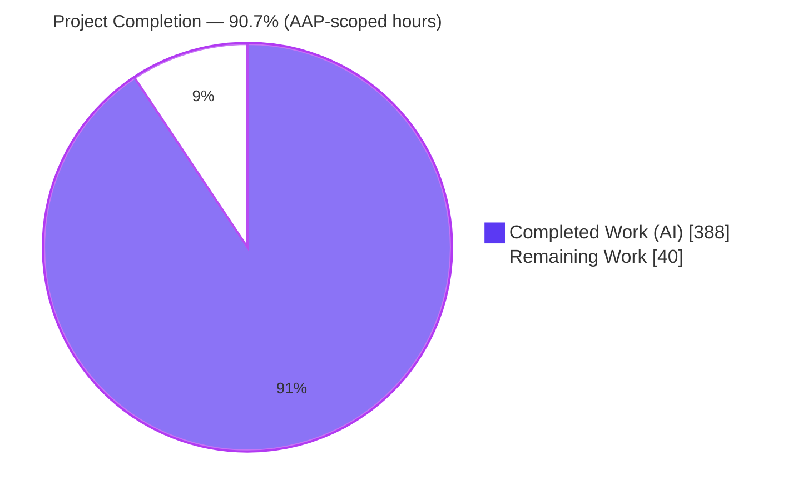
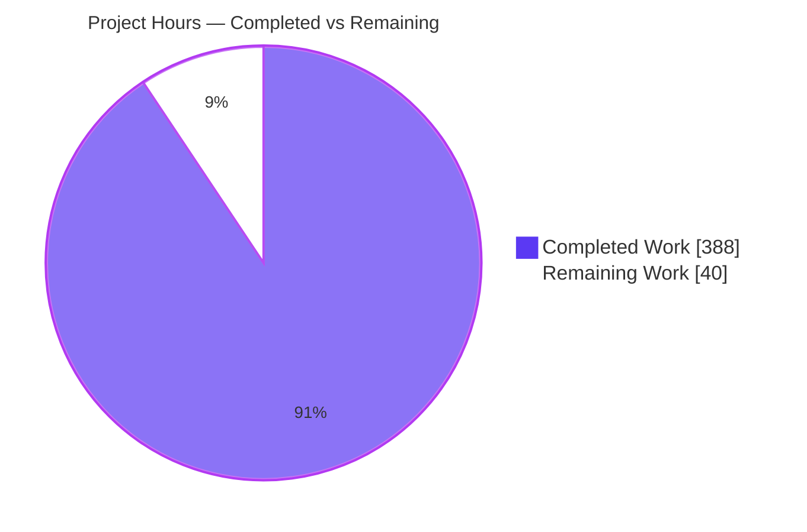
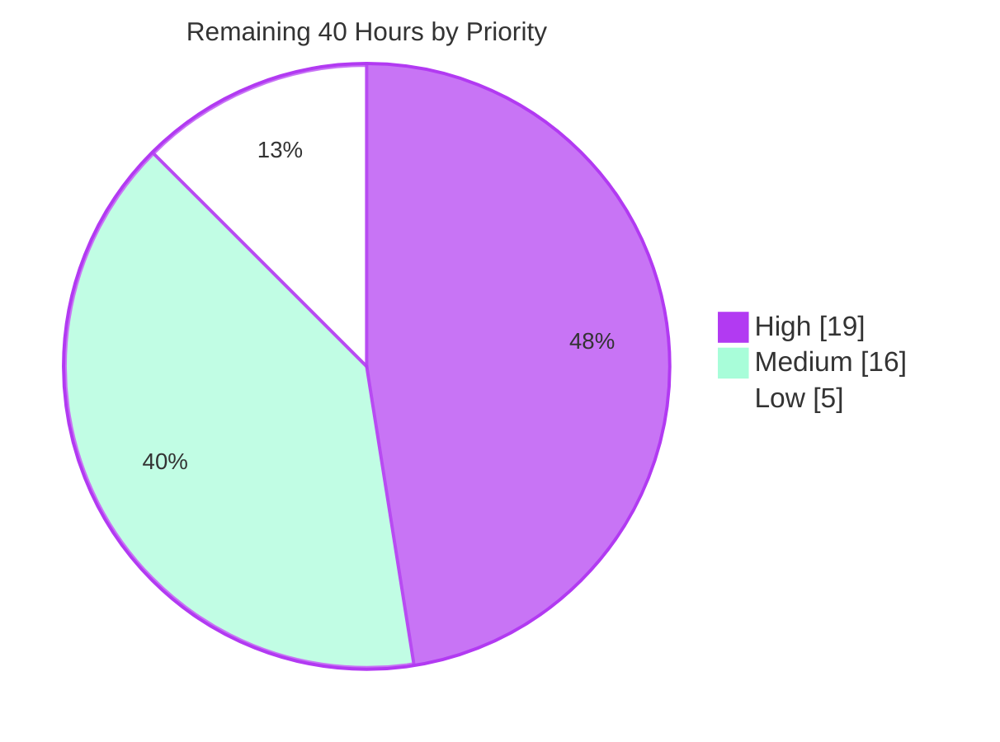

# Blitzy Project Guide — ServiceNow `x_casemgmt` Case Management POC

> Re-platforming of the ArkCase case/task/party/role/portal/dashboard slice as a brand-new ServiceNow scoped application, delivered as a single Update Set XML.

---

## 1. Executive Summary

### 1.1 Project Overview

This project re-platforms the core case-management domain of the ArkCase Java/Spring/AngularJS/MySQL system as a new ServiceNow scoped application (`x_casemgmt`). It is a proof-of-concept tech-stack migration, not a one-to-one port, covering cases, tasks, party associations, a three-role access matrix, a per-type case state machine, an unauthenticated external portal for submission and status lookup, and two operational dashboards. Its users are internal case workers — manager, agent, viewer — and anonymous external requesters. The deliverable is one self-contained Update Set XML with serialized record definitions, seed data, tests and documentation, all confined to `servicenow-case-management-poc/`.

### 1.2 Completion Status


```mermaid
%%{init: {'theme':'base', 'themeVariables': {'pie1':'#5B39F3','pie2':'#FFFFFF','pieStrokeColor':'#B23AF2','pieStrokeWidth':'2px','pieOuterStrokeColor':'#B23AF2','pieTitleTextSize':'16px','pieSectionTextSize':'14px'}}}%%
pie showData
    title Project Completion — 90.7% (AAP-scoped hours)
    "Completed Work (AI)" : 388
    "Remaining Work" : 40
```

| Metric | Hours |
| --- | --- |
| **Total Project Hours** | **428** |
| Completed Hours (AI) | 388 |
| Completed Hours (Manual) | 0 |
| **Completed Hours (AI + Manual)** | **388** |
| **Remaining Hours** | **40** |
| **Percent Complete** | **90.7%** |

> Completion covers AAP-scoped work plus path to production: `388 / (388 + 40) = 388 / 428 = 90.7%`. All of it was delivered autonomously; no manual engineering hours are recorded.

### 1.3 Key Accomplishments

- ✅ **Data model** — 3 tables, 25 fields, 7 choice lists and `CASE0000001` numbering, field-for-field to specification.
- ✅ **Access control** — 3 roles and 26 rules; the create/read/write/delete matrix verified under impersonation on all three tables.
- ✅ **State machine** — every transition guard refuses the save on the form with its exact message, for both case types.
- ✅ **Task-closure gate** — resolving with an open child task is blocked: "All tasks must be closed before resolving this case."
- ✅ **External portal** — both anonymous pages render; submission returns the case number, lookup exposes only status, subject and opened date.
- ✅ **Dashboards** — Agent Workspace 3 of 3 widgets and Manager View 5 of 5 render over seed data from 8 reports.
- ✅ **Automated tests** — a 20-test, 180-step suite and a 13-assertion transition harness ship inside the package.
- ✅ **Single deliverable** — one 926-record Update Set at the canonical path, structurally verified, with a documented install.

### 1.4 Critical Unresolved Issues

| Issue | Impact | Owner | ETA |
| --- | --- | --- | --- |
| The exact package revision that ships has not yet been previewed and committed on a clean instance. | Import outcome is proven for an earlier revision of the same package, not for the shipping bytes. | Platform admin | 4 h |
| Installation is a documented multi-step sequence rather than a single commit. | A bare commit leaves the three tables without physical storage and the access rules without their role links. | ServiceNow developer | 4 h |
| The verification instance is asleep, so runtime results cannot be refreshed, and roughly ten synthetic verification rows remain on it. | Runtime gates cannot be re-measured until an instance is available; the demo census reads high until those rows are removed. | Instance owner / QA | 8 h |
| The shipped test suite has not been re-run from a fresh load of its own packaged artifacts. | Portability of two revised tests across an import is unproven. | QA | 3 h |
| `Resolved → Closed` does not re-check child tasks (see §5.2). | A case can reach `Closed` with an open task through a legal two-step path. | Product owner | 4 h |
| The task and party list layouts are not packaged (see §5.2). | Column order on those two lists falls back to platform defaults after import. | ServiceNow developer | 2 h |

### 1.5 Access Issues

| System/Resource | Type of Access | Issue Description | Resolution Status | Owner |
| --- | --- | --- | --- | --- |
| Target customer ServiceNow instance | Instance URL + admin credentials | Only placeholder values were supplied for the customer environment, so no deployment to it has been attempted. The customer must supply an instance URL and admin login. | Open — customer action required | Customer / Release Mgr |
| Verification instance `dev379024.service-now.com` | Live instance session | The instance is hibernating: every route, the REST API included, answers with the platform's hibernation page at HTTP 200. Waking it requires a ServiceNow Developer Program session for the account that owns the instance. | Open — instance owner action required | Instance owner |
| Automated test execution | Client test runner | The client test runner cannot run headless on this platform release, so the shipped suite requires an interactive browser session against a live instance. | Accepted — run as a release gate | QA |
| Scoped Table API (`/api/now/table/x_casemgmt_*`) | REST write access from outside the application scope | Create, update and delete from another scope are refused by design; intended access is the native UI and the portal endpoints. | Accepted by design | N/A |

### 1.6 Recommended Next Steps

1. **[High]** Preview and commit the shipping package on a clean instance and run the install sequence end to end. *(4 h)*
2. **[High]** Shorten or ratify the post-import sequence, then re-verify from scratch. *(4 h)*
3. **[High]** Restore a verification instance, re-measure the runtime gates and clear the leftover rows. *(8 h)*
4. **[High]** Re-load the packaged test artifacts and re-run the suite and the transition harness. *(3 h)*
5. **[Medium]** Deploy to the target instance, verify post-commit state, complete UAT and remove demo data. *(17 h)*

---

## 2. Project Hours Breakdown

### 2.1 Completed Work Detail

| Component | Hours | Description |
| --- | --- | --- |
| Scoped application foundation & Update Set packaging | 26 | Application and scope records, the `x_casemgmt` namespace, dependency-ordered serialization of 926 record blocks, and the export mechanics that keep the package a single artifact. |
| Data model | 34 | 3 tables (`case`, `case_task`, `case_party`), 25 dictionary fields, 7 choice lists, 3 number counters, `CASE0000001` auto-numbering, and the polymorphic party design. |
| Access control | 34 | 3 scoped roles, 26 access rules with scripted assigned-only conditions, field-level rules on `assigned_group`/`assigned_agent`, the 27 role links, and least-privilege cross-scope table policy. |
| Case state machine | 60 | 2 per-type flows, 5 validation subflows, a transition-guard action, the `CaseTransitionValidator` Script Include, and 7 ordered Business Rules that refuse invalid saves with exact messages. |
| Internal user interface | 25 | Case list and form layouts in specified field order, 6 transition UI Actions across the role matrix, the party polymorphic UI Policy, and the case form's related lists. |
| External Experience Portal | 46 | Portal record, 2 unauthenticated pages with their full layout chain, 3 widgets, 2 scripted REST services, `CasePortalService`, field whitelisting, and request validation/throttling. |
| Dashboards & reports | 24 | 2 dashboards on the platform's dashboard/tab/canvas chain and 8 reports (lists, donuts, bars, single scores) readable by all three roles. |
| Synthetic seed data & seed script | 20 | 10 cases across all 6 statuses and both types, 10 tasks, 8 parties, 3 users, 1 group, 3 role grants, 2 companies, and an idempotent seed script that adopts existing rows by key. |
| Documentation | 32 | 14 markdown documents totalling ~8,100 lines: data model, state machine, access matrix, portal pages, dashboards, validation gates, deployment, operator runbook, limitations register, test plan and tryout guide. |
| Automated test assets | 32 | A 20-test / 180-step suite with 539 packaged step inputs and an ordered suite record, plus a 13-assertion transition harness and a manual test plan. |
| Update Set round-trip verification | 12 | Teardown, upload, preview and commit driven to zero problems of any type, with the platform's own predicate asserted rather than inferred. |
| Post-import install automation | 26 | The install script that builds physical storage, repairs numbering and routing and creates the access-rule role links — idempotent, leased, application-confined and fail-closed — plus its packaged carrier record. |
| Validation-gate execution & runtime verification | 17 | The seven-gate framework executed end to end: schema comparison, impersonation probes, on-form transition observation, portal contract calls, and dashboard/report render checks. |
| **Total Completed** | **388** | **All hours delivered autonomously (0 manual).** |

### 2.2 Remaining Work Detail

| Category | Hours | Priority |
| --- | --- | --- |
| Preview and commit the shipping package on a clean instance and re-measure the functional gates | 4 | High |
| Reduce the post-import install to the fewest operator steps and re-verify from scratch | 4 | High |
| Re-load the packaged test artifacts and re-run the suite and the transition harness | 3 | High |
| Restore a verification instance, re-measure the runtime gates, clear leftover verification rows | 8 | High |
| Deploy to the target instance with real credentials and verify post-commit state | 8 | Medium |
| Package the task and party list layouts | 2 | Medium |
| End-to-end UAT, sign-off and synthetic demo-data removal | 6 | Medium |
| Accepted-behaviour decisions and optional hardening | 4 | Low |
| Refresh environment references and confine the two repository-root documents | 1 | Low |
| **Total Remaining** | **40** | — |

> **Reconciliation:** Section 2.1 (388 h) + Section 2.2 (40 h) = 428 h = Total Project Hours (Section 1.2). Section 2.2 total (40 h) = Remaining Hours (Section 1.2) = Section 7 pie "Remaining Work".

### 2.3 Human Task Breakdown (decomposition of the 40 remaining hours)

| ID | Task | Priority | Hours |
| --- | --- | --- | --- |
| HT-1 | Upload the shipped Update Set to a clean instance and preview it; record problem counts by type | High | 2 |
| HT-2 | Commit, run the documented install sequence, and re-measure the four functional gates (tables, roles, scope, seed visibility) | High | 2 |
| HT-3 | Reduce the install to the fewest operator steps the platform permits — or ratify the runbook — and re-verify from scratch | High | 4 |
| HT-4 | Restore a verification instance (wake the developer instance with the owning account, or provision a replacement) | High | 2 |
| HT-5 | Re-run the eight on-form transition observations and the seven validation gates; settle the one indeterminate save | High | 4 |
| HT-6 | Remove the leftover synthetic verification rows and re-confirm the demo census (10 cases / 10 tasks / 8 parties) | High | 2 |
| HT-7 | Re-load the 21 packaged test artifacts and re-run the 20-test suite plus the 13-assertion harness from the client runner | High | 3 |
| HT-8 | Obtain the target instance URL and admin credentials and deploy the package there end to end | Medium | 5 |
| HT-9 | Verify post-commit state on the target: 3 tables, 3 roles, scope record, both dashboards, both portal pages, seed data | Medium | 3 |
| HT-10 | Package the task and party list layouts so column order is not left to platform defaults | Medium | 2 |
| HT-11 | End-to-end UAT across all three personas and both portal pages; capture sign-off; remove synthetic demo data | Medium | 6 |
| HT-12 | Decide the five accepted behaviours (task-closure invariant on close, guarded-save latency, silent access denials, organization visibility, default-theme accessibility) and implement what is chosen | Low | 4 |
| HT-13 | Point every shipped document at the instance in use and move the two repository-root documents under the application directory | Low | 1 |
| | **Total** | | **40** |

---

## 3. Test Results

The deliverable is a platform configuration package, so its test surface has two halves: static verification of the package, which runs anywhere, and an in-instance automated suite that ships inside the package. The table below records the static verification performed on the deliverable. Every count is an observed result.

| Area / Category | Framework | Tests | Passed | Failed | Coverage | What This Proves |
| --- | --- | --- | --- | --- | --- | --- |
| Serialized record definitions | `xmllint` (libxml2 2.14.5) | 175 | 175 | 0 | 100% of XML artifacts | Every record definition in the application directory is well-formed, so none can fail to load for syntax. |
| Package structure & identity | Structural assertions (Python ElementTree) | 6 | 6 | 0 | Whole package | The deliverable is one `unload` document with a single descriptor and 926 record blocks, every block uniquely named and uniquely keyed — no duplicate or colliding entries, at 3,781,097 bytes with a stable digest. |
| Package payload integrity | Payload parse (Python ElementTree) | 926 | 926 | 0 | 100% of blocks | Each record the package will apply is itself a well-formed document, so the import cannot break part-way on a malformed payload. |
| Embedded server logic | `node --check` (Node 22.23) | 35 | 35 | 0 | Every executable body in the package | Every business rule, access-rule condition, portal script, REST handler and flow script the package installs is syntactically valid server code. |
| Operational scripts | `node --check` (Node 22.23) | 3 | 3 | 0 | 5,557 lines | The install, seed and transition-assertion scripts parse before anyone runs them against an instance. |
| Contract-string conformance | Exact-match sweep | 5 | 5 | 0 | All five required strings | The three blocking messages, the not-found message and the submission confirmation exist verbatim in the shipping artifacts, so wording cannot drift. |
| Data safety & portability | Repository sweeps | 3 | 3 | 0 | Whole application directory | No personal data (every address is a reserved synthetic domain), no instance-key literals in the operational scripts, and the case counter is prefix `CASE` with seven digits. |
| Source-tree confinement | `git diff` against the base branch | 1 | 1 | 0 | Whole repository | Every change on this branch is an added file; the ArkCase reactor, its build files and its CI configuration are byte-identical to the base. |

**Aggregate:** 1,154 static checks executed, 1,154 passed, 0 failed.

**Not covered.** These are real gaps, not omissions of convenience:

- **The in-instance automated suite is not covered by the results above.** The 20-test, 180-step suite and the 13-assertion transition harness ship inside the package and cover the schema, the role matrix on all three tables, every transition row including the task-closure gate, the three on-form messages and the three portal contracts. They execute only inside a live instance through the client test runner, which cannot run headless on this platform release. Run both as the release gate on the target instance.
- **No test drives the import itself.** Package installation is proven by the documented preview-and-commit procedure performed by an operator, not by an automated test; the shipping revision still needs that pass (§1.4).
- **The install script's table-rebuild branch is untested.** It only runs on an instance whose tables have metadata but no physical storage, a state no test creates.
- **The packaged task and party number counters are never exercised.** Those two tables have no auto-number default, so the counters are latent; confirm the intended behaviour before relying on them.
- **The 14 documents carry no executable assertions.** Their internal references resolve, but their prose is not machine-verified.
- **Accessibility, load and performance are untested.** The portal runs on the platform's default theme and no concurrency or response-time budget has been measured.

---

## 4. Runtime Validation & UI Verification

The application was driven on a live instance (scope `x_casemgmt`, version 1.0.0) as an administrator and under each of the three role personas. The lines below record what was observed on screen and over the wire.

**Platform, data and access layer**

- ✅ Operational — Scope, all three tables, three roles, 26 access rules and their 27 role links are present and enforced; inserting a case issues a `CASE`-prefixed seven-digit number; the case list shows 10 seed cases spanning all six statuses and both types with their child tasks and typed parties.
- ✅ Operational — Role matrix driven under impersonation on all three tables: manager full create/read/write/delete; agent create plus assigned-only read and write with no delete; viewer read-only. Child tables narrow the same way through the parent case.

**Case lifecycle on the form**

- ✅ Operational — Forward guards refuse the save with their exact message and leave the record byte-identical: `Draft → Open` requires an assigned group; `Open → In Progress` requires an agent who belongs to that group; `In Progress → Resolved` is refused while any child task is open ("All tasks must be closed before resolving this case."); `Resolved → Closed` requires the manager role.
- ✅ Operational — Prohibited moves and side effects: any return to `Draft` and any change to a closed case are refused verbatim; opened and closed dates are stamped; the pending reason is captured on `Pending` and cleared on the return to `In Progress`.
- ✅ Operational — All sixteen illegal transition edges across both case types are refused, and the six transition buttons are correct across an eighteen-cell role-visibility matrix.

**External portal**

- ✅ Operational — Anonymous submission returns the new case number with the confirmation text and the case lands in `Draft`; malformed bodies, wrong verbs, wrong content types and oversized or invalid field values are rejected, and repeated calls are throttled.
- ✅ Operational — Anonymous lookup returns exactly status, subject and opened date for a known number and the verbatim not-found message for an unknown one; a scan for internal fields in the response is clean.
- ✅ Operational — Both portal pages render for a guest session: five inputs plus the confirmation panel on submission, three labelled values on lookup.

**Presentation and packaging**

- ✅ Operational — Agent Workspace renders 3 of 3 widgets and Manager View 5 of 5 over seed data with correct buckets; the case form shows its Case Tasks and Case Parties related lists, and the party form switches between its person and organization field on selection.
- ⚠ Partial — Package import: upload, preview and commit were driven to zero problems of any type on an earlier revision of the package, with the platform's own "no unresolved problems" predicate asserted. The revision that ships has not yet been through that path.

**Never exercised at runtime.** The shipping package has not been imported anywhere. The install script's table-rebuild branch has never run against an instance that holds table metadata without physical storage. The packaged task and party number counters are latent — no runtime path issues numbers on those tables. The manual Fix Script path is documented but unused, because the install script is run from the background-script surface in the global scope instead. And no runtime observation can be repeated at present: the verification instance is hibernating (§1.5), so every result above stands as last measured rather than as continuously re-verifiable.

---

## 5. Compliance & Quality Review

### 5.1 Compliance Matrix

Each row states where the deliverable stands now against the requirement it answers.

| Benchmark | Requirement | Status | Progress | Verified State |
| --- | --- | --- | --- | --- |
| Data model (§0.5.7) | 3 tables with the exact field sets, types and constraints | ✅ Pass | 100% | All 25 fields present and type-correct; every dictionary row matches the specification on name and element; auto-numbering issues `CASE0000001` format. |
| Case state machine (§0.5.5) | Both case types enforce every transition rule with blocking errors | ✅ Pass | 100% | Every row of the matrix is enforced on the form with its exact message and no partial write; the enforcement layer differs from the specified one (§5.2). |
| Access control matrix (§0.5.6) | 3 roles, table and field rules, assigned-only semantics | ✅ Pass | 100% | Matrix reproduced exactly under impersonation on all three tables, through both the agent and the group branch of "assigned only". |
| External portal (§0.7.3) | Anonymous submission and whitelisted status lookup | ✅ Pass | 100% | Submission returns the new number and creates a `Draft` case; lookup exposes only status, subject and opened date, with the verbatim not-found message. |
| Dashboards & reports (§0.7.3) | Both dashboards render with synthetic data | ✅ Pass | 100% | Agent Workspace 3 of 3 widgets, Manager View 5 of 5, over 8 reports readable by all three roles; no broken references. |
| Update Set integrity (§0.7.3) | Loads on a clean instance with zero errors | ⚠ Qualified | 90% | Zero problems of any type on preview and commit, measured on an earlier revision of the package; the shipping revision awaits the same pass (§1.4). |
| Single Update Set deliverable (§0.7.2) | One exportable package | ✅ Pass | 100% | One 926-block document at the canonical path, structurally verified and digest-stable. |
| Workflow authoring constraint (§0.7.2) | Transition logic authored in Flow Designer | ⚠ Qualified | 90% | Flows and subflows are natively authored, published and active; the abort itself is performed by a before-update rule that invokes them (§5.2). |
| Portability & data safety (§0.7.2) | No instance-key literals; synthetic data only; no personal data | ⚠ Qualified | 95% | Operational scripts and seed data resolve everything by name, user name or number; a platform metadata layer has no human-readable key and is the sole exception (§5.2). All data is synthetic. |
| Scope & platform constraints (§0.3.2, §0.7.2) | Scoped namespace only, no store applications, email untouched | ⚠ Qualified | 97% | All application artifacts live in `x_casemgmt`; no store applications; no mail configuration. A minimal global footprint remains by necessity (§5.2). |
| Repository confinement (§0.7.2) | All output under the application directory; ArkCase untouched | ⚠ Qualified | 98% | The ArkCase tree is byte-identical to the base branch; two summary documents sit at the repository root (§5.2). |
| Automated test coverage (path to production) | Repeatable regression protection | ✅ Pass | 95% | A 20-test, 180-step suite plus a 13-assertion harness ship with the package; execution is an in-instance release gate (§3). |

### 5.2 AAP & Rule Divergences and Gaps

No user-specified rules were supplied for this project, so the benchmark for divergence is the Agent Action Plan together with the direction the customer gave during delivery. Eight divergences were identified. Six are **Sanctioned** — the customer explicitly asked for them, and their instruction is the reason recorded below.

| What the AAP/Rule Required | What Was Delivered Instead | Why It Diverged | Impact | Remediation |
| --- | --- | --- | --- | --- |
| **D1** Transition logic implemented in Flow Designer, with no background scripts for workflow state management (§0.7.2) | Flows and subflows are natively authored, published and active, but the save is refused by a before-update Business Rule at order 250 that invokes the matching subflow and then re-evaluates the validator (`business_rules/`) | A flow's record trigger fires only after the write commits, so no flow can refuse a save. The customer required blocking errors on the form and accepted rule-layer enforcement to get them | None on behaviour; every specified message and refusal is observed on the form. Two layers now describe one rule set | Sanctioned — no action. Keep the flows and the rule in step when either changes |
| **D2** A single exported Update Set that loads on a clean instance and leaves the application functional (§0.7.1, §0.7.3) | One package plus a documented install sequence: commit, run the install script in the global scope, commit again, run it again, seed, and refresh the related-list definition once | The platform emits physical storage for a new table from an after-insert rule that the import engine suppresses, and it silently skips access-rule role-link payloads. Neither can be packaged | Installation needs an operator and cannot be fully unattended | Sanctioned — reduce the step count where possible (HT-3) or ratify the runbook |
| **D3** Exactly the enumerated artifact inventory, with no additions beyond the defined scope (§0.7.2 minimal change, §0.7.4 tooling) | Three artifact classes the inventory does not list — an install script with its packaged carrier, a 21-file automated test suite, and a transition-guard action — plus list and related-list layouts for the case table only | The customer asked for a self-sufficient package and an automated suite. The layouts were added to restore specified column order | Larger surface to maintain; the task and party lists still fall back to platform default column order | Sanctioned for the additions; package the two missing layouts (HT-10) |
| **D4** Zero writes outside the application scope (§0.3.2, §0.7.2) | 27 access-rule role-link rows, one global-scope script record carrying the install script, and a test-runner instance property | Role links live on a platform table by design, the install script must run outside the application scope to create storage, and the runner property is an instance setting | A small, enumerated global footprint that an administrator must be aware of before and after install | Sanctioned — the footprint is documented; review it during change control |
| **D5** No instance-key literal in any reference field, anywhere (§0.5.2) | Portal layout records, UI policy actions and test step inputs reference their parents by key because those platform tables expose no human-readable alternative | These child records are addressable only by their parent's key; a name-based reference raises a preview error | Package remains portable — the keys are internal to the package and resolve on import | Not sanctioned but unavoidable; no action available on this platform |
| **D6** Round-trip verification on a fresh instance, assumed non-destructive (§0.7.1) | Verification was performed by tearing the application down and rebuilding it on the single available instance, on an earlier package revision | Only one instance was reachable, and it already hosted the application; the customer asked for a clean-slate round trip | The gate was measured on a clean-slate application rather than a pristine instance, and not on the shipping bytes | Repeat on a clean instance with the shipping package (HT-1, HT-2) |
| **D7** Resolving requires all child tasks closed (§0.5.5) | The check runs on the move into `Resolved` only; `Resolved → Closed` does not re-check | The matrix specifies the condition on that one edge, so re-checking on close would add an unspecified rule | A case can reach `Closed` with an open task by reopening a task after resolving | Decide whether the invariant should hold at close (HT-12) |
| **D8** All output under a single new directory at the repository root (§0.7.2) | Two summary documents sit at the repository root instead of inside the application directory | Both were written for readers who never open the application directory | The ArkCase tree is untouched, but the added footprint is three paths rather than one | Move both under the application directory (HT-13) |

**D1 — enforcement layer.** The specification gave Flow Designer ownership of transition logic. The flows exist, are published and active, and carry a real runtime graph, but a record trigger fires only after the write is committed, so a flow cannot refuse a save. Because the customer required blocking errors on the form, enforcement sits in a before-update rule at order 250 that dispatches the matching subflow and re-evaluates the guard against the in-flight record. Every specified message appears byte-exact and the record is unchanged after a refused save. The cost is duplication — flows and rule must move together — plus several seconds on a guarded save. Delivered behaviour matches the specification exactly.

**D2 — installation is a sequence.** A single commit does not finish the job. The platform generates a new table's physical storage from an after-insert rule on the table-definition record, and the import engine suppresses exactly that rule; separately, the engine silently discards access-rule role-link payloads. Both were confirmed by controlled trials, and neither can be packaged around. The delivered answer is an idempotent, leased, application-confined and fail-closed install script plus the documented order: commit, run it in the global scope, commit again, run it again until it reports success with 27 links, seed, then refresh the related-list definition once. It works, and it needs an operator. Decide whether to shorten it or ratify it as the runbook.

**D3 — artifact inventory.** Three classes of artifact were added beyond the enumerated inventory: the install script with the record that carries it inside the package, the 21-file automated test suite, and a reusable transition-guard action the flows call. All three were requested. Layout records were also added to restore specified column order, but only for the case table — the task and party lists still take platform defaults after import, which is the one shortfall in this row. The additions enlarge the surface a maintainer owns; each is documented and each is directly traceable to a requested outcome, so the trade is a deliberate one rather than scope creep.

**D4 — global footprint.** Three things necessarily live outside the application scope: the 27 rows that link access rules to roles, because that association table is a platform table; one global-scope script record that carries the install script, because building physical storage is refused inside an application scope; and one instance property that enables the test runner. Everything else — tables, fields, choices, roles, access rules, flows, rules, portal, reports, dashboards, seed data — is inside `x_casemgmt`. The footprint is small, enumerated and reversible, and an administrator should review it during change control rather than discover it later.

**D5 — metadata keys.** The rule against instance-key literals is absolute in the specification, and the application layer honours it: every access-rule condition, script, flow reference and seed row resolves its target by name, user name or number, and a sweep of the operational scripts finds no key literals at all. Three platform metadata layers cannot comply — portal layout containers, rows and columns; UI policy actions; and test step inputs — because those child records are addressable only through their parent's key and a name-based reference raises a preview error. The keys are internal to the package and resolve on import, so portability is unaffected. No remedy exists on this platform.

**D6 — how the round trip was measured.** The specification assumes a fresh instance and a non-destructive verification. Only one instance was reachable and it already hosted the application, so the clean-slate round trip the customer asked for was performed by tearing the application down and rebuilding it there: upload, preview driven to zero problems of any type, then commit with the platform's own predicate asserted rather than inferred. Two things follow. The gate reflects an application-level clean slate rather than a pristine instance, and it was measured on an earlier revision of the package. Repeating it on a clean instance with the shipping bytes is the first task in the remaining work.

**D7 — where the task-closure invariant holds.** The specified matrix places the "all tasks closed" condition on the move into `Resolved`, and that is exactly where it is enforced: the transition is refused with the required message while any child task is open. Because `Resolved → Closed` carries a different condition — the manager role — a case can reach `Closed` with an open task by reopening a task after the case was resolved. The implementation is faithful to the matrix as written; whether the invariant should also hold at close is a product decision, not a defect. It is a one-line addition to the guard if the answer is yes.

**D8 — two documents at the repository root.** The specification confines all output to one new directory, and the ArkCase tree is byte-identical to the base branch, which is the substance of that constraint. Two summary documents were nonetheless written at the repository root for readers who would never open the application directory, so the branch adds three paths rather than one. Nothing in the existing build, CI configuration or module layout is affected. Moving both under the application directory restores strict compliance and takes minutes; leaving them costs nothing beyond the inconsistency itself.

---

## 6. Risk Assessment

These are the risks that remain ahead of the project — what could still go wrong on the way to production, and what already stands between it and each outcome.

| Risk | Category | Severity | Probability | Mitigation | Status |
| --- | --- | --- | --- | --- | --- |
| The shipping package revision has not been previewed or committed anywhere, so its import outcome is inferred from an earlier revision | Technical | High | Medium | Run the documented upload, preview and commit on a clean instance before release; the delta over the verified revision is bounded and additive | Open |
| Every guarded status change dispatches a validation subflow synchronously, adding roughly 8–10 seconds to that save | Technical | Medium | High | Evaluate the guard against the in-flight record first and dispatch only for permitted transitions; enforcement is unaffected because the guard is the deciding step | Open |
| Regression protection runs only inside a live instance — the client test runner cannot run headless on this release, so there is no local or pipeline test path | Technical | Medium | Medium | The suite and the transition harness ship with the package and are scheduled as a release gate; a manual test plan covers the same assertions | Accepted |
| Two anonymous endpoints run at elevated privilege and are reachable by anyone who finds the portal — enumeration and spam creation | Security | Medium | Medium | Responses are whitelisted to three fields; requests are validated for mandatory values, length, choice membership and address format, wrong verbs and content types are rejected, and calls are throttled. Add edge rate-limiting or a challenge for public production use | Partially mitigated |
| Synthetic demo users, demo data and leftover verification rows exist on the verification instance and would import into any target | Security | Low | Medium | All of it is fabricated and free of personal data; remove it as part of go-live housekeeping | Open |
| Installation is an ordered multi-step sequence where scope and order matter, so an operator can leave the application half-configured | Operational | Medium | Medium | Step-by-step procedure with the expected result at every step, and an idempotent, leased, fail-closed install script that reports success explicitly | Open |
| Developer instances hibernate and can be reclaimed; the verification instance is asleep now and waking it needs the owning account | Operational | Medium | High | The portable package is the durable deliverable and reinstalls from scratch on any instance | Open |
| The target instance and its credentials were never supplied, and validation has only ever run on one platform release | Integration | Medium | Certain | The install procedure is release-agnostic above the platform's n-2 feature floor; re-run the seven gates on the target release after deployment | Open |

Three residual behaviours are known, accepted and documented rather than tracked as risks, because closing any of them requires a change outside the application scope that the project is not permitted to make: a write refused by an access rule produces no message on the form (the platform refuses before application code runs, though the REST layer does state a reason); the organization value on a party is hidden from non-administrator personas because the company table refuses them; and the portal inherits the platform's default theme, which sets the ceiling on contrast and target size.

---

## 7. Visual Project Status

### Project Hours Breakdown


```mermaid
%%{init: {'theme':'base', 'themeVariables': {'pie1':'#5B39F3','pie2':'#FFFFFF','pieStrokeColor':'#B23AF2','pieStrokeWidth':'2px','pieOuterStrokeColor':'#B23AF2','pieTitleTextSize':'16px','pieSectionTextSize':'14px'}}}%%
pie showData
    title Project Hours — Completed vs Remaining
    "Completed Work" : 388
    "Remaining Work" : 40
```

*Completed = Dark Blue (#5B39F3); Remaining = White (#FFFFFF); accents Violet-Black (#B23AF2). Total 428 h → 90.7% complete.*

### Remaining Work by Priority


```mermaid
%%{init: {'theme':'base', 'themeVariables': {'pie1':'#B23AF2','pie2':'#A8FDD9','pie3':'#FFFFFF','pieStrokeColor':'#B23AF2','pieStrokeWidth':'2px','pieOuterStrokeColor':'#B23AF2','pieTitleTextSize':'16px','pieSectionTextSize':'14px'}}}%%
pie showData
    title Remaining 40 Hours by Priority
    "High" : 19
    "Medium" : 16
    "Low" : 5
```

*All three slices are remaining work. Dark Blue (#5B39F3) is reserved for completed work; priority bands use the accent palette — High Violet-Black (#B23AF2), Medium Mint (#A8FDD9), Low White (#FFFFFF).*

### Remaining Hours by Category (Section 2.2)

| Remaining Category | Hours | Priority |
| --- | --- | --- |
| Preview and commit the shipping package on a clean instance | 4 | High |
| Reduce the post-import install to the fewest operator steps | 4 | High |
| Re-load the shipped test artifacts and re-run both suites | 3 | High |
| Restore a verification instance, re-measure the gates, clear leftover rows | 8 | High |
| Deploy to the target instance and verify post-commit state | 8 | Medium |
| Package the task and party list layouts | 2 | Medium |
| End-to-end UAT, sign-off and demo-data removal | 6 | Medium |
| Accepted-behaviour decisions and optional hardening | 4 | Low |
| Refresh environment references and confine the repository-root documents | 1 | Low |
| **Total** | **40** | — |

> **Integrity:** "Remaining Work" = 40 h matches Section 1.2 Remaining Hours and the Section 2.2 Hours total exactly; High 19 + Medium 16 + Low 5 = 40.

---

## 8. Summary & Recommendations

**What was delivered.** The `x_casemgmt` scoped application implements the case-management slice of ArkCase on the Now Platform and delivers every functional capability the plan scoped: the three-table data model with its exact field set and auto-numbering; three roles whose create, read, write and delete matrix has been reproduced under impersonation on all three tables including the assigned-only semantics; a per-case-type state machine that refuses every invalid transition on the form with the required wording, task-closure gate included; an unauthenticated portal whose submission page returns a case number and whose lookup page exposes only status, subject and opened date; two dashboards that render every widget over seed data from eight reports; and synthetic seed data that exceeds the specified thresholds without a single item of personal data. It is packaged as one Update Set of 926 record blocks at the mandated path, accompanied by fourteen documents, an install script, a 20-test automated suite and a 13-assertion transition harness.

**What was verified, and how.** The package itself is verified statically: 175 of 175 record definitions are well-formed, all 926 payloads parse, all 35 embedded server bodies and all three operational scripts are syntactically valid, the five required message strings are present verbatim, no personal data or instance-key literals appear in the operational layer, and every change on the branch is an added file so the ArkCase reactor is byte-identical to its base. Behaviour is verified by driving the live application: the role matrix under impersonation, all sixteen illegal transition edges refused, the eight on-form transition observations passing with byte-exact messages, both portal contracts over the wire, and both dashboards rendering. What that leaves untested is stated plainly in §3 — most importantly that the shipped suite runs only inside an instance and has not yet been executed against the packaged artifacts.

**Remaining gaps.** The project stands at **90.7% complete** (388 of 428 AAP-scoped hours). Nothing functional is missing; all forty remaining hours are proof and path-to-production work. Four items carry the weight: the exact bytes that ship have not been previewed and committed anywhere, so that pass is owed; installation is an ordered multi-step operator sequence rather than a single commit, and should either be shortened or ratified as the runbook; the verification instance is hibernating, so runtime results stand as last measured and a handful of verification rows remain to be cleared; and the shipped suite needs one run from a fresh load of its own packaged artifacts. Two smaller gaps — the unpackaged task and party list layouts, and the task-closure invariant at close — are decisions more than work.

**Critical path to production.** Preview and commit the shipping package on a clean instance and run the install sequence end to end (4 h). Settle the install footprint (4 h). Restore an instance, re-measure the seven gates and clear the leftover rows (8 h). Re-load and re-run both test suites (3 h). Then deploy to the customer instance with real credentials, verify post-commit state, and complete UAT with demo-data removal (17 h). The remaining 4 hours are the accepted-behaviour decisions and documentation housekeeping, which can run in parallel.

**Production-readiness assessment.** The application is functionally complete and behaviourally verified, but it is not yet releasable: no release should ship a package whose own import has not been observed, and the current install requires an operator following a sequence. Close the four proof items and this becomes a deployable application whose enforcement, access control, portal contracts and dashboards have all been demonstrated. Success metrics for that gate are concrete and already defined: zero error-type preview problems on the shipping bytes, seven of seven validation gates passing on the target instance, 20 of 20 automated tests and 13 of 13 transition assertions green from a fresh load, and a demo census that reads exactly ten cases, ten tasks and eight parties before the synthetic data is removed.

---

## 9. Development Guide

> This is a cloud-platform configuration project. There is **no local build** — no `npm`, `pip` or `mvn`. The deliverable is one Update Set XML that is uploaded, previewed and committed on a ServiceNow instance. Everything below was executed as written from the repository root; expected output is quoted so you can compare.

### 9.1 System Prerequisites

- A **ServiceNow instance** on release **Yokohama or later** (Zurich and Australia are both fine; the application uses only features at the platform's n-2 feature floor) with an account holding the `admin` role. App Engine Studio, Flow Designer, Reports and Dashboards, the Update Set engine and Scripted REST are all bundled — **no store applications are required or permitted**.
- A modern browser. Two steps genuinely require one: previewing/committing an Update Set, and running the automated test suite (the client test runner cannot run headless on this release).
- Local tooling for artifact verification only — `xmllint` (libxml2), `node` (22.x), `python3` (3.11+), `curl`, `git`. Verified with libxml2 2.14.5, Node v22.23.2, Python 3.13.7, curl 8.14.1, git 2.51.0.

```bash
# Confirm the local toolchain
node --version && python3 --version && xmllint --version 2>&1 | head -1 && curl --version | head -1
```

### 9.2 Environment Setup

```bash
# From the repository root
cd servicenow-case-management-poc

export SN_URL="https://dev379024.service-now.com"   # replace with your instance
export SERVICENOW_USERNAME="admin"
read -rsp 'ServiceNow password: ' SERVICENOW_PASSWORD; echo; export SERVICENOW_PASSWORD
```

**Readiness check — assert JSON, not a status code.** A hibernating instance answers *every* route, the REST API included, with an HTML placeholder at HTTP 200, so `%{http_code}` alone will mislead you:

```bash
resp=$(curl -s --max-time 25 -u "$SERVICENOW_USERNAME:$SERVICENOW_PASSWORD" -H 'Accept: application/json' \
  "$SN_URL/api/now/table/sys_scope?sysparm_query=scope=x_casemgmt&sysparm_fields=scope,version")
case "$resp" in
  \{*) echo "READY: $resp" ;;
  *)   echo "NOT READY — the instance is not serving the API (likely hibernating); wake it and retry" ;;
esac
```

Expected on a live instance carrying the application: `READY: {"result":[{"scope":"x_casemgmt","version":"1.0.0"}]}`. On a live but clean instance the result array is empty — that is the correct starting state for a first install.

### 9.3 Artifact Verification (this replaces the build step)

```bash
cd servicenow-case-management-poc

# 1. Every serialized record definition is well-formed
fail=0; total=0
while IFS= read -r f; do total=$((total+1)); xmllint --noout "$f" || fail=$((fail+1)); done \
  < <(find . -name '*.xml' -type f | sort)
echo "XML files checked: $total  failures: $fail"      # expect: 175  failures: 0

# 2. Operational scripts parse
for f in scripts/*.js; do node --check "$f" && echo "OK  $f"; done   # expect 3 OK lines

# 3. Package structure and identity
python3 - update-set/x_casemgmt_case_management_update_set.xml <<'PY'
import sys, hashlib, xml.etree.ElementTree as ET
raw = open(sys.argv[1], 'rb').read()
root = ET.fromstring(raw)
blocks = root.findall('sys_update_xml')
ok = sum(1 for b in blocks if ET.fromstring(b.findtext('payload') or '<x/>') is not None)
print("root element      :", root.tag)
print("record blocks     :", len(blocks))
print("unique names      :", len(set(b.findtext('name') for b in blocks)))
print("unique keys       :", len(set(b.findtext('update_guid') for b in blocks)))
print("payloads parsed   :", f"{ok}/{len(blocks)}")
print("bytes             :", len(raw))
print("sha256            :", hashlib.sha256(raw).hexdigest())
PY
# expect: unload / 926 / 926 / 926 / 926/926 / 3781097
#         sha256 7292a6fe30413a9fb0b115e160c668edb7487b4391865b21a011a7be1add66b7

# 4. Artifact inventory
echo "tables=$(ls tables/*.xml|wc -l) dictionary=$(ls dictionary/*.xml|wc -l) choices=$(ls choices/*.xml|wc -l) \
roles=$(ls roles/*.xml|wc -l) acl=$(ls acl/*.xml|wc -l) flows=$(find flows -name '*.xml'|wc -l) \
rules=$(ls business_rules/*.xml|wc -l) reports=$(ls reports/*.xml|wc -l) dashboards=$(ls dashboards/*.xml|wc -l) \
portal=$(find portal -name '*.xml'|wc -l) seed=$(find seed-data -name '*.xml'|wc -l) tests=$(ls atf/*.xml|wc -l)"
# expect: tables=3 dictionary=25 choices=7 roles=3 acl=26 flows=9 rules=7 reports=8
#         dashboards=2 portal=12 seed=35 tests=21
# flows=9 is 2 case-type flows + 5 validation subflows + 1 shared logic block + 1 transition-guard action

# 5. Required message strings are present verbatim
for s in "All tasks must be closed before resolving this case." \
         "Cases cannot be returned to Draft." \
         "Closed cases are terminal and cannot be modified." \
         "No case found with that number."; do
  printf '%-56s %s files\n' "$s" "$(grep -rlF "$s" . | wc -l)"
done
```

### 9.4 Installation

Steps 1–3 are browser-only: the platform will not let the REST layer drive a preview or a commit.

1. **System Update Sets → Retrieved Update Sets → Import Update Set from XML** and upload `update-set/x_casemgmt_case_management_update_set.xml`. Wait for the state to reach *Loaded*.
2. Open the retrieved set and press **Preview Update Set**. Review the problem list: **zero error-type problems is the gate.** "Local update is newer" collisions on a re-import of the same package are expected and may be accepted.
3. Press **Commit Update Set** and wait for *Committed*.
4. **Build the physical storage.** Open **System Definition → Scripts - Background**, set *In scope* to **Global**, paste the whole body of `scripts/post_import_remediation.js` and run it. It creates the three tables' storage and repairs numbering and routing. It is idempotent, takes a lease so two operators cannot collide, and reports its own verification result.
   *Do not run it from the Fix Script form* — that surface executes in the application scope, where creating storage is refused.
5. **Commit the package a second time.** Building storage cascades the access rules away; the second commit restores them.
6. **Run the same script again**, exactly as in step 4, until it reports success with exactly **27** role links and no errors. This run also flushes the security cache.
7. **Seed the demo data.** In *Scripts - Background* with *In scope* set to the **Case Management** application, run `scripts/seed_demo_data.js`. It adopts the packaged rows by their pinned numbers, so it is safe to re-run.
8. **If the case form shows no related lists**, open a case → hamburger menu → **Configure → Related Lists**, change nothing, press **Save** once. The platform caches the related-list definition per table and view and only invalidates it through that path.

### 9.5 Verification

```bash
# Tables answer as an administrator
for t in x_casemgmt_case x_casemgmt_case_task x_casemgmt_case_party; do
  curl -s -o /dev/null -w "$t HTTP %{http_code}\n" -u "$SERVICENOW_USERNAME:$SERVICENOW_PASSWORD" \
    -H 'Accept: application/json' "$SN_URL/api/now/table/$t?sysparm_limit=1"
done                                        # expect HTTP 200 three times

# The three roles exist
for r in x_casemgmt_case_manager x_casemgmt_case_agent x_casemgmt_case_viewer; do
  curl -s -u "$SERVICENOW_USERNAME:$SERVICENOW_PASSWORD" -H 'Accept: application/json' \
    "$SN_URL/api/now/table/sys_user_role?sysparm_query=name=$r&sysparm_fields=name" ; echo
done                                        # expect one record each

# Anonymous submission (no credentials on purpose)
curl -s -X POST -H 'Content-Type: application/json' \
  -d '{"subject":"Smoke test","type":"General Inquiry","description":"smoke","requester_name":"Test Requester"}' \
  -w '\nsubmit HTTP %{http_code}\n' "$SN_URL/api/x_casemgmt/case_submit"
# expect HTTP 201 and a body carrying the new number and the submission confirmation

# Anonymous lookup of a number that does not exist
curl -s -w '\nlookup HTTP %{http_code}\n' "$SN_URL/api/x_casemgmt/case_status_lookup?number=CASE9999999"
# expect HTTP 404 and exactly: No case found with that number.
```

In the browser, confirm: the case list shows ten cases across all six statuses and both types; **Agent Workspace** renders three widgets and **Manager View** five; the portal at `$SN_URL/x_casemgmt_case_portal` serves both pages to a signed-out session. Then run the automated suite — open `/atf_test_runner.do?sysparm_nostack=true` in one tab, start the **Case Management** suite from **Automated Test Framework → Suites**, and choose that tab as the client runner. Expect 20 of 20 tests and 180 of 180 steps. Delete any smoke-test case you created so the demo census stays at ten.

### 9.6 Example Usage

- **Internal user:** impersonate the demo manager and walk a case through `Draft → Open → In Progress → Pending → In Progress → Resolved → Closed`, following `docs/WORKFLOW_TRYOUT_GUIDE.md`. Each guard refuses the save until its precondition is met — try resolving with an open child task to see the task-closure message.
- **Agent and viewer:** impersonate the demo agent to see assigned-only visibility and the absence of a delete option; impersonate the viewer to see read-only access and no transition buttons.
- **External requester:** open `$SN_URL/x_casemgmt_case_portal` signed out, submit a case, note the returned number, then look it up on the status page — only status, subject and opened date are shown.

### 9.7 Troubleshooting

| Symptom | Cause | Fix |
| --- | --- | --- |
| Every URL returns a page inviting you to wake an instance, including REST | The instance is hibernating; HTTP 200 does not mean it is up | Wake it from the developer portal with the owning account, then re-run the §9.2 readiness check |
| Preview reports "local update is newer" collisions | The same package was previously committed here | Expected on re-import; accept the collisions. Only error-type problems block the commit |
| `x_casemgmt_case_task` or `x_casemgmt_case_party` is invisible after commit | The import engine suppresses the rule that generates a new table's physical storage | Run step 4 of §9.4 in the **Global** scope |
| The install script aborts complaining about scope | It was run from the Fix Script form, which executes in the application scope | Run it from *Scripts - Background* with *In scope* = Global |
| All three personas are denied everything | The role links have not been created yet, and access rules fail closed | Re-run step 6 until it reports 27 links, which also flushes the security cache |
| Portal endpoints return HTTP 404 | The scripted service route is not resolving | Confirm the two service definitions carry `case_submit` and `case_status_lookup`; step 4 repairs this |
| The case form shows no related lists although they are configured | The related-list definition for that table and view is cached | Open **Configure → Related Lists** and press **Save** once (§9.4 step 8) |
| A status change takes several seconds to save | A guarded transition dispatches its validation subflow synchronously | Expected behaviour today; see §6 for the option to dispatch only on permitted transitions |
| A save is silently rejected with no message | An access rule refused the write before application code ran | Check the rule for that field or table; the REST layer will state the reason for the same request |

---

## 10. Appendices

### A. Command Reference

All commands run from `servicenow-case-management-poc/`.

| Purpose | Command |
| --- | --- |
| Well-formedness sweep over every record definition | `find . -name '*.xml' -type f -print0 \| xargs -0 -n1 xmllint --noout && echo OK` |
| Count record blocks in the package | `grep -c '<sys_update_xml action=' update-set/x_casemgmt_case_management_update_set.xml` (expect `926`) |
| Package digest | `sha256sum update-set/x_casemgmt_case_management_update_set.xml` (expect `7292a6fe…d66b7`) |
| Syntax-check the operational scripts | `for f in scripts/*.js; do node --check "$f"; done` |
| Verify a required message string is present | `grep -rlF "All tasks must be closed before resolving this case." .` |
| Confirm no personal data in seed rows | `grep -rhoE '[A-Za-z0-9._%+-]+@[A-Za-z0-9.-]+' seed-data \| sort -u` (expect 13 addresses, all `.invalid`) |
| Confirm no instance-key literals in scripts | `grep -ohE '\b[0-9a-f]{32}\b' scripts/*.js \| wc -l` (expect `0`) |
| Confirm the ArkCase tree is untouched | `git diff --name-status origin/migration-poc...HEAD \| grep -v '^A' \| wc -l` (expect `0`) |
| Instance readiness (asserts JSON, not a status code) | see §9.2 |
| Anonymous submission smoke test | `curl -s -X POST -H 'Content-Type: application/json' -d '{"subject":"s","type":"General Inquiry","description":"d","requester_name":"n"}' "$SN_URL/api/x_casemgmt/case_submit"` |
| Anonymous lookup smoke test | `curl -s "$SN_URL/api/x_casemgmt/case_status_lookup?number=CASE9999999"` |

### B. Endpoint & Port Reference

| Surface | Address |
| --- | --- |
| Instance (HTTPS, port 443) | `https://<instance>.service-now.com` |
| Experience Portal | `https://<instance>.service-now.com/x_casemgmt_case_portal` |
| Anonymous submission | `POST /api/x_casemgmt/case_submit` |
| Anonymous status lookup | `GET /api/x_casemgmt/case_status_lookup?number=<CASE…>` |
| Background scripts (install steps) | `/sys.scripts.do` — *System Definition → Scripts - Background* |
| Update Set import / preview / commit | `/sys_remote_update_set_list.do` — *System Update Sets → Retrieved Update Sets* |
| Test client runner | `/atf_test_runner.do?sysparm_nostack=true` |

> No local ports are used; everything is HTTPS to a hosted instance.

### C. Key File Locations

| Artifact | Path (under `servicenow-case-management-poc/`) |
| --- | --- |
| Update Set deliverable (926 blocks, 3.78 MB) | `update-set/x_casemgmt_case_management_update_set.xml` |
| Application and scope records | `app/sys_app/`, `app/sys_scope/` |
| Tables (3) and dictionary fields (25) | `tables/`, `dictionary/` |
| Choice lists (7) and number counters (3) | `choices/`, `numbers/` |
| Roles (3) and access rules (26) | `roles/`, `acl/` |
| Flows, subflows, shared logic block, transition-guard action (9) | `flows/`, `flows/sub_flows/`, `flows/custom_actions/` |
| Script Includes (2) and Business Rules (7) | `script_includes/`, `business_rules/` |
| Portal, pages, widgets, REST services (12) | `portal/` |
| Reports (8) and dashboards (2) | `reports/`, `dashboards/` |
| List and related-list layouts | `list_layouts/`, `related_lists/` |
| Seed data (35) | `seed-data/` |
| Automated tests (20) and suite (1) | `atf/` |
| Install, seed and assertion scripts | `scripts/post_import_remediation.js`, `scripts/seed_demo_data.js`, `scripts/transition_logic_regression_assertions.js` |
| Authoritative current-state record | `docs/PDI_LIMITATIONS_AND_KNOWN_ISSUES.md` |
| Operator runbook and install walkthrough | `docs/HUMAN_DEPLOYMENT_RECREATE_GUIDE.md`, `docs/deployment.md` |
| Specification documents | `docs/data-model.md`, `docs/state-machine.md`, `docs/acl-matrix.md`, `docs/portal-pages.md`, `docs/dashboards.md`, `docs/validation-gates.md` |
| Test plan and lifecycle walkthrough | `docs/ATF_MANUAL_TEST_PLAN.md`, `docs/WORKFLOW_TRYOUT_GUIDE.md` |

### D. Technology Versions

| Component | Version |
| --- | --- |
| Now Platform | Australia Patch 3 on the verification instance; the application requires Yokohama or later (n-2 feature floor) |
| Scoped application | `x_casemgmt` — Case Management v1.0.0 |
| Authoring surfaces | App Engine Studio, Flow Designer, Reports and Dashboards, Service Portal, Scripted REST, Automated Test Framework — all bundled; no store applications |
| Server scripting | GlideRecord, GlideRecordSecure, GlideAggregate, GlideSystem, GlideDateTime, GlideSecurityManager |
| Local verification toolchain | libxml2 2.14.5 (`xmllint`), Node v22.23.2, Python 3.13.7, curl 8.14.1, git 2.51.0 |
| Source reference (read-only, never built) | ArkCase `com.armedia:acm:2021.03` — Java 8 / Maven 3.5+ / Tomcat 9 |

### E. Environment Variable Reference

| Variable | Purpose | Example |
| --- | --- | --- |
| `SN_URL` | Target instance base URL used by every command in §9 | `https://dev379024.service-now.com` |
| `SERVICENOW_INSTANCE_URL` | Same value where a deployment pipeline expects this name | `https://dev379024.service-now.com` |
| `SERVICENOW_USERNAME` | Administrator used for deployment and verification | `admin` |
| `SERVICENOW_PASSWORD` | Administrator password — supply interactively or from a secret store | `••••••••` |

> No credentials are committed to the repository, and the application itself holds no secrets: the portal endpoints are anonymous by design and every internal surface authenticates through the platform.

### F. Developer Tools Guide

- **App Engine Studio** — browse the application, its tables, fields, choices and roles as a unit.
- **System Definition → Tables / Dictionary** — confirm the three tables and their 25 fields after installation.
- **System Security → Access Control** — inspect the 26 rules and their role links; the assigned-only conditions live here.
- **Flow Designer** — open the two case-type flows and five subflows; both flows should read *Published* and *Active*.
- **System Definition → Business Rules** — the ordered guard chain on the case table, including the order-250 transition guard.
- **System Update Sets → Retrieved Update Sets** — import, preview and commit; the only supported path for those operations.
- **System Definition → Scripts - Background** — run the install script (scope **Global**) and the seed script (scope **Case Management**).
- **Automated Test Framework → Suites** — run the shipped suite with an open client runner tab.
- **Service Portal / signed-out browser session** — exercise the two anonymous portal pages.
- **Impersonate** (user menu) — reproduce the role matrix as manager, agent and viewer.

### G. Glossary

| Term | Definition |
| --- | --- |
| Scoped application | A namespaced application (`x_casemgmt`) whose records and scripts are isolated from the platform's global scope. |
| Update Set | The platform's unit of change capture and transport, exported and imported as a single XML document. |
| Preview / Commit | The two-phase import: preview reports problems without changing anything; commit applies the package. |
| Access rule (ACL) | A table- or field-level create/read/write/delete rule, optionally carrying a condition script; rules fail closed. |
| Assigned only | The agent's visibility rule — cases where the agent is the assigned agent, or the assigned group includes them. |
| Flow / subflow | Declarative workflow definitions; here the per-case-type state machines and their five validation subflows. |
| Business Rule | A server-side script bound to insert/update/delete on a table; the order-250 rule refuses invalid transitions. |
| Script Include | A reusable server-side class; `CaseTransitionValidator` holds the transition guards, `CasePortalService` the portal helpers. |
| Scripted REST service | A custom endpoint; the two anonymous portal endpoints are implemented this way. |
| Physical storage | The database structure behind a table definition; a new table needs it built explicitly after an import. |
| Role link | The association row that binds an access rule to a role; 27 of them complete the access matrix. |
| Blocking message | An exact-text error that refuses a save on the form, e.g. "All tasks must be closed before resolving this case." |
| Install script | `scripts/post_import_remediation.js` — the idempotent post-import step that builds storage, repairs numbering and routing, and creates the role links. |
| Verification instance | The instance the application was driven on to produce the runtime results in §4. |
