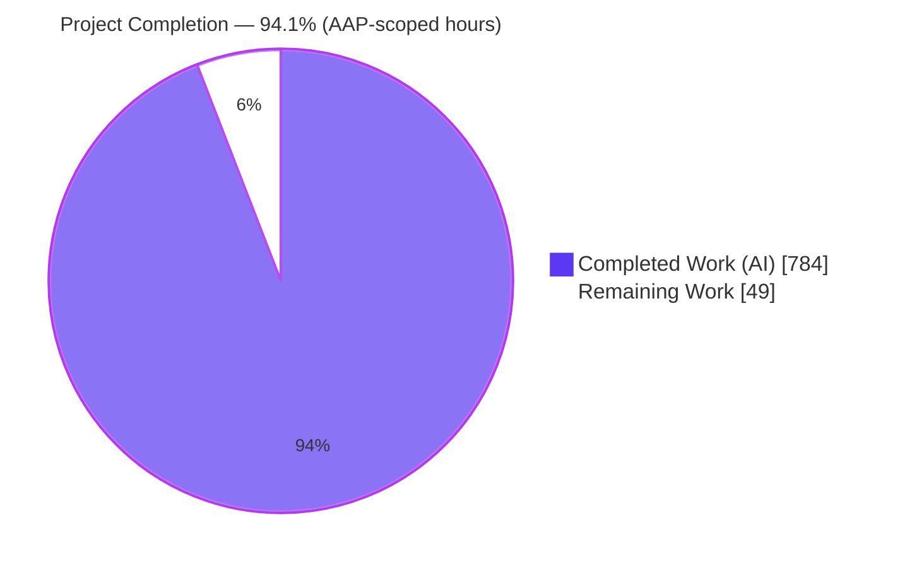
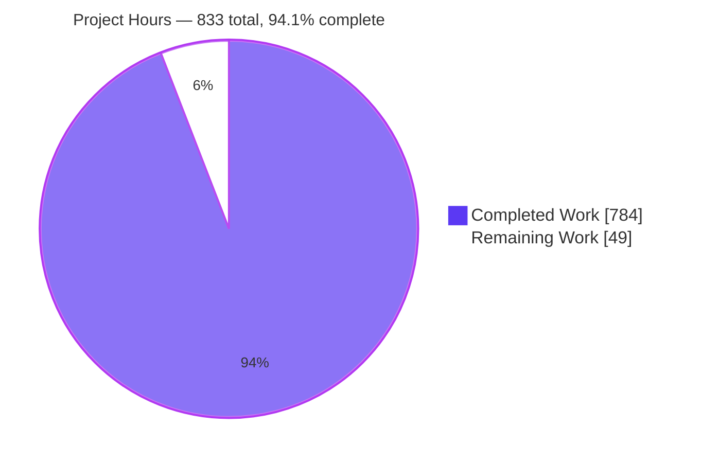
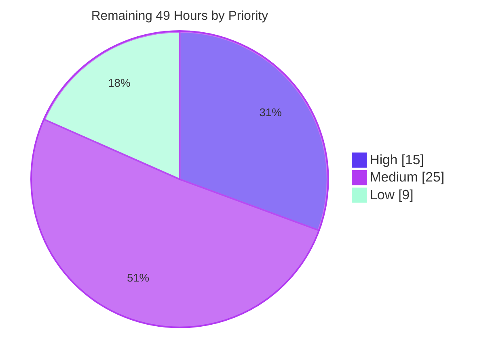

# Blitzy Project Guide — ServiceNow `x_casemgmt` Case Management POC

> Re-platforming of the ArkCase case/task/party/role/portal/dashboard slice as a brand-new ServiceNow scoped application, delivered as a single Update Set XML.

# 1. Executive Summary

## 1.1 Project Overview

This project re-platforms ArkCase's core case-management domain — a Java/Spring/AngularJS/MySQL system — as a new ServiceNow scoped application (`x_casemgmt`). It is a proof of concept, not a one-to-one port: cases, tasks, party associations, a three-role access matrix, a per-type state machine, an unauthenticated submission and status-lookup portal, and two dashboards. Its users are internal case workers — manager, agent, viewer — and anonymous requesters. The deliverable is one self-contained Update Set XML carrying record definitions, seed data, tests and documentation.

## 1.2 Completion Status


```mermaid
%%{init: {'theme':'base', 'themeVariables': {'pie1':'#5B39F3','pie2':'#FFFFFF','pieStrokeColor':'#B23AF2','pieStrokeWidth':'2px','pieOuterStrokeColor':'#B23AF2','pieTitleTextSize':'16px','pieSectionTextSize':'14px'}}}%%
pie showData
    title Project Completion — 94.1% (AAP-scoped hours)
    "Completed Work (AI)" : 784
    "Remaining Work" : 49
```

| Metric | Hours |
| --- | --- |
| **Total Project Hours** | **833** |
| Completed Hours (AI) | 784 |
| Completed Hours (Manual) | 0 |
| **Completed Hours (AI + Manual)** | **784** |
| **Remaining Hours** | **49** |
| **Percent Complete** | **94.1%** |

> AAP-scoped work plus path to production: `784 / (784 + 49) = 784 / 833 = 94.1%`. All delivered autonomously; no manual hours are recorded.

## 1.3 Key Accomplishments

- ✅ **One installable package** — 576 blocks, each carrying a platform payload hash, byte-identical to the platform's own export.
- ✅ **Proven install** — preview to zero problems of any type, then one clean commit, on four emptied instances.
- ✅ **One-commit deployment** — storage, choice values, role links and persona access all arrive with the commit.
- ✅ **Automated suite green on the delivered bytes** — 20 of 20 tests, 179 of 179 steps; 13 of 13 transition assertions.
- ✅ **Data model** — 3 tables, the full specified field set, 7 choice lists, `CASE0000001` numbering.
- ✅ **Access control** — 3 roles, 29 access rules, 36 role links; the CRUD matrix verified per persona.
- ✅ **State machine** — every guard refuses the save with its exact message, both case types.
- ✅ **Portal and dashboards** — both anonymous pages serve signed out; every dashboard widget renders.

## 1.4 Critical Unresolved Issues

**14 of the 95 requested items remain open.** Group counts sum to 14.

| Issue | Impact | Owner | ETA |
| --- | --- | --- | --- |
| **Independent-instance confirmation (1 item)** — the install gate is met on these exact bytes, but on a single instance emptied immediately beforehand rather than on a second, independent one | Platform state a teardown does not reset — caches, indexes, retained update history — was never re-created, so an install elsewhere is the one unproven case | Platform engineer | 8 h |
| **Access-control decisions (3 items)** — organization parties cannot be saved because the referenced company table is unreadable to all three roles; counts and aggregates compute over rows the access rules deny; the anonymous endpoints are unthrottled at the platform perimeter | One party type is unusable; a viewer or agent can infer records they cannot read; the public endpoints rely on the application's own guard alone | Security admin | 16 h |
| **Package hygiene decision (1 item)** — one shipped user row carries login date, time and a cloud egress address | The source environment's login trail travels with the package; no credential material does | Product owner | 4 h |
| **Presentation on theme-owned surfaces (2 items)** — control and focus-ring contrast, mobile zoom, target sizing; chart percentage announcement, label truncation, mobile legend | Portal and dashboard accessibility falls short of AA on surfaces the default theme owns | Product owner | 4 h |
| **Specification ratifications (3 items)** — one column beyond the specified field set, the literal-identifier position, exact-concurrency duplicate submissions | Delivered schema arity differs from the specification; two positions are unratified | Product owner | 5 h |
| **Platform limits and housekeeping (4 items)** — dashboard ownership unset, three rule names truncated at the platform's limit, tracked output paths outside the application directory, documentation carrying both current and superseded verdicts | Personas cannot navigate to their dashboards; an operator can read a superseded instruction as current | Platform engineer | 12 h |

## 1.5 Access Issues

| System/Resource | Type of Access | Issue Description | Resolution Status | Owner |
| --- | --- | --- | --- | --- |
| Verification instance | Instance URL + admin credentials | Supplied and working. The instance is live, is not mid-upgrade, and now holds no installation — the agreed end state, with the package and its recorded digest as the durable artifact. | Resolved — verified | Instance owner |
| Receiving production instance | Instance URL + admin credentials | No production instance has been named, so no deployment to one has been attempted. A URL and an administrator login are required. | Open — customer action required | Customer / Release Mgr |
| Update Set preview and commit | Interactive browser session | The platform will not let the REST layer drive a preview or a commit; both are browser-only actions. | Accepted — operator step | Release Mgr |
| Automated test execution | Client test runner | The client test runner cannot run headless on this platform release, so the shipped suite needs an interactive browser session against an instance holding the application. | Accepted — run as a release gate | QA lead |
| Scoped Table API (`/api/now/table/x_casemgmt_*`) | Anonymous and cross-scope access | Anonymous reads are refused at HTTP 401 and cross-scope writes are refused by design; intended access is the native UI and the two portal endpoints. | Accepted by design | N/A |

## 1.6 Recommended Next Steps

1. **[High]** Install the package on the receiving instance through preview and commit, then record the census. *(3 h)*
2. **[High]** Re-run the packaged suite and transition harness there as the release identity. *(3 h)*
3. **[High]** Authorize the company read rule and re-verify organization parties. *(3 h)*
4. **[High]** Make the anonymous endpoints throttle at the perimeter and close the admission race. *(6 h)*
5. **[Medium]** Complete UAT across the three personas and both public pages, then remove the demo data. *(6 h)*

# 2. Project Hours Breakdown

## 2.1 Completed Work Detail

| Component | Hours | Description |
| --- | --- | --- |
| Scoped application foundation & Update Set packaging | 60 | Application and scope records, the `x_casemgmt` namespace, serialization of the record definitions, and the deliverable itself as a single genuine platform export — dependency-ordered per the plan's sequence contract, byte-identical to the platform's own output, carrying an identity and digest ledger, and standing alone at the canonical path. |
| Data model | 46 | 3 tables (`case`, `case_task`, `case_party`), the full specified field set across 21/14/13 live dictionary rows, 7 choice lists in the platform's native choice-set form with an idempotent reconciliation script, 3 number counters, `CASE0000001` auto-numbering, and the polymorphic party design. |
| Write-path data contracts | 22 | Mandatory-value, string-length, referential-existence and party-exclusivity enforcement as ordered rules on every write path; unique, read-only child keys; and a parent-to-child cascade so orphans cannot survive a parent delete. |
| Access control | 64 | 3 scoped roles, 29 access rules with scripted assigned-only conditions, field-level rules on `assigned_group`/`assigned_agent`, three date-range rules carrying a resolvable operation reference, 36 role links authored through the platform's own role-assignment action, and persona access delivered by a transportable group route that derives no stock role. |
| Case state machine | 62 | 2 per-type flows, 5 validation subflows, a shared logic block, a reusable transition-guard action, the `CaseTransitionValidator` Script Include, and 12 ordered Business Rules that refuse invalid saves with exact messages on the form, in the list editor and over the API. |
| Internal user interface | 40 | Single-column case form in the specified field order, case list and related-list layouts, 6 transition UI Actions gated on the stored record, 3 UI policies with 12 actions, and 3 client scripts covering party polymorphism, closed-case read-only enforcement and stale-message flushing. |
| External Experience Portal | 84 | Portal record, 2 unauthenticated pages with their full layout chain, 3 widgets, 2 scripted REST services, `CasePortalService`, field whitelisting, exact-storage round-trip verification, strict identifier validation, post-insert admission accounting with a per-requester bucket, refusal-before-not-found ordering, abuse telemetry, timezone-labelled dates and in-portal navigation. |
| Dashboards & reports | 30 | 2 dashboards on the platform's dashboard/tab/canvas chain with their 8 canvas placements and widget instances, and 8 reports (lists, donuts, bars, single scores), with the agent donut scoped to the caller. |
| Synthetic seed data & seed script | 26 | 10 cases across all 6 statuses and both types, 10 tasks, 8 parties, 3 users, 3 groups with their role links and memberships, 2 companies, and an idempotent seed script that adopts rows by key and supplies any missing parent or date. |
| Documentation | 68 | 20 documents plus an application README: data model, state machine, access matrix, portal pages, dashboards, validation gates, deployment, operator runbook, limitations register, test plan, lifecycle walkthrough and the gate evidence narrative — each stating the delivered identity, gate result and step arithmetic at its point of use. |
| Automated test assets | 56 | A 20-test / 179-step suite with its 768 packaged step inputs and an ordered suite record, plus a 13-assertion transition harness and a manual test plan — its read-only assertions, portal date contract and lifecycle coverage all matching the specification. |
| Post-import install automation & operational safeguards | 34 | The contingency install script that builds physical storage, sets numbering and routing and creates the access-rule role links, and the pre-delete collateral guard that enumerates dependants and aborts before any destructive call — both idempotent, leased, application-confined and fail-closed, with a 58-assertion harness. |
| Package verification & round-trip gating | 84 | Candidate production through the platform's own publish path, dependency-order verification, three guarded teardowns with ten-to-forty-seven-predicate zero-state proofs, residue elimination across six census snapshots, and four complete gate cycles of upload, preview to zero problems of any type, single native commit and post-commit census. |
| Validation-gate execution & runtime verification | 76 | The seven-gate framework executed end to end plus the persona, transition, portal-contract, dashboard-render and accessibility campaigns, and a committed predicate ledger of 727 checks with the raw request, timestamp, status and body behind each. |
| Repository-to-instance parity & native artifact authoring | 24 | 22 records authored natively in scope — 5 business rules, 3 client scripts, 3 date-range access rules and a UI policy with its 10 actions — each read back after creation, with parity between the repository definitions and the live application established across all six artifact groups before the package was published. |
| Package data hygiene | 8 | Neutral actor identity across every record, cleared login metadata, reserved-domain addresses only, no credential element populated, and no instance host in the shipped bytes. |
| **Total Completed** | **784** | **All hours delivered autonomously (0 manual).** |

## 2.2 Remaining Work Detail

| Category | Hours | Priority |
| --- | --- | --- |
| Install the package on an independent receiving instance and gate it there | 6 | High |
| Authorize the narrowly scoped company read rule and re-verify the organization party flow | 3 | High |
| Make the anonymous endpoints throttle at the platform perimeter and close the script-side admission race | 6 | High |
| Implement the scoped count/aggregate disclosure control and re-run the persona access matrix | 5 | Medium |
| Decide the shipped login-metadata footprint, then re-publish, re-gate and update the recorded digest | 4 | Medium |
| UAT across all three personas and both public pages, with sign-off | 4 | Medium |
| Consolidate the documentation set to one current statement per fact | 8 | Medium |
| Remove synthetic demo data and confirm the census | 2 | Medium |
| Set dashboard ownership and correct the three truncated rule names | 2 | Medium |
| Accessibility and chart presentation decisions on theme-owned surfaces | 4 | Low |
| Ratify the additional column, the literal-identifier position and exact-concurrency deduplication | 3 | Low |
| Confine the tracked output paths outside the application directory | 1 | Low |
| Decide whether the historical run records fall inside the package exclusion | 1 | Low |
| **Total Remaining** | **49** | — |

> **Reconciliation:** Section 2.1 (784 h) + Section 2.2 (49 h) = 833 h = Total Project Hours (Section 1.2). Section 2.2 total (49 h) = Remaining Hours (Section 1.2) = Section 7 pie "Remaining Work". Priority split: High 15 + Medium 25 + Low 9 = 49.

## 2.3 Human Task Breakdown (decomposition of the 49 remaining hours)

| ID | Task | Priority | Hours |
| --- | --- | --- | --- |
| HT-1 | Provision the receiving instance, prove it empty, then upload, preview to zero problems of any type and commit the package natively; record the post-commit census | High | 3 |
| HT-2 | Re-run the packaged 20-test / 179-step suite and the 13-assertion transition harness on that instance against the delivered bytes, and record the result as the release identity | High | 3 |
| HT-3 | Authorize one global read rule on the company table restricted to the three roles and the minimum columns, then re-verify the organization party flow end to end | High | 3 |
| HT-4 | Re-author the two anonymous rate-limit rules with valid resource keys, re-export, and demonstrate a refusal past the ceiling | High | 4 |
| HT-5 | Close the script-side admission race so exactly simultaneous submissions cannot both be admitted | High | 2 |
| HT-6 | Implement the three scoped before-query rules so counts and group-by tallies respect the access rules, then re-run the persona access matrix | Medium | 5 |
| HT-7 | Decide the shipped login-metadata footprint; if it must go, clear the three fields at source, re-publish, re-gate and update the recorded digest wherever it is stated | Medium | 4 |
| HT-8 | Run UAT across all three personas and both public pages and capture written sign-off | Medium | 4 |
| HT-9 | Consolidate the documentation set to one current statement per fact and replace the retired instance-host references | Medium | 8 |
| HT-10 | Remove the synthetic demo data and re-confirm the census (10 cases / 10 tasks / 8 parties) | Medium | 2 |
| HT-11 | Set dashboard ownership so each persona can navigate to its dashboard, and correct the three truncated rule names in the next gated package | Medium | 2 |
| HT-12 | Decide the theme-owned accessibility and chart items — control and focus-ring contrast, mobile zoom, target sizing, percentage announcement, label truncation, mobile legend — and implement what is chosen | Low | 4 |
| HT-13 | Ratify the additional case column, the literal-identifier position and the exact-concurrency deduplication behaviour | Low | 3 |
| HT-14 | Relocate the tracked evidence and summary paths that sit outside the application directory | Low | 1 |
| HT-15 | Decide whether the historical run records fall inside the package exclusion and, if so, supersede them with dated headers | Low | 1 |
| | **Total** | | **49** |

# 3. Test Results

The deliverable is a platform configuration package, so its test surface has three parts: static and structural verification of the package, which runs anywhere; read-only verification of the instance it targets; and an automated suite that ships inside the package and runs only where the application is installed. The table records verification executed against the artifact as it now stands.

| Area / Category | Framework | Tests | Passed | Failed | Coverage | What This Proves |
| --- | --- | --- | --- | --- | --- | --- |
| Serialized record definitions | `xmllint` (libxml2 2.14.5) | 226 | 226 | 0 | Every record definition in the application directory | No record definition can fail to load for syntax. |
| Package structure & identity | Structural assertions (Python ElementTree) | 12 | 12 | 0 | The shipping package end to end | One descriptor, 576 uniquely named blocks, every action an insert-or-update, no amended block, a platform payload hash on all 576, and a digest matching the ledger committed beside it — the signature of a genuine platform export rather than a hand-assembled file. |
| Package payload integrity | Payload parse (Python ElementTree) | 576 | 576 | 0 | 100% of blocks | Every record the package will apply is itself a well-formed document, so an import cannot break part-way on a malformed payload. |
| Package artifact inventory | Class-count assertions | 30 | 30 | 0 | 30 artifact classes | The package carries the whole application: 3 tables, the dictionary and label set, 24 choice values across 7 lists, 3 counters, 3 roles, 29 access rules with 36 role links, 12 business rules, 2 script includes, 3 client scripts, 3 UI policies with 12 actions, 6 UI actions, 7 flows, 8 reports, 2 dashboards with 8 canvas placements, the portal chain, 2 anonymous services, the test assets and all 28 seed rows. |
| Constraint conformance | Byte-level sweeps over the package | 6 | 5 | 1 | Scope stamps, actor identity, addresses, credentials, host, reference identifiers | Nothing is stamped to the global scope, no authenticating account identity survives, all 15 addresses are on the reserved domain, no credential element is populated, and no instance host appears. The literal-reference-identifier rule is not met — see §5.2. |
| Operational scripts & descriptors | `node --check` (Node 22.23), `jq` | 9 | 9 | 0 | 9,070 script lines + 4 descriptors | The choice-reconciliation, seed, install, collateral-guard and transition-assertion scripts, and every run descriptor, parse before anyone runs them. |
| Contract strings & seed thresholds | Exact-match sweep + seed census | 7 | 7 | 0 | 4 required messages, 3 data thresholds | The three blocking messages and the not-found message exist verbatim in the shipping bytes, and the seed set is 10 cases spanning all six statuses and both case types. |
| Confinement & instance state | `git diff` against the base branch; read-only platform API | 12 | 12 | 0 | Whole repository; scope, tables, roles, portal, endpoints | Every change on this branch is an added file, so the ArkCase reactor, its build files and its CI configuration are byte-identical to the base; and the target instance is live, is not mid-upgrade, and holds no installation — the agreed end state. |

**Aggregate:** 878 checks executed, 877 passed, 1 failed.

**The packaged suite.** The deliverable carries a 20-test / 179-step automated suite with its 768 step inputs, and a 13-assertion transition harness. Together they cover the schema and choice sets, the role matrix on all three tables, every row of the transition matrix including the task-closure gate, the three on-form blocking messages and the three portal contracts. Both execute only where the application is installed, and the client test runner cannot run headless on this platform release. Run against these exact bytes as the release gate, the suite returned **20 of 20 tests and 179 of 179 steps**, and the harness **13 of 13 assertions**, five times over. Alongside them sits a committed predicate ledger — 727 records, each carrying the request, UTC timestamp, HTTP status and response body behind one gate check, with six scripts that reproduce every figure.

**Not covered.** These are real gaps, not omissions of convenience:

- **No test drives the import.** Installation is proven by an operator performing preview and commit and reading the census afterwards, not by an automated assertion. It has been performed on the delivered bytes, but only on instances emptied immediately beforehand — never on an independent one.
- **The packaged suite cannot be re-run where no installation exists.** It is the release gate for the receiving instance, and until it runs there the suite result describes an environment that has since been torn down.
- **Wording of the blocking messages is asserted statically, not over the API.** The refusals themselves are exercised; the exact text is confirmed in the shipping bytes and observed on the rendered form, because the platform returns only its generic abort text to an API caller.
- **Perimeter throttling of the anonymous endpoints is unproven, and measured not to hold.** A 300-request run passed the configured ceiling without a refusal. The application's own sliding-window guard is exercised by a 29-assertion admission harness including 3,000 generated concurrency schedules; the platform-level rules are not.
- **The install script's table-rebuild branch and the collateral guard's destructive path are unexercised.** Both are syntax-verified and the guard carries a 58-assertion off-instance harness, but neither has been driven against an instance in the state it exists for — and the install script is now a contingency the delivered package does not need.
- **Organization parties are untested outside an administrator session.** The company table the field references is unreadable to all three roles, so no persona-level test can reach that half of the party model.
- **Accessibility, load and performance carry no automated assertions.** The portal was measured manually against WCAG AA; theme-owned surfaces fall short (§1.4). No concurrency or response-time budget is asserted anywhere.
- **The 20 documents carry no executable assertions.** Their internal references resolve and their figures were re-derived, but their prose is not machine-verified.

# 4. Runtime Validation & UI Verification

The application was installed from the delivered package and driven on a live instance — as an administrator, under each of the three role personas, and as an anonymous visitor — across four complete install cycles, each starting from an instance proven empty. The lines below record what was observed on screen and over the wire. The instance now holds no installation, by agreement: the package and its recorded digest are the durable artifact.

- ✅ Operational — **Package install.** Upload, then preview returning zero errors, zero warnings and zero problems of any type with no problem row marked skip, ignore or collision; then a single native commit reporting success, 576 inserted, 0 updated, 0 collisions and 0 skipped. Repeated on four separately emptied instances.
- ✅ Operational — **Provisioning census.** From the commit alone, with no post-import step: three tables answering with physical storage, 21/14/13 dictionary and label rows, three roles, 29 access rules, 36 role links, 24 choice values across seven lists, three number counters, seven flows reading Active and Published, eight reports, two dashboards with their eight canvas placements, the portal chain, two anonymous services and the full test-asset set.
- ✅ Operational — **Persona access.** Each of the three demo personas resolves its scoped role from the shipped group route with nothing written by hand, confirmed on four independent installs. Driven under impersonation on all three tables: manager full create/read/write/delete; agent create plus assigned-only read and write with no delete; viewer read-only. Field-level rules on the assignment fields hold, and child tables narrow the same way through the parent case.
- ✅ Operational — **Data set.** The case list shows 10 seed cases spanning all six statuses and both types, every one carrying an opened date, with their 10 child tasks and 8 typed parties resolving to their parents.
- ✅ Operational — **Forward transition guards.** Each refuses the save with its exact message and leaves the record byte-identical: `Draft → Open` requires an assigned group; `Open → In Progress` requires an agent who belongs to that group; `In Progress → Resolved` is refused while any child task is open ("All tasks must be closed before resolving this case."); `Resolved → Closed` requires the manager role.
- ✅ Operational — **Prohibited moves and side effects.** Any return to `Draft` and any change to a closed case are refused verbatim, on the form, in the list editor and over the API; opened and closed dates are stamped; the pending reason is captured on `Pending` and cleared on the return to `In Progress`; the closed-case form lock is asserted on the rendered form.
- ✅ Operational — **Write-path contracts.** Missing mandatory values, over-length text, a task without a parent, a party missing the reference its type requires, and a dangling reference are each refused before the row is created.
- ✅ Operational — **Anonymous submission.** Returns the new case number with the confirmation text and the case lands in `Draft`; malformed bodies, wrong verbs, wrong content types and oversized or invalid field values are rejected; duplicates collapse.
- ✅ Operational — **Anonymous lookup and page delivery.** Lookup returns exactly status, subject and opened date for a known number and the verbatim not-found message for an unknown one, with no internal field in the response; both portal pages render for a signed-out session; anonymous table access is refused outright.
- ⚠ Partial — **Perimeter throttling and presentation.** Agent Workspace renders 3 of 3 widgets and Manager View 5 of 5 over seed data with correct buckets, and the party form switches between its person and organization field on selection. A 300-request run against the anonymous endpoints passed the configured ceiling without a platform-level refusal; the application's own sliding-window guard held throughout.

**Never exercised at runtime.** No install has been performed on an independent instance — every cycle ran on the same instance emptied immediately beforehand, so platform state a teardown does not reset was never re-created. Organization parties cannot be saved by any of the three personas, because the company table the field references is unreadable to them, so that half of the party model is unexercised outside an administrator session. The install script's table-rebuild branch has never run against an instance holding table metadata without physical storage, and the collateral guard has never been driven against a live delete. The demo personas hold no passwords by design, so every persona observation comes from impersonation rather than a direct login. No concurrency, latency or load profile has been measured, and no dashboard has been reached by navigation as a persona rather than by direct link.

# 5. Compliance & Quality Review

## 5.1 Compliance Matrix

Each row states where the deliverable stands now against the requirement it answers.

| Benchmark | Requirement | Status | Progress | Verified State |
| --- | --- | --- | --- | --- |
| Data model (§0.5.7) | 3 tables with the exact field sets, types and constraints | ✅ Pass | 100% | Every specified field present and type-correct across 21/14/13 live dictionary rows; auto-numbering issues the `CASE0000001` format. One column beyond the set (§5.2). |
| Choice lists (§0.5.7) | 7 choice fields with their specified values | ✅ Pass | 100% | 24 values across all seven fields, carried by the platform's native choice-set composites, materialising from the commit alone and rendering on the form. |
| Case state machine (§0.5.5) | Both case types enforce every transition rule with blocking errors | ✅ Pass | 100% | Every row of the matrix enforced with its exact message and no partial write, on the form, in the list editor and over the API; 13 of 13 transition assertions pass. The enforcement layer differs from the specified one (§5.2). |
| Access control matrix (§0.5.6) | 3 roles, table and field rules, assigned-only semantics | ✅ Pass | 100% | Matrix reproduced exactly under impersonation on all three tables, through both the agent and the group branch of "assigned only", across 29 rules and 36 role links, with each persona's role resolved from the commit alone. |
| Write-path integrity (§0.5.7 constraints) | Mandatory, length, referential and conditional constraints hold | ✅ Pass | 100% | Enforced on every write path, not only the form: missing values, over-length text, orphan children, dangling references and party-type mismatches are all refused before insert. |
| External portal (§0.7.3) | Anonymous submission and whitelisted status lookup | ✅ Pass | 100% | Submission returns the new number and creates a `Draft` case; lookup exposes only status, subject and opened date with the verbatim not-found message; anonymous table access is refused. Perimeter throttling is a separate open item (§1.4). |
| Dashboards & reports (§0.7.3) | Both dashboards render with synthetic data | ⚠ Qualified | 97% | Agent Workspace 3 of 3 widgets, Manager View 5 of 5, over 8 reports with no broken references and their canvas placements transported; ownership is unset, so the personas reach them by link rather than by navigation (§1.4). |
| Seed data thresholds (§0.7.4) | ≥10 cases across all statuses, both types, 3 users | ✅ Pass | 100% | 10 cases covering all six statuses and both types, 10 tasks, 8 parties, 3 users each resolving one role, all synthetic and free of personal data. |
| Update Set integrity (§0.7.3 gate 7) | Loads on a fresh instance with zero preview errors | ✅ Pass | 95% | The shipping bytes previewed to zero problems of any type and committed in one native pass on an instance proven empty immediately beforehand — four times over. An install on an independent instance remains the unproven case (§5.2). |
| Single Update Set deliverable (§0.7.2) | One exportable package that installs the application | ✅ Pass | 100% | One package at the canonical path carries the whole application and installs it in a single commit with no post-import step; every one of its 576 blocks carries a platform payload hash and the file is byte-identical to the platform's own export. |
| Scope, platform & portability constraints (§0.3.2, §0.5.2, §0.7.2) | Scoped namespace only, no store applications, email untouched, no instance-key literals | ⚠ Qualified | 90% | No record is stamped to the global scope, no store application is used, no mail configuration is touched, and no instance host appears in the package. Five rows land in stock tables by design, and a platform export cannot avoid literal reference identifiers (§5.2). |
| Repository confinement (§0.7.2) | All output under the application directory; ArkCase untouched | ⚠ Qualified | 92% | Every change on the branch is an added file and the ArkCase reactor is byte-identical to the base across all 3,456 Java sources and 114 build files. A review document, an HTML summary, a guide copy and 28 evidence captures sit outside the application directory (§5.2). |

## 5.2 AAP & Rule Divergences and Gaps

No user-specified rules were supplied for this project, so the benchmark for divergence is the Agent Action Plan together with the direction the customer gave during delivery. Eight divergences were identified. Four are **Sanctioned** — the customer asked for them, or the platform admits no alternative — and their reason is recorded below.

| What the AAP/Rule Required | What Was Delivered Instead | Why It Diverged | Impact | Remediation |
| --- | --- | --- | --- | --- |
| **D1** Round-trip re-import with zero preview errors on a *fresh* instance before commit (§0.7.1, §0.7.3 gate 7) | The gate run four times on the same instance, each time emptied to a proven zero state immediately before the exact shipping bytes were re-imported | **Sanctioned** — one instance was available, and the customer directed this as the closest achievable proxy with the caveat recorded | Platform state a teardown does not reset was never re-created, so an install elsewhere is the one unproven case | Run the same gate on the receiving instance (HT-1) |
| **D2** Confirm post-commit deployable state, and deliver a live portal URL (§0.7.1, §0.7.2) | An intentionally empty instance; the package plus its recorded digest and a 727-record predicate ledger are the deliverable | **Sanctioned** — the customer required the instance returned to empty and the artifact, not the environment, to hold the proof | No live environment to demonstrate against; a URL exists only once someone installs the package | Re-provision from the package (HT-1) |
| **D3** No literal `sys_id` in any reference field anywhere (§0.7.2) | A platform export in which every reference is a literal identifier — 3,698 distinct — plus six compiled-plan rows that resolve nowhere on any instance | The export format has no by-key form and no script layer; shipping keys instead imports inert records | None observed: zero preview problems and a clean commit on four installs; flows install Active and published | Accept in writing, or commission a by-key installer and forfeit the platform's own gate (HT-13) |
| **D4** Transition logic in Flow Designer with no background scripts for workflow state (§0.7.2) | Flows and subflows published and active, with the save refused by a before-update rule at order 250 that dispatches the matching subflow | **Sanctioned** — a flow's record trigger fires only after the write commits, so no flow can refuse a save, and blocking errors on the form were mandatory | None on behaviour; every specified message and refusal is observed. Two layers describe one rule set | Keep the flows and the rule in step |
| **D5** Organization parties selectable and mandatory for their type (§0.5.7) with no global-scope writes (§0.3.2) | Two company rows ship into a stock table, and the field still points at a table no scoped role can read | Every read rule on that table is global and the plan forbids authoring global rules; the plan also fixes the field's target | One of the two party types is unusable for all three personas | Authorize one narrowly scoped global read rule (HT-3) |
| **D6** Exactly the specified field set, the enumerated inventory, and all output in one subdirectory (§0.5.7, §0.7.2) | A 14th case column, artifact classes the inventory does not list, and 31 tracked paths outside the application directory | The mandated average-time-to-close widget cannot aggregate a value the platform does not store; the rest answer requested outcomes; evidence was written where the review trail lives | Larger surface to maintain, a schema arity that differs from the specification, and a wider repository footprint than one path | Ratify the column and inventory; relocate the paths (HT-13, HT-14) |
| **D7** Synthetic data only, no environment or personal data (§0.7.2) | One shipped user row carries a login date, a login time and a cloud egress address | The suite must run against the exact shipped bytes, and impersonation writes login metadata into the very row the package carries | The source environment's login trail travels with the package. No credential material ships | Clear at source, re-publish, re-gate, update the digest (HT-7) |
| **D8** Three users, one per role (§0.7.4), delivered as role grants in the package | Three groups, three group-to-role links and three memberships, from which the platform derives the grants on install | **Sanctioned by platform constraint** — the user-role table is owned by the platform's role-management layer on this release and no update set can carry it | None: effective access is identical, verified on four clean installs, and it avoids a stock role a direct grant derives | None required |

**D1 — the gate is met on these bytes, by reset-and-reimport.** Gate 7 asks for the exported package to re-import on a *fresh* instance with zero preview errors. One instance was available, so the customer directed the closest achievable proxy: empty it completely, prove the zero state, then re-import the exact candidate bytes with nothing in between. That ran four times — zero-state proof, upload, preview to zero errors *and* zero warnings, one native commit, then the post-commit census. What it cannot claim is what a second instance would prove: caches, indexes, retained update history and metadata a scope deletion does not reach were never re-created. Install on the receiving instance and read the census before release.

**D2 — the instance is empty on purpose.** The plan asks for a live post-commit state and a portal URL as deliverables. The customer replaced both: the durable artifact is the package plus its SHA-256, and the instance is to be handed back clean. It is — the scope is gone, all three tables answer "invalid table", no scoped role exists, the portal URL redirects to login and the anonymous endpoint refuses at HTTP 401. The verified state instead lives in `docs/refine-run/qa4-evidence/`, where 727 predicate records each carry the request, timestamp, status and body behind one gate check, alongside six scripts that reproduce every figure.

**D3 — literal reference identifiers.** The plan bars a literal `sys_id` in any reference field, anywhere. A platform Update Set export cannot satisfy that: the format serialises every reference as an identifier, and 3,698 distinct ones appear. The authored artifacts *are* clean — the five scripts contain three such tokens between them, all inside a comment block in `scripts/pre_delete_collateral_guard.js`. Two classes deserve naming: the three date-range rules in `acl/` carry a stock platform operation constant that resolves identically on every instance, and six compiled-plan rows resolve nowhere by construction. Neither has consequence — four installs previewed to zero problems and every flow installed active. Ratify the position in writing.

**D4 — enforcement layer.** The plan gave Flow Designer ownership of transition logic and barred background scripts for workflow state. The flows exist under `flows/`, are published and active, and carry a real runtime graph — but a record trigger fires only after the write commits, so no flow can refuse a save. Because blocking errors on the form were mandatory, enforcement sits in a before-update rule at order 250 that dispatches the matching subflow and re-evaluates the guard against the in-flight record. Every specified message appears byte-exact and the record is unchanged after a refused save. The cost is duplication: flows and rule must move together.

**D5 — organization parties are unsatisfiable.** The party schema points the organization field at the stock company table and makes it mandatory when the party type is Organization, per `dictionary/x_casemgmt_case_party_organization.xml`. Every read rule on that table is global, and the plan forbids authoring global access rules, so none of the three scoped roles can read it: the field is hidden on the form yet required by the save. Two synthetic company rows therefore ship into a stock table — unavoidable, since the plan fixes the field's target — and the party type remains unusable for every persona. Closing it needs one global read rule restricted to the three roles and the minimum columns: a deliberate, reviewable exception.

**D6 — field set, inventory and footprint.** The specified field set defines twelve case columns; the delivered table carries fourteen — the plan's own transition matrix requires the pending reason, and `duration_to_close` exists because the mandated average-time-to-close widget cannot aggregate a difference the platform does not store. Several artifact classes also go beyond the enumerated inventory: a choice-reconciliation script and a collateral guard under `scripts/`, a 21-file automated suite under `atf/`, layout classes, client scripts and business rules beyond the six named. And 31 tracked paths sit outside the application directory — a review document, an HTML summary, a guide copy and 28 evidence captures. Ratify the additions; relocate the paths.

**D7 — one shipped row carries environment metadata.** The plan permits synthetic data only. The demo manager's user row ships with a login date, a login time and a cloud egress address, because the exit condition requires the automated suite to run against the exact bytes that ship, and impersonating that persona writes login metadata straight into the row the package carries. Removing it after the fact would mean hand-editing a gated export, which destroys the byte-for-byte provenance that makes this package trustworthy. Nothing sensitive travels: no credential element is populated anywhere and all fifteen addresses are on the reserved `.invalid` domain. To ship without it, clear the three fields at source, re-publish, re-gate and update the digest.

**D8 — persona access arrives by derivation.** The plan asks for three users, one per role, and the natural reading is three role grants in the package. That is impossible on this platform release: the user-role table is owned by the platform's role-management layer, which refuses those payloads from any update set regardless of how they are stamped. The package therefore carries three groups, three group-to-role links and three memberships, and the platform derives the three effective grants during the commit. Verified on four independent installs: each persona resolves its scoped role with nothing written by hand. It is also the better mechanism: a direct grant derives a stock role the plan forbids, and the group route does not.

# 6. Risk Assessment

These are forward-looking: what could still go wrong between this package and a production release. Anything already closed during delivery is not listed.

| Risk | Category | Severity | Probability | Mitigation | Status |
| --- | --- | --- | --- | --- | --- |
| **Install on an independent instance behaves differently** — the gate was met by emptying one instance and re-importing the exact bytes, so platform state a scope deletion does not reach (caches, indexes, retained update history) was never re-created | Integration | High | Medium | The package is a genuine platform export with a payload hash on all 576 blocks, previewed to zero problems of any type and committed cleanly four times over. Run the same gate on the receiving instance before release (HT-1, HT-2) | Open |
| **Anonymous endpoints are unthrottled at the platform perimeter** — the two rate-limit rules carry display labels in their resource columns with no populated ceiling, so only the user half binds; a measured 300-request run returned 300 successes past the ceiling with no refusal | Security | Medium | High | Responses are whitelisted to three fields; pattern, mandatory-value, length, choice-membership and address validation all apply; wrong verbs and content types are refused; a script-side sliding-window guard and per-requester bucket are in place. Re-author the rules with valid resource keys and close the script-side race before public exposure (HT-4, HT-5) | Open |
| **Record counts disclose cardinality to restricted personas** — count and group-by paths compute before the access rules filter, so a viewer or agent can infer records they cannot open | Security | Medium | High | No field value is returned — only a tally. Three scoped before-query rules would narrow the count path the way the read path already narrows (HT-6) | Open — decision pending |
| **Making Organization parties usable widens read on a stock table** — the only route is a read rule outside the scoped namespace, granted to every holder of the three roles | Security | Medium | Medium | Restrict it to the three roles and the minimum columns and take it through change control; same-specificity read rules are any-pass, so no existing rule needs changing (HT-3) | Decision required |
| **Compiled execution plans may need a re-publish on the target** — six plan references in the package resolve nowhere on any instance by construction | Technical | Medium | Low | Proven inconsequential across four clean installs: zero preview problems, all seven flows install Active and published, 13 of 13 transition assertions and the full lifecycle suite green | Mitigated |
| **An operator follows a superseded instruction** — 21 documents carrying layered dated corrections, with current and superseded verdicts in the same file and a retired instance host named 45 times | Operational | Medium | Medium | Every operative document states the delivered identity at its point of use and the gate rollup reads seven met. Consolidate to one current statement per fact (HT-9) | Open |
| **The source environment's login trail travels with the package** — one shipped user row carries a login date, a login time and a cloud egress address | Operational | Medium | Low | No credential material ships anywhere in the package and every address is on a reserved domain. Clear the three fields at source and re-gate if the footprint matters (HT-7) | Open — decision pending |
| **A destructive schema operation cascades into access, transition and reporting metadata** — the platform offers no dependency manifest before a delete | Operational | Medium | Low | A mandatory read-only, fail-closed guard enumerates every dependant and aborts before the destructive call, refusing malformed input rather than widening the target; each teardown performed during delivery ran behind a freshly re-evaluated guard with the blast radius proven by a 52-table before-and-after diff | Mitigated |

**Accepted behaviours, stated once and not tracked as risks.** A write refused by an access rule produces no message on the form, because the platform refuses before application code runs. The portal and both dashboards inherit the default theme, which sets the ceiling on contrast, focus visibility and target size. Three classes of platform metadata can only be addressed through their parent record's key.

# 7. Visual Project Status

## 7.1 Project Hours Breakdown


```mermaid
%%{init: {'theme':'base', 'themeVariables': {'pie1':'#5B39F3','pie2':'#FFFFFF','pieStrokeColor':'#B23AF2','pieStrokeWidth':'2px','pieOuterStrokeColor':'#B23AF2','pieTitleTextSize':'16px','pieSectionTextSize':'14px'}}}%%
pie showData
    title Project Hours — 833 total, 94.1% complete
    "Completed Work" : 784
    "Remaining Work" : 49
```

## 7.2 Remaining Work by Priority


```mermaid
%%{init: {'theme':'base', 'themeVariables': {'pie1':'#5B39F3','pie2':'#B23AF2','pie3':'#A8FDD9','pieStrokeColor':'#B23AF2','pieStrokeWidth':'2px','pieOuterStrokeColor':'#B23AF2','pieTitleTextSize':'16px','pieSectionTextSize':'14px'}}}%%
pie showData
    title Remaining 49 Hours by Priority
    "High" : 15
    "Medium" : 25
    "Low" : 9
```

## 7.3 Remaining Hours by Category

The categories and hours below are Section 2.2 exactly.

| Category | Hours | Priority |
| --- | --- | --- |
| Independent receiving-instance install and gate | 6 | High |
| Company-table read rule and organization party re-verify | 3 | High |
| Perimeter throttling and the script-side admission race | 6 | High |
| Count and aggregate disclosure control, matrix re-run | 5 | Medium |
| Shipped login-metadata decision, re-publish and re-gate | 4 | Medium |
| UAT across three personas and both public pages | 4 | Medium |
| Documentation consolidation to one current statement per fact | 8 | Medium |
| Demo-data removal and census confirmation | 2 | Medium |
| Dashboard ownership and the three truncated rule names | 2 | Medium |
| Accessibility and chart decisions on theme-owned surfaces | 4 | Low |
| Written ratifications (extra column, identifiers, deduplication) | 3 | Low |
| Out-of-directory tracked paths | 1 | Low |
| Historical-record exclusion decision | 1 | Low |
| **Total** | **49** | — |

Colour key: **Completed / delivered = Dark Blue `#5B39F3`**, **Remaining = White `#FFFFFF`**, accents Violet-Black `#B23AF2`, highlight Mint `#A8FDD9`.

# 8. Summary & Recommendations

**What you have.** The ArkCase case-management slice now exists as a self-contained ServiceNow scoped application, and it arrives as one file: `servicenow-case-management-poc/update-set/x_casemgmt_case_management_update_set.xml`, 576 blocks, 3,282,299 bytes, SHA-256 `5565d986…`. Every block carries a platform payload hash and the file is byte-identical to the platform's own export, so what installs is what the platform itself produced — no hand-assembled XML anywhere in the chain. Inside it are the three tables with the full specified field set, the seven choice lists, `CASE0000001` numbering, three roles behind 29 access rules and 36 role links, seven flows with twelve ordered business rules enforcing the state machine, the internal form and list layouts, the unauthenticated portal with its two pages and two endpoints, both dashboards over eight reports, the synthetic seed census, a 20-test automated suite and the documentation set. It installs in three steps — import, preview, commit — and nothing else: no background script, no elevation, no second commit.

**What was proven.** The install gate ran end to end four times: an instance emptied to a verified zero state, the exact shipping bytes uploaded, preview returning zero problems of *any* type, one native commit reporting 576 inserted and 0 collisions, then a 55-predicate post-commit census. Across those installs, all three tables answered with their seed rows, the dictionary and label rows matched one-for-one, the 24 choice values materialised and rendered, all 36 role links arrived, all seven flows installed Active and published, both dashboards rendered with data, both public pages served signed out, and each of the three personas resolved its role with nothing written by hand. On the delivered bytes the packaged suite passes 20 of 20 tests and 179 of 179 steps, and the transition harness passes 13 of 13 assertions. Off the instance, 878 first-hand checks over the repository return 877 passes — the single failure is the literal-identifier constraint, which no platform export can satisfy. That evidence lives in the repository as a 727-record predicate ledger with the raw request, timestamp, status and body behind each check, plus six scripts that reproduce every figure.

**Where the gaps are.** Fourteen of the ninety-five requested items remain open, and they cluster. The one integration gap is that the gate was met on a single instance emptied immediately beforehand rather than on a second, independent one — the package is trustworthy, but the receiving instance is the case no run has exercised. Three are access-control decisions: the organization party type is unusable because its target table is unreadable to every scoped role and only a deliberate exception can change that; counts and aggregates compute before the access rules filter; and the two anonymous endpoints are unthrottled at the platform perimeter, relying on the application's own guard. The rest are decisions and housekeeping — one shipped user row carrying login metadata, theme-owned accessibility residues, three specification points needing written ratification, and documentation carrying both current and superseded verdicts.

**The critical path.** Fifteen hours of high-priority work stand between this package and a release candidate, and they run in order: install and gate on the receiving instance, re-run the suite and harness there and record that as the release identity, authorize the company read rule and re-verify organization parties, then make the endpoints throttle at the perimeter and close the admission race. Twenty-five hours of medium work follow — disclosure control, the login-metadata decision, UAT sign-off, documentation consolidation, demo-data removal and dashboard ownership — and nine hours of low-priority decisions after that. The success measures are already defined: the census returns the same figures on the receiving instance, the suite reads 20 of 20 there, and a request past the endpoint ceiling is refused.

**Readiness verdict.** At **94.1% of AAP-scoped hours (784 of 833)**, this is production-ready as a proof of concept and deployable today onto an internal instance. It is not yet ready for a public-facing release: the anonymous endpoints need real perimeter throttling and the count paths need scoping first, and neither is a code rewrite — one is configuration on two rules, the other three small scoped rules. The two headline concerns of the previous assessment are gone: the package now carries the whole application rather than a subset, and it has passed the round-trip gate on the exact bytes that ship. What remains is verification on the receiving instance, three security decisions, and paperwork.

# 9. Development Guide

> This is a cloud-platform configuration project. There is **no local build** — no `npm`, `pip` or `mvn`, and no manifest or lock file anywhere in the application directory. The deliverable is one Update Set XML that is uploaded, previewed and committed on a ServiceNow instance. Every command below was executed as written from the repository root or the application directory; the quoted output is what it produced.

## 9.1 System Prerequisites

- A **ServiceNow instance** on release **Yokohama or later** (Zurich and Australia are both fine — the application uses only features at the platform's n-2 feature floor) with an account holding the `admin` role. App Engine Studio, Flow Designer, Reports and Dashboards, the Update Set engine, Scripted REST and the Automated Test Framework are all bundled — **no store applications are required or permitted**.
- A modern browser. Two steps genuinely require one: previewing and committing the Update Set, and running the automated suite (the client test runner cannot run headless on this release).
- Local tooling for artifact verification only — `xmllint` (libxml2), `node`, `python3`, `jq`, `curl`, `git`. Measured: libxml2 2.14.5, Node v22.23.2, Python 3.13.7, jq 1.8.1, curl 8.14.1, git 2.51.0.
- No `security_admin` elevation is needed to install. The commit creates the access rules and their role links on its own; elevation is only relevant if you later hand-author access rules over REST.

```bash
# Confirm the local toolchain
node --version && python3 --version && jq --version && xmllint --version 2>&1 | head -1 && curl --version | head -1
```

## 9.2 Environment Setup

```bash
# From the repository root
cd servicenow-case-management-poc

export SN_URL="https://<your-instance>.service-now.com"
export SN_USER="admin"
read -rsp 'ServiceNow password: ' SN_PASS; echo; export SN_PASS
```

**Readiness check — assert a JSON body, never a status code.** A hibernating instance answers *every* route, the REST API included, with an HTML placeholder at HTTP 200, so `%{http_code}` alone will mislead you:

```bash
resp=$(curl -s --max-time 25 -u "$SN_USER:$SN_PASS" -H 'Accept: application/json' \
  "$SN_URL/api/now/table/sys_scope?sysparm_query=scope=x_casemgmt&sysparm_fields=name,version")
case "$resp" in
  \{*) echo "READY: $resp" ;;
  *)   echo "NOT READY — the instance is not serving the API (likely hibernating); wake it and retry" ;;
esac

# Confirm the instance is not mid-upgrade — the result array must be empty
curl -s -u "$SN_USER:$SN_PASS" -H 'Accept: application/json' \
  "$SN_URL/api/now/table/sys_upgrade_history?sysparm_limit=1&sysparm_query=upgrade_finishedISEMPTY&sysparm_fields=sys_id"
```

Observed just now against a live instance holding no installation: `READY: {"result":[]}` and `{"result":[]}`. An empty readiness array is the correct starting state for a first install. An instance already carrying the application answers with its name and version instead — `{"result":[{"name":"x_casemgmt Case Management","version":"1.0.0"}]}`.

## 9.3 Artifact Verification (this replaces the build step)

```bash
cd servicenow-case-management-poc

## Step 1 — every serialized record definition is well-formed
find . -name '*.xml' -print0 | xargs -0 -n1 xmllint --noout \
  && echo "xmllint: ALL WELL-FORMED ($(find . -name '*.xml' | wc -l) files)"
# observed: xmllint: ALL WELL-FORMED (226 files)

## Step 2 — operational scripts and the JSON descriptors parse
for j in scripts/*.js; do node --check "$j" && echo "OK $j"; done
# observed: 5 OK lines — create_choice_values, post_import_remediation,
#           pre_delete_collateral_guard, seed_demo_data, transition_logic_regression_assertions
find . -name '*.json' -print0 | xargs -0 -n1 jq -e . > /dev/null && echo "JSON: 4 VALID"

## Step 3 — package structure and identity
python3 - <<'PY'
import glob, hashlib, xml.etree.ElementTree as ET
for path in sorted(glob.glob('update-set/*.xml')):
    raw = open(path, 'rb').read()
    root = ET.fromstring(raw)
    blocks = root.findall('sys_update_xml')
    ok = sum(1 for b in blocks if ET.fromstring(b.findtext('payload') or '<x/>') is not None)
    hashed = sum(1 for b in blocks if (b.findtext('payload_hash') or '').strip())
    print(f"{path.split('/')[-1]:58s} root={root.tag} blocks={len(blocks):4d} "
          f"unique={len(set(b.findtext('name') for b in blocks)):4d} payloads={ok}/{len(blocks)} "
          f"hashed={hashed}/{len(blocks)} bytes={len(raw)} sha256={hashlib.sha256(raw).hexdigest()[:16]}")
PY
# observed, both with root=unload and payloads parsing 1:1 with blocks:
#   x_casemgmt_case_management_update_set.xml   blocks= 576 unique= 576 hashed=576/576 bytes=3282299 sha256=5565d98691abe9c5
#   …FALLBACK.xml                              blocks= 926 unique= 926 hashed= 13/926 bytes=3781097 sha256=7292a6fe30413a9f
# The hashed ratio is the discriminator: 576/576 is a genuine platform export. Install the first file.

## Step 4 — artifact inventory
echo "tables=$(ls tables/*.xml|wc -l) dictionary=$(ls dictionary/*.xml|wc -l) choices=$(ls choices/*.xml|wc -l) \
roles=$(ls roles/*.xml|wc -l) acl=$(ls acl/*.xml|wc -l) flows=$(find flows -name '*.xml'|wc -l) \
rules=$(ls business_rules/*.xml|wc -l) client=$(ls client_scripts/*.xml|wc -l) policies=$(ls ui_policy/*.xml|wc -l) \
actions=$(ls ui_action/*.xml|wc -l) reports=$(ls reports/*.xml|wc -l) dashboards=$(ls dashboards/*.xml|wc -l) \
portal=$(find portal -name '*.xml'|wc -l) seed=$(find seed-data -name '*.xml'|wc -l) tests=$(ls atf/*.xml|wc -l)"
# observed: tables=3 dictionary=60 choices=7 roles=3 acl=29 flows=9 rules=12 client=3 policies=2
#           actions=6 reports=8 dashboards=2 portal=14 seed=35 tests=21
# flows=9 is 2 case-type flows + 5 validation subflows + 1 shared logic block + 1 transition-guard action

## Step 5 — required message strings are present verbatim
for s in "All tasks must be closed before resolving this case." \
         "Cases cannot be returned to Draft." \
         "Closed cases are terminal and cannot be modified." \
         "No case found with that number."; do
  printf '%-56s %s files\n' "$s" "$(grep -rlF "$s" . | wc -l)"
done
# observed: 46, 34, 32 and 25 files respectively

## Step 6 — portability and data hygiene of the shipping package
P=update-set/x_casemgmt_case_management_update_set.xml
echo "global scope stamps: $(grep -c '<sys_scope>global</sys_scope>' "$P" || true)   \
source=global: $(grep -c 'source="global"' "$P" || true)   \
addresses: $(grep -oE '[A-Za-z0-9._%+-]+@[A-Za-z0-9.-]+' "$P" | sort -u | wc -l) \
(off reserved domain: $(grep -oE '[A-Za-z0-9._%+-]+@[A-Za-z0-9.-]+' "$P" | sort -u | grep -vc 'example.invalid' || true))   \
instance host: $(grep -c 'service-now\.com' "$P" || true)"
# observed: global scope stamps: 0   source=global: 0   addresses: 15 (off reserved domain: 0)   instance host: 0

## Step 7 — the committed gate ledger
jq -s '{records: length, passed: [.[] | select(.pass == true)] | length}' \
  docs/refine-run/qa4-evidence/qa4-gate-evidence.jsonl
# observed: {"records": 727, "passed": 724}
cat docs/refine-run/qa4-evidence/canonical_sha256.txt
sha256sum update-set/x_casemgmt_case_management_update_set.xml
# the recorded digest and the file on disk must match: 5565d98691abe9c5fd505d385dac650d5149e894952c772dc3c453d34a4cd983

## Step 8 — repository confinement
cd .. && git diff --name-status origin/migration-poc...HEAD | grep -v '^A' | wc -l
# observed: 0 — every change on the branch is an added file; the ArkCase reactor is untouched
```

## 9.4 Installation

Three steps, both browser-only, and nothing else. The platform will not let the REST layer drive a preview or a commit.

1. **System Update Sets → Retrieved Update Sets → Import Update Set from XML** and upload `update-set/x_casemgmt_case_management_update_set.xml`. Wait for the state to reach *Loaded*, and confirm the retrieved set holds **576** children — the same number the §9.3 Step 3 report gives for the file.
   *Use a clean instance.* The package envelope names a retrieved-set record; uploading it onto an instance that already holds this application appends children into that record rather than creating a new one, and a re-import produces "local update is newer" collisions.
2. Open the retrieved set and press **Preview Update Set**. **The gate is zero problems of *any* type** — errors and warnings both — and no row marked skipped, ignored or collision-accepted. That is what the delivered bytes produce.
3. Press **Commit Update Set** and wait for *Committed*. Expect a report of 576 inserted, 0 updated, 0 collisions, 0 skipped, in well under a minute.

There is no fourth step. The commit builds the three tables' physical storage, materialises all 24 choice values, creates the 29 access rules with all 36 role links, installs the seven flows Active and published, loads the 10/10/8 seed census, and derives the three persona role grants from the shipped group route. `scripts/post_import_remediation.js` is retained as a documented contingency only — it repairs storage, numbering, routing and role links if a target instance ever behaves differently — and `scripts/seed_demo_data.js` is only needed if you want the seed census restored after removing it. Both are idempotent and take a lease so two operators cannot collide.

**Before any destructive schema change**, run `scripts/pre_delete_collateral_guard.js` first. It enumerates every dependant of the tables you name — access rules, role links, flows, business rules, reports, dashboard placements — and aborts before the delete if anything outside your allowlist would be caught. It is read-only, fail-closed, and refuses malformed input rather than widening the target.

## 9.5 Verification

```bash
# Tables answer, and carry the seed census
for t in x_casemgmt_case x_casemgmt_case_task x_casemgmt_case_party; do
  printf "%-24s " "$t"
  curl -s -o /dev/null -w "HTTP:%{http_code}  " -u "$SN_USER:$SN_PASS" \
    -H 'Accept: application/json' "$SN_URL/api/now/table/$t?sysparm_limit=1"
  curl -s -u "$SN_USER:$SN_PASS" -H 'Accept: application/json' \
    "$SN_URL/api/now/table/$t?sysparm_fields=sys_id" | jq '.result | length'
done
# after the commit: HTTP:200 with 10, 10 and 8 rows
# before it:        HTTP:400 "Invalid table" — that is how an absent table answers here, not 404

# The three roles exist
for r in x_casemgmt_case_manager x_casemgmt_case_agent x_casemgmt_case_viewer; do
  printf "%-30s " "$r"
  curl -s -u "$SN_USER:$SN_PASS" -H 'Accept: application/json' \
    "$SN_URL/api/now/table/sys_user_role?sysparm_query=name=$r&sysparm_fields=name" | jq '.result | length'
done                                        # after the commit: 1 each; before it: 0 each

# Persona grants are DERIVED by the commit from the shipped group route, not shipped directly
curl -s -u "$SN_USER:$SN_PASS" -H 'Accept: application/json' \
  "$SN_URL/api/now/table/sys_user_has_role?sysparm_query=roleSTARTSWITHx_casemgmt&sysparm_fields=user,role" \
  | jq '.result | length'                   # after the commit: 3; before it: 0

# Public pages serve to a signed-out visitor
for p in "/x_casemgmt_case_portal" \
         "/x_casemgmt_case_portal?id=x_casemgmt_case_submit" \
         "/x_casemgmt_case_portal?id=x_casemgmt_case_status"; do
  printf "%-52s " "$p"; curl -s -o /dev/null -w "HTTP:%{http_code}\n" "$SN_URL$p"
done                                        # after the commit: HTTP:200 three times

# Anonymous lookup of a number that does not exist
curl -s -w '  HTTP:%{http_code}\n' "$SN_URL/api/x_casemgmt/case_status_lookup?number=CASE0000000"
# expect: {"result":{"error":"No case found with that number."}}  HTTP:404

# Anonymous lookup of a known number returns exactly three keys
curl -s "$SN_URL/api/x_casemgmt/case_status_lookup?number=CASE9000002" | jq -r '.result | keys | join(",")'
# expect: opened_date,status,subject

# Anonymous table access must be refused
curl -s -o /dev/null -w "anonymous table read HTTP:%{http_code}\n" \
  "$SN_URL/api/now/table/x_casemgmt_case?sysparm_limit=1"     # expect HTTP:401

# Anonymous submission (writes a row — use a disposable instance or delete the case afterwards)
curl -s -X POST -H 'Content-Type: application/json' \
  -d '{"subject":"Smoke test","type":"General Inquiry","description":"smoke","requester_name":"Test Requester"}' \
  -w '\nsubmit HTTP %{http_code}\n' "$SN_URL/api/x_casemgmt/case_submit"
# expect HTTP 201 and a body carrying the new number and the submission confirmation
```

In the browser, confirm: the case list shows ten cases across all six statuses and both types; **Agent Workspace** renders three widgets and **Manager View** five; the portal at `$SN_URL/x_casemgmt_case_portal` serves both pages to a signed-out session. Then run the automated suite — open `/atf_test_runner.do?sysparm_nostack=true` in one tab *first*, start the **Case Management** suite from **Automated Test Framework → Suites**, and choose that tab as the client runner. Expect **20 of 20 tests and 179 of 179 steps**. Separately, run `scripts/transition_logic_regression_assertions.js` from *Scripts - Background* with *In scope* set to the **Case Management** application — it must be that scope, since the validator it exercises is package-private — and expect `TOTAL=13 PASSED=13 FAILED=0`. Delete any smoke-test case you created so the demo census stays at ten.

## 9.6 Example Usage

- **Internal user:** impersonate the demo manager and walk a case through `Draft → Open → In Progress → Pending → In Progress → Resolved → Closed`, following `docs/WORKFLOW_TRYOUT_GUIDE.md`. Each guard refuses the save until its precondition is met — try resolving with an open child task to see the task-closure message.
- **Agent and viewer:** impersonate the demo agent to see assigned-only visibility and the absence of a delete option; impersonate the viewer to see read-only access and no transition buttons. The three demo personas hold no passwords by design, so impersonation is the intended route, and each one's role is resolved from the group route the commit installed.
- **External requester:** open `$SN_URL/x_casemgmt_case_portal` signed out, submit a case, note the returned number, then look it up on the status page — only status, subject and opened date are shown.
- **Dashboards:** open them from **Self-Service → Dashboards**, or by direct link. Ownership is unset on both, so a persona reaches them by role-based visibility rather than by a personal navigation entry (see §1.4).

## 9.7 Troubleshooting

| Symptom | Cause | Fix |
| --- | --- | --- |
| Every URL returns a page inviting you to wake an instance, including REST | The instance is hibernating; HTTP 200 does not mean it is up | Wake it from the developer portal with the owning account, then re-run the §9.2 readiness check — which asserts a JSON body precisely for this reason |
| A table probe returns HTTP 400 "Invalid table" | The application is not installed on this instance — that is how an absent table answers here | Complete §9.4; a 400 before the commit and a 200 after it is the expected pair |
| Preview reports "local update is newer" collisions | The same package was previously committed on this instance | Use a clean instance for a verification round trip. The gate is zero problems of any type, which only a clean target can give you |
| An access rule or role link write returns a permission error over REST | These writes require `security_admin`, which cannot be elevated outside an interactive session | Elevate in the browser user menu and perform the write there. The install itself needs none of this |
| A count or aggregate reports more rows than a persona can open | The count path runs before the access rules filter | Expected today; see §6 for the scoped before-query control |
| A save is silently rejected with no message | An access rule refused the write before application code ran | Check the rule for that field or table; the API layer states the reason for the same request |
| A status change takes a moment to save | A guarded transition dispatches its validation subflow synchronously | Expected behaviour; evaluate the guard first and dispatch only for permitted transitions if it matters |
| The test suite never starts | The client runner cannot run headless on this release | Open `/atf_test_runner.do?sysparm_nostack=true` in a second tab *before* launching the suite, then select it as the runner |
| The transition harness fails every assertion | It was run in the global scope, where the validator it calls is not visible | Run it from *Scripts - Background* with *In scope* set to the **Case Management** application |

# 10. Appendices

## A. Command Reference

All commands run from `servicenow-case-management-poc/` unless noted.

| Purpose | Command |
| --- | --- |
| Well-formedness sweep over every record definition | `find . -name '*.xml' -print0 \| xargs -0 -n1 xmllint --noout && echo OK` (226 files) |
| Syntax-check the operational scripts | `for j in scripts/*.js; do node --check "$j"; done` (5 files) |
| Validate every JSON descriptor | `find . -name '*.json' -print0 \| xargs -0 -n1 jq -e . > /dev/null && echo VALID` (4 files) |
| Package digests | `sha256sum update-set/*.xml` — canonical `5565d986…`, retained companion `7292a6fe…` |
| Count record blocks in a package | `python3 -c "import sys,xml.etree.ElementTree as ET;print(len(ET.parse(sys.argv[1]).getroot().findall('sys_update_xml')))" update-set/x_casemgmt_case_management_update_set.xml` (576) |
| Confirm the package is a genuine platform export | count `payload_hash` elements against blocks — the canonical file is 576/576; a hand-assembled package is not (see §9.3 Step 3) |
| Verify a required message string is present | `grep -rlF "All tasks must be closed before resolving this case." .` |
| Confirm no personal data in seed rows | `grep -rhoE '[A-Za-z0-9._%+-]+@[A-Za-z0-9.-]+' seed-data \| sort -u` (all on the reserved `.invalid` domain) |
| Confirm no instance-key literals in executable script code | `grep -ohE '\b[0-9a-f]{32}\b' scripts/*.js` (matches appear only inside a comment block) |
| Confirm no instance host or global stamp in the package | `grep -c 'service-now\.com' update-set/x_casemgmt_case_management_update_set.xml` (0); same for `<sys_scope>global</sys_scope>` (0) |
| Read the committed gate ledger | `jq -s '{records: length, passed: [.[] \| select(.pass == true)] \| length}' docs/refine-run/qa4-evidence/qa4-gate-evidence.jsonl` (727 / 724) |
| Confirm the ArkCase tree is untouched (from the repository root) | `git diff --name-status origin/migration-poc...HEAD \| grep -v '^A' \| wc -l` (0) |
| Instance readiness (asserts a JSON body, not a status code) | see §9.2 |
| Live census of the three tables, roles and derived grants | see §9.5 |
| Anonymous lookup smoke test | `curl -s "$SN_URL/api/x_casemgmt/case_status_lookup?number=CASE0000000"` |

## B. Endpoint & Port Reference

| Surface | Address |
| --- | --- |
| Instance (HTTPS, port 443) | `https://<instance>.service-now.com` |
| Experience Portal | `https://<instance>.service-now.com/x_casemgmt_case_portal` |
| Portal pages | `?id=x_casemgmt_case_submit`, `?id=x_casemgmt_case_status` |
| Anonymous submission | `POST /api/x_casemgmt/case_submit` |
| Anonymous status lookup | `GET /api/x_casemgmt/case_status_lookup?number=<CASE…>` |
| Dashboards | `/$pa_dashboard.do` — *Self-Service → Dashboards*; **Agent Workspace** (3 widgets), **Manager View** (5 widgets) |
| Background scripts (contingency and harness) | `/sys.scripts.do` — *System Definition → Scripts - Background* |
| Update Set import / preview / commit | `/sys_remote_update_set_list.do` — *System Update Sets → Retrieved Update Sets* |
| Test client runner | `/atf_test_runner.do?sysparm_nostack=true` |

> No local ports are used; everything is HTTPS to a hosted instance.

## C. Key File Locations

| Artifact | Path (under `servicenow-case-management-poc/`) |
| --- | --- |
| **The deliverable** — 576 blocks, 3,282,299 bytes, SHA-256 `5565d986…`, 576/576 payload hashes | `update-set/x_casemgmt_case_management_update_set.xml` |
| Retained earlier companion package (926 blocks, 13/926 payload hashes — not the deliverable) | `update-set/x_casemgmt_case_management_update_set.FALLBACK.xml` |
| Application and scope records | `app/sys_app/`, `app/sys_scope/` |
| Tables (3) and dictionary definitions (60 files) | `tables/`, `dictionary/` |
| Choice lists (7) and number counters (3) | `choices/`, `numbers/` |
| Roles (3) and access rules (29) | `roles/`, `acl/` |
| Flows, subflows, shared logic block, transition-guard action (9) | `flows/`, `flows/sub_flows/`, `flows/custom_actions/` |
| Script Includes (2) and Business Rules (12) | `script_includes/`, `business_rules/` |
| UI Policies (2), UI Actions (6), client scripts (3) | `ui_policy/`, `ui_action/`, `client_scripts/` |
| Form, list and related-list layouts | `form_layout/`, `list_layouts/`, `related_lists/` |
| Portal, pages, widgets, REST services (14) | `portal/` |
| Reports (8) and dashboards (2) | `reports/`, `dashboards/` |
| Seed data (35) | `seed-data/` |
| Automated tests (20) and suite (1) | `atf/` |
| Choice-value reconciliation, contingency install, seed, guard and harness scripts | `scripts/create_choice_values.js`, `scripts/post_import_remediation.js`, `scripts/seed_demo_data.js`, `scripts/pre_delete_collateral_guard.js`, `scripts/transition_logic_regression_assertions.js` |
| Gate evidence — 727-record predicate ledger, raw captures, six reproducing scripts, recorded digest | `docs/refine-run/qa4-evidence/` (13 files, 432 KB) |
| Delivery record for the consolidation and the re-gate | `docs/refine-run/CONSOLIDATION-FINAL-REPORT.md`, `docs/refine-run/CR5-REGATE-EVIDENCE.md` |
| Authoritative current-state record | `docs/PDI_LIMITATIONS_AND_KNOWN_ISSUES.md` |
| Operator runbook and install walkthrough | `docs/HUMAN_DEPLOYMENT_RECREATE_GUIDE.md`, `docs/deployment.md` |
| Specification documents | `docs/data-model.md`, `docs/state-machine.md`, `docs/acl-matrix.md`, `docs/portal-pages.md`, `docs/dashboards.md`, `docs/validation-gates.md` |
| Test plan and lifecycle walkthrough | `docs/ATF_MANUAL_TEST_PLAN.md`, `docs/WORKFLOW_TRYOUT_GUIDE.md` |

## D. Technology Versions

| Component | Version |
| --- | --- |
| Now Platform | Zurich Patch 10 on the instance the application was driven on; the application requires Yokohama or later (n-2 feature floor) |
| Scoped application | `x_casemgmt` — Case Management v1.0.0 |
| Authoring surfaces | App Engine Studio, Flow Designer, Reports and Dashboards, Service Portal, Scripted REST, Automated Test Framework — all bundled; no store applications |
| Server scripting | GlideRecord, GlideRecordSecure, GlideAggregate, GlideSystem, GlideDateTime, GlideSecurityManager |
| Local verification toolchain | libxml2 2.14.5 (`xmllint`), Node v22.23.2, Python 3.13.7, jq 1.8.1, curl 8.14.1, git 2.51.0 |
| Source reference (read-only, never built) | ArkCase `com.armedia:acm:2021.03` — Java 8 / Maven 3.5+ / Tomcat 9 |

## E. Environment Variable Reference

| Variable | Purpose | Example |
| --- | --- | --- |
| `SN_URL` | Target instance base URL used by every command in §9 | `https://<instance>.service-now.com` |
| `SN_USER` | Administrator used for deployment and verification | `admin` |
| `SN_PASS` | Administrator password — supply interactively or from a secret store | `••••••••` |
| `SERVICENOW_INSTANCE_ADMIN_URL` | Same instance URL where a deployment pipeline expects this name | `https://<instance>.service-now.com` |
| `SERVICENOW_INSTANCE_ADMIN_USERNAME` / `_PASSWORD` | Pipeline credentials for the instance | `admin` / `••••••••` |
| `SERVICENOW_DEV_LOGIN_USERNAME` / `_PASSWORD` | Developer-portal credentials, used only to wake a hibernating instance | `••••••••` |

> No credentials are committed to the repository, and the application itself holds no secrets: the portal endpoints are anonymous by design and every internal surface authenticates through the platform. Read passwords from the environment rather than placing them on a command line.

## F. Developer Tools Guide

- **App Engine Studio** — browse the application, its tables, fields, choices and roles as a unit.
- **System Definition → Tables / Dictionary** — confirm the three tables and their fields after installation (21/14/13 rows).
- **System Security → Access Control** — inspect the 29 rules and their 36 role links; the assigned-only conditions live here. Writing here needs `security_admin` elevation; reading does not.
- **User menu → Elevate role** — the only route to `security_admin`; it ends at logout and cannot be reached over REST. Installing the package needs none of it.
- **Flow Designer** — open the two case-type flows and five subflows; all seven should read *Published* and *Active*.
- **System Definition → Business Rules** — the ordered guard chain on the case table, including the order-250 transition guard.
- **System Update Sets → Retrieved Update Sets** — import, preview and commit; the only supported path for those operations.
- **System Definition → Scripts - Background** — run the transition harness and the seed script in the **Case Management** scope; the contingency install script runs in **Global**.
- **Automated Test Framework → Suites** — run the shipped 20-test suite with an open client runner tab.
- **Service Portal / signed-out browser session** — exercise the two anonymous portal pages.
- **Impersonate** (user menu) — reproduce the role matrix as manager, agent and viewer; the demo personas hold no passwords by design.

## G. Glossary

| Term | Definition |
| --- | --- |
| Scoped application | A namespaced application (`x_casemgmt`) whose records and scripts are isolated from the platform's global scope. |
| Update Set | The platform's unit of change capture and transport, exported and imported as a single XML document. |
| Preview / Commit | The two-phase import: preview reports problems without changing anything; commit applies the package. |
| Record block | One captured record inside a package; the deliverable holds 576 of them. |
| Payload hash | A per-block digest the platform writes on export; all 576 blocks carry one, which is how a genuine platform export is told from a hand-assembled file. |
| Access rule (ACL) | A table- or field-level create/read/write/delete rule, optionally carrying a condition script; rules fail closed. |
| Role link | The association row that binds an access rule to a role; without them every rule denies. All 36 arrive with the commit. |
| Assigned only | The agent's visibility rule — cases where the agent is the assigned agent, or the assigned group includes them. |
| Group route | The transportable way persona access is delivered: groups and group-to-role links from which the platform derives each user's role grant on install. |
| Flow / subflow | Declarative workflow definitions; here the per-case-type state machines and their five validation subflows. |
| Business Rule | A server-side script bound to insert/update/delete on a table; the order-250 rule refuses invalid transitions. |
| Script Include | A reusable server-side class; `CaseTransitionValidator` holds the transition guards, `CasePortalService` the portal helpers. |
| Scripted REST service | A custom endpoint; the two anonymous portal endpoints are implemented this way. |
| Physical storage | The database structure behind a table definition. The commit builds it for all three tables. |
| Choice set | The composite payload form the platform requires for choice values; the package carries all 24 values in that form. |
| Blocking message | An exact-text error that refuses a save on the form, e.g. "All tasks must be closed before resolving this case." |
| Contingency install script | `scripts/post_import_remediation.js` — retained but not required: it repairs storage, numbering, routing and role links if a target instance ever behaves differently. |
| Collateral guard | `scripts/pre_delete_collateral_guard.js` — the read-only, fail-closed check that enumerates dependants and aborts before a destructive schema change. |
| Predicate ledger | The committed record of the install gate: one line per check, each carrying the request, timestamp, status, body and expected outcome. |
