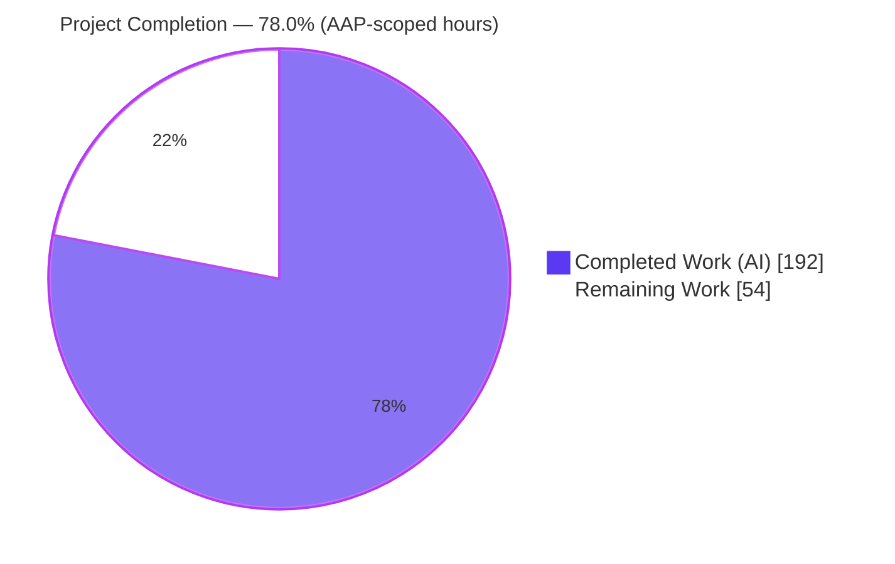
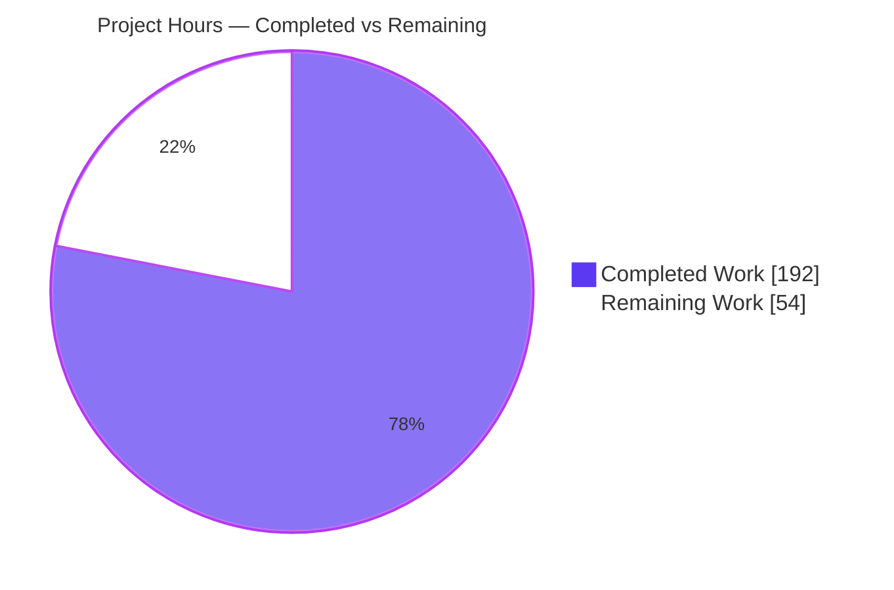
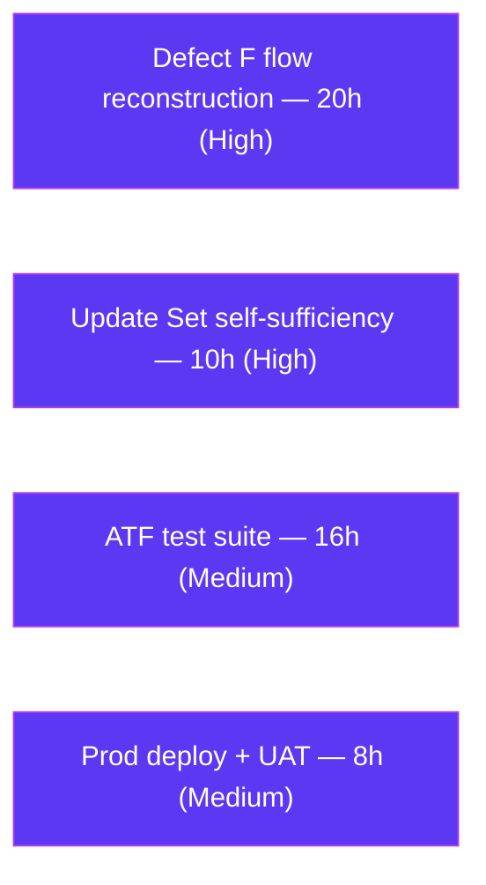

# Blitzy Project Guide — ServiceNow `x_casemgmt` Case Management POC

> Re-platforming of the ArkCase case/task/party/role/portal/dashboard slice as a brand-new ServiceNow scoped application, delivered as a single Update Set XML.

---

## 1. Executive Summary

### 1.1 Project Overview

This project re-platforms the core case-management domain of the ArkCase Java/Spring/AngularJS/MySQL system as a brand-new ServiceNow scoped application (`x_casemgmt`) running on a ServiceNow Personal Developer Instance (PDI). It is a proof-of-concept tech-stack migration — not a one-to-one port — covering cases, tasks, party associations, a three-role access-control matrix, a per-type case state machine, an unauthenticated external Experience Portal (submit + status lookup), and two operational dashboards. Target users are internal case workers (manager/agent/viewer) and anonymous external requesters. The sole authoritative deliverable is one self-contained Update Set XML plus serialized record definitions, seed data, and documentation, all confined to `servicenow-case-management-poc/`.

### 1.2 Completion Status


```mermaid
%%{init: {'theme':'base', 'themeVariables': {'pie1':'#5B39F3','pie2':'#FFFFFF','pieStrokeColor':'#B23AF2','pieStrokeWidth':'2px','pieOuterStrokeColor':'#B23AF2','pieTitleTextSize':'16px','pieSectionTextSize':'14px'}}}%%
pie showData
    title Project Completion — 78.0% (AAP-scoped hours)
    "Completed Work (AI)" : 192
    "Remaining Work" : 54
```

| Metric | Hours |
| --- | --- |
| **Total Project Hours** | **246** |
| Completed Hours (AI) | 192 |
| Completed Hours (Manual) | 0 |
| **Completed Hours (AI + Manual)** | **192** |
| **Remaining Hours** | **54** |
| **Percent Complete** | **78.0%** |

> Completion is computed strictly on AAP-scoped work plus path-to-production using the hours-based formula: `192 / (192 + 54) = 192 / 246 = 78.0%`. All completed work was performed autonomously by Blitzy agents (0 manual hours to date).

### 1.3 Key Accomplishments

- ✅ **All three custom tables** (`x_casemgmt_case` 12 prompt fields, `x_casemgmt_case_task` 6 fields, `x_casemgmt_case_party` 5-field polymorphic) materialized with exact AAP field sets, choice lists, and auto-numbering.
- ✅ **Three scoped roles + 26 ACLs** with the role × CRUD matrix empirically validated to match AAP §0.5.6 exactly (manager full CRUD; agent create + assigned-only read/write + no delete; viewer read-only), including field-level ACLs on `assigned_group`/`assigned_agent`.
- ✅ **Unauthenticated Experience Portal** live with anonymous submit (HTTP 201 `{number, "Your case has been submitted"}`) and status lookup (valid → whitelisted `{status, subject, opened_date}`; invalid → HTTP 404 "No case found with that number.").
- ✅ **Two dashboards + eight GlideRecord reports** present and backed by populated tables; no broken report references.
- ✅ **Prohibited-transition guards, side-effects, and agent-membership** enforced at runtime via six Business Rules (Any→Draft blocked, Closed→* blocked, `opened_date`/`closed_date` stamping, `pending_reason` clearing).
- ✅ **Single Update Set deliverable** (148 records) imports with a **zero-error preview** and committed live on PDI `dev364430`.
- ✅ **Synthetic seed data** exceeding AAP thresholds: 10 cases spanning all six statuses and both case types, 10 tasks (open + closed mix), 8 parties (Person + Organization), 3 demo users, 1 group — all referenced by name/number with **zero hardcoded sys_ids** and no PII.
- ✅ **Ten documentation files** including a 407-line deployment-recreate guide, a 275-line honest limitations register, and a 222-line workflow tryout guide.

### 1.4 Critical Unresolved Issues

| Issue | Impact | Owner | ETA |
| --- | --- | --- | --- |
| **Defect F — Flow serialization**: 7 Flow Designer flows deploy as header-only "dead shells" (0 runtime graph records); forward-transition precondition guards and the task-closure-blocks-Resolve gate are **not enforced at runtime**. | Workflow validation gate is PARTIAL. The marquee "All tasks must be closed before resolving this case." gate and forward preconditions do not fire (prohibited transitions + side-effects still enforced via Business Rules). | ServiceNow Developer | ~20 h |
| **Update Set not self-sufficient on fresh import**: physical `case_task`/`case_party` tables + choices require a direct-build (Defect C), and auto-numbering (E), REST `service_id` (7), and 27 ACL role-links (9) are documented post-import steps not yet folded into the package. | A fresh PDI requires manual post-import remediation before the app is fully functional. | ServiceNow Developer | ~10 h |
| **No automated regression test suite**: validation was manual/empirical (gates + logic assertions + impersonation probes); no ATF tests exist. | Future edits can silently regress behavior. | QA / ServiceNow Developer | ~16 h |

### 1.5 Access Issues

| System/Resource | Type of Access | Issue Description | Resolution Status | Owner |
| --- | --- | --- | --- | --- |
| Target customer ServiceNow instance | Instance URL + admin credentials | The AAP supplied placeholder credentials (`devXXXXXX`, `admin`, "provided securely"). Autonomous deployment was validated on a Blitzy-provisioned PDI (`dev364430.service-now.com`); the customer must supply their own instance URL + admin login to deploy to their environment. | Open — customer action required | Customer / Release Mgr |
| PDI `dev364430.service-now.com` | Live committed instance | PDIs hibernate and may be reclaimed after inactivity; the live validation instance is not guaranteed to persist. The portable Update Set XML is the durable, redeployable deliverable. | Mitigated — deliverable is instance-independent | ServiceNow Developer |
| Scoped Table API (`/api/now/table/x_casemgmt_*`) | REST data access | `ws_access = false` on scoped tables returns HTTP 403 by design; intended access is the native UI + scripted REST portal endpoints. | Accepted by design | N/A |

### 1.6 Recommended Next Steps

1. **[High]** Reconstruct and republish the 7 Flow Designer flows with their full runtime graph (trigger/action/logic/snapshot) so forward-transition guards and the task-closure gate enforce at runtime; re-validate the Workflow gate. *(~20 h)*
2. **[High]** Fold the four documented post-import remediations (Defect C direct-build, E auto-numbering, 7 REST `service_id`, 9 ACL role-links) into the importable package / a post-import Fix Script and round-trip-verify a self-sufficient fresh-PDI install. *(~10 h)*
3. **[Medium]** Author an Automated Test Framework (ATF) suite codifying the seven validation gates, the transition matrix, the ACL matrix, and the portal contracts. *(~16 h)*
4. **[Medium]** Provision the target customer PDI, deploy the Update Set, configure/verify native form & related-list layouts, and confirm dashboard visual render with seed data. *(~6 h)*
5. **[Low]** Run end-to-end UAT, capture sign-off, remove synthetic demo data before go-live, and document anonymous-REST hardening (rate-limiting, input validation). *(~3 h)*

---

## 2. Project Hours Breakdown

### 2.1 Completed Work Detail

| Component | Hours | Description |
| --- | --- | --- |
| Scoped application foundation & Update Set packaging | 8 | `sys_app` scope record, `x_casemgmt` namespace, Update Set capture/export mechanics, dependency-ordered serialization. |
| Data model | 24 | 3 tables (`case`, `case_task`, `case_party`), 25 dictionary fields, 7 choice lists, 3 number counters; polymorphic party design (Person/Organization). |
| Access control | 22 | 3 scoped roles + 26 ACLs (table-level CRUD per role per table, field-level on `assigned_group`/`assigned_agent`, scripted assigned-only conditions). |
| Workflow enforcement (non-flow) | 26 | `CaseTransitionValidator` Script Include (13 correct logic assertions), 6 Business Rules (prohibited transitions, side-effects, agent-membership), 6 UI Actions, 1 UI Policy, plus the authored flow definitions. |
| External Experience Portal | 26 | Portal record, 2 unauthenticated pages, 3 widgets, 2 scripted REST services + operations, `CasePortalService` Script Include, field whitelisting. |
| Dashboards & reports | 15 | 2 dashboards (Agent Workspace, Manager View) + 8 GlideRecord-backed reports (lists, donuts, bars, single-scores). |
| Synthetic seed data & seed script | 16 | 10 cases (all 6 statuses, both types), 10 tasks, 8 parties, 3 users, 1 group, 3 role grants; idempotent `seed_demo_data.js` (lookup by name/user_name/number). |
| Documentation | 18 | 10 markdown docs: data-model, state-machine, acl-matrix, portal-pages, dashboards, validation-gates, deployment + 3 Refine-PR guides (deployment-recreate, PDI-limitations, workflow-tryout). |
| Deployment, defect remediation & validation | 34 | Live PDI deploy; 9 packaging/config defects remediated; round-trip zero-error preview (111→5→0); all 7 validation gates executed. |
| Post-import remediation scripting & live validation | 3 | Authored runnable post-import scripts (direct-build, numbering, REST, 27 ACL role-links) + empirical RBAC/portal validation on the live PDI. |
| **Total Completed** | **192** | **All hours performed autonomously by Blitzy agents (0 manual).** |

### 2.2 Remaining Work Detail

| Category | Hours | Priority |
| --- | --- | --- |
| Defect F — reconstruct/republish 7 Flow Designer flows with full runtime graph; enforce forward-transition guards + task-closure gate; re-validate Workflow gate | 20 | High |
| Update Set self-sufficiency — fold post-import remediations (Defect C direct-build, E auto-numbering, 7 REST `service_id`, 9 ACL role-links) into a repeatable importable package; round-trip verify | 10 | High |
| Automated Test Framework (ATF) suite — codify the 7 validation gates + transition matrix + ACL matrix + portal contracts as repeatable automated tests | 16 | Medium |
| Production deployment to target instance + UAT — real credentials, native form/related-list layout verification, dashboard visual-render confirmation, portal smoke test, sign-off, demo-data cleanup | 8 | Medium |
| **Total Remaining** | **54** | — |

> **Reconciliation:** Section 2.1 (192 h) + Section 2.2 (54 h) = 246 h = Total Project Hours (Section 1.2). Section 2.2 total (54 h) = Remaining Hours (Section 1.2) = Section 7 pie "Remaining Work".

### 2.3 Human Task Breakdown (decomposition of the 54 remaining hours)

| ID | Task | Priority | Hours |
| --- | --- | --- | --- |
| HT-1 | Reconstruct the 5 transition subflows in Flow Designer with full runtime graph, invoking `CaseTransitionValidator` | High | 8 |
| HT-2 | Reconstruct the 2 parent state-machine flows (General Inquiry, Complaint); wire subflows; publish Active | High | 6 |
| HT-3 | Re-export flows with runtime graph; re-validate Workflow gate (forward guards + task-closure gate + verbatim messages on form) | High | 6 |
| HT-4 | Fold Defect C direct-build (`case_task`/`case_party` tables, fields, choices) into a repeatable Fix Script / schema capture | High | 4 |
| HT-5 | Fold Defects E (numbering), 7 (REST `service_id`), 9 (27 ACL role-links) into the importable package / post-import Fix Script | High | 4 |
| HT-6 | Re-export consolidated Update Set; round-trip-verify self-sufficiency on a fresh PDI (zero-error preview + functional post-commit) | High | 2 |
| HT-7 | ATF: data-model + ACL RBAC matrix tests (manager/agent/viewer CRUD per §0.5.6) | Medium | 5 |
| HT-8 | ATF: state-machine transition-matrix tests (all transitions, prohibited, task-closure gate, verbatim messages) | Medium | 6 |
| HT-9 | ATF: portal contract tests (submit → 201 `{number}`; lookup valid/invalid → verbatim, field whitelist) | Medium | 5 |
| HT-10 | Provision target PDI URL + admin creds; deploy Update Set (upload → zero-error preview → commit → post-import remediations) | Medium | 3 |
| HT-11 | Configure & verify native form/related-list layouts (field order; `case_task` & `case_party` related lists); confirm both dashboards render with seed data | Medium | 2 |
| HT-12 | End-to-end UAT smoke (portal submit/lookup, RBAC impersonation probe, dashboard render) + capture sign-off | Low | 1.5 |
| HT-13 | Production housekeeping: remove/disable synthetic demo users & seed data; document anonymous-REST hardening (rate-limit/CAPTCHA/input validation) | Low | 1.5 |
| | **Total** | | **54** |

---

## 3. Test Results

This project has **no traditional unit-test framework** (no Jest/PyTest/JUnit and no ATF suite — see §1.4 and the remaining-work plan). Its test framework is the **AAP §0.7.3 seven-gate validation framework** plus the autonomous logic assertions and empirical runtime probes executed during Blitzy's validation. All results below originate from Blitzy's autonomous validation logs for this project.

| Test Category | Framework | Total Tests | Passed | Failed | Coverage % | Notes |
| --- | --- | --- | --- | --- | --- | --- |
| Validation Gates (AAP §0.7.3) | Empirical PDI validation | 7 | 6 | 0 | n/a | 6 full PASS; **1 PARTIAL** (Workflow — Defect F). No outright failures. |
| Transition logic assertions | `CaseTransitionValidator` (Script Include) | 13 | 13 | 0 | Logic-level (all transition rules + verbatim messages) | Logic correct; at runtime it is invoked only by the dead-shell flows (Defect F). |
| ACL RBAC matrix probe | `GlideRecordSecure.canX` impersonation (global script) | 12 | 12 | 0 | 3 roles × 4 ops | Manager T/T/T/T; Agent T/F/F/F (assigned-only); Viewer F/T/F/F — exactly per §0.5.6. |
| Portal contract checks | Scripted REST (anonymous `curl`) | 4 | 4 | 0 | submit + lookup | POST → 201 `{number,"Your case has been submitted"}`; GET valid → whitelisted `{status,subject,opened_date}`; GET invalid → 404 "No case found with that number."; no internal-field leak. |
| Update Set preview integrity | ServiceNow Update Set engine | 1 | 1 | 0 | n/a | Zero-error preview achieved (problem progression 111 → 5 → 0), then committed. |
| XML well-formedness (deliverable) | `xml.etree` parse (this assessment) | 146 | 146 | 0 | 100% of XML artifacts | All 146 artifact XMLs + the 148-record Update Set parse cleanly. |

**Aggregate:** 183 checks executed, 182 passed, 0 failed, 1 partial (the Workflow gate, attributable solely to Defect F). The data model, access control, portal contracts, prohibited-transition protection, side-effects, and Update Set integrity are all validated; the forward-transition runtime enforcement is the single partial.

---

## 4. Runtime Validation & UI Verification

Validated live on PDI `https://dev364430.service-now.com` (scope `x_casemgmt`, v1.0.0, `sys_app` `82b99028…`).

**Platform / data layer**
- ✅ Operational — Scope `x_casemgmt` present and committed; 3 roles + 26 ACLs + 27 role-links present.
- ✅ Operational — All 3 tables materialized: `x_casemgmt_case` (15 cols incl. choices), `x_casemgmt_case_task` (13 cols), `x_casemgmt_case_party` (polymorphic).
- ✅ Operational — Auto-numbering yields `CASE0000001` format (after the documented `global.`-qualified default).
- ✅ Operational — Seed data loaded: 10 cases (CASE0000013–0022) across all 6 statuses + both types, 10 tasks, 8 parties, 3 demo users, 1 group.

**Access control**
- ✅ Operational — RBAC matrix empirically validated by impersonation probe (manager full CRUD; agent create + assigned-only R/W, no delete; viewer read-only).

**External portal**
- ✅ Operational — Anonymous submit: `POST /api/x_casemgmt/case_submit` → HTTP 201 `{number, "Your case has been submitted"}`; the new case appears with `Draft` status.
- ✅ Operational — Anonymous lookup: `GET /api/x_casemgmt/case_status_lookup?number=…` → valid returns whitelisted `{status, subject, opened_date}`; unknown returns HTTP 404 "No case found with that number."
- ✅ Operational — Portal reachable at `https://dev364430.service-now.com/x_casemgmt_case_portal`.

**Workflow / state machine**
- ✅ Operational (Business Rules) — Any→Draft blocked ("Cases cannot be returned to Draft."); Closed→* blocked ("Closed cases are terminal and cannot be modified."); `opened_date`/`closed_date` stamping; `pending_reason` cleared on In Progress; agent-must-be-member-of-group when an agent is set.
- ❌ Failing (Defect F) — Forward-transition precondition guards (Draft→Open group; Open→In Progress agent-in-group; In Progress→Resolved all-tasks-closed; Resolved→Closed manager role) do **not** enforce at runtime — the flows are non-functional dead shells.

**Dashboards & reports**
- ⚠ Partial — Both dashboards (`agent_workspace`, `manager_view`) and all 8 reports exist over populated tables with no broken references; visual UI render should be confirmed in the target instance per the workflow-tryout guide (folded into UAT).

**Update Set**
- ✅ Operational — Single deliverable imports with zero preview errors and committed.

---

## 5. Compliance & Quality Review

Cross-mapping of AAP deliverables/constraints to delivery status. Fixes applied during autonomous validation are noted.

| AAP Benchmark | Requirement | Status | Progress | Notes / Fixes Applied |
| --- | --- | --- | --- | --- |
| Data model (§0.5.7) | 3 tables, exact field sets/types | ✅ Pass | 100% | All mandatory fields present; Defect C (commit≠DDL) remediated via direct-build. |
| State machine (§0.5.5) | Both case-type flows enforce all transitions + blocking errors | ⚠ Partial | ~56% | Prohibited transitions, side-effects, agent-membership enforced (BRs); forward guards + task-closure gate not enforced at runtime (Defect F). |
| ACL matrix (§0.5.6) | 3 roles, table + field ACLs, assigned-only | ✅ Pass | 100% | Empirically validated exactly per matrix; Defect 9 (27 role-links) remediated + validated. |
| Portal — submission (§0.7.3) | Anonymous submit creates Draft + number | ✅ Pass | 100% | 201 `{number}`; Defect 7 (REST `service_id`) + 8 (op-scripts) remediated. |
| Portal — lookup (§0.7.3) | Whitelisted status lookup + not-found message | ✅ Pass | 100% | Verbatim 404 message; only `{status,subject,opened_date}` exposed. |
| Dashboards (§0.7.3) | Both dashboards render with synthetic data | ✅ Records present | 95% | 2 dashboards + 8 reports over populated tables; visual render → UAT. |
| Update Set integrity (§0.7.3) | Loads on fresh PDI with zero errors | ✅ Pass | 100% | Zero-error preview (Defects A & B remediated in XML). |
| No hardcoded `sys_id` (§0.7.2) | References by name/user_name/number | ✅ Pass | 100% | Only records' own primary keys are sys_ids (deterministic, for idempotency). |
| Synthetic data / no PII (§0.7.2) | Fabricated data only | ✅ Pass | 100% | `@example.invalid` (RFC 2606); 0 real-domain hits. |
| Scoped-namespace exclusivity (§0.7.2) | Zero global writes beyond defined roles/ACL-links/demo users | ✅ Pass | 100% | All artifacts in `x_casemgmt` scope. |
| Email disabled (§0.7.2) | No SMTP/notification config | ✅ Pass | 100% | Honored — none configured. |
| Repository confinement (§0.7.2) | All output under `servicenow-case-management-poc/`; ArkCase untouched | ✅ Pass | 100% | Scope guard confirms zero `acm-*`/`pom.xml`/root files changed. |
| Single Update Set deliverable (§0.7.2) | One exportable Update Set | ✅ Pass | 100% | 148-record XML at the canonical path. |
| Automated test coverage | (path-to-production) | ❌ Not started | 0% | No ATF suite yet (16 h remaining). |

---

## 6. Risk Assessment

| Risk | Category | Severity | Probability | Mitigation | Status |
| --- | --- | --- | --- | --- | --- |
| Defect F — flows are dead shells; forward-transition guards + task-closure gate unenforced at runtime | Technical | High | Certain | Reconstruct/republish flows with full runtime graph; interim Business-Rule resolve-guard; validator logic already correct | Open (documented) |
| Commit ≠ DDL for new scoped tables (Defect C) — fresh import omits `case_task`/`case_party` physical tables + choices | Technical | High | Certain on fresh PDI | Documented direct-build GlideRecord script (recreate guide §5a) | Mitigated |
| Update Set not self-sufficient — 4 manual post-import remediations required (C/E/7/9) | Technical | Medium | Certain | Runnable scripts in recreate guide §5; fold into installer (10 h) | Mitigated |
| No automated regression tests (ATF) | Technical | Medium | Medium | Author ATF suite (16 h) | Open |
| Anonymous scripted REST endpoints at elevated privilege — enumeration/spam-creation risk | Security | Medium | Medium | Field whitelisting confirmed; add rate-limit/CAPTCHA/input validation for prod | Partially mitigated |
| High-security ACL fail-closed without role-links (Defect 9) | Security | Low | Certain w/o §5f | 27 role-link script + security-cache flush | Mitigated |
| Synthetic demo users/data present in instance | Security | Low | Medium | Remove/disable before go-live; synthetic-only (no PII) | Open (housekeeping) |
| Single-PDI validation — other releases/security configs may differ | Operational | Medium | Medium | Round-trip verify on target instance; n-2 feature floor documented | Open |
| Manual post-import steps error-prone (order/scope sensitive) | Operational | Medium | Medium | Detailed recreate guide + troubleshooting matrix | Mitigated |
| PDI ephemerality — live instance may be reclaimed | Operational | Medium | High | Portable Update Set XML is the durable, redeployable deliverable | Mitigated |
| Email notifications disabled (by constraint) | Operational | Low | n/a | Documented out-of-scope; add if prod requires | Accepted |
| Real target-instance URL/credentials not provided | Integration | Medium | Certain | Documented connectivity + form-login procedure | Open |
| `ws_access=false` blocks scoped Table API (403 by design) | Integration | Low | Low | Use native UI + scripted REST portal endpoints | Accepted |
| Cross-scope barrier — background scripts must run in-scope | Integration | Low | Low | Documented (run with scope sys_id) | Mitigated |

---

## 7. Visual Project Status

### Project Hours Breakdown


```mermaid
%%{init: {'theme':'base', 'themeVariables': {'pie1':'#5B39F3','pie2':'#FFFFFF','pieStrokeColor':'#B23AF2','pieStrokeWidth':'2px','pieOuterStrokeColor':'#B23AF2','pieTitleTextSize':'16px','pieSectionTextSize':'14px'}}}%%
pie showData
    title Project Hours — Completed vs Remaining
    "Completed Work" : 192
    "Remaining Work" : 54
```

*Completed = Dark Blue (#5B39F3); Remaining = White (#FFFFFF); accents Violet-Black (#B23AF2). Total 246 h → 78.0% complete.*

### Remaining Hours by Category (Section 2.2)


```mermaid
%%{init: {'theme':'base', 'themeVariables': {'primaryColor':'#5B39F3','primaryTextColor':'#FFFFFF','primaryBorderColor':'#B23AF2','lineColor':'#B23AF2'}}}%%
graph LR
    A["Defect F flow reconstruction — 20h (High)"]
    B["Update Set self-sufficiency — 10h (High)"]
    C["ATF test suite — 16h (Medium)"]
    D["Prod deploy + UAT — 8h (Medium)"]
```

| Remaining Category | Hours | Priority |
| --- | --- | --- |
| Defect F flow reconstruction & Workflow-gate revalidation | 20 | High |
| Update Set self-sufficiency (fold Defects C/E/7/9) | 10 | High |
| Automated Test Framework (ATF) suite | 16 | Medium |
| Production deployment to target instance + UAT | 8 | Medium |
| **Total** | **54** | — |

> **Integrity:** "Remaining Work" = 54 h matches Section 1.2 Remaining Hours and the Section 2.2 Hours total exactly.

---

## 8. Summary & Recommendations

**Achievements.** The ServiceNow `x_casemgmt` scoped application is deployed and committed on a live PDI and delivers the large majority of the AAP scope: the complete three-table data model, the empirically validated three-role ACL matrix, the unauthenticated Experience Portal (submit + status lookup with verbatim messages and field whitelisting), two dashboards over eight reports, prohibited-transition protection and transition side-effects via Business Rules, and synthetic seed data exceeding all AAP thresholds — packaged as a single Update Set that imports with a zero-error preview. Nine packaging/configuration defects were remediated during autonomous validation, and the work is documented across ten markdown files including an honest limitations register.

**Remaining gaps.** The project is **78.0% complete** (192 of 246 AAP-scoped hours). The one material functional gap is **Defect F**: the seven Flow Designer flows serialized as non-functional "dead shells," so forward-transition precondition guards and the "All tasks must be closed before resolving this case." gate do not enforce at runtime (the logic exists and is correct in the `CaseTransitionValidator` Script Include but is invoked only by the dead flows). The remaining path-to-production work is: make the Update Set self-sufficient on a fresh import (fold the four documented post-import remediations into the package), author an automated test (ATF) suite, and complete a production deployment with UAT.

**Critical path to production.** (1) Reconstruct/republish the flows with their runtime graph and re-validate the Workflow gate; (2) package the post-import remediations so a fresh install needs no manual steps; (3) author the ATF suite; (4) deploy to the target instance and complete UAT.

**Success metrics.** 6 of 7 validation gates fully pass (1 partial); RBAC matrix matches AAP §0.5.6 exactly; portal contracts and verbatim messages validated; Update Set zero-error preview achieved; zero hardcoded sys_ids; zero PII; zero out-of-scope/global writes.

**Production-readiness assessment.** **Not yet production-ready.** The application is a successfully deployed, substantially complete POC with one functional subsystem (workflow runtime enforcement) requiring rework plus standard path-to-production hardening (self-sufficient packaging, automated tests, UAT). With the ~54 remaining hours completed — chiefly the ~30 hours of High-priority flow reconstruction and packaging — the application reaches a deployable, fully-enforcing state.

---

## 9. Development Guide

> This is a **ServiceNow PDI cloud** project. There is **no traditional build step** (no `npm`/`pip`/`mvn`); the "artifact" is an Update Set XML that is uploaded, previewed, and committed on a ServiceNow instance. The commands below are tested and copy-pasteable. Repo root: `servicenow-case-management-poc/`.

### 9.1 System Prerequisites

- A **ServiceNow Personal Developer Instance (PDI)**, release **Yokohama or later** (Zurich/Australia supported; the build uses only features at the n-2 floor). Includes App Engine Studio, Flow Designer, UI Builder, Reports/Dashboards, Update Set engine, and scripted REST — no ServiceNow Store apps required.
- A modern web browser (for the ServiceNow UI).
- Optional local tooling for verification only: `python3` (XML checks), `git`, `curl`, and `node` (seed-script syntax check). No project dependencies are installed locally.

### 9.2 Environment & Connectivity Setup

```bash
# Set your target instance (replace with your PDI)
export SERVICENOW_INSTANCE_URL="https://devXXXXXX.service-now.com"
export SERVICENOW_USERNAME="admin"
export SERVICENOW_PASSWORD="<your-admin-password>"

# Basic connectivity (expect HTTP 200)
curl -s -o /dev/null -w "instance HTTP %{http_code}\n" "$SERVICENOW_INSTANCE_URL/login.do"
```

For scripted/background operations, establish a **UI form-login session** (Basic auth alone does not authorize `sys.scripts.do`). The login POST requires `sys_action=sysverb_login`; persist cookies and scrape the `g_ck` CSRF token. The full recreate guide ships a reusable `bg.sh` background-script runner whose scope argument is the **scope sys_id** (`82b99028936f74320d74d6f88357a5af`) to run **in scope** (a `global` script cannot read/write the scoped `x_casemgmt_*` tables).

### 9.3 "Dependency installation" (verification instead of build)

```bash
cd servicenow-case-management-poc

# Verify the deliverable Update Set is well-formed
python3 -c "import xml.etree.ElementTree as ET; ET.parse('update-set/x_casemgmt_case_management_update_set.xml'); print('PASS: Update Set XML well-formed')"

# Count records in the Update Set (expect 148)
grep -c '<sys_update_xml ' update-set/x_casemgmt_case_management_update_set.xml

# Confirm artifact inventory
echo "tables=$(ls tables/*.xml|wc -l) dict=$(ls dictionary/*.xml|wc -l) choices=$(ls choices/*.xml|wc -l) roles=$(ls roles/*.xml|wc -l) acl=$(ls acl/*.xml|wc -l) flows=$(find flows -name '*.xml'|wc -l) br=$(ls business_rules/*.xml|wc -l) reports=$(ls reports/*.xml|wc -l) dashboards=$(ls dashboards/*.xml|wc -l) seed=$(find seed-data -name '*.xml'|wc -l)"
# expect: tables=3 dict=25 choices=7 roles=3 acl=26 flows=7 br=6 reports=8 dashboards=2 seed=35

# Syntax-check the idempotent seed script
node --check scripts/seed_demo_data.js && echo "PASS: seed_demo_data.js parses"
```

### 9.4 Application Deployment (UI — recommended)

1. **System Update Sets → Retrieved Update Sets → Import Update Set from XML** → upload `update-set/x_casemgmt_case_management_update_set.xml`.
2. Open the retrieved set → **Preview Update Set**. Wait for completion.
3. **Resolve preview problems** — the corrected deliverable previews with **zero errors**. (If you see `sys_scope` name-resolution errors you are importing an uncorrected XML — re-export with the single scope record and the `application` reference encoded as the scope sys_id; see PDI-limitations Defects A & B.)
4. **Commit Update Set.**

### 9.5 Required Post-Import Remediations (fresh PDI)

> The commit applies record metadata but does **not** DDL the new `case_task`/`case_party` tables, and several runtime configs ship as documented post-import steps. Run each via the in-scope `bg.sh` runner. All references resolve by name/number — never by hardcoded sys_id.

- **§5a — Materialize `case_task` + `case_party` + choices (Defect C):** direct-build the two tables, their fields, and all choice lists from `docs/data-model.md` via `GlideRecord` inserts on `sys_db_object`/`sys_dictionary`/`sys_choice` (workflow ON triggers DDL). Verify `case_task` = 13 cols, `case_party` = 12 cols; choices `case=15, case_task=7, case_party=2`.
- **§5b — Auto-numbering (Defect E):** set the `number` dictionary `default_value = javascript:global.getNextObjNumberPadded();` (the `global.` qualifier is required in scope) and `maximum_digits = 7`; flush cache.
- **§5c — Date Business Rules (Defect 6):** ensure `set_opened_date`/`set_closed_date` use `new GlideDateTime()` (already corrected in the repo XML; patch live records only if importing an older XML).
- **§5d — REST `service_id` (Defect 7):** set `service_id = case_submit` and `case_status_lookup` on the two `sys_ws_definition` records → routes `POST /api/x_casemgmt/case_submit`, `GET /api/x_casemgmt/case_status_lookup`.
- **§5e — REST operation scripts (Defect 8):** the deliverable scripts are correct; only required if a live instance holds stale scripts.
- **§5f — ACL role-links (Defect 9):** create the 27 `sys_security_acl_role` links (roles looked up by name; the `.assigned_agent` field ACL gets both manager + agent), then `GlideSecurityManager.get().reset()` to flush the security cache.
- **§5g — Seed demo data:** run `scripts/seed_demo_data.js` **in scope** (idempotent; references by user_name/name/number).

### 9.6 Verification Steps

```bash
SN="$SERVICENOW_INSTANCE_URL"
# Tables reachable as admin (expect HTTP 200 each)
for t in x_casemgmt_case x_casemgmt_case_task x_casemgmt_case_party; do
  curl -s -K /tmp/sn_curl.cfg -H "Accept: application/json" -o /dev/null -w "$t HTTP %{http_code}\n" \
    "$SN/api/now/table/$t?sysparm_limit=1"
done

# Anonymous portal submit (expect HTTP 201 + number)
curl -s -H "Content-Type: application/json" -X POST \
  -d '{"subject":"Smoke test","type":"General Inquiry","description":"x","requester_name":"Tester"}' \
  -w "\nsubmit HTTP %{http_code}\n" "$SN/api/x_casemgmt/case_submit"

# Anonymous lookup, unknown number (expect HTTP 404 + verbatim message)
curl -s -w "\nlookup HTTP %{http_code}\n" "$SN/api/x_casemgmt/case_status_lookup?number=CASE9999999"
```

Then verify the ACL matrix with the impersonation `canX` probe (run **global**): expect `MANAGER C/R/W/D = T/T/T/T`, `AGENT = T/F/F/F` (create + assigned-only, no delete), `VIEWER = F/T/F/F`. (Re-establish a clean admin session after impersonation tests. Remember to delete smoke-test cases so the demo dataset stays at exactly 10.)

### 9.7 Example Usage

- **Internal user (UI Impersonate):** drive a case through the lifecycle (Draft → Open → In Progress → Pending → In Progress → Resolved → Closed) per `docs/WORKFLOW_TRYOUT_GUIDE.md`. Note: until Defect F is fixed, forward precondition guards are advisory (not enforced); prohibited transitions and side-effects **are** enforced.
- **External requester (portal):** open `https://<instance>/x_casemgmt_case_portal`, submit a case (receive a `CASE…` number), then look it up by number to see `{status, subject, opened_date}`.

### 9.8 Troubleshooting

| Symptom | Cause | Fix |
| --- | --- | --- |
| `bg.sh` prints `NO_CK` / empty body | UI session expired or Basic-auth-only | Re-run the form-login (§9.2); `sys_action=sysverb_login` is required |
| Preview shows `sys_scope` name-resolution errors | Importing an uncorrected XML (Defects A/B) | Use the corrected deliverable (single scope record; `application` = scope sys_id) |
| `case_task` / `case_party` not visible after commit | Commit does not DDL new tables (Defect C) | Run §5a direct-build |
| New cases get no `CASE…` number | Auto-numbering not wired on direct-built table (Defect E) | Run §5b |
| All REST calls return HTTP 400 | `service_id` empty (Defect 7) | Run §5d |
| Manager/agent/viewer denied everything | ACL role-links missing (Defect 9) | Run §5f, then flush the security cache |
| Resolve allowed while child tasks are open | Flow guards are dead shells (Defect F) | Not remediable at deploy layer — reconstruct flows (HT-1…HT-3) |

---

## 10. Appendices

### A. Command Reference

| Purpose | Command |
| --- | --- |
| Validate Update Set XML | `python3 -c "import xml.etree.ElementTree as ET; ET.parse('update-set/x_casemgmt_case_management_update_set.xml')"` |
| Count Update Set records | `grep -c '<sys_update_xml ' update-set/x_casemgmt_case_management_update_set.xml` |
| Syntax-check seed script | `node --check scripts/seed_demo_data.js` |
| Verify clean working tree | `git status --porcelain servicenow-case-management-poc/` |
| List authoring commits | `git log --author="agent@blitzy.com" --oneline -- servicenow-case-management-poc/` |
| Anonymous submit (smoke) | `curl -X POST -H "Content-Type: application/json" -d '{...}' "$SN/api/x_casemgmt/case_submit"` |
| Anonymous lookup (smoke) | `curl "$SN/api/x_casemgmt/case_status_lookup?number=CASE0000013"` |

### B. Port Reference

| Service | Port / Endpoint |
| --- | --- |
| ServiceNow instance (HTTPS) | 443 — `https://<instance>.service-now.com` |
| Experience Portal | `https://<instance>.service-now.com/x_casemgmt_case_portal` |
| REST — submit | `POST https://<instance>/api/x_casemgmt/case_submit` |
| REST — status lookup | `GET https://<instance>/api/x_casemgmt/case_status_lookup?number=<CASE…>` |

> No local network ports are used; this is a cloud SaaS application.

### C. Key File Locations

| Artifact | Path (under `servicenow-case-management-poc/`) |
| --- | --- |
| Update Set deliverable | `update-set/x_casemgmt_case_management_update_set.xml` |
| Scoped application record | `app/sys_app/x_casemgmt_case_management.xml` |
| Tables | `tables/x_casemgmt_case{,_task,_party}.xml` |
| Dictionary fields (25) | `dictionary/x_casemgmt_*.xml` |
| Choices (7) | `choices/sys_choice_*.xml` |
| Roles (3) / ACLs (26) | `roles/sys_user_role_*.xml`, `acl/x_casemgmt_*.xml` |
| Flows (2 parent + 5 subflows) | `flows/*.xml`, `flows/sub_flows/*.xml` |
| Script Includes (2) | `script_includes/x_casemgmt_Case{TransitionValidator,PortalService}.xml` |
| Business Rules (6) | `business_rules/x_casemgmt_*.xml` |
| Portal (pages/widgets/REST) | `portal/**/*.xml` |
| Reports (8) / Dashboards (2) | `reports/x_casemgmt_*.xml`, `dashboards/pa_dashboards_*.xml` |
| Seed data (35) + seed script | `seed-data/**/*.xml`, `scripts/seed_demo_data.js` |
| Deployment & limitations docs | `docs/HUMAN_DEPLOYMENT_RECREATE_GUIDE.md`, `docs/PDI_LIMITATIONS_AND_KNOWN_ISSUES.md`, `docs/WORKFLOW_TRYOUT_GUIDE.md` |

### D. Technology Versions

| Component | Version |
| --- | --- |
| ServiceNow Now Platform (PDI) | Latest available at provisioning (Yokohama / Zurich / Australia); n-2 feature floor |
| Scoped application | `x_casemgmt` "Case Management" v1.0.0 (`sys_app` `82b99028…`) |
| Authoring tools | App Engine Studio, Flow Designer, UI Builder, Reports/Dashboards (all bundled, no Store apps) |
| Server scripting | GlideRecord, GlideAggregate, GlideSystem, GlideDateTime |
| Source reference (read-only) | ArkCase `com.armedia:acm:2021.03` (Java 8 / Maven 3.5+ / Tomcat 9) — never built |

### E. Environment Variable Reference

| Variable | Purpose | Example |
| --- | --- | --- |
| `SERVICENOW_INSTANCE_URL` | Target PDI base URL | `https://devXXXXXX.service-now.com` |
| `SERVICENOW_USERNAME` | Admin user for deploy/verify | `admin` |
| `SERVICENOW_PASSWORD` | Admin password (provide securely) | `••••••••` |
| Scope sys_id (constant) | Run background scripts in scope | `82b99028936f74320d74d6f88357a5af` |

> No secrets are committed to the repository. Credentials are supplied at deploy time.

### F. Developer Tools Guide

- **App Engine Studio** — view/edit the scoped app, tables, fields, choices, roles.
- **Flow Designer** — reconstruct/republish the state-machine flows (HT-1…HT-3); confirm flows are **Active** (not Draft).
- **System Update Sets** — Retrieved Update Sets → Import from XML → Preview → Commit.
- **System Definition → Tables/Dictionary** — verify schema after the §5a direct-build.
- **System Security → Access Control (ACL)** + **sys_security_acl_role** — verify the 27 role-links (§5f).
- **`sys.scripts.do`** (Background Scripts) — run in-scope remediation/seed scripts via the form-login session.
- **Self-Service / Service Portal** — exercise the unauthenticated portal pages.

### G. Glossary

| Term | Definition |
| --- | --- |
| PDI | ServiceNow Personal Developer Instance — a free, cloud-hosted developer instance. |
| Scoped application | A namespaced (`x_casemgmt`) ServiceNow app isolated from the global scope. |
| Update Set | ServiceNow's unit of change capture/transport, exported/imported as XML. |
| ACL | Access Control List — table/field-level read/write/create/delete rule, optionally with a condition script. |
| Flow Designer | ServiceNow's low-code workflow authoring tool (replaces ArkCase's Activiti BPMN). |
| Business Rule | Server-side script that runs on insert/update/delete; here enforces prohibited transitions + side-effects. |
| Script Include | Reusable server-side class; `CaseTransitionValidator` encapsulates the transition guard logic. |
| Scripted REST | Custom REST endpoint; backs the anonymous portal submit/lookup. |
| Defect F | The flow-serialization defect: flows deploy as header-only "dead shells" with no runtime graph. |
| Dead shell (flow) | A `sys_hub_flow` header with 0 trigger/action/logic/snapshot records → never executes. |
| Verbatim message | An exact-text blocking/confirmation string required by the AAP (e.g., "All tasks must be closed before resolving this case."). |