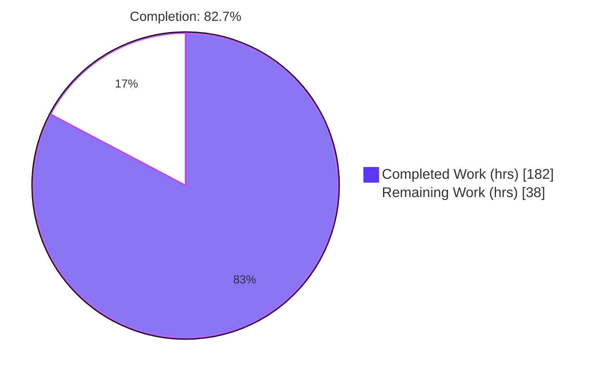
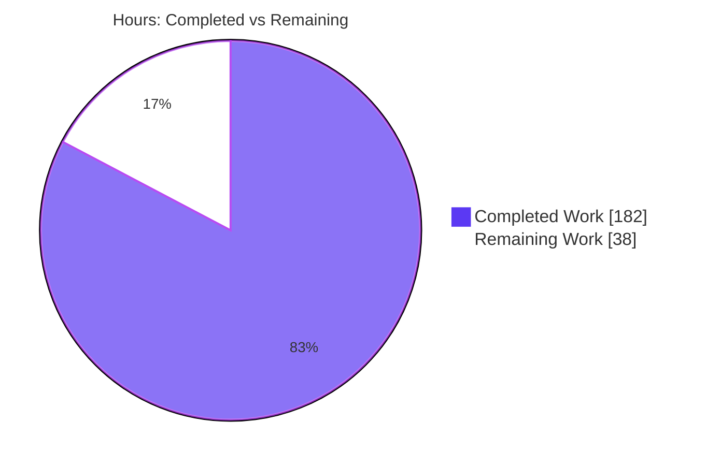
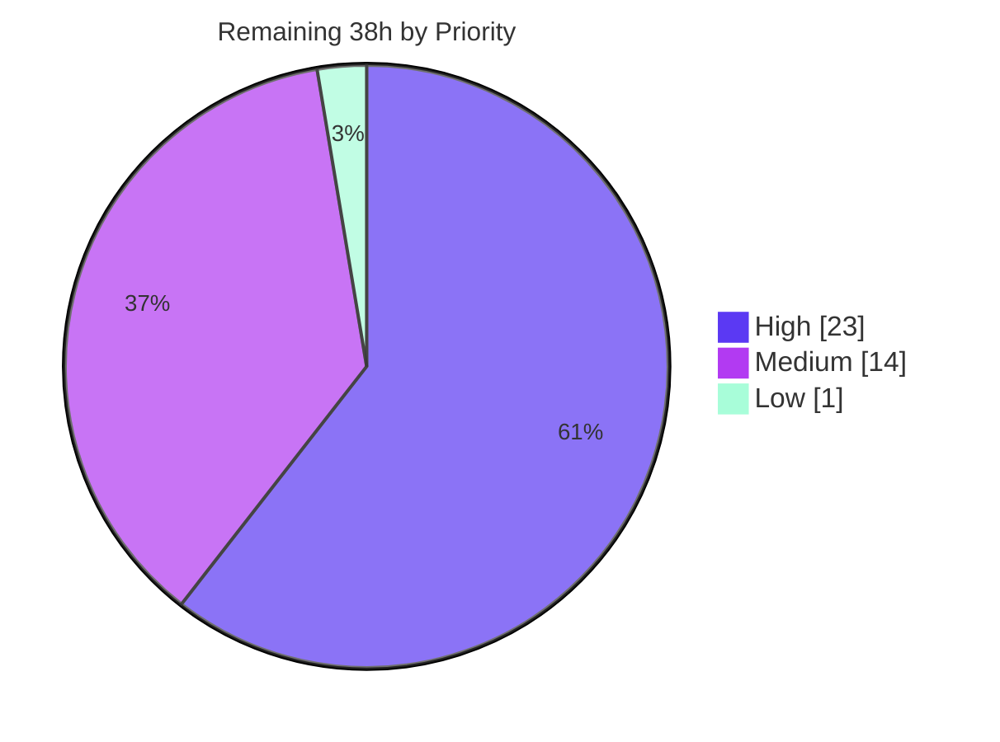

# Blitzy Project Guide — ServiceNow Case Management POC (`x_casemgmt`)

> **Project:** Re-platform of the ArkCase case-management functional domain (Java/Spring/AngularJS/MySQL) into a brand-new ServiceNow scoped application, delivered as one Update Set XML.
> **Branch:** `blitzy-7871c364-a98a-4b0b-9eda-3e6a8571a6d2` · **HEAD:** `0a99405237` · **Base:** `cda48134fe`
> **Brand color legend:** <span style="color:#5B39F3">■ Completed / AI Work = Dark Blue `#5B39F3`</span> · <span style="background:#FFFFFF;border:1px solid #ccc">□ Remaining = White `#FFFFFF`</span>

---

## 1. Executive Summary

### 1.1 Project Overview

This project rebuilds the case/task/party/role/portal/dashboard slice of the open-source ArkCase platform as a self-contained ServiceNow scoped application (scope `x_casemgmt`). It targets two user populations: internal case workers (case managers, agents, viewers) who drive cases through a six-state lifecycle via native list/form views, and unauthenticated external requesters who submit and look up cases through an Experience Portal. The technical scope is a low-code re-platforming — JPA entities become Glide tables, Activiti/BPMN becomes Flow Designer flows, Spring role config becomes scoped ACLs, and Pentaho reports become native dashboards — packaged as a single importable Update Set. Zero data is migrated; all demo data is synthetic. The business impact is a proof-of-concept demonstrating ArkCase parity on the Now Platform.

### 1.2 Completion Status

The AAP-scoped completion percentage is computed using the PA1 hours-based methodology: `Completed Hours / (Completed Hours + Remaining Hours)`, measuring only AAP deliverables plus standard path-to-production activities.


```mermaid
%%{init: {'theme':'base', 'themeVariables': {'pie1':'#5B39F3','pie2':'#FFFFFF','pieStrokeColor':'#B23AF2','pieStrokeWidth':'2px','pieOuterStrokeWidth':'2px','pieTitleTextSize':'16px','pieSectionTextSize':'14px'}}}%%
pie showData title Completion: 82.7%
    "Completed Work (hrs)" : 182
    "Remaining Work (hrs)" : 38
```

| Metric | Value |
| --- | --- |
| **Total Hours** | **220 h** |
| **Completed Hours (AI + Manual)** | **182 h** <span style="color:#5B39F3">■</span> |
| &nbsp;&nbsp;↳ AI (autonomous) | 182 h |
| &nbsp;&nbsp;↳ Manual (human) | 0 h |
| **Remaining Hours** | **38 h** <span style="background:#FFFFFF;border:1px solid #ccc">□</span> |
| **Percent Complete** | **82.7 %** |

> **Calculation:** `182 / (182 + 38) = 182 / 220 = 82.7 %`

### 1.3 Key Accomplishments

- ✅ **Complete three-table data model authored** — `x_casemgmt_case` (12 AAP-verbatim fields + `pending_reason` + `duration_to_close`), `x_casemgmt_case_task` (6 fields), `x_casemgmt_case_party` (5 fields, polymorphic) with 25 dictionary entries and 7 choice lists
- ✅ **Full access-control layer** — 3 scoped roles + 26 ACLs (table + field level) implementing the role × table × CRUD matrix from §0.5.6 exactly
- ✅ **Declarative state machine** — 2 Flow Designer flows (General Inquiry, Complaint) + 5 transition subflows + 2 Script Includes, with all 4 verbatim blocking-error strings present
- ✅ **6 Business Rules, 1 UI Policy, 6 UI Actions** covering date guards, terminal/back-transition blocks, agent-membership validation, conditional party fields, and per-role transition actions
- ✅ **Unauthenticated Experience Portal** — submit + lookup pages, 3 widgets, 2 scripted-REST endpoints with strict 5-field / 3-field whitelists
- ✅ **2 dashboards from 8 reports** — Agent Workspace + Manager View
- ✅ **Synthetic seed data** — 10 cases (all 6 statuses, both types), 10 tasks, 8 parties, 3 users, 1 group, 3 role assignments + idempotent seed script
- ✅ **9 documentation files** + consolidated **765 KB / 14,034-line Update Set XML**
- ✅ **Static validation 100%** — 147/147 XML well-formed, seed-script JS syntax OK; multi-cycle review 7/7 domains APPROVED, 0 Critical/0 Warning

### 1.4 Critical Unresolved Issues

| Issue | Impact | Owner | ETA |
| --- | --- | --- | --- |
| Update Set never imported/previewed/committed on a live PDI | All 7 functional validation gates unconfirmed; deployment unverified | Human deployer | 8–9 h after PDI access |
| Hand-authored `sys_hub_flow` / portal / dashboard XML activation unverified | Flows may import as Draft or fail activation; portal/dashboards may need UI-rebuild | Human deployer | Within 8 h remediation buffer |
| ACL "Assigned only" condition scripts not runtime-tested | Possible over/under-grant of agent access until exercised | Human deployer | Part of gate-3 (≤12 h block) |
| Anonymous portal field whitelist not runtime-tested | Internal-field exposure risk unconfirmed at runtime (statically verified 3-layer) | Human deployer | Part of gates 4–5 |

### 1.5 Access Issues

| System / Resource | Type of Access | Issue Description | Resolution Status | Owner |
| --- | --- | --- | --- | --- |
| ServiceNow PDI | Instance URL | AAP §0.7.2 provided only a placeholder `https://devXXXXXX.service-now.com` | **Unresolved — blocking** | Human deployer |
| ServiceNow PDI | Admin credentials | Username/password were placeholders; never supplied to the build | **Unresolved — blocking** | Human deployer |

> Because no PDI or credentials were ever provided, **all live-PDI deployment and the 7 functional validation gates could not be executed**. This is an external access dependency, **not a code defect**. Every other constraint was validated statically and via multi-cycle code review.

### 1.6 Recommended Next Steps

1. **[High]** Provision a ServiceNow PDI (Yokohama release or later) and verify admin login (AAP pre-build gate) — *2 h*
2. **[High]** Import the Update Set XML, run **Preview**, and resolve any preview errors before commit — *8 h*
3. **[High]** Commit the Update Set, then execute functional validation gates 1–6 (data model, workflow both case types, ACL enforcement for all 3 roles, portal submit, portal lookup, dashboards) — *13 h*
4. **[Medium]** Round-trip-verify the Update Set on a fresh PDI (gate 7) and confirm post-commit deployable state (tables, flows Active, portal URL, dashboards, seed data) — *6 h*
5. **[Low]** Deliver the portal URL + Update Set path and obtain final validation sign-off — *1 h*

---

## 2. Project Hours Breakdown

### 2.1 Completed Work Detail

All completed work is autonomous (AI) authoring of AAP deliverables, verified on disk and via static validation.

| Component | Hours | Description |
| --- | --- | --- |
| Scoped-app scaffolding | 4 | `sys_app` + `sys_scope` records, README, namespace setup (`x_casemgmt`) |
| Data model (3 tables + 25 dictionary fields) | 16 | `x_casemgmt_case` (14 fields), `x_casemgmt_case_task` (6), `x_casemgmt_case_party` (5) with exact types/lengths/mandatory flags/reference targets |
| Choice lists (7 sets) | 4 | type, status, priority, pending_reason, task_type, task_status, party_type |
| Auto-numbering counters (3) | 2 | `CASE0000001` / `TASK` / `PARTY` formats |
| Roles (3) + ACLs (26) | 20 | 3 scoped roles + table & field-level ACLs implementing role × CRUD matrix incl. scripted "Assigned only" conditions |
| Flow Designer flows (2) + subflows (5) + Script Includes (2) | 28 | Per-type state machines, 5 transition-validation subflows, `CaseTransitionValidator` + `CasePortalService` |
| Business Rules (6) | 14 | set_opened/closed_date, block_draft_backtransition, block_terminal_closed, validate_assigned_agent_membership, clear_pending_reason_on_inprogress |
| UI Policy (1) + UI Actions (6) | 10 | Conditional person/organization fields; 6 per-role transition actions |
| Experience Portal (10 artifacts) | 20 | Portal + 2 pages + 3 widgets + 2 scripted-REST definitions + 2 operations with field whitelisting |
| Dashboards (2) + Reports (8) | 14 | Agent Workspace + Manager View from 8 list/donut/bar/single-score reports |
| Synthetic seed data (35 files) + seed script | 16 | 10 cases / 10 tasks / 8 parties / 3 users / 1 group / 3 role assignments + idempotent `seed_demo_data.js` |
| Documentation (9 Markdown files) | 16 | data-model, state-machine, acl-matrix, portal-pages, dashboards, validation-gates, deployment, round_trip_verify, README |
| Update Set consolidation | 6 | Dependency-ordered 765 KB / 14,034-line consolidated XML |
| Multi-cycle code review + remediation | 12 | 2 review cycles + Refine PR; INFRA-1/FE-1 findings remediated |
| **Total Completed** | **182** | |

### 2.2 Remaining Work Detail

All remaining work is path-to-production (requires a live PDI + credentials).

| Category | Hours | Priority |
| --- | --- | --- |
| PDI provisioning + admin login verification (AAP pre-build gate) | 2 | High |
| Update Set import + Preview + resolve preview errors | 8 | High |
| Update Set commit (zero preview errors required) | 1 | High |
| Functional validation gates 1–6 on live instance | 12 | High |
| Update Set round-trip integrity on a fresh PDI (gate 7) | 3 | Medium |
| Post-commit deployable-state confirmation | 3 | Medium |
| First-import remediation buffer (hand-authored flow/portal/dashboard activation) | 8 | Medium |
| Portal URL delivery + final validation sign-off | 1 | Low |
| **Total Remaining** | **38** | |

> **Priority distribution:** High = 23 h · Medium = 14 h · Low = 1 h · **Total = 38 h**
> **Integrity check:** Section 2.1 (182 h) + Section 2.2 (38 h) = **220 h** = Total Project Hours in Section 1.2 ✓

### 2.3 Estimation Confidence

| Area | Confidence | Rationale |
| --- | --- | --- |
| Completed authoring hours | High | Anchored to verified artifact counts (157 files, 78,912 lines) and incremental commit history |
| Import / preview / commit hours | Medium | Standard ServiceNow procedure, but hand-authored XML increases preview-error likelihood |
| Functional gate hours | Medium | Well-defined gates (§0.7.3) but unexercised; 8 h remediation buffer absorbs uncertainty |
| First-import remediation | Low–Medium | `sys_hub_flow` XML activation is the principal unknown |

---

## 3. Test Results

> **Integrity note:** This ServiceNow scoped-application stack ships **no traditional unit-test framework, compiler, or build runner by design** (AAP §0.6 — all platform capabilities are bundled in the cloud PDI). The applicable test analogs are Blitzy's autonomous **static-validation** runs, all sourced from this project's validation logs and **re-executed live during this assessment**. No runtime/functional tests could be run because no PDI was provided.

| Test Category | Framework / Tool | Total Tests | Passed | Failed | Coverage % | Notes |
| --- | --- | --- | --- | --- | --- | --- |
| XML well-formedness (individual records) | `xmllint` (libxml 2.14.5) | 146 | 146 | 0 | 100% | Every scoped record-definition XML |
| XML well-formedness (consolidated) | `xmllint` (libxml 2.14.5) | 1 | 1 | 0 | 100% | 765 KB / 14,034-line Update Set XML |
| Embedded JS syntax | `node --check` (v20.20.2) | 1 | 1 | 0 | 100% | `seed_demo_data.js` (1,452 lines) |
| Scope-exclusivity scan | `grep` (399 `sys_scope=x_casemgmt`) | 1 | 1 | 0 | 100% | Zero global-scope writes |
| No-hardcoded-sys_id scan | `grep` (reference fields) | 1 | 1 | 0 | 100% | All refs by name/user_name/number; 334 hex tokens are records' own deterministic MD5 sys_ids |
| Synthetic-PII scan | `grep` (`@example.invalid`) | 1 | 1 | 0 | 100% | No real PII |
| Multi-domain code review | Blitzy review (7 domains) | 7 | 7 | 0 | 100% | 0 Critical, 0 Warning, 6 Info — all APPROVED |
| **Aggregate** | — | **158** | **158** | **0** | **100%** | All static analogs pass |

> **Runtime / functional tests (gates 1–7): NOT EXECUTED** — blocked by missing PDI credentials. Documented as a human deployment prerequisite in `docs/validation-gates.md`, `docs/deployment.md`, and `scripts/round_trip_verify.md`.

---

## 4. Runtime Validation & UI Verification

### Static deliverable verification (executed this session)

- ✅ **Operational** — XML well-formedness across 147/147 record-definitions
- ✅ **Operational** — Seed-script JavaScript syntax (`node --check`)
- ✅ **Operational** — Executive-summary deliverable (`executive-summary.html`, 16-slide reveal.js deck) rendered live in Chrome during the prior session: `window.Reveal` loaded, `isReady()=true`, 16 slides, 0 console errors

### Live-PDI runtime gates (require provisioned instance)

- ⚠ **Partial / Pending** — Data model gate (tables/fields visible in App Engine Studio): *authored & well-formed; not imported*
- ❌ **Pending** — Workflow gate (transitions enforced for both case types; task-closure blocks Resolved): *flows authored; not activated/exercised*
- ❌ **Pending** — ACL gate (`case_viewer` read-only, `case_agent` assigned-only, `case_manager` full): *ACLs authored; not enforced at runtime*
- ❌ **Pending** — Portal submission gate (anonymous submit creates Draft case): *widgets/REST authored; not invoked*
- ❌ **Pending** — Portal lookup gate (returns status/subject/opened_date or "No case found with that number."): *authored; not invoked*
- ❌ **Pending** — Dashboards gate (both render with synthetic data, no broken report refs): *reports/dashboards authored; not rendered*
- ❌ **Pending** — Update Set integrity gate (zero preview errors on fresh PDI): *XML well-formed; preview not run*

> Internal UI is delivered via ServiceNow's auto-generated native list/form views (no UI Builder workspace required); the external portal uses the default Experience Portal theme. UI correctness on a live instance is pending the deployment phase.

---

## 5. Compliance & Quality Review

Cross-mapping of AAP deliverables to quality/compliance benchmarks. Static = verified on disk this session; Runtime = pending live PDI.

| AAP Deliverable / Constraint | Benchmark | Status | Evidence |
| --- | --- | --- | --- |
| Data model verbatim (§0.5.7) | All 3 tables, exact fields/types | ✅ Pass (static) | case 12 verbatim (+pending_reason +duration_to_close), task 6, party 5 |
| ACL matrix (§0.5.6) | Role × table × CRUD + field-level | ✅ Pass (static) | 26 ACLs = 10 case + 8 task + 8 party |
| State-machine transitions (§0.5.5) | All transitions + verbatim errors | ✅ Pass (static) | 2 flows + 5 subflows; "All tasks must be closed before resolving this case." / "Cases cannot be returned to Draft." / "Closed cases are terminal…" / "No case found with that number." all present |
| Three scoped roles | manager/agent/viewer | ✅ Pass (static) | 3 role records |
| Unauthenticated portal | submit + lookup, field whitelist | ✅ Pass (static) | 5-field submit / 3-field lookup whitelist at 3 layers |
| 2 dashboards / 8 reports | Agent Workspace + Manager View | ✅ Pass (static) | 2 dashboards + 8 reports |
| Seed thresholds (§0.7.4) | ≥10 cases, all statuses, both types, 3 users | ✅ Pass (static) | 10 cases / 6 statuses / 2 types / 3 users / 1 group |
| No-hardcoded-sys_id | Lookup by stable key | ✅ Pass (static) | GlideRecord addQuery by user_name/name/number |
| Scope-namespace exclusivity | Zero global writes | ✅ Pass (static) | 399 `sys_scope=x_casemgmt`; no global ACL/BR/SI |
| Synthetic-data-only (no PII) | Fabricated data | ✅ Pass (static) | `@example.invalid`, "Synthetic Requester N" |
| Email-disabled | No SMTP/notification config | ✅ Pass (static) | No notification artifacts generated |
| Repository confinement | Only `servicenow-case-management-poc/` | ✅ Pass (static) | 0 ArkCase-reactor files modified |
| Single-Update-Set deliverable | One importable XML | ✅ Pass (static) | 765 KB consolidated XML |
| Update Set re-import zero errors | Fresh-PDI preview | ❌ Pending (runtime) | Requires PDI |
| 7 functional validation gates | All pass on live instance | ❌ Pending (runtime) | Requires PDI |

**Fixes applied during autonomous validation:** INFRA-1 (stale filename in a UI Action comment) and FE-1 (doc/code drift in the lookup response shape) were found and remediated across review cycles. Final review verdict: **7/7 domains APPROVED, 0 Critical, 0 Warning, 6 Info**.

---

## 6. Risk Assessment

| Risk | Category | Severity | Probability | Mitigation | Status |
| --- | --- | --- | --- | --- | --- |
| T1 — Hand-authored `sys_hub_flow` XML may not import/activate cleanly | Technical | High | Medium-High | 8 h remediation buffer; verify flows Active post-import; rebuild via Flow Designer UI if needed | Open |
| T2 — `duration_to_close` field added beyond 12 verbatim case fields | Technical | Low | Low | Review-APPROVED (supports avg-time-to-close report); confirm acceptable with stakeholder | Open (info) |
| T3 — Deterministic MD5-derived sys_ids could collide on import | Technical | Low | Low | Scope prefix isolates namespace; Preview catches collisions | Mitigated |
| S1 — ACL "Assigned only" condition scripts unverified at runtime | Security | High | Medium | Execute gate-3 ACL tests for all 3 roles on live instance | Open |
| S2 — Anonymous portal field whitelist unverified at runtime | Security | High | Medium | Execute portal gates 4 & 5; statically verified 3-layer whitelist | Open |
| O1 — No PDI credentials provided (§0.7.2 placeholders) | Operational | High | Certain | Human provisions PDI + admin creds; verify login before deploy | **Open (blocking)** |
| O2 — Reference resolution depends on base records on fresh PDI (esp. `core_company`) | Operational | Medium | Medium | Idempotent seed creates prerequisites; verify `core_company` entries during import | Open |
| I1 — All 7 functional validation gates unexercised | Integration | High | Medium | Run all 7 per documented procedures (`docs/validation-gates.md`) | Open |
| I2 — Update Set round-trip (zero preview errors) not performed | Integration | Medium-High | Medium | Import+preview+resolve buffer; dependency ordering pre-designed (§0.5.2) | Open |

---

## 7. Visual Project Status

### Project Hours Breakdown


```mermaid
%%{init: {'theme':'base', 'themeVariables': {'pie1':'#5B39F3','pie2':'#FFFFFF','pieStrokeColor':'#B23AF2','pieStrokeWidth':'2px','pieTitleTextSize':'16px','pieSectionTextSize':'14px'}}}%%
pie showData title Hours: Completed vs Remaining
    "Completed Work" : 182
    "Remaining Work" : 38
```

> **Integrity:** "Remaining Work" = **38 h** = Section 1.2 Remaining Hours = sum of Section 2.2 "Hours" column. "Completed Work" = **182 h** = Section 2.1 total. Colors: Completed = `#5B39F3`, Remaining = `#FFFFFF`.

### Remaining Hours by Priority


```mermaid
%%{init: {'theme':'base', 'themeVariables': {'pie1':'#5B39F3','pie2':'#B23AF2','pie3':'#A8FDD9','pieStrokeColor':'#333','pieTitleTextSize':'16px','pieSectionTextSize':'14px'}}}%%
pie showData title Remaining 38h by Priority
    "High" : 23
    "Medium" : 14
    "Low" : 1
```

### Remaining Hours by Category (Bar)

| Category | Hours | Bar |
| --- | --- | --- |
| Functional gates 1–6 | 12 | █████████████ |
| First-import remediation buffer | 8 | █████████ |
| Import + preview + resolve | 8 | █████████ |
| Round-trip gate 7 | 3 | ███ |
| Post-commit confirmation | 3 | ███ |
| PDI provisioning + login | 2 | ██ |
| Commit | 1 | █ |
| Portal URL delivery + sign-off | 1 | █ |
| **Total** | **38** | |

---

## 8. Summary & Recommendations

**Achievements.** The project is **82.7% complete** (182 of 220 hours). The entire engineering/authoring scope of the AAP is delivered and statically validated: a complete three-table data model, full role-based access control (26 ACLs), a declarative two-flow state machine with verbatim blocking errors, an unauthenticated Experience Portal with strict field whitelisting, two analytics dashboards from eight reports, comprehensive synthetic seed data, nine documentation files, and a single 765 KB consolidated Update Set. All hard constraints — scoped-namespace exclusivity, no-hardcoded-sys_id, synthetic-data-only, email-disabled, and repository confinement — were verified, and multi-cycle code review returned 7/7 domains APPROVED with zero Critical or Warning findings.

**Remaining gaps & critical path.** The remaining **38 hours** are exclusively path-to-production: importing, previewing, and committing the Update Set on a live PDI, then executing the seven functional validation gates. The **single blocking dependency** is the absence of a provisioned PDI and admin credentials (AAP §0.7.2 supplied only placeholders). The critical path is therefore: **provision PDI → import & preview → commit → run gates 1–6 → round-trip gate 7 → confirm & sign off.**

**Principal risk.** Every artifact was hand-authored as raw record-definition XML rather than generated through the App Engine Studio / Flow Designer / UI Builder authoring UIs. `sys_hub_flow` XML is structurally complex, so first-import flow activation is the most material risk; an 8-hour remediation buffer is budgeted to rebuild flows/portal/dashboards through the native UIs if activation fails on import.

**Production-readiness assessment.** The deliverable is **ready for the documented live-PDI deployment and verification phase**. It is **not yet production-ready** because none of the AAP's runtime pass/fail gates have been exercised — by necessity, not by omission. Once a PDI is available, a single focused deployment pass (~38 h, much of it remediation buffer) should carry the application to full validation.

| Success Metric | Target | Current |
| --- | --- | --- |
| AAP authoring deliverables complete | 100% | 100% (static) |
| Static validation pass rate | 100% | 100% (158/158) |
| Code review verdict | Approved | 7/7 APPROVED |
| Functional validation gates passed | 7/7 | 0/7 (pending PDI) |
| Overall completion | 100% | **82.7%** |

---

## 9. Development Guide

> All host-side commands below were executed and verified during this assessment. Live-PDI steps are reproduced from the project's own `docs/deployment.md` and `scripts/round_trip_verify.md`.

### 9.1 System Prerequisites

- **ServiceNow Personal Developer Instance (PDI)** — Yokohama release or later (Zurich/Australia compatible). Admin role required.
- **Host tooling** (for static validation only — already present in this environment):
  - `xmllint` (libxml **2.14.5**)
  - `node` **v20.20.2** (for `--check` of the seed script)
  - `python3` **3.13.7**
  - `git` **2.51.0**
- No `npm`/`pip`/`mvn` step exists — all platform capabilities are bundled with the PDI.

### 9.2 Environment Setup

```bash
# Clone (if not already present) and enter the POC directory
git clone <repo-url> arkcase && cd arkcase
git checkout blitzy-7871c364-a98a-4b0b-9eda-3e6a8571a6d2
cd servicenow-case-management-poc

# Confirm the key deliverables exist
ls -la update-set/x_casemgmt_case_management_update_set.xml
ls -la scripts/seed_demo_data.js
```

**Pre-build instance verification (AAP §0.7.2):** before deploying, log in to the PDI as admin and confirm access. If login fails, **stop and report — do not proceed.**

### 9.3 Static Validation (host-side, optional but recommended)

```bash
# Tool versions
xmllint --version 2>&1 | head -1; node --version; python3 --version; git --version

# Well-formedness of every individual record-definition XML
find servicenow-case-management-poc -name '*.xml' -not -path '*/update-set/*' \
  -exec xmllint --noout {} \; && echo "Individual XML: ALL WELL-FORMED"

# Well-formedness of the consolidated Update Set
xmllint --noout servicenow-case-management-poc/update-set/x_casemgmt_case_management_update_set.xml \
  && echo "Update Set XML: WELL-FORMED"

# Seed-script syntax
node --check servicenow-case-management-poc/scripts/seed_demo_data.js && echo "seed_demo_data.js: SYNTAX OK"
```

*Expected output:* `Individual XML: ALL WELL-FORMED`, `Update Set XML: WELL-FORMED`, `seed_demo_data.js: SYNTAX OK`.

### 9.4 Update Set Deployment (live PDI)

1. In the PDI, navigate to **System Update Sets → Retrieved Update Sets**.
2. Click **Import Update Set from XML** and upload `update-set/x_casemgmt_case_management_update_set.xml`.
3. Open the retrieved set and click **Preview Update Set**. **Resolve every preview error before committing** (see Troubleshooting).
4. Once preview is clean, click **Commit Update Set**.
5. (Optional, gate 7) Repeat steps 1–3 on a **fresh** PDI to confirm zero preview errors round-trip.

### 9.5 Verification Steps

After commit, confirm the post-commit deployable state:

- **App Engine Studio** → the `x_casemgmt` app shows all **3 custom tables** (`x_casemgmt_case`, `x_casemgmt_case_task`, `x_casemgmt_case_party`).
- **Flow Designer** → both `general_inquiry_state_machine` and `complaint_state_machine` flows are **Active** (not Draft).
- **Experience Portal** → reachable at `https://<instance>/x_casemgmt_case_portal` (or the configured portal suffix).
- **Dashboards** → Agent Workspace and Manager View render for users with the correct roles.
- **Seed data** → run the seed script (if not auto-seeded) as a background script in the `x_casemgmt` scope, then confirm 10 cases appear in the case list:

```javascript
// System Definition → Scripts - Background (run in x_casemgmt scope)
// Source: servicenow-case-management-poc/scripts/seed_demo_data.js  (idempotent)
```

### 9.6 Example Usage

- **External portal — submit:** open the portal, fill subject/type/description/requester_name/requester_email, submit → confirmation panel shows the new `CASExxxxxxx` number; the case appears internally in **Draft** status.
- **External portal — lookup:** enter a valid case number → returns **status, subject, opened_date** only. An unknown number returns exactly: `No case found with that number.`
- **Internal lifecycle:** drive a case `Draft → Open → In Progress → Resolved → Closed`. Attempting **Resolve** while any child task is not `Closed` surfaces: `All tasks must be closed before resolving this case.`
- **Dashboards:** the Manager View shows cases-by-status (bar), by-type (donut), by-priority (bar), average time-to-close (single score), and cases-opened-30-days (single score).

### 9.7 Troubleshooting

| Symptom | Likely Cause | Resolution |
| --- | --- | --- |
| Preview reports missing referenced record | Dependency ordering / base record absent | Verify scope/table records load before dictionary/ACL/flow records (ordering pre-designed §0.5.2); ensure `sys_user`, `sys_user_group`, `sys_user_role`, `core_company` exist |
| Flow imports as **Draft** or fails to activate | Hand-authored `sys_hub_flow` XML | Open in Flow Designer and re-activate; if invalid, rebuild the flow via the Flow Designer UI (8 h buffer budgeted) |
| Portal page blank / widget error | Widget or scripted-REST not committed | Confirm all 10 portal artifacts committed; check scripted-REST is anonymous-accessible |
| Seed refs unresolved | Target user/group/company not present | Seed script is idempotent — it creates prerequisite group/users; re-run; verify `core_company` entries |
| Dashboard widget "broken report" | Report not committed before dashboard | Confirm all 8 reports committed; reload dashboard |

---

## 10. Appendices

### A. Command Reference

| Command | Purpose |
| --- | --- |
| `xmllint --noout <file>.xml` | Validate XML well-formedness |
| `node --check scripts/seed_demo_data.js` | Validate seed-script JS syntax |
| `git diff --stat cda48134fe..HEAD` | Whole-repo change summary (162 files / 81,528 insertions) |
| `git log --author="agent@blitzy.com" --oneline` | List autonomous commits (199) |
| `find servicenow-case-management-poc -type f \| wc -l` | Count POC files (157) |

### B. Port Reference

| Port | Service | Notes |
| --- | --- | --- |
| 443 (HTTPS) | ServiceNow PDI | Cloud-hosted; no local ports. The build exposes no local services. |

### C. Key File Locations

| Path | Description |
| --- | --- |
| `servicenow-case-management-poc/update-set/x_casemgmt_case_management_update_set.xml` | **Final deliverable** — single importable Update Set (765 KB / 14,034 lines) |
| `servicenow-case-management-poc/tables/` | 3 table definitions |
| `servicenow-case-management-poc/dictionary/` | 25 dictionary field definitions |
| `servicenow-case-management-poc/acl/` | 26 ACL records |
| `servicenow-case-management-poc/flows/` | 2 flows + 5 subflows |
| `servicenow-case-management-poc/portal/` | Portal, 2 pages, 3 widgets, 4 REST records |
| `servicenow-case-management-poc/dashboards/` + `reports/` | 2 dashboards + 8 reports |
| `servicenow-case-management-poc/seed-data/` | 35 synthetic seed records |
| `servicenow-case-management-poc/scripts/seed_demo_data.js` | Idempotent seed script |
| `servicenow-case-management-poc/docs/` | 7 design docs (+ README, round_trip_verify) |

### D. Technology Versions

| Component | Version |
| --- | --- |
| ServiceNow PDI (target) | Yokohama or later (Zurich / Australia compatible) |
| `xmllint` (libxml) | 2.14.5 |
| Node.js | v20.20.2 |
| Python | 3.13.7 |
| Git | 2.51.0 |
| Source platform (read-only reference) | ArkCase `com.armedia:acm:2021.03` |

### E. Environment Variable Reference

| Variable | Required | Notes |
| --- | --- | --- |
| Instance URL | Yes (deploy) | PDI base URL — **not supplied** (placeholder `https://devXXXXXX.service-now.com`) |
| Admin username | Yes (deploy) | **Not supplied** (placeholder `admin`) |
| Admin password | Yes (deploy) | **Not supplied** (placeholder) |

> The build itself consumes **zero** environment variables or secrets; the three above are runtime deployment inputs the human deployer must provide.

### F. Developer Tools Guide

| Tool | Use in this project |
| --- | --- |
| App Engine Studio | View/manage the scoped app, tables, roles after import |
| Flow Designer | Inspect/activate the 2 state-machine flows + 5 subflows |
| UI Builder / Service Portal | Configure/serve the external portal pages |
| Reports + Dashboards | Render the 2 dashboards from 8 reports |
| System Update Sets | Import → Preview → Commit the deliverable XML |
| Scripts - Background | Run `seed_demo_data.js` in the `x_casemgmt` scope |

### G. Glossary

| Term | Definition |
| --- | --- |
| **PDI** | Personal Developer Instance — a free cloud-hosted ServiceNow instance |
| **Update Set** | ServiceNow's unit of change packaging; exported/imported as XML |
| **Scoped application** | A namespaced app (`x_casemgmt`) isolated from the global scope |
| **ACL** | Access Control List — table/field-level authorization rule |
| **Flow Designer** | Low-code workflow authoring environment (replaces ArkCase Activiti/BPMN) |
| **Script Include** | Reusable server-side script class (e.g., `CaseTransitionValidator`) |
| **Scripted REST** | Custom REST endpoint backing the anonymous portal pages |
| **AAP** | Agent Action Plan — the authoritative project requirements document |
| **Path-to-production** | Standard deployment/validation activities beyond authoring |

---

*Cross-section integrity validated before submission: §1.2 Remaining (38 h) = §2.2 sum (38 h) = §7 "Remaining Work" (38 h); §2.1 (182 h) + §2.2 (38 h) = 220 h = §1.2 Total; completion 82.7% consistent across §1.2, §7, §8; all Section 3 tests sourced from Blitzy autonomous validation logs; brand colors Completed `#5B39F3` / Remaining `#FFFFFF` applied throughout.*