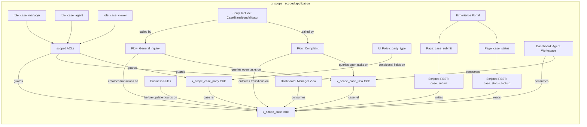

# 0. Agent Action Plan

## 0.1 Intent Clarification

### 0.1.1 Core Refactoring Objective

Based on the prompt, the Blitzy platform understands that the refactoring objective is to **rebuild the core case-management functional domain of the existing ArkCase Java/Angular/MySQL platform as a brand-new ServiceNow scoped application** that runs inside a ServiceNow Personal Developer Instance (PDI), and to deliver that scoped application as a single, self-contained Update Set XML packaged inside a the same repository subdirectory. The Blitzy platform further understands that this is a **proof-of-concept (POC) functional re-platforming**, not a one-to-one feature port: only the explicitly enumerated subset of ArkCase's case, task, party, ACL, portal, and dashboard capabilities is in scope, and zero data is migrated from ArkCase.

- **Refactoring type:** Tech-stack migration (Java/Spring/JPA/Hibernate/AngularJS/MySQL/Solr → ServiceNow Now Platform / scoped app / Glide records / Flow Designer / UI Builder Experience Portal / Performance Analytics dashboards). This is simultaneously a partial **architectural refactor** (monolithic plugin/service/DAO architecture → declarative low-code scoped configuration) and a **modularity refactor** (ArkCase's many cross-cutting modules collapsed into a single bounded scoped application).
- **Target repository:** Same repository (the existing ArkCase repo). All output is confined to a brand-new top-level subdirectory `servicenow-case-management-poc/`. The existing ArkCase Maven reactor, its modules, build files, CI/CD pipelines, licensing files, and documentation are explicitly out of bounds for read, modify, rename, or delete.
- **Authoritative deliverable:** A complete ServiceNow scoped application exported as **one Update Set XML** at `servicenow-case-management-poc/update-set/x_[scope]_case_management_update_set.xml`, accompanied by serialized record-definition artifacts and supporting documentation under the same new subdirectory.

The enumerated refactoring goals, restated with full technical clarity, are:

- **Replicate ArkCase's case lifecycle** (`acm-case-file-plugin`'s `CaseFile` entity stored in `acm_case_file`) as a ServiceNow scoped table `x_[scope]_case` with the exact field set defined in the user prompt — `number`, `type`, `status`, `priority`, `subject`, `description`, `opened_date`, `closed_date`, `assigned_group`, `assigned_agent`, `requester_name`, and `requester_email`.
- **Replicate ArkCase's task domain** (`acm-task-plugin`'s `AcmTask`, including its `dueDate`, `assignee`, `status`, `taskType`, and parent linkage) as a ServiceNow scoped table `x_[scope]_case_task` with the exact field set defined in the user prompt — `case`, `subject`, `type`, `status`, `assigned_to`, `due_date`.
- **Replicate ArkCase's party-association model** (the combination of `PersonAssociation` and `OrganizationAssociation` from `acm-person-plugin`) as a single, polymorphic scoped table `x_[scope]_case_party` with the user-specified fields `case`, `party_type`, `person`, `organization`, and `role_label`. The single-table polymorphism (Person | Organization) is an intentional simplification of ArkCase's two separate association tables.
- **Replicate ArkCase's role/privilege subsystem** (`acm-service-users` `ApplicationRolesConfig`, `ApplicationRolesToPrivilegesConfig`, plus `acm-admin-plugin` `RolesPrivilegesService`) as exactly three scoped roles (`x_[scope]_case_manager`, `x_[scope]_case_agent`, `x_[scope]_case_viewer`) enforced through scoped table-level and field-level ACLs, with no global ACL writes.
- **Replicate ArkCase's case state-machine** (the queue/state/`ChangeCaseFileStateService`/Activiti workflow stack) as **two Flow Designer flows — one per case type** (General Inquiry, Complaint) — that enforce every transition rule and blocking error message verbatim.
- **Replicate ArkCase's external requester intake** (the FOIA portal gateway pattern referenced in `acm-service-portal-gateway` and `foiaPortalRequestServiceProvider`) as a ServiceNow Experience Portal containing two unauthenticated pages: case submission and case status lookup.
- **Replicate ArkCase's reporting surfaces** (Pentaho-backed reports referenced in 1.1.4) as two ServiceNow dashboards — Agent Workspace and Manager View — composed of native list, donut, bar, and single-score widgets.
- **Provide deployable artifacts:** seed at least 10 synthetic cases across all statuses and 2 case types, plus 3 synthetic users (one per role); export and round-trip-verify the Update Set; deliver portal URL and Update Set XML path.

Implicit requirements that the Blitzy platform has surfaced from the prompt:

- **API-compatibility preservation is explicitly NOT required.** The ArkCase Java REST APIs (`/api/latest/plugin/casefile/...`, `/api/latest/plugin/admin/rolesprivileges/...`, etc.) have no equivalent in the target — ServiceNow consumers will use the platform's auto-generated Table API and the Experience Portal page services instead. No legacy API contract must be honored.
- **Behavior preservation is scoped to the enumerated functional domain only.** ArkCase's complaint workflows, FOIA deadline calculations, ECM/Alfresco document handling, Outlook calendar integrations, ZyLAB matter creation, billing/invoicing, time/cost tracking, correspondence management, redaction, exemption management, e-discovery, BPMN/Activiti engine, Drools rules, and Solr search are all out of scope.
- **Synthetic-data-only constraint:** No PII may be referenced, even derived from the source codebase. All seeded users, cases, tasks, and parties must be fabricated for the POC.
- **Zero hardcoded** `sys_id`**s anywhere** — every ACL, flow, script include, business rule, and seed record must reference target rows by query (e.g., `getReference()`/`GlideRecord` lookups by `name`, `user_name`, or `number`) rather than by hard-coded sys_id.
- **Email notifications are disabled on the PDI** and the build must not attempt to configure them, even though ArkCase's `NotificationService` is a major source-side concern.
- **Update Set integrity is a validation gate, not an afterthought:** the exported XML must re-import on a fresh PDI with zero preview errors before commit.
- **Repository minimality:** the build must not modify, rename, delete, or reorganize anything outside `servicenow-case-management-poc/`. The existing 16-module ArkCase Maven reactor is read-only context; it is not refactored in place.
- **Scope-namespace exclusivity:** every artifact (table, role, ACL, script include, flow, dashboard, portal, theme, image) must live in the auto-assigned `x_[scope]` namespace; zero global-scope writes are permitted.

### 0.1.2 Technical Interpretation

This refactoring translates to the following technical transformation strategy:

- **Architectural collapse from multi-module Maven reactor to single scoped application.** The ArkCase platform is a Maven `pom`-packaged reactor of eight top-level modules (`acm-forms`, `acm-plugins`, `acm-services`, `acm-standard-applications`, `acm-tool-integrations`, `acm-core-api`, `acm-jmeter`, `acm-user-interface`, `acm-web`) producing three deployable WARs. The target collapses the case/task/party slice of this stack into one ServiceNow scoped application identified by the auto-assigned namespace `x_[scope]`. Java domain classes (e.g., `CaseFile.java`, `AcmTask.java`, `PersonAssociation.java`, `OrganizationAssociation.java`) become ServiceNow tables; Spring service classes (e.g., `SaveCaseServiceImpl`, `RolesPrivilegesService`) become Flow Designer flows, Script Includes, and Business Rules; AngularJS controllers/services (e.g., `Case.InfoService`, `Cases.PeopleController`) become UI Builder pages and List/Form configurations.

- **Persistence transformation: JPA/Hibernate → Glide records.** ArkCase persistence is annotation-driven JPA (`@Entity`, `@Table(name="acm_case_file")`, `@Inheritance(strategy = SINGLE_TABLE)`, `@JsonTypeInfo` for polymorphism, `@TableGenerator` for IDs, `BooleanToStringConverter` for boolean-to-string mapping, `@Temporal(TIMESTAMP)` for audit timestamps) on top of MySQL. The target uses ServiceNow's automatic schema creation through App Engine Studio: each table inherits the platform's standard `sys_*` audit columns (`sys_id`, `sys_created_on`, `sys_created_by`, `sys_updated_on`, `sys_updated_by`); reference fields replace JPA `@ManyToOne`; choice lists replace string-discriminator inheritance; and auto-numbering replaces `@TableGenerator`. The `case_party` polymorphic conditional fields (`person` shown when `party_type = Person`; `organization` shown when `party_type = Organization`) are implemented via UI Policies on the form.

- **Workflow transformation: Activiti BPMN +** `ChangeCaseFileStateService` **+ queue pipeline → Flow Designer.** ArkCase's case state-machine is enforced by a combination of `CaseFileQueueHandler` (sets status `ACTIVE` pre-save), `ChangeCaseFileStateService` (status transitions), `ChangeCaseStatusWorkflowListener` (launches BPM processes), and Activiti BPMN definitions. The target eliminates BPM entirely and replaces it with two Flow Designer flows — one for each `case.type` (General Inquiry, Complaint). Each flow contains an OnUpdate trigger filtered by `status` change, and conditional logic that validates the transition matrix specified in the user's prompt (e.g., `Open` requires `assigned_group`; `In Progress` requires `assigned_agent`; `Resolved` requires zero open child `x_[scope]_case_task` records via `GlideRecord` query). Blocking errors are surfaced through Flow Designer's Throw Error action so they appear on the form rather than as silent failures.

- **Access-control transformation:** `ApplicationRolesConfig` **+** `RolesPrivilegesService` **+ URL-based privilege metadata → scoped roles + ACLs.** ArkCase resolves privileges via `ApplicationRolesToPrivilegesConfig.getRolesToPrivileges()` (a `Map<String, List<Object>>` bound from `application.rolesToPrivileges` configuration), enforced at URL/method level by `AcmPluginUrlPrivilege`. The target replaces this with three scoped roles (`x_[scope]_case_manager`, `x_[scope]_case_agent`, `x_[scope]_case_viewer`), each governed by table-level ACLs (`read`, `write`, `create`, `delete`) and field-level ACLs on `assigned_group`/`assigned_agent`. The "Assigned only" condition for `case_agent` is encoded in the ACL condition script as a query: `assigned_agent = current.sys_id OR assigned_group IN current.user_group_membership`. No global ACLs are touched.

- **External-portal transformation:** `acm-service-portal-gateway` **+** `foiaPortalRequestServiceProvider` **(Java REST + Angular template) → ServiceNow Experience Portal.** ArkCase's portal pattern uses a Java REST service to accept anonymous submissions and return a confirmation. The target replaces this with a ServiceNow Experience Portal (UI Builder) containing two pages whose data layer goes through scripted REST endpoints that run as a privileged user but expose only the whitelisted fields. The submission page writes a new `x_[scope]_case` record with `status = Draft` and returns the auto-numbered `number`; the lookup page queries by `number` and returns `status`, `subject`, and `opened_date` — explicitly excluding all internal fields, audit fields, and assignment fields.

- **Reporting transformation: Pentaho BI + Solr aggregates → ServiceNow Reports + Performance Analytics-style dashboards.** ArkCase reports are produced via Pentaho (referenced in `1.1.4` and the README's Vagrant VM build) and Solr facet aggregates (`ActiveCaseFileByQueueService`/`Impl`). The target builds two dashboards via Reports + Dashboard Designer: Agent Workspace (My open cases list, My overdue tasks list, Case count by status donut) and Manager View (cases by status bar, cases by type donut, cases by priority bar, average time-to-close single score, cases-opened-30-days single score). All widgets are powered by GlideRecord-backed reports; no external BI engine is involved.

- **UI transformation: AngularJS modules and resource controllers → ServiceNow native list/form views and UI Builder pages.** ArkCase's case-people/case-organizations/case-info/task-list AngularJS service-and-controller pairs (`Case.InfoService`, `Cases.PeopleController`, `Cases.OrganizationsController`, `Task.ListService`, `Task.WorkflowService`, etc.) are replaced by ServiceNow's auto-generated form layouts, related lists, and UI Policies for the internal user experience, plus UI Builder pages for the external portal.

- **Transformation rule for naming.** Every artifact name is prefixed with the auto-assigned scope identifier `x_[scope]_` per ServiceNow scoped-app conventions. For example, `acm_case_file` (ArkCase MySQL table) becomes `x_[scope]_case` (ServiceNow scoped table), and `ROLE_ARKCASE_CASE_MANAGER` (ArkCase application role string) becomes `x_[scope]_case_manager` (ServiceNow role).

- **Transformation rule for IDs.** No `sys_id` literals are emitted. Every cross-reference is a `GlideRecord` `addQuery()` lookup by a stable, human-readable key (`name`, `user_name`, `number`, `role_label`). This includes seed-data scripts, ACL conditions, and Flow Designer reference resolutions.

- **Transformation rule for inheritance and polymorphism.** ArkCase's JPA single-table inheritance with discriminator (`cm_class_name`) on `PersonAssociation`/`OrganizationAssociation` is collapsed into one table (`x_[scope]_case_party`) with a Choice field (`party_type`) plus conditional reference fields (`person` → `sys_user`, `organization` → `core_company`).

## 0.2 Source Analysis

### 0.2.1 Comprehensive Source File Discovery

The Blitzy platform inspected the existing ArkCase repository at the root of the workspace and identified the following source-side surfaces that drive the target ServiceNow scoped application. These are **read-only reference inputs** — none of these files will be modified, renamed, or deleted by this build.

#### 0.2.1.1 Case Domain (Java)

The case domain in ArkCase resides under `acm-plugins/acm-default-plugins/acm-case-file-plugin/`. The Blitzy platform identified the following case-domain Java source files as the **primary semantic reference** for the target `x_[scope]_case` table and its lifecycle:

- `acm-plugins/acm-default-plugins/acm-case-file-plugin/src/main/java/com/armedia/acm/plugins/casefile/model/CaseFile.java` — JPA entity mapped to `acm_case_file`. Implements `AcmObject`, `AcmEntity`, `AcmAssignedObject`, `AcmNotifiableEntity`, `AcmStatefulEntity`, `AcmLegacySystemEntity`, `AcmParentObjectInfo`, `AcmContainerObject`, `AcmChildObjectsManager`. Field surface includes identity, numbering, classification, title, status, descriptive details, incident timestamps, audit, disposition, priority, external/restricted/denied flags, queue/response timing, courtroom/responsibility, ECM container linkage, child associations, people and organization associations, milestones, and participants. Default `status = "DRAFT"`; queue handler sets to `"ACTIVE"` on save. Single-table inheritance via `cm_class_name` discriminator. `@PrePersist` defaults missing status to DRAFT and synchronizes parent pointers; `@PreUpdate` repeats the synchronization.
- `acm-plugins/acm-default-plugins/acm-case-file-plugin/src/main/java/com/armedia/acm/plugins/casefile/model/ChangeCaseStatus.java` — JPA entity recording status-change history with statuses `IN_APPROVAL`, `DRAFT`, `APPROVED`. Reference for state-machine transition history.
- `acm-plugins/acm-default-plugins/acm-case-file-plugin/src/main/java/com/armedia/acm/plugins/casefile/model/Disposition.java` — Disposition record with `closeDate`, `dispositionType`, `referExternalDate`. Reference for case-closure metadata.
- `acm-plugins/acm-default-plugins/acm-case-file-plugin/src/main/java/com/armedia/acm/plugins/casefile/model/CaseFileConstants.java` — Domain constants: `OBJECT_TYPE = "CASE_FILE"`, `OBJECT_TYPE_DISPOSITION = "DISPOSITION"`, `EVENT_TYPE_CREATED`, `EVENT_TYPE_UPDATED`, `EVENT_TYPE_VIEWED`. Used as semantic anchor for status-/event-naming choices in the target.
- `acm-plugins/acm-default-plugins/acm-case-file-plugin/src/main/java/com/armedia/acm/plugins/casefile/model/CaseFileQueueHandler.java` — Pipeline pre-save handler that resolves queue and sets status to `ACTIVE`. Behavior absorbed into Flow Designer flow conditions in the target.
- `acm-plugins/acm-default-plugins/acm-case-file-plugin/src/main/java/com/armedia/acm/plugins/casefile/model/CaseByStatusDto.java` and `CaseSummaryByStatusAndTimePeriodDto.java` — DTOs used by ArkCase status-aggregation reports. Reference for dashboard widget shapes.
- `acm-plugins/acm-default-plugins/acm-case-file-plugin/src/main/java/com/armedia/acm/plugins/casefile/model/AcmCasesState.java` — Module state carrier with `numberOfCases` counter. Reference for dashboard count-cards.
- `acm-plugins/acm-default-plugins/acm-case-file-plugin/src/main/java/com/armedia/acm/plugins/casefile/service/SaveCaseService.java` and `*Impl.java` — Save orchestration. Reference for OnInsert/OnUpdate triggers.
- `acm-plugins/acm-default-plugins/acm-case-file-plugin/src/main/java/com/armedia/acm/plugins/casefile/service/GetCaseService.java`, `GetCaseByNumberService.java` — Retrieval services. Reference for the portal status-lookup script.
- `acm-plugins/acm-default-plugins/acm-case-file-plugin/src/main/java/com/armedia/acm/plugins/casefile/service/CaseFileTasksService.java` — Logic that aggregates tasks for a case. Reference for the "all tasks closed before resolve" guard.
- `acm-plugins/acm-default-plugins/acm-case-file-plugin/src/main/java/com/armedia/acm/plugins/casefile/service/MergeCaseService.java`, `SplitCaseService.java`, `AcmQueueService.java`, `CaseFileEventListener.java`, `CaseFileToSolrTransformer.java`, `ChangeCaseFileStateService.java` — Behavior outside the POC scope but provides full semantic context for the case lifecycle.
- `acm-forms/acm-form-case-file/src/main/java/com/armedia/acm/form/casefile/service/CaseFileFactory.java`, `CaseFileService.java`, `CaseFileUpdatedListener.java`, `CaseFileWorkflowListener.java` — Frevvo-form bindings; reference only for understanding how requesters were captured server-side.

#### 0.2.1.2 Task Domain (Java)

Task domain resides under `acm-plugins/acm-default-plugins/acm-task-plugin/`. The Blitzy platform identified the following as the **primary semantic reference** for the target `x_[scope]_case_task` table:

- `acm-plugins/acm-default-plugins/acm-task-plugin/src/main/java/com/armedia/acm/plugins/task/model/AcmTask.java` — JPA entity. Implements `AcmAssignedObject`, `Serializable`, `AcmLegacySystemEntity`, `AcmParentObjectInfo`, `AcmNotifiableEntity`, `AcmStatefulEntity`. Field surface includes identifiers, priority, title, due date, attachment metadata, assignee/owner, business-process info, ad-hoc and completion flags, status/pending status, percent completion, descriptive details, task type, creation/start/finish timestamps, duration, workflow request identifiers, review-document references, document-under-review, documents-queued-for-review, child object associations, rework instructions, outcome information, participants, notification receivers, ECM container, parent object metadata, candidate claim groups, next assignee, legacy system ID, buckslip approval data, restriction flag. Bean Validation enforces required due date and non-empty title.
- `acm-plugins/acm-default-plugins/acm-task-plugin/src/main/java/com/armedia/acm/plugins/task/model/OutlookTaskItem.java` — Outlook integration shape. Out of POC scope.
- `acm-plugins/acm-default-plugins/acm-task-plugin/src/main/java/com/armedia/acm/plugins/task/model/BuckslipFutureTask.java` — Approval-chain DTO with `approverId`, `approverFullName`, `taskName`, `groupName`, `details`, `addedBy`, `addedByFullName`, `maxTaskDurationInDays` (default 3, ignores negatives). Out of POC scope.

#### 0.2.1.3 Person/Organization Association Domain (Java)

Party associations reside under `acm-plugins/acm-default-plugins/acm-person-plugin/`. The Blitzy platform identified the following as the **primary semantic reference** for the target `x_[scope]_case_party` table:

- `acm-plugins/acm-default-plugins/acm-person-plugin/src/main/java/com/armedia/acm/plugins/person/model/PersonAssociation.java` — JPA entity mapped to `acm_person_assoc`. Fields include `parentId`, `parentType`, `parentTitle`, `personType`, `personDescription`, `notes`, `tags` (`@ElementCollection` mapped to `acm_person_assoc_tag` via `cm_tag` column), lazy-instantiates `Person` if null.
- `acm-plugins/acm-default-plugins/acm-person-plugin/src/main/java/com/armedia/acm/plugins/person/model/PersonOrganizationAssociation.java` — JPA entity mapped to `acm_person_org_assoc`. Many-to-one to `Person` and `Organization` plus `personToOrganizationAssociationType`, `organizationToPersonAssociationType`, `primaryContact`, `defaultOrganization` booleans, audit fields.
- `acm-plugins/acm-default-plugins/acm-person-plugin/src/main/java/com/armedia/acm/plugins/person/service/OrganizationAssociationServiceImpl.java`, `OrganizationAssociationListener.java`, `PersonAssociationServiceImpl.java`, `OrganizationAssociationDao.java` — Spring services and DAOs. Reference for related-list behavior.
- `acm-plugins/acm-default-plugins/acm-person-plugin/src/main/java/com/armedia/acm/plugins/person/web/api/OrganizationAssociationAPIController.java` — REST controller. Out of scope (no API compatibility required).

The target collapses these two ArkCase tables (`acm_person_assoc` and `acm_person_org_assoc`) into a single ServiceNow polymorphic table (`x_[scope]_case_party`) with `party_type` choice and conditional `person`/`organization` reference fields.

#### 0.2.1.4 Roles & Privileges Domain (Java)

Authorization configuration resides under `acm-services/acm-service-users/` and `acm-plugins/acm-default-plugins/acm-admin-plugin/`. The Blitzy platform identified the following as the **primary semantic reference** for the target three scoped roles and their ACLs:

- `acm-services/acm-service-users/src/main/java/com/armedia/acm/services/users/model/ApplicationRolesConfig.java` — Holds `application.roles` as `List<String>`; exposes constant `MERGE_APPLICATION_ROLES_OP = "application.~roles"`.
- `acm-services/acm-service-users/src/main/java/com/armedia/acm/services/users/model/ApplicationPrivilegesConfig.java` — Holds `application.privileges` as `Map<String,String>`.
- `acm-services/acm-service-users/src/main/java/com/armedia/acm/services/users/model/ApplicationRolesToPrivilegesConfig.java` — Holds `application.rolesToPrivileges` as `Map<String, List<Object>>`; defines `ROLES_TO_PRIVILEGES_PROP_KEY = "application.rolesToPrivileges"`.
- `acm-services/acm-service-users/src/main/java/com/armedia/acm/services/users/model/AcmPluginPrivilege.java` — `privilegeName` + `applicationRolesWithPrivilege`.
- `acm-services/acm-service-users/src/main/java/com/armedia/acm/services/users/model/ApplicationPluginPrivilegesConfig.java` — Nested `Map<String, Map<String, List<String>>>` for plugin URL-to-privilege mapping.
- `acm-services/acm-service-users/src/main/java/com/armedia/acm/services/users/model/RolePrivilegesConstants.java` — `ROLE_PREFIX = "ROLE_"` and property keys.
- `acm-plugins/acm-default-plugins/acm-admin-plugin/src/main/java/com/armedia/acm/plugins/admin/service/RolesPrivilegesService.java` — Central role CRUD + privilege paging/filtering + role normalization (uppercase, whitespace→underscore, periods→double-underscore, prepend `ROLE_PREFIX`).
- `acm-plugins/acm-default-plugins/acm-admin-plugin/src/main/java/com/armedia/acm/plugins/admin/web/api/RolesPrivilegesRetrievePrivileges.java`, `RolesPrivilegesUpdateRolePrivileges.java`, `RolesPrivilegesAddRolesPrivileges.java`, `RolesPrivilegesRetrieveRolesByPrivilege.java`, `RolesPrivilegesRetrieveRoles.java` — REST controllers under `/api/v1/plugin/admin/...` and `/api/latest/plugin/admin/...`.

The target replaces all of this with three named scoped roles plus seven ACL records (one per table-operation × role combination, plus field-level ACLs on `assigned_group` / `assigned_agent`).

#### 0.2.1.5 Case Frontend (AngularJS)

Case AngularJS surfaces reside under `acm-standard-applications/arkcase/src/main/webapp/resources/modules/`. The Blitzy platform identified the following as the **UX semantic reference** for the target ServiceNow native form/list and Experience Portal layout:

- `acm-standard-applications/arkcase/src/main/webapp/resources/modules/cases/services/case-billing.client.service.js` — `Case.BillingService`. Out of POC scope.
- `acm-standard-applications/arkcase/src/main/webapp/resources/modules/cases/services/case-future-approval.client.service.js` — Workflow-state adapter. Reference for transition adapters.
- `acm-standard-applications/arkcase/src/main/webapp/resources/modules/cases/services/case-info.client.service.js` — Most feature-rich; uses `$resource` against `api/latest/plugin/casefile`. Reference for the case form data shape.
- `acm-standard-applications/arkcase/src/main/webapp/resources/modules/cases/services/case-list.client.service.js`, `case-lookup.client.service.js`, `case-mergesplit.client.service.js` — Reference for related-list shapes.
- `acm-standard-applications/arkcase/src/main/webapp/resources/modules/tasks/services/*.js` — `task-alerts`, `task-history`, `task-info`, `task-list`, `task-new-task`, `task-people`, `task-workflow`. Reference for task form/related-list shapes.
- `acm-standard-applications/acm-foia/src/main/resources/META-INF/resources/resources/foia_modules/cases/services/*.js` — FOIA-specific services (`exemption`, `folder-structure`, `info`, `zylab-matter`). All out of POC scope.

#### 0.2.1.6 External Portal Reference (Java + JS)

ArkCase's external portal pattern (FOIA portal gateway) lives under `acm-services/acm-service-portal-gateway/` and `acm-services/acm-service-foia-portal/`. The Blitzy platform treats the **shape and intent** (anonymous submission → confirmation, anonymous lookup → status) as semantic reference; no code is reused. Specific files include:

- `acm-services/acm-service-portal-gateway/src/main/java/.../foiaPortalRequestServiceProvider.java` (and surrounding service classes) — Reference for the request-submission contract.

#### 0.2.1.7 Build / Module / Documentation Files (Read-Only)

- `pom.xml` (75692 bytes) — Maven parent POM identifying the reactor as `com.armedia:acm:2021.03`. Read-only context.
- `README.md` — Prerequisites: Java 8, Maven 3.5+, VirtualBox, Vagrant, Tomcat 9, git, Node.js, npm, yarn; build via `mvn -DskipITs clean install`. Read-only context.
- `LICENSE.txt` — LGPLv3. Read-only context.
- `acm-checkstyle-checks.xml`, `jacoco-summary.sh`, `.gitlab-ci.yml`, `.gitlab-ci-release.yml` — CI/build config. Read-only context.

#### 0.2.1.8 Current Structure Mapping

```plaintext
Current (existing ArkCase repo - read-only):
.
├── pom.xml                                  (Maven reactor; com.armedia:acm:2021.03)
├── README.md                                (Java 8 / Maven 3.5+ / Tomcat 9 prereqs)
├── LICENSE.txt                              (LGPLv3)
├── acm-checkstyle-checks.xml
├── jacoco-summary.sh
├── .gitlab-ci.yml, .gitlab-ci-release.yml
├── acm-core-api/                            (shared API)
├── acm-forms/                               (Frevvo form modules)
│   └── acm-form-case-file/                  (case-form binding; reference only)
├── acm-jmeter/                              (load testing; out of scope)
├── acm-plugins/
│   ├── acm-default-plugins/
│   │   ├── acm-case-file-plugin/            (CASE DOMAIN - primary reference)
│   │   ├── acm-task-plugin/                 (TASK DOMAIN - primary reference)
│   │   ├── acm-person-plugin/               (PARTY DOMAIN - primary reference)
│   │   ├── acm-admin-plugin/                (ROLES/PRIVILEGES - primary reference)
│   │   └── ... (17 more default plugins, all out of scope)
│   ├── acm-extra-plugins/                   (5 plugins, all out of scope)
│   └── acm-sample-plugins/                  (sample-plugin model)
├── acm-services/
│   ├── acm-service-users/                   (RolesConfig - primary reference)
│   ├── acm-service-portal-gateway/          (PORTAL pattern - reference only)
│   ├── acm-service-foia-portal/             (FOIA portal - out of scope)
│   ├── acm-service-state-of-arkcase/        (out of scope)
│   └── ... (60+ services, all out of scope except above)
├── acm-standard-applications/
│   ├── arkcase/                             (Angular UI shell - reference only)
│   │   └── src/main/webapp/resources/modules/
│   │       ├── cases/services/              (case AngularJS - reference only)
│   │       └── tasks/services/              (task AngularJS - reference only)
│   ├── acm-foia/                            (FOIA WAR - out of scope)
│   └── acm-privacy/                         (Privacy WAR - out of scope)
├── acm-tool-integrations/                   (out of scope)
├── acm-user-interface/                      (Angular UI library - out of scope)
└── acm-web/                                 (web library - out of scope)
```

The Blitzy platform has comprehensively cataloged every source file relevant to the seven enumerated case-management capabilities. Nothing is left as "to be discovered" — the source-side surface is fully mapped above and any file not listed is by definition outside the POC scope.

## 0.3 Scope Boundaries

### 0.3.1 Exhaustively In Scope

The following artifacts MUST be created inside the new `servicenow-case-management-poc/` subdirectory of the existing repository. All paths in this section refer to the new ServiceNow scoped-application output, not the existing ArkCase Java codebase.

- **ServiceNow scoped application metadata**

  - `servicenow-case-management-poc/update-set/x_[scope]_case_management_update_set.xml` — final exported Update Set XML deliverable
  - `servicenow-case-management-poc/app/sys_app/x_[scope]_case_management.xml` — scoped application record (sys_app)
  - `servicenow-case-management-poc/app/sys_scope/x_[scope]_*.xml` — scope record(s)

- **Custom tables (sys_db_object) and dictionary fields (sys_dictionary)**

  - `servicenow-case-management-poc/tables/x_[scope]_case.xml` — case table definition
  - `servicenow-case-management-poc/tables/x_[scope]_case_task.xml` — case-task table definition
  - `servicenow-case-management-poc/tables/x_[scope]_case_party.xml` — case-party table definition
  - `servicenow-case-management-poc/dictionary/x_[scope]_case_*.xml` — every dictionary entry for every field on every custom table (name, label, type, max-length, mandatory flag, choice list, reference target, default value)
  - `servicenow-case-management-poc/choices/sys_choice_x_[scope]_*.xml` — every Choice record for `case.type`, `case.status`, `case.priority`, `case_task.type`, `case_task.status`, `case_party.party_type`, plus `pending_reason` if implemented as choice

- **Number maintenance**

  - `servicenow-case-management-poc/numbers/sys_number_x_[scope]_case.xml` — auto-numbering counter and `CASE0000001` format
  - `servicenow-case-management-poc/numbers/sys_number_x_[scope]_case_task.xml` — auto-numbering for case_task
  - `servicenow-case-management-poc/numbers/sys_number_x_[scope]_case_party.xml` — auto-numbering for case_party (if a numeric identifier is desired beyond `sys_id`)

- **Roles and ACLs**

  - `servicenow-case-management-poc/roles/sys_user_role_x_[scope]_case_manager.xml`
  - `servicenow-case-management-poc/roles/sys_user_role_x_[scope]_case_agent.xml`
  - `servicenow-case-management-poc/roles/sys_user_role_x_[scope]_case_viewer.xml`
  - `servicenow-case-management-poc/acl/sys_security_acl_x_[scope]_case_*.xml` — table-level ACLs (read, write, create, delete) for each role × table combination
  - `servicenow-case-management-poc/acl/sys_security_acl_x_[scope]_case_field_*.xml` — field-level ACLs for `assigned_group` and `assigned_agent`
  - `servicenow-case-management-poc/acl/sys_security_acl_x_[scope]_case_task_*.xml` — table/field ACLs for `case_task`
  - `servicenow-case-management-poc/acl/sys_security_acl_x_[scope]_case_party_*.xml` — table/field ACLs for `case_party`

- **Flow Designer flows (sys_hub_flow + sys_hub_action_instance + sys_hub_trigger_instance)**

  - `servicenow-case-management-poc/flows/sys_hub_flow_x_[scope]_general_inquiry_state_machine.xml` — General Inquiry case-lifecycle flow
  - `servicenow-case-management-poc/flows/sys_hub_flow_x_[scope]_complaint_state_machine.xml` — Complaint case-lifecycle flow
  - `servicenow-case-management-poc/flows/sub_flows/sys_hub_flow_x_[scope]_validate_*.xml` — supporting subflows for shared transition validations (`validate_open_transition`, `validate_inprogress_transition`, `validate_resolved_transition`, `validate_closed_transition`)

- **Script Includes / Business Rules / UI Policies / Client Scripts (only as needed to support flow guards and conditional UI)**

  - `servicenow-case-management-poc/script_includes/sys_script_include_x_[scope]_CaseTransitionValidator.xml` — encapsulates "all tasks closed" check used by flows
  - `servicenow-case-management-poc/business_rules/sys_script_x_[scope]_set_closed_date.xml` — sets `closed_date` on Resolved → Closed
  - `servicenow-case-management-poc/business_rules/sys_script_x_[scope]_block_draft_backtransition.xml` — blocks any backward transition to Draft
  - `servicenow-case-management-poc/business_rules/sys_script_x_[scope]_block_terminal_closed.xml` — blocks any transition out of Closed
  - `servicenow-case-management-poc/business_rules/sys_script_x_[scope]_validate_assigned_agent_membership.xml` — validates `assigned_agent` is a member of `assigned_group`
  - `servicenow-case-management-poc/ui_policy/sys_ui_policy_x_[scope]_case_party_conditional_fields.xml` — show `person` when `party_type=Person`; show `organization` when `party_type=Organization`
  - `servicenow-case-management-poc/ui_action/sys_ui_action_x_[scope]_case_*.xml` — only those needed for state transitions visible to authorized roles

- **Experience Portal**

  - `servicenow-case-management-poc/portal/sp_portal_x_[scope]_case_portal.xml` — portal record
  - `servicenow-case-management-poc/portal/sp_page_x_[scope]_case_submit.xml` — case submission page (unauthenticated)
  - `servicenow-case-management-poc/portal/sp_page_x_[scope]_case_status.xml` — case status lookup page (unauthenticated)
  - `servicenow-case-management-poc/portal/sp_widget_x_[scope]_case_submission_widget.xml` — submission widget
  - `servicenow-case-management-poc/portal/sp_widget_x_[scope]_case_lookup_widget.xml` — lookup widget
  - `servicenow-case-management-poc/portal/sp_widget_x_[scope]_case_confirmation_widget.xml` — confirmation widget displaying returned case number
  - `servicenow-case-management-poc/portal/sys_ws_definition_x_[scope]_case_submit.xml` — scripted REST endpoint backing the submission widget
  - `servicenow-case-management-poc/portal/sys_ws_definition_x_[scope]_case_status_lookup.xml` — scripted REST endpoint backing the lookup widget

- **Dashboards and reports**

  - `servicenow-case-management-poc/dashboards/pa_dashboards_x_[scope]_agent_workspace.xml` — Agent Workspace Dashboard
  - `servicenow-case-management-poc/dashboards/pa_dashboards_x_[scope]_manager_view.xml` — Manager View Dashboard
  - `servicenow-case-management-poc/reports/sys_report_x_[scope]_my_open_cases.xml` — list of cases where `assigned_agent = current user` AND `status NOT IN (Resolved, Closed)`
  - `servicenow-case-management-poc/reports/sys_report_x_[scope]_my_overdue_tasks.xml` — list of tasks where `assigned_to = current user` AND `due_date < Today` AND `status != Closed`
  - `servicenow-case-management-poc/reports/sys_report_x_[scope]_case_count_by_status.xml` — donut on case.status
  - `servicenow-case-management-poc/reports/sys_report_x_[scope]_all_cases_by_status.xml` — bar on case.status
  - `servicenow-case-management-poc/reports/sys_report_x_[scope]_all_cases_by_type.xml` — donut on case.type
  - `servicenow-case-management-poc/reports/sys_report_x_[scope]_all_cases_by_priority.xml` — bar on case.priority
  - `servicenow-case-management-poc/reports/sys_report_x_[scope]_avg_time_to_close.xml` — single-score on `closed_date - opened_date`
  - `servicenow-case-management-poc/reports/sys_report_x_[scope]_cases_opened_30d.xml` — single-score on cases created within last 30 days

- **Synthetic seed data**

  - `servicenow-case-management-poc/seed-data/users/sys_user_x_[scope]_demo_*.xml` — three synthetic users (one per role)
  - `servicenow-case-management-poc/seed-data/groups/sys_user_group_x_[scope]_demo_*.xml` — at least one demo group used by `assigned_group`
  - `servicenow-case-management-poc/seed-data/role_assignments/sys_user_has_role_x_[scope]_*.xml` — role-to-user assignments
  - `servicenow-case-management-poc/seed-data/cases/x_[scope]_case_demo_01.xml` … `x_[scope]_case_demo_10.xml` — minimum 10 cases spanning all six statuses and both case types
  - `servicenow-case-management-poc/seed-data/tasks/x_[scope]_case_task_demo_*.xml` — child tasks linked to the demo cases (at least one open and one closed task per demo case in `In Progress` or `Pending` state, to exercise the "all-tasks-closed" gate)
  - `servicenow-case-management-poc/seed-data/parties/x_[scope]_case_party_demo_*.xml` — at least one Person and one Organization party per demo case to exercise the polymorphic UI policy

- **Documentation and operational scripts** (under the new subdirectory)

  - `servicenow-case-management-poc/README.md` — overview, install steps, and reference to portal URL and Update Set XML path
  - `servicenow-case-management-poc/docs/data-model.md` — the three-table schema with field/type tables matching the user prompt verbatim
  - `servicenow-case-management-poc/docs/state-machine.md` — narrative of the transition matrix and blocking-error messages
  - `servicenow-case-management-poc/docs/acl-matrix.md` — the role × table × CRUD matrix and the "Assigned only" definition
  - `servicenow-case-management-poc/docs/portal-pages.md` — wireframe-level description of submission and lookup pages
  - `servicenow-case-management-poc/docs/dashboards.md` — widget inventory for both dashboards
  - `servicenow-case-management-poc/docs/validation-gates.md` — the seven-row validation framework and pass criteria
  - `servicenow-case-management-poc/docs/deployment.md` — Update Set export, re-import, preview, and commit walkthrough
  - `servicenow-case-management-poc/scripts/seed_demo_data.js` — idempotent ServiceNow-server-side script that seeds the 10+ cases, tasks, parties, users, and groups using `GlideRecord` lookups by `name`/`user_name`/`number` (no hard-coded `sys_id`s)
  - `servicenow-case-management-poc/scripts/round_trip_verify.md` — manual procedure for the "preview Update Set on fresh PDI with zero errors" gate

- **Wildcard coverage** (every artifact whose path matches the patterns below is in scope, generated under `servicenow-case-management-poc/`):

  - `servicenow-case-management-poc/**/*.xml` (every serialized record-definition produced by App Engine Studio export)
  - `servicenow-case-management-poc/**/*.md` (every documentation file)
  - `servicenow-case-management-poc/**/*.js` (every server-side script artifact, e.g., flow scripts, business rule scripts, scripted REST scripts, Script Include bodies)
  - `servicenow-case-management-poc/**/*.json` (any JSON descriptors used to seed records)

### 0.3.2 Explicitly Out of Scope

The following are explicitly out of scope per the user's prompt and MUST NOT be touched, generated, installed, or referenced:

- **Document management, file attachments, redaction** — none of ArkCase's `acm-content-management`, `acm-tool-integration-alfresco`, `acm-plugin-ecm-file`, redaction services, ECM container linkage, or attachment metadata is replicated.
- **FOIA deadline tracking and compliance workflows** — `acm-service-foia-portal`, `acm-foia` WAR, `foia_modules`, exemption services, and any FOIA deadline calculator are not replicated.
- **Email notifications** — disabled on the PDI per the user's prompt; the Blitzy platform MUST NOT attempt to configure SMTP, notification rules, or email templates, even though ArkCase's `NotificationService` is a major source-side concern.
- **Correspondence management** — `acm-service-correspondence`, `acm-tool-integration-onlyoffice`, and any correspondence template engine are not replicated.
- **Time tracking and cost tracking** — `acm-service-timesheet`, `acm-service-costsheet`, `case-billing.client.service.js`, and `Case.BillingService` are not replicated.
- **Any integration to external systems** — no Alfresco CMIS, no Outlook/Exchange EWS, no Pentaho BI, no OnlyOffice, no ZyLAB, no Ephesoft, no AWS Comprehend Medical, no AWS Transcribe, no LDAP/AD SSO. The ServiceNow scoped application is fully self-contained on the PDI.
- **Data migration from ArkCase** — zero rows are read from the ArkCase MySQL database. All target seed data is fabricated synthetic data inside the Update Set.
- **Global scope changes of any kind** — no edits to `sys_user`, `sys_user_group`, `sys_user_role` (except the three new scoped roles created in scope), `core_company`, `task`, `incident`, or any out-of-the-box ServiceNow tables. No global ACLs, no global business rules, no global script includes, no global UI policies.
- **Any ServiceNow Store applications** — none MUST be installed; the build relies exclusively on the platform's standard low-code tooling that ships with the PDI (App Engine Studio, Flow Designer, UI Builder, Reports, Dashboards).
- **Global theme, branding, or chrome modifications** — the Experience Portal uses the platform's default styling.
- **Any modules, workflows, portal pages, tables, or integrations beyond the defined scope** — per the prompt's MINIMAL CHANGE CLAUSE.
- **All files outside** `servicenow-case-management-poc/` — the existing ArkCase source tree (everything at the repo root other than the new subdirectory) is read-only context and MUST NOT be read by build agents performing modification, modified, renamed, or deleted. This explicitly excludes `pom.xml`, `README.md`, `LICENSE.txt`, `.gitlab-ci.yml`, `.gitlab-ci-release.yml`, `acm-checkstyle-checks.xml`, `jacoco-summary.sh`, and the `acm-core-api/`, `acm-forms/`, `acm-jmeter/`, `acm-plugins/`, `acm-services/`, `acm-standard-applications/`, `acm-tool-integrations/`, `acm-user-interface/`, and `acm-web/` directories.
- **ArkCase Java source-code changes** — the existing Maven reactor is not refactored in place. Even though the ArkCase domain serves as semantic reference, no `.java`, `.xml` (Spring config), `.properties`, `.js`, `.html`, or build-tool file outside the new subdirectory is altered.
- **PII or real customer data** — synthetic only.
- **Hard-coded** `sys_id` **references anywhere** — including flows, ACLs, scripts, seed data, portal widgets, business rules, UI actions, and client scripts.
- **Out-of-scope workarounds when capability gaps are discovered** — per the prompt, if a gap exists that PDI cannot address, the agent MUST stop and report rather than substitute.

## 0.4 Target Design

### 0.4.1 Refactored Structure Planning

The Blitzy platform will create a single new top-level subdirectory `servicenow-case-management-poc/` at the repository root. The complete target directory layout is enumerated below. Every file and folder is listed explicitly — none of it depends on existing ArkCase content, since the ServiceNow scoped application is a fully standalone artifact set.

```plaintext
Target (new artifacts only - lives entirely under servicenow-case-management-poc/):
servicenow-case-management-poc/
├── README.md                                        (overview, install, deliverables)
├── update-set/
│   └── x_[scope]_case_management_update_set.xml     (FINAL deliverable)
├── app/
│   ├── sys_app/
│   │   └── x_[scope]_case_management.xml            (scoped application record)
│   └── sys_scope/
│       └── x_[scope].xml                            (scope record)
├── tables/
│   ├── x_[scope]_case.xml
│   ├── x_[scope]_case_task.xml
│   └── x_[scope]_case_party.xml
├── dictionary/
│   ├── x_[scope]_case_number.xml
│   ├── x_[scope]_case_type.xml
│   ├── x_[scope]_case_status.xml
│   ├── x_[scope]_case_priority.xml
│   ├── x_[scope]_case_subject.xml
│   ├── x_[scope]_case_description.xml
│   ├── x_[scope]_case_opened_date.xml
│   ├── x_[scope]_case_closed_date.xml
│   ├── x_[scope]_case_assigned_group.xml
│   ├── x_[scope]_case_assigned_agent.xml
│   ├── x_[scope]_case_requester_name.xml
│   ├── x_[scope]_case_requester_email.xml
│   ├── x_[scope]_case_pending_reason.xml
│   ├── x_[scope]_case_task_case.xml
│   ├── x_[scope]_case_task_subject.xml
│   ├── x_[scope]_case_task_type.xml
│   ├── x_[scope]_case_task_status.xml
│   ├── x_[scope]_case_task_assigned_to.xml
│   ├── x_[scope]_case_task_due_date.xml
│   ├── x_[scope]_case_party_case.xml
│   ├── x_[scope]_case_party_party_type.xml
│   ├── x_[scope]_case_party_person.xml
│   ├── x_[scope]_case_party_organization.xml
│   └── x_[scope]_case_party_role_label.xml
├── choices/
│   ├── sys_choice_case_type.xml                     (General Inquiry, Complaint)
│   ├── sys_choice_case_status.xml                   (Draft, Open, In Progress, Pending, Resolved, Closed)
│   ├── sys_choice_case_priority.xml                 (Low, Medium, High, Critical)
│   ├── sys_choice_case_pending_reason.xml           (Awaiting Info, Awaiting Third Party, Other)
│   ├── sys_choice_case_task_type.xml                (Investigation, Review, Follow-up, Other)
│   ├── sys_choice_case_task_status.xml              (Open, In Progress, Closed)
│   └── sys_choice_case_party_party_type.xml         (Person, Organization)
├── numbers/
│   ├── sys_number_x_[scope]_case.xml                (CASE0000001 format)
│   ├── sys_number_x_[scope]_case_task.xml
│   └── sys_number_x_[scope]_case_party.xml
├── roles/
│   ├── sys_user_role_x_[scope]_case_manager.xml
│   ├── sys_user_role_x_[scope]_case_agent.xml
│   └── sys_user_role_x_[scope]_case_viewer.xml
├── acl/
│   ├── x_[scope]_case_create_manager.xml
│   ├── x_[scope]_case_read_manager.xml
│   ├── x_[scope]_case_write_manager.xml
│   ├── x_[scope]_case_delete_manager.xml
│   ├── x_[scope]_case_create_agent.xml
│   ├── x_[scope]_case_read_agent_assigned.xml       (condition: assigned_agent=current OR assigned_group IN current.groups)
│   ├── x_[scope]_case_write_agent_assigned.xml      (same condition)
│   ├── x_[scope]_case_read_viewer.xml
│   ├── x_[scope]_case_assigned_group_field_acl.xml  (write restricted to manager)
│   ├── x_[scope]_case_assigned_agent_field_acl.xml  (write restricted to manager and agent-assigned)
│   ├── x_[scope]_case_task_*.xml                    (mirror of case ACL pattern)
│   └── x_[scope]_case_party_*.xml                   (mirror of case ACL pattern)
├── flows/
│   ├── general_inquiry_state_machine.xml
│   ├── complaint_state_machine.xml
│   └── sub_flows/
│       ├── validate_open_transition.xml             (assigned_group required)
│       ├── validate_inprogress_transition.xml       (assigned_agent required + member of group)
│       ├── validate_pending_transition.xml          (sets pending_reason)
│       ├── validate_resolved_transition.xml         (all child case_task.status=Closed)
│       └── validate_closed_transition.xml           (caller has case_manager role; sets closed_date)
├── script_includes/
│   ├── x_[scope]_CaseTransitionValidator.xml        (reusable transition guards)
│   └── x_[scope]_CasePortalService.xml              (portal submission and lookup helpers)
├── business_rules/
│   ├── x_[scope]_block_draft_backtransition.xml
│   ├── x_[scope]_block_terminal_closed.xml
│   ├── x_[scope]_set_opened_date.xml                (sets opened_date on insert)
│   ├── x_[scope]_set_closed_date.xml                (sets closed_date on Resolved->Closed)
│   ├── x_[scope]_validate_assigned_agent_membership.xml
│   └── x_[scope]_clear_pending_reason_on_inprogress.xml
├── ui_policy/
│   └── x_[scope]_case_party_conditional_fields.xml  (person/organization visibility by party_type)
├── ui_action/
│   └── x_[scope]_case_*.xml                         (only those needed for transitions)
├── portal/
│   ├── sp_portal_x_[scope]_case_portal.xml
│   ├── pages/
│   │   ├── sp_page_x_[scope]_case_submit.xml
│   │   └── sp_page_x_[scope]_case_status.xml
│   ├── widgets/
│   │   ├── sp_widget_x_[scope]_case_submission_widget.xml
│   │   ├── sp_widget_x_[scope]_case_lookup_widget.xml
│   │   └── sp_widget_x_[scope]_case_confirmation_widget.xml
│   └── rest/
│       ├── sys_ws_definition_x_[scope]_case_submit.xml
│       └── sys_ws_definition_x_[scope]_case_status_lookup.xml
├── dashboards/
│   ├── pa_dashboards_x_[scope]_agent_workspace.xml
│   └── pa_dashboards_x_[scope]_manager_view.xml
├── reports/
│   ├── x_[scope]_my_open_cases.xml
│   ├── x_[scope]_my_overdue_tasks.xml
│   ├── x_[scope]_case_count_by_status.xml
│   ├── x_[scope]_all_cases_by_status.xml
│   ├── x_[scope]_all_cases_by_type.xml
│   ├── x_[scope]_all_cases_by_priority.xml
│   ├── x_[scope]_avg_time_to_close.xml
│   └── x_[scope]_cases_opened_30d.xml
├── seed-data/
│   ├── users/
│   │   ├── sys_user_x_[scope]_demo_manager.xml
│   │   ├── sys_user_x_[scope]_demo_agent.xml
│   │   └── sys_user_x_[scope]_demo_viewer.xml
│   ├── groups/
│   │   └── sys_user_group_x_[scope]_demo_team.xml
│   ├── role_assignments/
│   │   └── sys_user_has_role_x_[scope]_demo_*.xml
│   ├── cases/
│   │   ├── x_[scope]_case_demo_01.xml               (Draft, General Inquiry)
│   │   ├── x_[scope]_case_demo_02.xml               (Open, General Inquiry)
│   │   ├── x_[scope]_case_demo_03.xml               (In Progress, General Inquiry)
│   │   ├── x_[scope]_case_demo_04.xml               (Pending, General Inquiry)
│   │   ├── x_[scope]_case_demo_05.xml               (Resolved, General Inquiry)
│   │   ├── x_[scope]_case_demo_06.xml               (Closed, General Inquiry)
│   │   ├── x_[scope]_case_demo_07.xml               (Open, Complaint)
│   │   ├── x_[scope]_case_demo_08.xml               (In Progress, Complaint)
│   │   ├── x_[scope]_case_demo_09.xml               (Resolved, Complaint)
│   │   └── x_[scope]_case_demo_10.xml               (Closed, Complaint)
│   ├── tasks/
│   │   └── x_[scope]_case_task_demo_*.xml           (Open + Closed mix per case)
│   └── parties/
│       └── x_[scope]_case_party_demo_*.xml          (Person + Organization mix per case)
├── docs/
│   ├── data-model.md                                (the three tables verbatim)
│   ├── state-machine.md                             (transition matrix, blocking errors)
│   ├── acl-matrix.md                                (role x table x CRUD matrix)
│   ├── portal-pages.md                              (submission + lookup specs)
│   ├── dashboards.md                                (widget inventory)
│   ├── validation-gates.md                          (seven-row pass framework)
│   └── deployment.md                                (export/preview/commit walkthrough)
└── scripts/
    ├── seed_demo_data.js                            (idempotent server-side seed script)
    └── round_trip_verify.md                         (re-import preview procedure)
```

### 0.4.2 Web Search Research Conducted

The Blitzy platform performed targeted research to confirm ServiceNow PDI conventions and the latest available release at the time of build. &lt;cite index="1-1,1-2"&gt;After its groundbreaking AI-driven Xanadu release, ServiceNow is back with another major update — ServiceNow Yokohama, launched in early availability on January 30, 2025, with general availability by the end of Q1 2025.&lt;/cite&gt; &lt;cite index="8-2,8-3"&gt;The current Zurich release was released in Q4 2025; previously, Yokohama and Xanadu were delivered in early 2025 and late 2024 respectively.&lt;/cite&gt; &lt;cite index="8-22"&gt;After Zurich, the next ServiceNow release is Australia, planned for Q2-2026.&lt;/cite&gt; Therefore the Blitzy platform's target is "**latest available release**" on the provisioned PDI at build time, which will be Zurich or Australia depending on PDI rollout state when the build runs. The Blitzy platform does not pin a specific family — instead, every artifact uses only platform features that exist in Yokohama and later (the n-2 floor at the build date), guaranteeing forward compatibility on whatever PDI release is provisioned.

Additional research confirmed the App Engine Studio, Flow Designer, UI Builder, and Update Set tooling are part of the standard PDI feature set with no Store dependencies required.

### 0.4.3 Design Pattern Applications

- **Polymorphic association via single-table choice + UI Policy** — `case_party` collapses ArkCase's two association tables (`acm_person_assoc`, `acm_person_org_assoc`) into one ServiceNow table with a Choice discriminator (`party_type`) and a UI Policy that conditionally shows `person` (reference→`sys_user`) or `organization` (reference→`core_company`).
- **Declarative state machine via Flow Designer** — Each `case.type` (General Inquiry, Complaint) gets its own `sys_hub_flow` whose triggers are filtered on `status` change. Transitions are validated by reusable subflows, replacing ArkCase's Activiti BPMN approach with a low-code declarative equivalent.
- **Shared transition-guard Script Include** — `x_[scope]_CaseTransitionValidator` exposes static methods (`canTransitionToOpen`, `canTransitionToInProgress`, `canTransitionToResolved`, `canTransitionToClosed`) used by both flows and by Business Rules. This is the ServiceNow-native equivalent of ArkCase's `ChangeCaseFileStateService`.
- **Scoped role-based access control** — Three named roles paired with table-level and field-level ACLs whose conditions are encoded as scripted ACL expressions, replacing ArkCase's `ApplicationRolesToPrivilegesConfig` map.
- **Anonymous portal via scripted REST + Experience widget** — Two scripted REST endpoints execute at platform-default elevated privilege, but their request/response shapes whitelist exactly the fields specified by the user, giving anonymous callers no path to internal data.
- **Reference-by-key lookup pattern** — All seed scripts and ACL conditions perform `GlideRecord` lookups by stable human-readable keys (`name`, `user_name`, `number`) instead of `sys_id` literals, so the Update Set is portable to any fresh PDI.

### 0.4.4 User Interface Design

The Blitzy platform interprets the user's UI requirements as comprising **three distinct surfaces**:

- **Internal user UI** — provided by ServiceNow's automatic native list and form views for the three custom tables. The Blitzy platform configures form layouts to surface fields in the order shown in the data-model tables (subject, type, status, priority, description, requester_name, requester_email, opened_date, closed_date, assigned_group, assigned_agent), and configures Related Lists on the case form for both `case_task` (parent = current case) and `case_party` (parent = current case). No UI Builder workspace is required — the standard List/Form views satisfy the prompt.

- **External Experience Portal UI** — two unauthenticated pages built with UI Builder + Service Portal widgets:

  - **Page 1 — Case Submission:** a simple form with five inputs (subject, type, description, requester_name, requester_email). On submit, calls the scripted REST endpoint, displays a confirmation panel showing the returned case number and a friendly "Your case has been submitted" message.
  - **Page 2 — Case Status Lookup:** a single input (case number) and a result panel that shows status, subject, opened_date when found, or the literal text "No case found with that number." when not found. No internal fields (assigned_group, assigned_agent, description, closed_date, requester\_\*) are exposed.
  - Visual treatment: ServiceNow Experience Portal default theme. No custom CSS, no custom branding.

- **Dashboard UI** — Two ServiceNow dashboards composed of native widgets:

  - **Agent Workspace Dashboard** — list widget for "My open cases", list widget for "My overdue tasks", donut chart for "Case count by status".
  - **Manager View Dashboard** — bar chart for "All cases by status", donut chart for "All cases by type", bar chart for "All cases by priority", single-score widget for "Average time to close" (computed as `closed_date - opened_date` over Closed cases), single-score widget for "Cases opened in last 30 days".

The Blitzy platform interprets the goals of the UI as: (a) demonstrate that authenticated internal users can drive a case end-to-end through the state machine using nothing but the OOB form/list experience; (b) demonstrate that an unauthenticated external requester can submit and look up cases without exposure of internal data; (c) demonstrate that a case_manager and a case_agent see operationally relevant aggregate views on day one. The **actions** required are: configure form/list layouts on the three tables, build two portal pages with three widgets, and assemble two dashboards from eight reports.

## 0.5 Transformation Mapping

### 0.5.1 File-by-File Transformation Plan

The mapping below uses the prompt's three transformation modes:

- **CREATE** — A new artifact is generated under `servicenow-case-management-poc/` from scratch (the source path, when provided, is consulted only for semantic guidance).
- **UPDATE** — An existing file is modified in place.
- **REFERENCE** — An existing file is read to extract domain semantics; it is NOT modified.

Because the entire ServiceNow scoped application is brand-new, **every target file uses CREATE mode**. The "Source File" column points at the ArkCase artifact whose semantics inform the target. Where a target has no semantic source counterpart (because the capability is platform-native to ServiceNow), the Source File column is `—`.

| Target File | Transformation | Source File | Key Changes |
| --- | --- | --- | --- |
| servicenow-case-management-poc/README.md | CREATE | — | Author project overview, install notes, deliverable paths, and link to docs/ |
| servicenow-case-management-poc/update-set/x_[scope]_case_management_update_set.xml | CREATE | — | Final exported Update Set XML deliverable from PDI |
| servicenow-case-management-poc/app/sys_app/x_[scope]_case_management.xml | CREATE | — | Author scoped-application sys_app record with auto-assigned scope id |
| servicenow-case-management-poc/app/sys_scope/x_[scope].xml | CREATE | — | Author sys_scope record |
| servicenow-case-management-poc/tables/x_[scope]_case.xml | CREATE | acm-plugins/acm-default-plugins/acm-case-file-plugin/src/main/java/com/armedia/acm/plugins/casefile/model/CaseFile.java | Materialize the user-prompt's case schema (12 fields) as sys_db_object record |
| servicenow-case-management-poc/tables/x_[scope]_case_task.xml | CREATE | acm-plugins/acm-default-plugins/acm-task-plugin/src/main/java/com/armedia/acm/plugins/task/model/AcmTask.java | Materialize the user-prompt's case_task schema (6 fields) as sys_db_object record |
| servicenow-case-management-poc/tables/x_[scope]_case_party.xml | CREATE | acm-plugins/acm-default-plugins/acm-person-plugin/src/main/java/com/armedia/acm/plugins/person/model/PersonAssociation.java, acm-plugins/acm-default-plugins/acm-person-plugin/src/main/java/com/armedia/acm/plugins/person/model/PersonOrganizationAssociation.java | Collapse two ArkCase association tables into one polymorphic table per user prompt (5 fields) |
| servicenow-case-management-poc/dictionary/x_[scope]case*.xml | CREATE | acm-plugins/acm-default-plugins/acm-case-file-plugin/src/main/java/com/armedia/acm/plugins/casefile/model/CaseFile.java | Author 12 dictionary entries with exact types: number (auto, RO, CASE0000001), type (Choice), status (Choice), priority (Choice), subject (String 255 mandatory), description (String 4000 mandatory), opened_date (DateTime auto-set), closed_date (DateTime auto-set on Close), assigned_group (Reference→sys_user_group, mandatory on Open), assigned_agent (Reference→sys_user, must be member of group), requester_name (String 100 mandatory), requester_email (String 100 optional). Also pending_reason (Choice). |
| servicenow-case-management-poc/dictionary/x_[scope]case_task*.xml | CREATE | acm-plugins/acm-default-plugins/acm-task-plugin/src/main/java/com/armedia/acm/plugins/task/model/AcmTask.java | Author 6 dictionary entries: case (Reference→x_[scope]_case mandatory), subject (String 255 mandatory), type (Choice), status (Choice), assigned_to (Reference→sys_user mandatory), due_date (Date mandatory) |
| servicenow-case-management-poc/dictionary/x_[scope]case_party*.xml | CREATE | acm-plugins/acm-default-plugins/acm-person-plugin/src/main/java/com/armedia/acm/plugins/person/model/PersonAssociation.java | Author 5 dictionary entries: case (Reference→x_[scope]_case mandatory), party_type (Choice mandatory), person (Reference→sys_user conditional), organization (Reference→core_company conditional), role_label (String 100 mandatory) |
| servicenow-case-management-poc/choices/sys_choice_case_type.xml | CREATE | — | General Inquiry, Complaint (extensible) |
| servicenow-case-management-poc/choices/sys_choice_case_status.xml | CREATE | acm-plugins/acm-default-plugins/acm-case-file-plugin/src/main/java/com/armedia/acm/plugins/casefile/model/CaseFile.java | Draft, Open, In Progress, Pending, Resolved, Closed (default = Draft) |
| servicenow-case-management-poc/choices/sys_choice_case_priority.xml | CREATE | — | Low, Medium, High, Critical |
| servicenow-case-management-poc/choices/sys_choice_case_pending_reason.xml | CREATE | — | Awaiting Info, Awaiting Third Party, Other |
| servicenow-case-management-poc/choices/sys_choice_case_task_type.xml | CREATE | — | Investigation, Review, Follow-up, Other |
| servicenow-case-management-poc/choices/sys_choice_case_task_status.xml | CREATE | — | Open, In Progress, Closed |
| servicenow-case-management-poc/choices/sys_choice_case_party_party_type.xml | CREATE | — | Person, Organization |
| servicenow-case-management-poc/numbers/sys_number_x_[scope]_case.xml | CREATE | — | Number prefix CASE, padding 7, format CASE0000001 |
| servicenow-case-management-poc/numbers/sys_number_x_[scope]_case_task.xml | CREATE | — | Number prefix TASK, padding 7 |
| servicenow-case-management-poc/numbers/sys_number_x_[scope]_case_party.xml | CREATE | — | Number prefix PARTY, padding 7 |
| servicenow-case-management-poc/roles/sys_user_role_x_[scope]_case_manager.xml | CREATE | acm-services/acm-service-users/src/main/java/com/armedia/acm/services/users/model/ApplicationRolesConfig.java | Scoped role; full-access |
| servicenow-case-management-poc/roles/sys_user_role_x_[scope]_case_agent.xml | CREATE | acm-services/acm-service-users/src/main/java/com/armedia/acm/services/users/model/ApplicationRolesConfig.java | Scoped role; assigned-only access |
| servicenow-case-management-poc/roles/sys_user_role_x_[scope]_case_viewer.xml | CREATE | acm-services/acm-service-users/src/main/java/com/armedia/acm/services/users/model/ApplicationRolesConfig.java | Scoped role; read-only access |
| servicenow-case-management-poc/acl/x_[scope]case*.xml | CREATE | acm-plugins/acm-default-plugins/acm-admin-plugin/src/main/java/com/armedia/acm/plugins/admin/service/RolesPrivilegesService.java | Author table-level ACLs (create, read, write, delete) per role per table; encode "Assigned only" condition as `current.assigned_agent == gs.getUserID() |
| servicenow-case-management-poc/acl/x_[scope]_case_assigned_group_field_acl.xml | CREATE | — | Field-level ACL: write restricted to case_manager |
| servicenow-case-management-poc/acl/x_[scope]_case_assigned_agent_field_acl.xml | CREATE | — | Field-level ACL: write restricted to case_manager and assigned case_agent |
| servicenow-case-management-poc/acl/x_[scope]case_task*.xml | CREATE | — | Mirror ACL pattern at task level; case_agent can write only tasks where parent case is "Assigned only" |
| servicenow-case-management-poc/acl/x_[scope]case_party*.xml | CREATE | — | Mirror ACL pattern at party level; case_agent can write only parties where parent case is "Assigned only" |
| servicenow-case-management-poc/flows/general_inquiry_state_machine.xml | CREATE | acm-plugins/acm-default-plugins/acm-case-file-plugin/src/main/java/com/armedia/acm/plugins/casefile/service/ChangeCaseFileStateService.java | Author Flow Designer flow with OnUpdate trigger filtered on type=General Inquiry; encode every transition rule from the user prompt with blocking error messages on failure |
| servicenow-case-management-poc/flows/complaint_state_machine.xml | CREATE | acm-plugins/acm-default-plugins/acm-case-file-plugin/src/main/java/com/armedia/acm/plugins/casefile/service/ChangeCaseFileStateService.java | Author parallel Flow Designer flow with OnUpdate trigger filtered on type=Complaint; same transition rules |
| servicenow-case-management-poc/flows/sub_flows/validate_open_transition.xml | CREATE | — | Subflow: requires assigned_group populated; throws blocking error if not |
| servicenow-case-management-poc/flows/sub_flows/validate_inprogress_transition.xml | CREATE | — | Subflow: requires assigned_agent populated AND member of assigned_group; throws blocking error if not |
| servicenow-case-management-poc/flows/sub_flows/validate_pending_transition.xml | CREATE | — | Subflow: sets pending_reason via prompt to caller (Awaiting Info, Awaiting Third Party, Other) |
| servicenow-case-management-poc/flows/sub_flows/validate_resolved_transition.xml | CREATE | acm-plugins/acm-default-plugins/acm-case-file-plugin/src/main/java/com/armedia/acm/plugins/casefile/service/CaseFileTasksService.java | Subflow: queries x_[scope]_case_task where case=current AND status!=Closed; if any rows returned, throws blocking error "All tasks must be closed before resolving this case." |
| servicenow-case-management-poc/flows/sub_flows/validate_closed_transition.xml | CREATE | — | Subflow: requires caller has x_[scope]_case_manager role; auto-sets closed_date to gs.nowDateTime() |
| servicenow-case-management-poc/script_includes/x_[scope]_CaseTransitionValidator.xml | CREATE | acm-plugins/acm-default-plugins/acm-case-file-plugin/src/main/java/com/armedia/acm/plugins/casefile/service/ChangeCaseFileStateService.java | Author Script Include exposing canTransitionTo* static methods; called from flows and business rules |
| servicenow-case-management-poc/script_includes/x_[scope]_CasePortalService.xml | CREATE | — | Author Script Include with submitCase(payload) and lookupCase(number) methods used by scripted REST endpoints |
| servicenow-case-management-poc/business_rules/x_[scope]_block_draft_backtransition.xml | CREATE | — | Before-update business rule on x_[scope]_case: if previous.status != Draft AND current.status == Draft, abort and return blocking error "Cases cannot be returned to Draft." |
| servicenow-case-management-poc/business_rules/x_[scope]_block_terminal_closed.xml | CREATE | — | Before-update business rule on x_[scope]_case: if previous.status == Closed, abort with blocking error "Closed cases are terminal and cannot be modified." |
| servicenow-case-management-poc/business_rules/x_[scope]_set_opened_date.xml | CREATE | — | Before-insert: opened_date = gs.nowDateTime() |
| servicenow-case-management-poc/business_rules/x_[scope]_set_closed_date.xml | CREATE | — | Before-update on Resolved->Closed: closed_date = gs.nowDateTime() |
| servicenow-case-management-poc/business_rules/x_[scope]_validate_assigned_agent_membership.xml | CREATE | — | Before-update: if assigned_agent is set, validate it is a member of assigned_group; otherwise blocking error |
| servicenow-case-management-poc/business_rules/x_[scope]_clear_pending_reason_on_inprogress.xml | CREATE | — | Before-update on Pending->In Progress: clear pending_reason |
| servicenow-case-management-poc/ui_policy/x_[scope]_case_party_conditional_fields.xml | CREATE | — | Show person field when party_type=Person; show organization field when party_type=Organization. Mark required accordingly. |
| servicenow-case-management-poc/ui_action/x_[scope]case*.xml | CREATE | — | Author UI Actions only as required for state transitions visible to the appropriate roles |
| servicenow-case-management-poc/portal/sp_portal_x_[scope]_case_portal.xml | CREATE | acm-services/acm-service-portal-gateway/src/main/java/.../foiaPortalRequestServiceProvider.java | Author Service Portal record with two pages, default theme, public access |
| servicenow-case-management-poc/portal/pages/sp_page_x_[scope]_case_submit.xml | CREATE | — | Author submission page: 5 input fields, submit button, confirmation slot |
| servicenow-case-management-poc/portal/pages/sp_page_x_[scope]_case_status.xml | CREATE | — | Author status lookup page: 1 input field (case number), result panel |
| servicenow-case-management-poc/portal/widgets/sp_widget_x_[scope]_case_submission_widget.xml | CREATE | acm-standard-applications/arkcase/src/main/webapp/resources/modules/cases/services/case-info.client.service.js | Author submission widget with HTML template + client-side controller; calls scripted REST submit endpoint; shows confirmation with case number |
| servicenow-case-management-poc/portal/widgets/sp_widget_x_[scope]_case_lookup_widget.xml | CREATE | acm-plugins/acm-default-plugins/acm-case-file-plugin/src/main/java/com/armedia/acm/plugins/casefile/service/GetCaseByNumberService.java | Author lookup widget; calls scripted REST status endpoint; shows status/subject/opened_date or "No case found with that number." |
| servicenow-case-management-poc/portal/widgets/sp_widget_x_[scope]_case_confirmation_widget.xml | CREATE | — | Author confirmation widget displaying returned case number after submit |
| servicenow-case-management-poc/portal/rest/sys_ws_definition_x_[scope]_case_submit.xml | CREATE | — | Scripted REST endpoint: POST anonymously allowed; creates x_[scope]_case in Draft; returns {number}. Whitelisted fields only. |
| servicenow-case-management-poc/portal/rest/sys_ws_definition_x_[scope]_case_status_lookup.xml | CREATE | — | Scripted REST endpoint: GET anonymously allowed; queries by number; returns {status, subject, opened_date} or 404 with "No case found with that number." |
| servicenow-case-management-poc/dashboards/pa_dashboards_x_[scope]_agent_workspace.xml | CREATE | — | Author Agent Workspace dashboard: 3 widgets (My open cases list, My overdue tasks list, Case count by status donut) |
| servicenow-case-management-poc/dashboards/pa_dashboards_x_[scope]_manager_view.xml | CREATE | — | Author Manager View dashboard: 5 widgets (cases by status bar, cases by type donut, cases by priority bar, avg time-to-close single score, cases-opened-30-days single score) |
| servicenow-case-management-poc/reports/x_[scope]_my_open_cases.xml | CREATE | — | List report: status NOT IN (Resolved, Closed) AND assigned_agent = javascript:gs.getUserID() |
| servicenow-case-management-poc/reports/x_[scope]_my_overdue_tasks.xml | CREATE | — | List report: due_date < javascript:gs.daysAgoStart(0) AND status != Closed AND assigned_to = javascript:gs.getUserID() |
| servicenow-case-management-poc/reports/x_[scope]_case_count_by_status.xml | CREATE | — | Donut grouped by status |
| servicenow-case-management-poc/reports/x_[scope]_all_cases_by_status.xml | CREATE | — | Bar grouped by status |
| servicenow-case-management-poc/reports/x_[scope]_all_cases_by_type.xml | CREATE | — | Donut grouped by type |
| servicenow-case-management-poc/reports/x_[scope]_all_cases_by_priority.xml | CREATE | — | Bar grouped by priority |
| servicenow-case-management-poc/reports/x_[scope]_avg_time_to_close.xml | CREATE | — | Single-score: AVG(closed_date - opened_date) over Closed cases |
| servicenow-case-management-poc/reports/x_[scope]_cases_opened_30d.xml | CREATE | — | Single-score: COUNT(opened_date >= javascript:gs.daysAgoStart(30)) |
| servicenow-case-management-poc/seed-data/users/sys_user_x_[scope]demo*.xml | CREATE | — | Three synthetic users: x_[scope]demo_manager, x[scope]demo_agent, x[scope]_demo_viewer (synthetic email/name only) |
| servicenow-case-management-poc/seed-data/groups/sys_user_group_x_[scope]_demo_team.xml | CREATE | — | One synthetic group with the demo agent as a member, used as assigned_group |
| servicenow-case-management-poc/seed-data/role_assignments/sys_user_has_role_x_[scope]_*.xml | CREATE | — | Role-to-user grants (manager→manager role, agent→agent role, viewer→viewer role) |
| servicenow-case-management-poc/seed-data/cases/x_[scope]case_demo*.xml | CREATE | acm-plugins/acm-default-plugins/acm-case-file-plugin/src/main/java/com/armedia/acm/plugins/casefile/model/CaseFile.java | Ten synthetic cases spanning all six statuses and both types; reference users/groups by user_name/name (no sys_id literals) |
| servicenow-case-management-poc/seed-data/tasks/x_[scope]case_task_demo*.xml | CREATE | acm-plugins/acm-default-plugins/acm-task-plugin/src/main/java/com/armedia/acm/plugins/task/model/AcmTask.java | Demo tasks; at least one open and one closed task on selected demo cases |
| servicenow-case-management-poc/seed-data/parties/x_[scope]case_party_demo*.xml | CREATE | acm-plugins/acm-default-plugins/acm-person-plugin/src/main/java/com/armedia/acm/plugins/person/model/PersonAssociation.java | Demo parties; mix of Person and Organization rows on selected demo cases |
| servicenow-case-management-poc/docs/data-model.md | CREATE | — | Mirror the user prompt's three field tables verbatim |
| servicenow-case-management-poc/docs/state-machine.md | CREATE | — | Document the transition matrix and the exact blocking-error messages |
| servicenow-case-management-poc/docs/acl-matrix.md | CREATE | — | Document the role × table × CRUD matrix and the "Assigned only" definition |
| servicenow-case-management-poc/docs/portal-pages.md | CREATE | — | Document submission page fields, lookup page fields, "No case found" message |
| servicenow-case-management-poc/docs/dashboards.md | CREATE | — | Document each dashboard's widget list and data sources |
| servicenow-case-management-poc/docs/validation-gates.md | CREATE | — | Reproduce the seven-row validation framework with pass criteria |
| servicenow-case-management-poc/docs/deployment.md | CREATE | — | Document Update Set export, re-import, preview, commit walkthrough |
| servicenow-case-management-poc/scripts/seed_demo_data.js | CREATE | — | Idempotent server-side seed script using GlideRecord lookups by user_name / name / number |
| servicenow-case-management-poc/scripts/round_trip_verify.md | CREATE | — | Document the manual procedure for fresh-PDI re-import preview verification |

### 0.5.2 Cross-File Dependencies

The following cross-artifact dependencies MUST be honored to prevent broken Update Set previews on fresh PDI:

- **Scope record before all other records** — `app/sys_app/x_[scope]_case_management.xml` and `app/sys_scope/x_[scope].xml` MUST be the first records in the Update Set so all subsequent scoped records can resolve their parent application.
- **Tables before dictionary entries** — `tables/x_[scope]_case.xml` MUST precede `dictionary/x_[scope]_case_*.xml`.
- **Choices after their parent dictionary entry** — `choices/sys_choice_*.xml` reference dictionary entries by `name`/`element` and require those entries to exist first.
- **Reference fields before referencing tables** — `dictionary/x_[scope]_case_task_case.xml` (reference→`x_[scope]_case`) requires `tables/x_[scope]_case.xml` to be present first.
- **Roles before ACLs** — `roles/sys_user_role_x_[scope]_*.xml` MUST precede `acl/x_[scope]_*.xml`.
- **ACLs reference tables and roles** — every ACL record carries `name=x_[scope]_case`/`x_[scope]_case_task`/`x_[scope]_case_party` and `roles=x_[scope]_case_manager|agent|viewer` resolved by `name` lookup, not `sys_id`.
- **Flow Designer dependencies** — `flows/general_inquiry_state_machine.xml` and `flows/complaint_state_machine.xml` reference subflows under `flows/sub_flows/` and call `script_includes/x_[scope]_CaseTransitionValidator.xml`. Subflows and Script Includes MUST be loaded before the parent flows.
- **Business Rules reference tables** — `business_rules/x_[scope]_*.xml` records reference tables by `collection=x_[scope]_case`/`x_[scope]_case_task`.
- **Portal widgets reference scripted REST endpoints** — `portal/widgets/sp_widget_x_[scope]_*.xml` widget client scripts call `/api/x_[scope]/case_submit` and `/api/x_[scope]/case_status_lookup` by URL, which means the scripted REST records MUST be present.
- **Dashboards reference reports** — `dashboards/pa_dashboards_*.xml` widgets reference `sys_report_x_[scope]_*` records by `name` lookup; reports MUST be loaded before dashboards.
- **Seed data is loaded last** — `seed-data/**/*.xml` MUST be the last segment of the Update Set since it depends on every other artifact (tables, choices, roles, ACLs).
- **Reference resolution rules across the entire Update Set:**
  - User references (e.g., on `assigned_agent`, `assigned_to`, seed data) → look up `sys_user` by `user_name`
  - Group references (e.g., on `assigned_group`) → look up `sys_user_group` by `name`
  - Role references (e.g., on ACL `roles` field, role assignments) → look up `sys_user_role` by `name`
  - Company references (e.g., on `organization`) → look up `core_company` by `name`
  - Case references (e.g., on `case_task.case`, `case_party.case`, demo task/party seed) → look up `x_[scope]_case` by `number`
  - **No file in the Update Set may contain a literal** `sys_id` **in any reference field.**

There are no "import statement" updates per se in ServiceNow scoped applications (since scoped apps don't have Java/JS imports of cross-module classes); the equivalent concept is the dependency-ordering above.

### 0.5.3 Wildcard Patterns

Per the user's prompt, the Blitzy platform uses **trailing wildcards only**:

- `servicenow-case-management-poc/dictionary/x_[scope]_case_*.xml` — every dictionary entry on the case table
- `servicenow-case-management-poc/dictionary/x_[scope]_case_task_*.xml` — every dictionary entry on the case_task table
- `servicenow-case-management-poc/dictionary/x_[scope]_case_party_*.xml` — every dictionary entry on the case_party table
- `servicenow-case-management-poc/acl/x_[scope]_case_*.xml` — every ACL on the case table
- `servicenow-case-management-poc/acl/x_[scope]_case_task_*.xml` — every ACL on the case_task table
- `servicenow-case-management-poc/acl/x_[scope]_case_party_*.xml` — every ACL on the case_party table
- `servicenow-case-management-poc/seed-data/cases/x_[scope]_case_demo_*.xml` — all 10 demo cases
- `servicenow-case-management-poc/seed-data/tasks/x_[scope]_case_task_demo_*.xml` — all demo tasks
- `servicenow-case-management-poc/seed-data/parties/x_[scope]_case_party_demo_*.xml` — all demo parties
- `servicenow-case-management-poc/seed-data/users/sys_user_x_[scope]_demo_*.xml` — three demo users
- `servicenow-case-management-poc/seed-data/role_assignments/sys_user_has_role_x_[scope]_*.xml` — three role assignments
- `servicenow-case-management-poc/flows/sub_flows/*.xml` — all subflows under sub_flows
- `servicenow-case-management-poc/portal/widgets/sp_widget_x_[scope]_*.xml` — all portal widgets
- `servicenow-case-management-poc/portal/pages/sp_page_x_[scope]_*.xml` — all portal pages
- `servicenow-case-management-poc/portal/rest/sys_ws_definition_x_[scope]_*.xml` — all scripted REST endpoints
- `servicenow-case-management-poc/dashboards/pa_dashboards_x_[scope]_*.xml` — both dashboards
- `servicenow-case-management-poc/reports/x_[scope]_*.xml` — all reports

No leading wildcards (`**/case`, `**/*.xml`) are used. Every wildcard is anchored at a specific subdirectory under `servicenow-case-management-poc/`.

### 0.5.4 One-Phase Execution

The entire refactor is executed by Blitzy in **ONE phase**. There is no multi-phase split. All tables, dictionary entries, choices, roles, ACLs, flows, subflows, script includes, business rules, UI policies, UI actions, portal/pages/widgets, scripted REST endpoints, dashboards, reports, seed data, documentation, and scripts listed above are produced and committed inside a single Update Set in one execution.

### 0.5.5 State-Machine Transition Map

The following table is preserved verbatim from the user prompt and serves as the canonical implementation contract for the two Flow Designer flows:

| From | To | Required condition | Blocking-error behavior on failure |
| --- | --- | --- | --- |
| Draft | Open | assigned_group populated | Surface form-level error |
| Open | In Progress | assigned_agent populated AND member of assigned_group | Surface form-level error |
| In Progress | Pending | None; sets pending_reason (Awaiting Info / Awaiting Third Party / Other) | n/a |
| Pending | In Progress | None; clears pending_reason | n/a |
| In Progress | Resolved | All linked x_[scope]_case_task records have status = Closed | Surface "All tasks must be closed before resolving this case." |
| Resolved | Closed | Caller has x_[scope]_case_manager role; auto-set closed_date | Surface form-level error |
| Any → Draft | (none) | PROHIBITED | Surface "Cases cannot be returned to Draft." |
| Closed → * | (none) | PROHIBITED — terminal state | Surface "Closed cases are terminal and cannot be modified." |

### 0.5.6 ACL Matrix

The following table is preserved verbatim from the user prompt:

| Role | Create | Read | Write | Delete |
| --- | --- | --- | --- | --- |
| x_[scope]_case_manager | ✅ | ✅ All | ✅ All | ✅ |
| x_[scope]_case_agent | ✅ | ✅ Assigned only | ✅ Assigned only | ❌ |
| x_[scope]_case_viewer | ❌ | ✅ All | ❌ | ❌ |

"Assigned only" = cases where `assigned_agent` = current user OR `assigned_group` contains current user.

ACLs MUST be defined at table level AND field level for sensitive fields (`assigned_group`, `assigned_agent`). ACLs MUST be scoped — no global ACL modifications.

### 0.5.7 Data-Model Mapping (Verbatim)

The following three tables are preserved verbatim from the user prompt and serve as the canonical schema for `tables/` and `dictionary/`:

`x_[scope]_case`

| Field | Type | Constraints |
| --- | --- | --- |
| number | Auto-number | Read-only, format CASE0000001 |
| type | Choice | General Inquiry, Complaint — extensible |
| status | Choice | Draft, Open, In Progress, Pending, Resolved, Closed |
| priority | Choice | Low, Medium, High, Critical |
| subject | String(255) | Mandatory |
| description | String(4000) | Mandatory |
| opened_date | DateTime | Auto-set on creation |
| closed_date | DateTime | Auto-set on Close transition |
| assigned_group | Reference → sys_user_group | Mandatory on Open transition |
| assigned_agent | Reference → sys_user | Optional; must be member of assigned_group |
| requester_name | String(100) | Mandatory — captures external requester |
| requester_email | String(100) | Optional |

`x_[scope]_case_task`

| Field | Type | Constraints |
| --- | --- | --- |
| case | Reference → x_[scope]_case | Mandatory |
| subject | String(255) | Mandatory |
| type | Choice | Investigation, Review, Follow-up, Other |
| status | Choice | Open, In Progress, Closed |
| assigned_to | Reference → sys_user | Mandatory |
| due_date | Date | Mandatory |

`x_[scope]_case_party`

| Field | Type | Constraints |
| --- | --- | --- |
| case | Reference → x_[scope]_case | Mandatory |
| party_type | Choice | Person, Organization |
| person | Reference → sys_user | Conditional: required if party_type = Person |
| organization | Reference → core_company | Conditional: required if party_type = Organization |
| role_label | String(100) | Mandatory (e.g., Requester, Respondent, Witness) |

### 0.5.8 Component Relationship Diagram



## 0.6 Dependency Inventory

### 0.6.1 Key Public and Private Packages

The build runs entirely on a ServiceNow Personal Developer Instance (PDI) — a cloud-hosted, multi-tenant SaaS platform. There is **no traditional package-manager step** (no `npm install`, no `pip install`, no `mvn dependency:resolve`); all platform capabilities used by the scoped application are bundled with the PDI release at the time of provisioning. The Blitzy platform itemizes platform features as "dependencies" in the table below for traceability.

| Registry | Name | Version | Purpose |
| --- | --- | --- | --- |
| ServiceNow Now Platform (cloud) | ServiceNow PDI | latest available release at provisioning time (Yokohama / Zurich / Australia depending on rollout state) | Hosts the scoped application; supplies all base tables (sys_user, sys_user_group, sys_user_role, core_company, sys_db_object, sys_dictionary, sys_choice, sys_security_acl, sys_app, sys_scope, sys_hub_flow, sp_portal, sp_page, sp_widget, sys_ws_definition, pa_dashboards, sys_report) |
| ServiceNow Now Platform (cloud) | App Engine Studio | bundled with PDI release | Low-code surface for creating tables, fields, choices, roles, and assembling the scoped application |
| ServiceNow Now Platform (cloud) | Flow Designer | bundled with PDI release | Authoring environment for the two case-type state-machine flows and their subflows |
| ServiceNow Now Platform (cloud) | UI Builder | bundled with PDI release | Authoring environment for Experience Portal pages and component composition |
| ServiceNow Now Platform (cloud) | Service Portal Engine | bundled with PDI release | Runtime that serves the unauthenticated submission and lookup pages |
| ServiceNow Now Platform (cloud) | Reports + Dashboards | bundled with PDI release | List, donut, bar, and single-score widgets used by both dashboards |
| ServiceNow Now Platform (cloud) | Update Set engine | bundled with PDI release | Captures, exports, previews, and commits the scoped application as a single XML artifact |
| ServiceNow Now Platform (cloud) | Glide Server APIs (GlideRecord, GlideAggregate, GlideSystem, GlideDateTime) | bundled with PDI release | Server-side scripting surface used by Script Includes, Business Rules, scripted REST endpoints, flow scripts, and seed scripts |
| ServiceNow Now Platform (cloud) | Scripted REST API engine | bundled with PDI release | Hosts the two anonymous endpoints (/api/x_[scope]/case_submit, /api/x_[scope]/case_status_lookup) backing the portal pages |

**ServiceNow Store applications (PROHIBITED):** Per the user's prompt, **no ServiceNow Store applications** may be installed; the Blitzy platform inventory above contains zero Store packages.

**ArkCase dependencies (READ-ONLY context only):** The existing ArkCase Maven reactor's `pom.xml` files declare hundreds of dependencies (Spring, Hibernate, JPA, Activiti, Solr client, Alfresco client, ZyLAB client, Pentaho, jQuery, AngularJS 1.x, etc.). **None of these are installed, downloaded, or referenced by the build for runtime purposes.** They are only consulted as semantic reference for source-side behavior.

### 0.6.2 Dependency Updates

This section is **not applicable** in the conventional sense:

- **Import refactoring** — There are no Java imports, JavaScript ES module imports, Python imports, or Spring `@Autowired` references to refactor. ServiceNow scoped applications use scope-prefixed Glide tables and Script Include calls; cross-script references are resolved at execution time via `gs.getModule()` / `new x_[scope].ClassName()` syntax. The Blitzy platform's **Script Include cross-references** are listed below for completeness:
  - Flow Designer flows (`general_inquiry_state_machine.xml`, `complaint_state_machine.xml`) call `new x_[scope].CaseTransitionValidator()` from inline script steps — already scoped.
  - Scripted REST endpoints (`case_submit`, `case_status_lookup`) call `new x_[scope].CasePortalService()` from their handler scripts — already scoped.
  - Business Rules call `new x_[scope].CaseTransitionValidator()` for shared validation — already scoped.
- **External reference updates** — The build produces no global configuration files, no `.config`, no `.json` build manifests, no top-level `package.json` or `setup.py` modifications. The only configuration files generated are the scoped XML record-definitions enumerated in section 0.5.

The Blitzy platform therefore explicitly notes: there are zero `*.config.*`, zero `*.json` (under existing repo paths), zero `*.md` (outside the new subdirectory), zero `setup.py`/`pyproject.toml`, zero `package.json`, zero `.github/workflows/*.yml`, and zero `.gitlab-ci.yml` files updated by this build. The `servicenow-case-management-poc/` subdirectory is fully self-contained.

## 0.7 Refactoring Rules

### 0.7.1 Refactoring-Specific Rules and Requirements

The following rules are non-negotiable and must be honored throughout build, validation, and delivery:

- **Replicate functional parity for the enumerated subset only.** The build delivers a POC of ArkCase's case/task/party/role/portal/dashboard slice as defined in the user prompt — not a full ArkCase replacement. ArkCase's existing public APIs are explicitly **NOT** preserved (the PDI scoped application uses the platform's auto-generated Table API instead).
- **Preserve the user-prompt's data-model field set verbatim.** The exact field names, types, and constraints in the three tables (`x_[scope]_case`, `x_[scope]_case_task`, `x_[scope]_case_party`) MUST match the prompt — no additions, no renames, no type relaxations.
- **Enforce every state-machine transition rule from the prompt.** Including, in particular: "All tasks must be closed before resolving this case." (verbatim error message); "Any state → Draft is PROHIBITED. No backward transitions to Draft." and "Closed: Terminal state. No transitions permitted from Closed."
- **Surface all blocking errors on the form.** Invalid transition attempts MUST produce a blocking error message visible on the form — silent failures or post-save error logs are unacceptable.
- **Enforce the exact role × CRUD matrix.** Three scoped roles (`x_[scope]_case_manager`, `x_[scope]_case_agent`, `x_[scope]_case_viewer`) with the exact privileges in the matrix; ACLs MUST be authored at table level AND field level for `assigned_group` and `assigned_agent`; "Assigned only" is defined as `assigned_agent = current user OR assigned_group contains current user`.
- **Pass every validation gate.** All seven validation gates (data model, workflow, ACLs, portal-submission, portal-lookup, dashboards, Update Set integrity) MUST pass before the Update Set is exported.
- **Round-trip-verify the Update Set.** The exported XML MUST re-import into a fresh PDI instance via System Update Sets → Retrieved Update Sets → Upload, with **zero preview errors** before commit. If preview errors exist, resolve them in the source application before re-exporting.
- **Confirm post-commit deployable state.** After successful preview and commit on the verification PDI, the agent MUST confirm: all 3 custom tables are visible in App Engine Studio; both Flow Designer flows are Active (not Draft); the Experience Portal is accessible at `[instance URL]/x_[scope]_portal` (or the equivalent portal URL chosen at portal-record creation time); both dashboards are accessible to users with correct roles; synthetic demo data is visible in the case list.
- **Deliver authoritative artifacts.** Provide the exported Update Set XML file path and the portal URL as final deliverables alongside confirmation that all validation gates passed.

### 0.7.2 Special Instructions and Constraints

- **PDI-only constraint.** Every artifact MUST be created within a single ServiceNow PDI using App Engine Studio, Flow Designer, and UI Builder. No paid Store applications, no global-scope writes, no external integrations.
- **Scoped-namespace-only constraint.** All artifacts (tables, fields, choices, numbers, roles, ACLs, flows, subflows, script includes, business rules, UI policies, UI actions, portals, pages, widgets, scripted REST, dashboards, reports, seed records) live in the `x_[scope]` scope. Zero global-scope writes.
- **Repository-layout constraint.** All build artifacts MUST be created under a single new subdirectory at the repo root: `servicenow-case-management-poc/`. All files and folders **outside this subdirectory are out of scope** — they MUST NOT be read for modification, modified, renamed, or deleted. The final Update Set XML MUST be placed at `servicenow-case-management-poc/update-set/x_[scope]_case_management_update_set.xml`. Supporting documentation, scripts, and serialized records MUST all live under `servicenow-case-management-poc/`. Do not reorganize or clean up the existing repository structure.
- **No-hardcoded-**`sys_id` **constraint.** Anywhere — flows, ACL conditions, scripts, seed data, UI Policies, UI Actions, Business Rules. Every cross-reference is resolved by `GlideRecord` lookup against a stable human-readable key (`name`, `user_name`, `number`, `role_label`).
- **No-PII constraint.** Synthetic data only. The seed users, groups, cases, tasks, and parties MUST be fabricated — no real names, real email addresses, real phone numbers, real organization names, or real case content.
- **Flow-Designer-exclusive workflow constraint.** All transition logic MUST be implemented in Flow Designer (with helper Script Includes and Business Rules at the entity level for OnInsert / OnUpdate guards). **No direct background scripts** are permitted for workflow state management.
- **Email-disabled constraint.** Email notifications are disabled on the PDI. The Blitzy platform MUST NOT attempt to configure SMTP, email notifications, notification rules, or templates.
- **Single-Update-Set deliverable constraint.** The scoped application MUST be exportable as a single Update Set upon completion.
- **Minimal-Change Clause.** Build only what is specified in the user's prompt. **MUST NOT add modules, workflows, portal pages, tables, or integrations beyond the defined scope.** If a capability gap is discovered during build that is not addressable within PDI constraints, **stop and report the specific gap** — do not substitute an out-of-scope workaround.
- **Pre-build instance verification.** Before beginning any build work, verify instance access by confirming successful admin login to the provided instance URL. If login fails, **stop and report — do not proceed**.

The user's instance and credential block is preserved verbatim:

> User-Provided Instance and Credentials:
>
> - **Instance URL:** `[PLACEHOLDER: https://devXXXXXX.service-now.com]`
> - **Admin Username:** `[PLACEHOLDER: admin]`
> - **Admin Password:** `[PLACEHOLDER: provided securely]`

The success-definition block is preserved verbatim:

> User Example — Success criteria:
>
> - Cases created, assigned, progressed through all defined states, and closed via both internal UI and external portal
> - Tasks created, linked to cases, assigned, and closed — case resolution blocked until all linked tasks are closed
> - People and Organizations associated to cases as typed parties
> - ACLs enforced: `case_viewer` read-only, `case_agent` read/write on assigned cases, `case_manager` full access
> - 2 dashboards operational: agent workspace and manager view
> - Scoped application exported as a complete Update Set

The deployment-step block is preserved verbatim:

> User Example — Deployment steps:
>
> 1. **Export Update Set:** Navigate to System Update Sets → Local Update Sets. Locate the scoped application Update Set. Set status to Complete. Export as XML.
> 2. **Verify Update Set integrity:** Re-import the exported XML on the same instance via System Update Sets → Retrieved Update Sets → Upload. Preview the Update Set. Zero errors required before proceeding. If preview errors exist, resolve them in the source application before re-exporting.
> 3. **Confirm deployed state:** After successful preview, commit the Update Set. Verify the following are present and functional post-commit: all 3 custom tables visible in App Engine Studio; Both Flow Designer flows active (not draft); Experience Portal accessible at `[instance URL]/x_[scope]_portal` (or equivalent portal URL); Both dashboards accessible to users with correct roles; Synthetic demo data visible in case list.
> 4. **Deliver:** Provide the exported Update Set XML file path and the portal URL as final deliverables alongside confirmation that all validation gates passed.

### 0.7.3 Validation Framework (Verbatim)

The seven validation gates from the user prompt are preserved verbatim and serve as the canonical pass/fail criteria for delivery:

| Gate | Criterion | Pass Condition |
| --- | --- | --- |
| Data model | All 3 custom tables created with correct fields and types | Zero missing mandatory fields |
| Workflow | All state transitions enforced for both case types | Invalid transitions return blocking error; task-closure check blocks Resolved transition |
| ACLs | Role-based access enforced | case_viewer cannot write; case_agent cannot access unassigned cases; case_manager has full access |
| Portal — submission | Case created from unauthenticated portal submission | Case appears in internal list with Draft status and correct case number |
| Portal — lookup | Status lookup returns correct data for valid case number | Correct status/subject/opened_date returned; "not found" message for invalid number |
| Dashboards | Both dashboards render with synthetic data | All widgets display data; no broken report references |
| Update Set | Scoped app exported | Update Set loads without errors on a fresh PDI instance |

### 0.7.4 Other User-Provided Rules

- **Minimum demo-data thresholds:** at least 10 cases across all statuses, both case types represented, and 3 users (one per role). The Blitzy platform interprets "across all statuses" to mean every one of the six statuses (Draft, Open, In Progress, Pending, Resolved, Closed) MUST have at least one demo case.
- **Tooling restriction:** development tooling is constrained to App Engine Studio, Flow Designer, and UI Builder (Experience Portal). No alternative authoring path is permitted.
- **Auto-numbering format:** the case `number` field MUST use format `CASE0000001` (7-digit zero-padded) and be Read-only.
- **Portal lookup output filtering:** the lookup page returns ONLY status, subject, opened_date — no internal fields exposed. The Blitzy platform interprets "internal fields" to mean every field on the case table other than those three.
- **Portal not-found message:** the literal text "No case found with that number." MUST appear when the lookup case number does not match.
- **Case-resolution-blocking rule wording:** the literal text "All tasks must be closed before resolving this case." MUST appear when a Resolved transition is attempted while any child task has `status != Closed`.

## 0.8 References

### 0.8.1 Repository Files and Folders Searched

The Blitzy platform inspected the following files and folders within the existing ArkCase repository to derive the source-side semantic baseline. **None of these are modified by the build** — they are read-only context for understanding ArkCase's domain model, workflow patterns, and authorization architecture.

**Top-level repository files:**

- `pom.xml` — Maven parent POM (75692 bytes); identifies reactor as `com.armedia:acm:2021.03`
- `README.md` — prerequisites and build instructions; confirmed Java 8, Maven 3.5+, Tomcat 9
- `LICENSE.txt` — LGPLv3
- `acm-checkstyle-checks.xml`, `jacoco-summary.sh`, `.gitlab-ci.yml`, `.gitlab-ci-release.yml` — build/CI config (read-only context)

**Top-level repository folders inspected:**

- `acm-core-api/`
- `acm-forms/`
- `acm-jmeter/`
- `acm-plugins/` (and `acm-plugins/acm-default-plugins/`, `acm-plugins/acm-extra-plugins/`, `acm-plugins/acm-sample-plugins/`)
- `acm-services/`
- `acm-standard-applications/` (and `acm-standard-applications/arkcase/`, `acm-standard-applications/acm-foia/`, `acm-standard-applications/acm-privacy/`)
- `acm-tool-integrations/`
- `acm-user-interface/`
- `acm-web/`

**Case-domain files retrieved or referenced:**

- `acm-plugins/acm-default-plugins/acm-case-file-plugin/src/main/java/com/armedia/acm/plugins/casefile/model/CaseFile.java` — central JPA entity for case domain; \~80+ fields including identity, numbering, classification, title, status, descriptive details, incident timestamps, audit, disposition, priority, queue/response timing, courtroom/responsibility, ECM container linkage, and child associations
- `acm-plugins/acm-default-plugins/acm-case-file-plugin/src/main/java/com/armedia/acm/plugins/casefile/model/ChangeCaseStatus.java` — status-change history with statuses `IN_APPROVAL`, `DRAFT`, `APPROVED`
- `acm-plugins/acm-default-plugins/acm-case-file-plugin/src/main/java/com/armedia/acm/plugins/casefile/model/Disposition.java` — disposition records
- `acm-plugins/acm-default-plugins/acm-case-file-plugin/src/main/java/com/armedia/acm/plugins/casefile/model/CaseFileConstants.java` — domain constants (`OBJECT_TYPE = "CASE_FILE"`, event types)
- `acm-plugins/acm-default-plugins/acm-case-file-plugin/src/main/java/com/armedia/acm/plugins/casefile/model/CaseFileQueueHandler.java` — pipeline pre-save handler that resolves queue and sets status to `ACTIVE`
- `acm-plugins/acm-default-plugins/acm-case-file-plugin/src/main/java/com/armedia/acm/plugins/casefile/model/CaseByStatusDto.java`, `CaseSummaryByStatusAndTimePeriodDto.java`, `AcmCasesState.java` — DTOs and module state for status aggregation
- `acm-plugins/acm-default-plugins/acm-case-file-plugin/src/main/java/com/armedia/acm/plugins/casefile/service/SaveCaseService.java`, `GetCaseService.java`, `GetCaseByNumberService.java`, `CaseFileTasksService.java`, `MergeCaseService.java`, `SplitCaseService.java`, `AcmQueueService.java`, `CaseFileEventListener.java`, `CaseFileToSolrTransformer.java`, `ChangeCaseFileStateService.java` — service-layer surfaces
- `acm-forms/acm-form-case-file/src/main/java/com/armedia/acm/form/casefile/service/CaseFileFactory.java`, `CaseFileService.java`, `CaseFileUpdatedListener.java`, `CaseFileWorkflowListener.java` — Frevvo form bindings

**Task-domain files retrieved or referenced:**

- `acm-plugins/acm-default-plugins/acm-task-plugin/src/main/java/com/armedia/acm/plugins/task/model/AcmTask.java` — central JPA entity for task domain; fields include priority, title, due date, attachment metadata, assignee/owner, business-process info, ad-hoc/completion flags, status/pending status, percent complete, task type, timestamps, duration, workflow IDs, parent metadata
- `acm-plugins/acm-default-plugins/acm-task-plugin/src/main/java/com/armedia/acm/plugins/task/model/OutlookTaskItem.java`, `BuckslipFutureTask.java` — supporting task DTOs (out of scope)

**Person/Organization-domain files retrieved or referenced:**

- `acm-plugins/acm-default-plugins/acm-person-plugin/src/main/java/com/armedia/acm/plugins/person/model/PersonAssociation.java` — JPA entity for person-to-parent associations
- `acm-plugins/acm-default-plugins/acm-person-plugin/src/main/java/com/armedia/acm/plugins/person/model/PersonOrganizationAssociation.java` — JPA entity for person-organization associations
- `acm-plugins/acm-default-plugins/acm-person-plugin/src/main/java/com/armedia/acm/plugins/person/service/OrganizationAssociationServiceImpl.java`, `OrganizationAssociationListener.java`, `PersonAssociationServiceImpl.java`, `OrganizationAssociationDao.java` — service/DAO layer
- `acm-plugins/acm-default-plugins/acm-person-plugin/src/main/java/com/armedia/acm/plugins/person/web/api/OrganizationAssociationAPIController.java` — REST controller (out of scope)

**Roles/Privileges files retrieved or referenced:**

- `acm-services/acm-service-users/src/main/java/com/armedia/acm/services/users/model/ApplicationRolesConfig.java`, `ApplicationPrivilegesConfig.java`, `ApplicationRolesToPrivilegesConfig.java`, `ApplicationPluginPrivilegesConfig.java`, `AcmPluginPrivilege.java`, `RolePrivilegesConstants.java` — configuration model classes
- `acm-plugins/acm-default-plugins/acm-admin-plugin/src/main/java/com/armedia/acm/plugins/admin/service/RolesPrivilegesService.java` — central CRUD/normalization service
- `acm-plugins/acm-default-plugins/acm-admin-plugin/src/main/java/com/armedia/acm/plugins/admin/web/api/RolesPrivilegesRetrievePrivileges.java`, `RolesPrivilegesUpdateRolePrivileges.java`, `RolesPrivilegesAddRolesPrivileges.java`, `RolesPrivilegesRetrieveRolesByPrivilege.java`, `RolesPrivilegesRetrieveRoles.java` — REST controllers

**Frontend AngularJS files retrieved or referenced:**

- `acm-standard-applications/arkcase/src/main/webapp/resources/modules/cases/services/case-billing.client.service.js`
- `acm-standard-applications/arkcase/src/main/webapp/resources/modules/cases/services/case-future-approval.client.service.js`
- `acm-standard-applications/arkcase/src/main/webapp/resources/modules/cases/services/case-info.client.service.js`
- `acm-standard-applications/arkcase/src/main/webapp/resources/modules/cases/services/case-list.client.service.js`
- `acm-standard-applications/arkcase/src/main/webapp/resources/modules/cases/services/case-lookup.client.service.js`
- `acm-standard-applications/arkcase/src/main/webapp/resources/modules/cases/services/case-mergesplit.client.service.js`
- `acm-standard-applications/arkcase/src/main/webapp/resources/modules/tasks/services/*.js` (task-alerts, task-history, task-info, task-list, task-new-task, task-people, task-workflow)
- `acm-standard-applications/acm-foia/src/main/resources/META-INF/resources/resources/foia_modules/cases/services/*.js` — FOIA-specific services (out of scope)

**Portal-pattern files retrieved or referenced:**

- `acm-services/acm-service-portal-gateway/src/main/java/.../foiaPortalRequestServiceProvider.java` — anonymous-submission semantic reference

### 0.8.2 Technical Specification Sections Consulted

The Blitzy platform retrieved the following sections of the existing technical specification document for background context:

- **Section 1.1 Executive Summary** — confirmed ArkCase is a multi-module Maven reactor (`com.armedia:acm:2021.03`) under LGPLv3, producing three deployable WARs (ArkCase, ACM-FOIA, ACM-Privacy), with stakeholders including internal case workers (Angular UI via LDAP/AD SSO), administrators, external requesters (FOIA/Privacy portals), and integrators using REST/CMIS/WebDAV/JMS. Plugin inventory: 21 default plugins, 5 extra plugins, sample-plugin model. Out-of-the-box integrations: Alfresco, Outlook/Exchange, Pentaho, OnlyOffice, ZyLAB, Ephesoft, AWS Comprehend Medical, AWS Transcribe.

### 0.8.3 External Research Sources

The Blitzy platform performed a single targeted web search to confirm the latest available ServiceNow PDI release at the time of build:

- &lt;cite index="1-1,1-2"&gt;"After its groundbreaking AI-driven Xanadu release, ServiceNow is back with another major update — ServiceNow Yokohama, launched in early availability on January 30, 2025, with general availability by the end of Q1 2025."&lt;/cite&gt;
- &lt;cite index="8-2,8-3"&gt;"The current Zurich release was released in Q4 2025; previously, Yokohama and Xanadu were delivered in early 2025 and late 2024 respectively."&lt;/cite&gt;
- &lt;cite index="8-22"&gt;"After Zurich, the next ServiceNow release is Australia, planned for Q2-2026."&lt;/cite&gt;
- &lt;cite index="8-1,8-7"&gt;"ServiceNow releases two new versions per year. Releases are intended to improve the overall performance of the platform; the upgrades typically include new modules, applications or enhancements, as well as fixes for existing products."&lt;/cite&gt;

### 0.8.4 User-Provided Attachments

No file attachments were provided by the user (`/tmp/environments_files` was empty per setup inspection). No Figma URLs, design files, or external assets were referenced in the user's prompt.

### 0.8.5 User-Provided Environment Variables and Secrets

The user provided **zero environment variables** and **zero secrets** to the build environment. The instance URL, admin username, and admin password are placeholder values in the prompt that the build process must obtain at execution time from the provisioned PDI; they are not pre-set environment variables.

### 0.8.6 User-Provided Setup Instructions

**None provided.** The user's prompt did not include shell commands, Dockerfiles, or other setup scripts. The PDI is cloud-hosted and authenticated via the placeholder credentials in the prompt.
