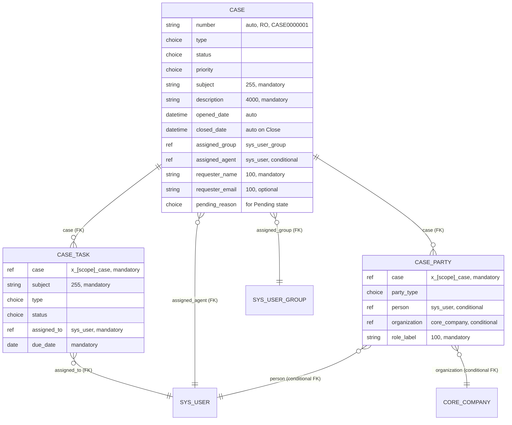

# Data Model

## Purpose

This document captures the three-table schema for the ServiceNow scoped application POC. The schema is preserved verbatim from AAP Section 0.5.7 and serves as the contract for the table records under [`../tables/`](../tables/) and the dictionary entries under [`../dictionary/`](../dictionary/). Every field name, type, and constraint MUST match this document character-for-character.

The three tables are:

- **`x_[scope]_case`** — the case-file root record (12 user-prompt-specified fields plus a `pending_reason` choice field for the Pending state).
- **`x_[scope]_case_task`** — child tasks linked to a parent case via the `case` reference field (6 fields).
- **`x_[scope]_case_party`** — polymorphic party associations linked to a parent case (5 fields, `party_type` discriminator + conditional `person`/`organization` reference fields).

The placeholder string `x_[scope]_` is preserved as written throughout this repository; the actual scope identifier is auto-assigned by the ServiceNow Personal Developer Instance (PDI) when the scoped application is created. No other token replaces this placeholder.

## Schema Overview

The following Mermaid entity-relationship diagram is illustrative. The textual schema tables in Sections 3, 4, and 5 are the contract — if they conflict with the diagram, the textual tables win.

## Table 1: x_[scope]_case

The case-file table replicates ArkCase's `acm_case_file` (mapped to the `CaseFile.java` JPA entity). It is the parent record for all case-management workflows in the POC. Each case has 12 user-prompt-specified fields plus a `pending_reason` choice field used for the Pending state.

| Field | Type | Constraints |
| --- | --- | --- |
| number | Auto-number | Read-only, format CASE0000001 |
| type | Choice | General Inquiry, Complaint — extensible |
| status | Choice | Draft, Open, In Progress, Pending, Resolved, Closed |
| priority | Choice | Low, Medium, High, Critical |
| subject | String(255) | Mandatory |
| description | String(4000) | Mandatory |
| opened_date | DateTime | Auto-set on creation |
| closed_date | DateTime | Auto-set on Close transition |
| assigned_group | Reference → sys_user_group | Mandatory on Open transition |
| assigned_agent | Reference → sys_user | Optional; must be member of assigned_group |
| requester_name | String(100) | Mandatory — captures external requester |
| requester_email | String(100) | Optional |

### Additional field: pending_reason

Per AAP Section 0.4.1 (under choices) and AAP Section 0.5.5 (transition matrix), a `pending_reason` Choice field is added to the case table to support the Pending state. The field is conditional — required only when transitioning to Pending — and is cleared automatically when transitioning Pending → In Progress.

| Field | Type | Constraints |
| --- | --- | --- |
| pending_reason | Choice | Awaiting Info, Awaiting Third Party, Other (mandatory only when status = Pending) |

### Choice values reference

| Field | Choice Values | Default | Choice Record File |
| --- | --- | --- | --- |
| `type` | General Inquiry, Complaint | (no default) | [`../choices/sys_choice_case_type.xml`](../choices/sys_choice_case_type.xml) |
| `status` | Draft, Open, In Progress, Pending, Resolved, Closed | Draft | [`../choices/sys_choice_case_status.xml`](../choices/sys_choice_case_status.xml) |
| `priority` | Low, Medium, High, Critical | (no default) | [`../choices/sys_choice_case_priority.xml`](../choices/sys_choice_case_priority.xml) |
| `pending_reason` | Awaiting Info, Awaiting Third Party, Other | (no default; only set in Pending) | [`../choices/sys_choice_case_pending_reason.xml`](../choices/sys_choice_case_pending_reason.xml) |

### Auto-numbering

- The `number` field uses platform auto-numbering with prefix `CASE` and zero-padded width of 7 digits → format `CASE0000001`.
- The number record file is [`../numbers/sys_number_x_[scope]_case.xml`](../numbers/sys_number_x_[scope]_case.xml).
- The field is Read-only on the form.
- Per AAP Section 0.7.4, this format is non-negotiable.

### Reference resolution rules

- `assigned_group` references `sys_user_group` table; resolved by `name` lookup (per AAP Section 0.5.2).
- `assigned_agent` references `sys_user` table; resolved by `user_name` lookup.
- No hard-coded `sys_id`s in any seed data or ACL condition.

## Table 2: x_[scope]_case_task

The case-task table replicates ArkCase's `acm_task` (mapped to the `AcmTask.java` JPA entity). It is a child record of `x_[scope]_case`, with each task linked to its parent case via the `case` reference field. Task closure status is the gate for the case-level In Progress → Resolved transition.

| Field | Type | Constraints |
| --- | --- | --- |
| case | Reference → x_[scope]_case | Mandatory |
| subject | String(255) | Mandatory |
| type | Choice | Investigation, Review, Follow-up, Other |
| status | Choice | Open, In Progress, Closed |
| assigned_to | Reference → sys_user | Mandatory |
| due_date | Date | Mandatory |

### Choice values reference

| Field | Choice Values | Default | Choice Record File |
| --- | --- | --- | --- |
| `type` | Investigation, Review, Follow-up, Other | (no default) | [`../choices/sys_choice_case_task_type.xml`](../choices/sys_choice_case_task_type.xml) |
| `status` | Open, In Progress, Closed | Open | [`../choices/sys_choice_case_task_status.xml`](../choices/sys_choice_case_task_status.xml) |

### Reference resolution rules

- `case` references `x_[scope]_case` table; resolved by `number` lookup (per AAP Section 0.5.2).
- `assigned_to` references `sys_user` table; resolved by `user_name` lookup.

### Auto-numbering

- Optional auto-numbering with prefix `TASK` and zero-padded width of 7 digits → format `TASK0000001`.
- The number record file is [`../numbers/sys_number_x_[scope]_case_task.xml`](../numbers/sys_number_x_[scope]_case_task.xml).

## Table 3: x_[scope]_case_party

The case-party table is a polymorphic association table that collapses ArkCase's two separate association tables (`acm_person_assoc` mapped to `PersonAssociation.java` and `acm_person_org_assoc` mapped to `PersonOrganizationAssociation.java`) into a single ServiceNow scoped table with a Choice discriminator (`party_type`) and conditional reference fields. This is an intentional simplification per AAP Section 0.1.1.

| Field | Type | Constraints |
| --- | --- | --- |
| case | Reference → x_[scope]_case | Mandatory |
| party_type | Choice | Person, Organization |
| person | Reference → sys_user | Conditional: required if party_type = Person |
| organization | Reference → core_company | Conditional: required if party_type = Organization |
| role_label | String(100) | Mandatory (e.g., Requester, Respondent, Witness) |

### Choice values reference

| Field | Choice Values | Default | Choice Record File |
| --- | --- | --- | --- |
| `party_type` | Person, Organization | (no default) | [`../choices/sys_choice_case_party_party_type.xml`](../choices/sys_choice_case_party_party_type.xml) |

### Conditional Field Visibility (UI Policy)

The single-table polymorphism is implemented via a UI Policy that conditionally shows the appropriate reference field based on `party_type`. The policy lives at [`../ui_policy/x_[scope]_case_party_conditional_fields.xml`](../ui_policy/x_[scope]_case_party_conditional_fields.xml).

| When `party_type =` | Show field | Hide field | Mandatory field |
| --- | --- | --- | --- |
| Person | `person` | `organization` | `person` |
| Organization | `organization` | `person` | `organization` |
| (empty) | both visible (form-creation default) | none | (validated on save) |

### Reference resolution rules

- `case` references `x_[scope]_case` table; resolved by `number` lookup.
- `person` references `sys_user` table; resolved by `user_name` lookup.
- `organization` references `core_company` table; resolved by `name` lookup.
- No hard-coded `sys_id`s.

### Example role_label values

These values are illustrative only; the field is `String(100)` (free text), not a Choice list. Any synthetic, non-PII string is permitted.

- `Requester` — the external requester who submitted the case.
- `Respondent` — the entity being investigated or asked to respond.
- `Witness` — a third party with knowledge of the case facts.
- Other free-text values are permitted (the field is `String(100)`, not Choice).

## Cross-Table Relationships

The three tables form a parent-child hierarchy with `x_[scope]_case` as the root.

| Parent | Child | Foreign Key | Cascade Behavior |
| --- | --- | --- | --- |
| `x_[scope]_case` | `x_[scope]_case_task` | `x_[scope]_case_task.case` | No cascade-delete; tasks are not auto-deleted when case is deleted (manager must delete children explicitly) |
| `x_[scope]_case` | `x_[scope]_case_party` | `x_[scope]_case_party.case` | No cascade-delete; parties are not auto-deleted when case is deleted |

Related Lists are configured on the case form to surface the child records (Tasks and Parties) inline with the parent case. Each related list uses the platform's standard list view; no custom related-list scripts are required.

## Platform Audit Fields

Per AAP Section 0.1.2 (Persistence transformation), every scoped table inherits the platform's standard `sys_*` audit columns. These fields are NOT user-defined and do NOT appear in the user-prompt schema, but they exist on every record:

| Field | Type | Set By |
| --- | --- | --- |
| `sys_id` | GUID | Platform on insert |
| `sys_created_on` | DateTime | Platform on insert |
| `sys_created_by` | String | Platform on insert |
| `sys_updated_on` | DateTime | Platform on update |
| `sys_updated_by` | String | Platform on update |

Per AAP Section 0.7.4, the portal lookup endpoint MUST NOT expose any `sys_*` audit field — only `number`, `status`, `subject`, `opened_date` are returned to anonymous callers.

## Source-Side Semantic Mapping

This section documents how the three ServiceNow tables semantically correspond to ArkCase JPA entities. None of the ArkCase code is reused — it is read-only context.

| ServiceNow Table | ArkCase Source Concept | Notes |
| --- | --- | --- |
| `x_[scope]_case` | `CaseFile.java` JPA entity (`acm_case_file` MySQL table) | Replaces 80+ ArkCase fields with the user-prompt-specified 12 + pending_reason; eliminates Activiti BPMN linkage, ECM container linkage, queue/response timing, milestones, courtroom/responsibility, child associations, audit, disposition |
| `x_[scope]_case_task` | `AcmTask.java` JPA entity | Replaces 30+ ArkCase fields with user-prompt-specified 6; eliminates buckslip/approval, percent completion, candidate claim groups, ad-hoc/completion flags, workflow IDs, ECM container, business-process info |
| `x_[scope]_case_party` | `PersonAssociation.java` (`acm_person_assoc`) AND `PersonOrganizationAssociation.java` (`acm_person_org_assoc`) | Collapses two ArkCase tables into one polymorphic table per AAP Section 0.1.1; replaces JPA single-table inheritance with `cm_class_name` discriminator with a Choice field (`party_type`) and UI Policy-driven conditional reference fields |

### Field-by-field mapping for x_[scope]_case

| ServiceNow Field | ArkCase Source Field | Notes |
| --- | --- | --- |
| `number` | `caseNumber` (auto-generated by `@TableGenerator`) | Replaced with platform auto-numbering, format `CASE0000001` |
| `type` | `caseType` (String discriminator) | Replaced with Choice (extensible) |
| `status` | `status` (`@Enumerated`) | Replaced with Choice; default Draft |
| `priority` | `priority` (String) | Replaced with Choice |
| `subject` | `title` (String) | Renamed from `title` to `subject` per AAP Section 0.5.7 |
| `description` | `details` (String) | Renamed from `details` to `description` per AAP Section 0.5.7 |
| `opened_date` | `created` (audit field) | Replaced with native auto-set business rule |
| `closed_date` | `Disposition.closeDate` | Replaced with native auto-set business rule on Resolved → Closed |
| `assigned_group` | `responsibleOrganization` (Reference) | Replaced with reference to `sys_user_group` |
| `assigned_agent` | `assignee` (String LDAP id) | Replaced with reference to `sys_user` |
| `requester_name` | `originator.fullName` (derived from PersonAssociations) | Captured directly on case (synthesized from FOIA portal pattern) |
| `requester_email` | `originator.email` (derived from PersonAssociations) | Captured directly on case |
| `pending_reason` | (no direct ArkCase equivalent) | New POC field per AAP Section 0.5.5 transition matrix |

## Constraints

The following schema-level constraints are non-negotiable per AAP Section 0.7.1:

- **Field set is non-negotiable.** No additions, no renames, no type relaxations beyond what is in AAP Section 0.5.7.
- **Choice values are non-negotiable.** Each Choice field's values match the user prompt verbatim.
- **Mandatory flags are non-negotiable.** Every "Mandatory" cell in the schema tables MUST result in `mandatory = true` on the dictionary entry.
- **Auto-numbering format `CASE0000001` is non-negotiable.** Per AAP Section 0.7.4.
- **Reference targets are non-negotiable.** `sys_user_group`, `sys_user`, `core_company`, `x_[scope]_case` are the EXACT reference targets.
- **No hard-coded `sys_id`s** in any seed data — references resolved by `name`/`user_name`/`number` lookup.
- **Single-table polymorphism for case_party** — one table, not two; `party_type` Choice plus conditional fields.

## Verification

The following verification gate is reproduced verbatim from AAP Section 0.7.3:

| Gate | Criterion | Pass Condition |
| --- | --- | --- |
| Data model | All 3 custom tables created with correct fields and types | Zero missing mandatory fields |

Verification procedure (cross-reference [`validation-gates.md`](./validation-gates.md) Gate 1):

1. Open System Definition → Tables → filter `Name CONTAINS x_[scope]_case`. Confirm exactly 3 records: `x_[scope]_case`, `x_[scope]_case_task`, `x_[scope]_case_party`.
2. Open `x_[scope]_case` → confirm 13 fields (12 + `pending_reason`). For each Mandatory field per the schema table, confirm `mandatory = true`. For each Choice field, confirm choice values match verbatim.
3. Open `x_[scope]_case_task` → confirm 6 fields. Confirm reference targets and Mandatory flags.
4. Open `x_[scope]_case_party` → confirm 5 fields. Confirm `party_type` Choice values, conditional `person`/`organization` reference targets.
5. Open the `x_[scope]_case_party_conditional_fields` UI Policy → confirm conditional show/hide rules.
6. Open [`../numbers/sys_number_x_[scope]_case.xml`](../numbers/sys_number_x_[scope]_case.xml) → confirm format `CASE0000001` and Read-only flag on the field.

## Cross-References

- [`state-machine.md`](./state-machine.md) — uses `status` and `pending_reason` field semantics.
- [`acl-matrix.md`](./acl-matrix.md) — uses `assigned_group` and `assigned_agent` field semantics.
- [`portal-pages.md`](./portal-pages.md) — uses `subject`, `type`, `description`, `requester_name`, `requester_email` (submission) and `number`, `status`, `subject`, `opened_date` (lookup).
- [`dashboards.md`](./dashboards.md) — uses `status`, `type`, `priority`, `opened_date`, `closed_date`, `assigned_agent`, `assigned_to`, `due_date` for grouping/filtering.
- [`validation-gates.md`](./validation-gates.md) — Gate 1 (Data model).
- [`../tables/`](../tables/) — three table records: `x_[scope]_case.xml`, `x_[scope]_case_task.xml`, `x_[scope]_case_party.xml`.
- [`../dictionary/`](../dictionary/) — every dictionary entry for every field.
- [`../choices/`](../choices/) — every choice list record.
- [`../numbers/`](../numbers/) — auto-numbering records.
- [`../ui_policy/x_[scope]_case_party_conditional_fields.xml`](../ui_policy/x_[scope]_case_party_conditional_fields.xml) — UI Policy for case_party.
