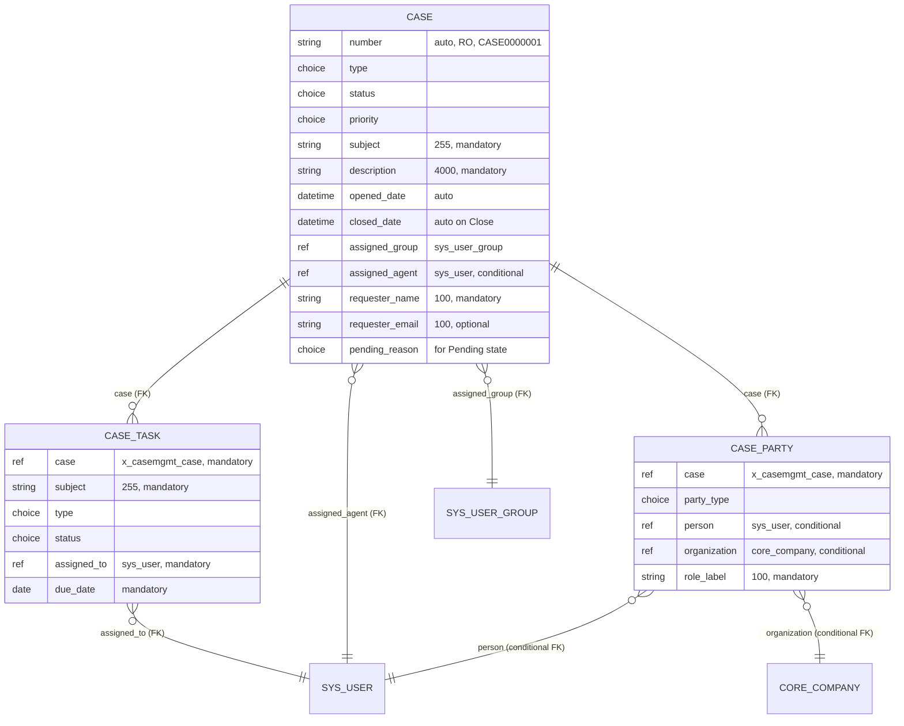

# Data Model

## Purpose

This document captures the three-table schema for the ServiceNow scoped application POC. The schema is preserved verbatim from AAP Section 0.5.7 and serves as the contract for the table records under [`../tables/`](../tables/) and the dictionary entries under [`../dictionary/`](../dictionary/). Every field name, type, and constraint MUST match this document character-for-character.

The three tables are:

- **`x_casemgmt_case`** — the case-file root record (12 user-prompt-specified fields plus a `pending_reason` choice field for the Pending state plus a virtual `duration_to_close` Function Field that powers the Manager View "Average Time to Close" widget — 14 fields total).
- **`x_casemgmt_case_task`** — child tasks linked to a parent case via the `case` reference field (6 fields).
- **`x_casemgmt_case_party`** — polymorphic party associations linked to a parent case (5 fields, `party_type` discriminator + conditional `person`/`organization` reference fields).

The concrete scope identifier `x_casemgmt_` is used consistently throughout this repository. ServiceNow Update Set imports use a standard XML parser, so the scope id must be concrete in every record before the Update Set is exported.

## Schema Overview

The following Mermaid entity-relationship diagram is illustrative. The textual schema tables in Sections 3, 4, and 5 are the contract — if they conflict with the diagram, the textual tables win.

```mermaid
erDiagram
    CASE ||--o{ CASE_TASK : "case (FK)"
    CASE ||--o{ CASE_PARTY : "case (FK)"
    CASE_PARTY }o--|| SYS_USER : "person (conditional FK)"
    CASE_PARTY }o--|| CORE_COMPANY : "organization (conditional FK)"
    CASE }o--|| SYS_USER_GROUP : "assigned_group (FK)"
    CASE }o--|| SYS_USER : "assigned_agent (FK)"
    CASE_TASK }o--|| SYS_USER : "assigned_to (FK)"

    CASE {
        string number "auto, RO, CASE0000001"
        choice type
        choice status
        choice priority
        string subject "255, mandatory"
        string description "4000, mandatory"
        datetime opened_date "auto"
        datetime closed_date "auto on Close"
        ref assigned_group "sys_user_group"
        ref assigned_agent "sys_user, conditional"
        string requester_name "100, mandatory"
        string requester_email "100, optional"
        choice pending_reason "for Pending state"
    }

    CASE_TASK {
        ref case "x_casemgmt_case, mandatory"
        string subject "255, mandatory"
        choice type
        choice status
        ref assigned_to "sys_user, mandatory"
        date due_date "mandatory"
    }

    CASE_PARTY {
        ref case "x_casemgmt_case, mandatory"
        choice party_type
        ref person "sys_user, conditional"
        ref organization "core_company, conditional"
        string role_label "100, mandatory"
    }
```

## Table 1: x_casemgmt_case

The case-file table replicates ArkCase's `acm_case_file` (mapped to the `CaseFile.java` JPA entity). It is the parent record for all case-management workflows in the POC. Each case has 12 user-prompt-specified fields plus a `pending_reason` choice field used for the Pending state plus a virtual `duration_to_close` Function Field that powers the Manager View "Average Time to Close" widget — 14 fields total.

| Field | Type | Constraints |
| --- | --- | --- |
| number | Auto-number | Read-only, format CASE0000001 |
| type | Choice | General Inquiry, Complaint — extensible |
| status | Choice | Draft, Open, In Progress, Pending, Resolved, Closed |
| priority | Choice | Low, Medium, High, Critical |
| subject | String(255) | Mandatory |
| description | String(4000) | Mandatory |
| opened_date | DateTime | Auto-set on creation |
| closed_date | DateTime | Auto-set on Close transition |
| assigned_group | Reference → sys_user_group | Mandatory on Open transition |
| assigned_agent | Reference → sys_user | Optional; must be member of assigned_group |
| requester_name | String(100) | Mandatory — captures external requester |
| requester_email | String(100) | Optional |

### Additional field: pending_reason

Per AAP Section 0.4.1 (under choices) and AAP Section 0.5.5 (transition matrix), a `pending_reason` Choice field is added to the case table to support the Pending state. The field is conditional — required only when transitioning to Pending — and is cleared automatically when transitioning Pending → In Progress.

| Field | Type | Constraints |
| --- | --- | --- |
| pending_reason | Choice | Awaiting Info, Awaiting Third Party, Other (mandatory only when status = Pending) |

### Additional field: duration_to_close (Function Field)

Per AAP Section 0.4.4, the Manager View dashboard's Widget 4 ("Average Time to Close") is required to display the average of `closed_date - opened_date` over Closed cases. ServiceNow's Reports + Dashboards stack can aggregate (`AVG`) only over native database columns and Function Fields; it cannot aggregate over JavaScript "Calculated Value" fields because those run per-row at read time. To satisfy AAP Section 0.4.4 and AAP Section 0.7.3 Validation Gate 6 ("All widgets display data; no broken report references") the case table includes one additional virtual field — `duration_to_close` — typed as a `glide_duration` **Function Field** computed at query time by the platform-native operator `glidefunction:datediff(closed_date,opened_date)`. The field is virtual (not stored on the row), read-only by definition, hidden from the form/list views (`display = false`), and not auditable (`audit = false`). When `closed_date` is empty (i.e., the case has not yet been closed) the function returns `NULL`; the report's `status = Closed` filter excludes those rows so the AVG is computed only over actually-closed cases.

| Field | Type | Constraints |
| --- | --- | --- |
| duration_to_close | Function Field (`glide_duration`) | Not stored / read-only / not displayed; `glidefunction:datediff(closed_date,opened_date)`; dictionary flag `virtual = false` (see the note below) |

**One dictionary flag on this field is load-bearing and counter-intuitive: `virtual` must be `false`.** The value
is genuinely not stored on the row, but `virtual = true` means something narrower — "this column's value comes from a
`virtual_type` provider", i.e. a script. A function field's value comes from the *database*, which evaluates
`function_definition` inside the query. The field shipped with `virtual = true` and no provider, and the measured
consequence was that `duration_to_close` returned **empty for every Closed case** — including demo `CASE0000984`,
an 18-day span — so the "Average Time to Close" widget had nothing to average. Every function field the platform
itself ships (for example `pa_dm_task_telemetry.duration`) carries `function_field = true` with `virtual = false`.
With `virtual = false` the field immediately returned `18 Days` and `14 Days` on the two Closed demo cases.
`post_import_remediation.js` now carries the same three attributes in its field spec and compares them on every
run, so this cannot silently regress on an install.

**A REST consumer sees this field as an epoch-offset datetime, not as a duration.** `glide_duration` is stored and
transmitted as a datetime measured from the Unix epoch, and only the presentation layer renders it as a span. On
`CASE9000006` the same field reads, measured on the live instance:

| How it is read | Value |
| --- | --- |
| `GET /api/now/table/x_casemgmt_case?sysparm_fields=duration_to_close` | `1970-01-19 08:00:00` |
| the same request with `sysparm_display_value=all` | `18 Days 8 Hours` |
| the Manager View "Average Time to Close" widget | `16 Days 8 Hours 0 Minutes` (the average over Closed cases) |

`1970-01-19 08:00:00` is 18 days and 8 hours after `1970-01-01 00:00:00`, so both readings carry the same fact. This
is standard platform behaviour for the type rather than anything specific to this field, but it is recorded here
because a caller reading the raw Table API would otherwise reasonably conclude the field held a corrupt date. A
consumer that wants the human span must ask for the display value; one that wants to compute with it should treat
the raw value as an offset from the epoch.

**This field is an addition to the AAP Section 0.5.7 field set, and that is a deliberate, disclosed divergence.**
Section 0.5.7 enumerates twelve columns for `x_casemgmt_case` and Section 0.7.1 requires the field set to match
"no additions". This field is a thirteenth column in the dictionary (fourteenth counting `pending_reason`). It
exists because AAP Section 0.4.4 separately *requires* the Manager View to show "Average Time to Close", computed
as `closed_date - opened_date` over Closed cases, and Section 0.7.3 Validation Gate 6 requires every widget to
display data — and, as set out above, the platform's report engine cannot aggregate that expression without a
native column or a Function Field to aggregate over. The two requirements cannot both be met without it, so the
divergence is the minimum needed to satisfy the more specific one: nothing is stored, no AAP-enumerated column is
altered, and the value is derived at query time from two columns Section 0.5.7 does enumerate. **Removing the
field would leave the AAP-mandated widget with nothing to average**, so it must not be removed without replacing
the mechanism. A reader who requires strict Section 0.5.7 arity should treat this as a divergence to ratify rather
than a defect to fix; the alternative — dropping the field and re-deriving the widget another way — is a design
change, not a correction, and needs a human decision.

The dictionary record file is [`../dictionary/x_casemgmt_case_duration_to_close.xml`](../dictionary/x_casemgmt_case_duration_to_close.xml). The field is consumed exclusively by [`../reports/x_casemgmt_avg_time_to_close.xml`](../reports/) and surfaced on [`../dashboards/pa_dashboards_x_casemgmt_manager_view.xml`](../dashboards/) Widget 4. See [`dashboards.md`](./dashboards.md) Widget 4 details for the full implementation rationale, including why a Function Field (not a Calculated Value field) is required for `sys_report` aggregation and how this satisfies AAP Section 0.7.2 Minimal-Change Clause (no new module, workflow, portal page, parent table, or external integration — only a query-time derivation from existing AAP-enumerated columns `opened_date` and `closed_date`).

### Choice values reference

| Field | Choice Values | Default | Choice Record File |
| --- | --- | --- | --- |
| `type` | General Inquiry, Complaint | (no default) | [`../choices/sys_choice_case_type.xml`](../choices/sys_choice_case_type.xml) |
| `status` | Draft, Open, In Progress, Pending, Resolved, Closed | Draft | [`../choices/sys_choice_case_status.xml`](../choices/sys_choice_case_status.xml) |
| `priority` | Low, Medium, High, Critical | (no default) | [`../choices/sys_choice_case_priority.xml`](../choices/sys_choice_case_priority.xml) |
| `pending_reason` | Awaiting Info, Awaiting Third Party, Other | (no default; only set in Pending) | [`../choices/sys_choice_case_pending_reason.xml`](../choices/sys_choice_case_pending_reason.xml) |

### Auto-numbering

- The `number` field uses platform auto-numbering with prefix `CASE` and zero-padded width of 7 digits → format `CASE0000001`.
- The number record file is [`../numbers/sys_number_x_casemgmt_case.xml`](../numbers/sys_number_x_casemgmt_case.xml).
- The field is Read-only on the form.
- Per AAP Section 0.7.4, this format is non-negotiable.

### Reference resolution rules

- `assigned_group` references `sys_user_group` table; resolved by `name` lookup (per AAP Section 0.5.2).
- `assigned_agent` references `sys_user` table; resolved by `user_name` lookup.
- No hard-coded `sys_id`s in any seed data or ACL condition.

## Table 2: x_casemgmt_case_task

The case-task table replicates ArkCase's `acm_task` (mapped to the `AcmTask.java` JPA entity). It is a child record of `x_casemgmt_case`, with each task linked to its parent case via the `case` reference field. Task closure status is the gate for the case-level In Progress → Resolved transition.

| Field | Type | Constraints |
| --- | --- | --- |
| case | Reference → x_casemgmt_case | Mandatory |
| subject | String(255) | Mandatory |
| type | Choice | Investigation, Review, Follow-up, Other |
| status | Choice | Open, In Progress, Closed |
| assigned_to | Reference → sys_user | Mandatory |
| due_date | Date | Mandatory |

### Choice values reference

| Field | Choice Values | Default | Choice Record File |
| --- | --- | --- | --- |
| `type` | Investigation, Review, Follow-up, Other | (no default) | [`../choices/sys_choice_case_task_type.xml`](../choices/sys_choice_case_task_type.xml) |
| `status` | Open, In Progress, Closed | Open | [`../choices/sys_choice_case_task_status.xml`](../choices/sys_choice_case_task_status.xml) |

### Reference resolution rules

- `case` references `x_casemgmt_case` table; resolved by `number` lookup (per AAP Section 0.5.2).
- `assigned_to` references `sys_user` table; resolved by `user_name` lookup.

### Auto-numbering

- Optional auto-numbering with prefix `TASK` and zero-padded width of 7 digits → format `TASK0000001`.
- The number record file is [`../numbers/sys_number_x_casemgmt_case_task.xml`](../numbers/sys_number_x_casemgmt_case_task.xml).
- The field is **Read-only** at the dictionary level ([`../dictionary/x_casemgmt_case_task_number.xml`](../dictionary/x_casemgmt_case_task_number.xml)), matching `x_casemgmt_case.number`. The platform's number generator and server-side scripts are exempt from dictionary read-only enforcement, so the column is still populated on insert; what read-only prevents is a caller overwriting an issued number — which was reachable before, and could produce two rows sharing one number. `mandatory` stays `false`, because the generator supplies the value server-side and a mandatory flag would break any `GlideRecord.insert()` that omits it.

## Table 3: x_casemgmt_case_party

The case-party table is a polymorphic association table that collapses ArkCase's two separate association tables (`acm_person_assoc` mapped to `PersonAssociation.java` and `acm_person_org_assoc` mapped to `PersonOrganizationAssociation.java`) into a single ServiceNow scoped table with a Choice discriminator (`party_type`) and conditional reference fields. This is an intentional simplification per AAP Section 0.1.1.

| Field | Type | Constraints |
| --- | --- | --- |
| case | Reference → x_casemgmt_case | Mandatory |
| party_type | Choice | Person, Organization |
| person | Reference → sys_user | Conditional: required if party_type = Person |
| organization | Reference → core_company | Conditional: required if party_type = Organization |
| role_label | String(100) | Mandatory (e.g., Requester, Respondent, Witness) |

### Choice values reference

| Field | Choice Values | Default | Choice Record File |
| --- | --- | --- | --- |
| `party_type` | Person, Organization | (no default) | [`../choices/sys_choice_case_party_party_type.xml`](../choices/sys_choice_case_party_party_type.xml) |

### Auto-numbering

- Optional auto-numbering with prefix `PARTY` and zero-padded width of 7 digits → format `PARTY0000001`.
- The number record file is [`../numbers/sys_number_x_casemgmt_case_party.xml`](../numbers/sys_number_x_casemgmt_case_party.xml).
- The field is **Read-only** at the dictionary level ([`../dictionary/x_casemgmt_case_party_number.xml`](../dictionary/x_casemgmt_case_party_number.xml)), for the same reason and with the same generator exemption as the task table's `number` described above.

### Conditional Field Visibility (UI Policy)

The single-table polymorphism is implemented via a UI Policy that conditionally shows the appropriate reference field based on `party_type`. The policy lives at [`../ui_policy/x_casemgmt_case_party_conditional_fields.xml`](../ui_policy/x_casemgmt_case_party_conditional_fields.xml). The policy governs the **form** only; the same exactly-one-of invariant is enforced on every other write path by [`x_casemgmt_validate_case_party_integrity`](../business_rules/x_casemgmt_validate_case_party_integrity.xml) — see [Server-Side Enforcement of the Schema Contract](#server-side-enforcement-of-the-schema-contract) below.

| When `party_type =` | Show field | Hide field | Mandatory field |
| --- | --- | --- | --- |
| Person | `person` | `organization` | `person` |
| Organization | `organization` | `person` | `organization` |
| (empty) | none | both `person` and `organization` | (validated on save) |

The last row was previously documented as "both visible (form-creation default)", which was wrong. Both policies carry `reverse_if_false=true` and each acts on a single field, so when the discriminator is empty **both** conditions are false and **both** reference fields are hidden and non-mandatory — which is what the UI Policy record's own behaviour matrix (Case 3) states, and what the rendered form does. Nothing depended on the incorrect reading; it is corrected here so the two documents agree.

### Clearing the inapplicable reference (onChange Client Script)

The UI Policy decides which reference field is **shown**. It cannot decide which one is **submitted**, and that gap was a functional dead end on the form (verifier finding I2).

**The defect, as measured on the rendered form.** On a new party record: set `Party Type = Person` and pick a Person; switch to `Organization` and pick an Organization; switch back to `Person` and Submit once. The UI Policy hides `organization` correctly and removes it from the accessibility tree — but a field hidden by a UI Policy stays in the DOM as a `display:none` row whose submit inputs are hidden and **not disabled**, so the classic form posts its stale value verbatim. The wire capture recorded in [`x_casemgmt_validate_case_party_integrity`](../business_rules/x_casemgmt_validate_case_party_integrity.xml) shows all of it arriving together: `sys_original…party_type=Organization`, `…party_type=Person`, `…person=<the newly chosen user>`, `…organization=<the OLD company, still sent>`. The Business Rule then correctly refuses with `Organization must be empty when Party Type is Person.` plus the platform's `Invalid insert` — and the user is trapped, because the value blocking the save is on a field that is no longer on their screen and the hidden input is reseeded from the same value on the re-render. The inverse sequence (Organization → Person → Organization) traps them symmetrically on `person`.

The trap has exactly two shapes, both following from the rule's normalisation predicate (see [The one normalisation](#the-one-normalisation-party-type-conversion) — it corrects a row only on an **update** that itself changes `party_type` to a *different* non-empty value):

| Shape | Why the server-side normalisation does not reach it |
| --- | --- |
| **Insert** — any new party whose discriminator was toggled | A new record has no prior discriminator, so nothing "changed"; on an insert, "both set" is indistinguishable from the caller's own incoherent input, which the rule must keep refusing |
| **Update whose discriminator round-trips** — a stored Person party toggled Person → Organization → Person in one form session | The submitted `party_type` equals the stored one, so again nothing "changed" and the stale reference is refused rather than normalised |

**The fix.** [`../client_scripts/x_casemgmt_case_party_clear_opposite_reference.xml`](../client_scripts/x_casemgmt_case_party_clear_opposite_reference.xml) is an `onChange` Client Script on `party_type` (table `x_casemgmt_case_party`, `order 200`) that clears the reference the new discriminator makes inapplicable — `organization` when `party_type` becomes `Person`, `person` when it becomes `Organization` — so the hidden field has no value left to carry into the POST. It clears the value **and** the reference display text in one `g_form.setValue(field, '', '')` call (the two-argument form would ask the server to resolve a display value; the three-argument form sets both directly), then sweeps the display input for text the user typed without selecting a row. It never touches the field the discriminator makes applicable, and it returns having changed nothing while `isLoading` is true, on an empty `party_type`, and on any discriminator value it does not recognise.

**Why a UI Policy action cannot do this job.** `sys_ui_policy_action` is not entirely value-blind — it carries a `cleared` column ("Clear the field value"), which both existing actions set to `false`. It still cannot express this fix:

| Reason | Consequence |
| --- | --- |
| `cleared` is one-way | It applies on the forward evaluation of a true condition, and `reverse_if_false` has no value counterpart — it restores visible / mandatory / read-only opposites and cannot restore a destroyed value |
| It crosses field ownership | Clearing `organization` when `party_type = Person` puts the action on the **Person** policy, so that policy would act on the organization field — destroying the one-field-per-policy invariant that is why the two policies can never contend and their orders (100, 110) are irrelevant |
| It fires on load | Both policies are `on_load=true` and an action applies at render, so a `cleared` action would wipe the opposite column merely because a record was **opened** — mutating stored data on a read, including for an `x_casemgmt_case_viewer` whose ACLs forbid writing |
| It cannot see the change | A UI Policy has no access to `newValue`, `oldValue` or `isLoading`, so it cannot confine itself to an actual discriminator change, which is the only moment a reference legitimately becomes stale |

An `onChange` script has all four properties the job needs. The two mechanisms write **disjoint** attributes of the same two fields — the policy writes visible and mandatory, the script writes the value — and neither reads what the other writes, so no execution order between them changes the outcome; the field the script clears is the one the policy has just reversed to hidden and *not* mandatory, so a cleared value can never leave a mandatory-empty control blocking the save.

The Client Script is form ergonomics, not enforcement. It removes no server-side check: [`x_casemgmt_validate_case_party_integrity`](../business_rules/x_casemgmt_validate_case_party_integrity.xml) remains the authority for every write path and is unchanged.

### Reference resolution rules

- `case` references `x_casemgmt_case` table; resolved by `number` lookup.
- `person` references `sys_user` table; resolved by `user_name` lookup.
- `organization` references `core_company` table; resolved by `name` lookup.
- No hard-coded `sys_id`s.

### Example role_label values

These values are illustrative only; the field is `String(100)` (free text), not a Choice list. Any synthetic, non-PII string is permitted.

- `Requester` — the external requester who submitted the case.
- `Respondent` — the entity being investigated or asked to respond.
- `Witness` — a third party with knowledge of the case facts.
- Other free-text values are permitted (the field is `String(100)`, not Choice).

## Cross-Table Relationships

The three tables form a parent-child hierarchy with `x_casemgmt_case` as the root.

| Parent | Child | Foreign Key | Cascade Behavior |
| --- | --- | --- | --- |
| `x_casemgmt_case` | `x_casemgmt_case_task` | `x_casemgmt_case_task.case` | `reference_cascade_rule = cascade` — deleting a case deletes its child tasks with it |
| `x_casemgmt_case` | `x_casemgmt_case_party` | `x_casemgmt_case_party.case` | `reference_cascade_rule = cascade` — deleting a case deletes its child parties with it |

Both child links are **compositions**, not associations: a task and a party have no meaning outside the case they belong to, and `case` is Mandatory on both. The rule was previously `none`, which left a deleted parent's children alive holding a mandatory reference that resolved to nothing — a row that can never be saved from its own form and that silently distorts the Tasks/Parties related lists, the Agent Workspace "My overdue tasks" report and the task-closure gate, all of which reach a child *through* `case`.

`cascade` was chosen over the four alternatives the platform offers:

| Option | Why not |
| --- | --- |
| `clear` | Leaves the child with an **empty** mandatory `case` — still unsavable from its own form, still in no related list |
| `restrict` | Refuses the parent delete while children exist, which would **revoke** the unqualified `Delete` that [`acl-matrix.md`](./acl-matrix.md) grants `x_casemgmt_case_manager` |
| `delete_no_workflow` | Suppresses the children's own business rules and audit on removal |
| `delete` | Equivalent here (neither child table has children of its own); `cascade` is the platform's canonical composition rule and stays correct if a grandchild table is ever added |

Cascade removes only rows on the two child tables. The `person` (`sys_user`) and `organization` (`core_company`) records a party points *at* are global identity records this application never owns and AAP Section 0.3.2 forbids writing to, so no cascade from `case_party.case` can reach them. The reference fields `case.assigned_group`, `case.assigned_agent`, `case_task.assigned_to`, `case_party.person` and `case_party.organization` correctly carry **no** cascade rule: those are associations to global records, and deleting a group or a user must never delete the cases assigned to it.

Related Lists are configured on the case form to surface the child records (Tasks and Parties) inline with the parent case. Each related list uses the platform's standard list view; no custom related-list scripts are required.

## Server-Side Enforcement of the Schema Contract

The `Mandatory` and `Conditional` cells in the three schema tables above are **dictionary metadata**, and dictionary metadata is enforced by the FORM engine — not by the insert/update pipeline. Every non-form write path (the Table API, a background script, an Import Set transform, a scoped Script Include, an inbound email action) bypasses it. Three before-insert/before-update Business Rules make the contract true of stored **rows** rather than only of metadata:

| Rule | Table | Order | Refuses |
| --- | --- | --- | --- |
| [`x_casemgmt_validate_case_mandatory_fields`](../business_rules/x_casemgmt_validate_case_mandatory_fields.xml) | `x_casemgmt_case` | 50 | an empty or whitespace-only `subject`, `description` or `requester_name` |
| [`x_casemgmt_validate_case_task_integrity`](../business_rules/x_casemgmt_validate_case_task_integrity.xml) | `x_casemgmt_case_task` | 100 | an empty `case`, a `case` that does not resolve to a live row, or an empty `subject` / `assigned_to` / `due_date` |
| [`x_casemgmt_validate_case_party_integrity`](../business_rules/x_casemgmt_validate_case_party_integrity.xml) | `x_casemgmt_case_party` | 100 | an empty or unresolvable `case`, an empty `role_label`, an empty or undeclared `party_type`, a missing required `person`/`organization`, or both references populated at once |

Each refusal calls `gs.addErrorMessage()` with a message naming the offending field and then `current.setAbortAction(true)`, so the failure surfaces as a blocking red banner at the top of the form (per AAP Section 0.7.1) and the Table API answers **HTTP 403** with the rule named in `error.detail`. None of the three reproduces any of the four verbatim messages AAP Section 0.7.4 fixes; those belong to [`state-machine.md`](./state-machine.md)'s rules and to the portal Script Include.

All three rules read the value the row **would carry after** the write, so an update that touches an unrelated column passes untouched. All three return early on `current.isActionAborted()`, so a save an earlier rule already rejected never collects a second, unrelated message. None fires on `delete`, so the cascade rules above and the manager's unqualified `Delete` grant are both untouched.

### The one normalisation: party-type conversion

`x_casemgmt_validate_case_party_integrity` has a single case where it **corrects** the row instead of refusing it. The UI Policy in [`../ui_policy/x_casemgmt_case_party_conditional_fields.xml`](../ui_policy/x_casemgmt_case_party_conditional_fields.xml) hides the inapplicable reference field but cannot clear it (why not: [Clearing the inapplicable reference](#clearing-the-inapplicable-reference-onchange-client-script)), and the classic form posts hidden, non-disabled inputs verbatim. So converting a party from Organization to Person on the form submits `party_type=Person`, the newly chosen `person`, **and** the stale `organization` together. Refusing that write would make a legitimate conversion impossible through the only internal UI AAP Section 0.4.4 provides, and the caller could not comply with the refusal either — the field they are told to empty is not on their screen.

Therefore, when a write is an **update** that itself changes `party_type` to a different non-empty value and the newly applicable reference is populated, the rule clears the now-inapplicable reference, records a `gs.info` audit line naming the record and the cleared column, and lets the save proceed. An **insert** carrying both references, and an update that sets the wrong reference without changing `party_type`, are both still refused. The stored row satisfies the exactly-one-of invariant on every path.

Since [`../client_scripts/x_casemgmt_case_party_clear_opposite_reference.xml`](../client_scripts/x_casemgmt_case_party_clear_opposite_reference.xml) empties the inapplicable reference as the discriminator changes, the form normally stops handing the rule a stale value at all — including on the two paths the normalisation deliberately does not cover (an insert, and an update whose discriminator round-trips back to the stored value), which is exactly where the form used to dead-end. The rule's behaviour is **unchanged**: it keeps both refusals and this one normalisation for every write path that has no form in front of it — the Table API, a background script, an Import Set transform.

## Platform Audit Fields

Per AAP Section 0.1.2 (Persistence transformation), every scoped table inherits the platform's standard `sys_*` audit columns. These fields are NOT user-defined and do NOT appear in the user-prompt schema, but they exist on every record:

| Field | Type | Set By |
| --- | --- | --- |
| `sys_id` | GUID | Platform on insert |
| `sys_created_on` | DateTime | Platform on insert |
| `sys_created_by` | String | Platform on insert |
| `sys_updated_on` | DateTime | Platform on update |
| `sys_updated_by` | String | Platform on update |

Per AAP Section 0.7.4, the portal lookup endpoint MUST NOT expose any `sys_*` audit field — only `number`, `status`, `subject`, `opened_date` are returned to anonymous callers.

## Source-Side Semantic Mapping

This section documents how the three ServiceNow tables semantically correspond to ArkCase JPA entities. None of the ArkCase code is reused — it is read-only context.

| ServiceNow Table | ArkCase Source Concept | Notes |
| --- | --- | --- |
| `x_casemgmt_case` | `CaseFile.java` JPA entity (`acm_case_file` MySQL table) | Replaces 80+ ArkCase fields with the user-prompt-specified 12 + `pending_reason` choice + `duration_to_close` Function Field (14 total); eliminates Activiti BPMN linkage, ECM container linkage, queue/response timing, milestones, courtroom/responsibility, child associations, audit, disposition |
| `x_casemgmt_case_task` | `AcmTask.java` JPA entity | Replaces 30+ ArkCase fields with user-prompt-specified 6; eliminates buckslip/approval, percent completion, candidate claim groups, ad-hoc/completion flags, workflow IDs, ECM container, business-process info |
| `x_casemgmt_case_party` | `PersonAssociation.java` (`acm_person_assoc`) AND `PersonOrganizationAssociation.java` (`acm_person_org_assoc`) | Collapses two ArkCase tables into one polymorphic table per AAP Section 0.1.1; replaces JPA single-table inheritance with `cm_class_name` discriminator with a Choice field (`party_type`) and UI Policy-driven conditional reference fields |

### Field-by-field mapping for x_casemgmt_case

| ServiceNow Field | ArkCase Source Field | Notes |
| --- | --- | --- |
| `number` | `caseNumber` (auto-generated by `@TableGenerator`) | Replaced with platform auto-numbering, format `CASE0000001` |
| `type` | `caseType` (String discriminator) | Replaced with Choice (extensible) |
| `status` | `status` (`@Enumerated`) | Replaced with Choice; default Draft |
| `priority` | `priority` (String) | Replaced with Choice |
| `subject` | `title` (String) | Renamed from `title` to `subject` per AAP Section 0.5.7 |
| `description` | `details` (String) | Renamed from `details` to `description` per AAP Section 0.5.7 |
| `opened_date` | `created` (audit field) | Replaced with native auto-set business rule |
| `closed_date` | `Disposition.closeDate` | Replaced with native auto-set business rule on Resolved → Closed |
| `assigned_group` | `responsibleOrganization` (Reference) | Replaced with reference to `sys_user_group` |
| `assigned_agent` | `assignee` (String LDAP id) | Replaced with reference to `sys_user` |
| `requester_name` | `originator.fullName` (derived from PersonAssociations) | Captured directly on case (synthesized from FOIA portal pattern) |
| `requester_email` | `originator.email` (derived from PersonAssociations) | Captured directly on case |
| `pending_reason` | (no direct ArkCase equivalent) | New POC field per AAP Section 0.5.5 transition matrix |
| `duration_to_close` | `CaseSummaryByStatusAndTimePeriodDto.java` (Pentaho-side `TIMESTAMPDIFF(SECOND, cm_case_created, cm_case_closed)`) | Replaced with native query-time Function Field `glidefunction:datediff(closed_date,opened_date)`; preserves ArkCase's "duration is computed, not stored" semantic |

## Constraints

The following schema-level constraints are non-negotiable per AAP Section 0.7.1:

- **Field set is non-negotiable.** No additions, no renames, no type relaxations beyond what is in AAP Section 0.5.7.
- **Choice values are non-negotiable.** Each Choice field's values match the user prompt verbatim.
- **Mandatory flags are non-negotiable.** Every "Mandatory" cell in the schema tables MUST result in `mandatory = true` on the dictionary entry — AND in a server-side refusal of any write that would store the column empty, because the dictionary flag alone is enforced only by the form engine. See [Server-Side Enforcement of the Schema Contract](#server-side-enforcement-of-the-schema-contract).
- **Conditional flags are non-negotiable.** `person` and `organization` form an exactly-one-of pair keyed on `party_type`: exactly one is populated on every stored row, never both and never neither.
- **Auto-numbering format `CASE0000001` is non-negotiable.** Per AAP Section 0.7.4. All three `number` columns are Read-only at the dictionary level, so an issued number cannot be overwritten or duplicated by any caller.
- **Both parent-child links cascade on delete.** `case_task.case` and `case_party.case` carry `reference_cascade_rule = cascade`, so no delete can leave a child holding a mandatory reference that resolves to nothing.
- **Reference targets are non-negotiable.** `sys_user_group`, `sys_user`, `core_company`, `x_casemgmt_case` are the EXACT reference targets.
- **No hard-coded `sys_id`s** in any seed data — references resolved by `name`/`user_name`/`number` lookup.
- **Single-table polymorphism for case_party** — one table, not two; `party_type` Choice plus conditional fields.

## Verification

The following verification gate is reproduced verbatim from AAP Section 0.7.3:

| Gate | Criterion | Pass Condition |
| --- | --- | --- |
| Data model | All 3 custom tables created with correct fields and types | Zero missing mandatory fields |

Verification procedure (cross-reference [`validation-gates.md`](./validation-gates.md) Gate 1):

1. Open System Definition → Tables → filter `Name CONTAINS x_casemgmt_case`. Confirm exactly 3 records: `x_casemgmt_case`, `x_casemgmt_case_task`, `x_casemgmt_case_party`.
2. Open `x_casemgmt_case` → confirm 14 fields (12 + `pending_reason` + `duration_to_close`). The `duration_to_close` Function Field is virtual/read-only/hidden and will appear in the dictionary list but not on the default form/list layout. For each Mandatory field per the schema table, confirm `mandatory = true`. For each Choice field, confirm choice values match verbatim.
3. Open `x_casemgmt_case_task` → confirm 6 fields. Confirm reference targets and Mandatory flags.
4. Open `x_casemgmt_case_party` → confirm 5 fields. Confirm `party_type` Choice values, conditional `person`/`organization` reference targets.
5. Open the `x_casemgmt_case_party_conditional_fields` UI Policy → confirm conditional show/hide rules.
6. Open [`../numbers/sys_number_x_casemgmt_case.xml`](../numbers/sys_number_x_casemgmt_case.xml) → confirm format `CASE0000001` and Read-only flag on the field. Confirm the same Read-only flag on `x_casemgmt_case_task.number` and `x_casemgmt_case_party.number`; on any of the three, `PATCH /api/now/table/<table>/<sys_id> {"number":"<a value another row holds>"}` must answer HTTP 200 with the value **discarded** and a query on that number must return exactly one row.
7. Confirm the mandatory contract holds on rows, not only on metadata. Each of these writes must answer **HTTP 403** naming the responsible rule and leave no row behind:
   - `POST /api/now/table/x_casemgmt_case {}`
   - `POST /api/now/table/x_casemgmt_case_task` with a `case` that does not exist, and again with an empty `case`
   - `POST /api/now/table/x_casemgmt_case_party` with `party_type=Person` and no `person`; with **both** `person` and `organization`; and with neither and no `party_type`
   A fully populated insert on each of the three tables must still answer HTTP 201.
8. Confirm the cascade. Create a case, attach one task and one party, `DELETE` the case → HTTP 204, and both children must then read HTTP 404. Sweep both child tables for any row whose `case` is empty or does not resolve → zero rows. A case with no children must still delete cleanly, so the manager's `Delete` grant is intact.

## Cross-References

- [`state-machine.md`](./state-machine.md) — uses `status` and `pending_reason` field semantics.
- [`acl-matrix.md`](./acl-matrix.md) — uses `assigned_group` and `assigned_agent` field semantics.
- [`portal-pages.md`](./portal-pages.md) — uses `subject`, `type`, `description`, `requester_name`, `requester_email` (submission) and `number`, `status`, `subject`, `opened_date` (lookup).
- [`dashboards.md`](./dashboards.md) — uses `status`, `type`, `priority`, `opened_date`, `closed_date`, `assigned_agent`, `assigned_to`, `due_date` for grouping/filtering.
- [`validation-gates.md`](./validation-gates.md) — Gate 1 (Data model).
- [`../tables/`](../tables/) — three table records: `x_casemgmt_case.xml`, `x_casemgmt_case_task.xml`, `x_casemgmt_case_party.xml`.
- [`../dictionary/`](../dictionary/) — every dictionary entry for every field.
- [`../choices/`](../choices/) — every choice list record.
- [`../numbers/`](../numbers/) — auto-numbering records.
- [`../ui_policy/x_casemgmt_case_party_conditional_fields.xml`](../ui_policy/x_casemgmt_case_party_conditional_fields.xml) — UI Policy for case_party (form layer): which reference field is shown and required.
- [`../client_scripts/x_casemgmt_case_party_clear_opposite_reference.xml`](../client_scripts/x_casemgmt_case_party_clear_opposite_reference.xml) — onChange Client Script on `party_type` (form layer): which reference field is submitted. Clears the reference the discriminator makes inapplicable so a hidden field cannot post a stale `sys_id`.
- [`../business_rules/x_casemgmt_validate_case_mandatory_fields.xml`](../business_rules/x_casemgmt_validate_case_mandatory_fields.xml), [`../business_rules/x_casemgmt_validate_case_task_integrity.xml`](../business_rules/x_casemgmt_validate_case_task_integrity.xml), [`../business_rules/x_casemgmt_validate_case_party_integrity.xml`](../business_rules/x_casemgmt_validate_case_party_integrity.xml) — the server-side enforcement of the Mandatory, referential and Conditional cells in the schema tables above.
